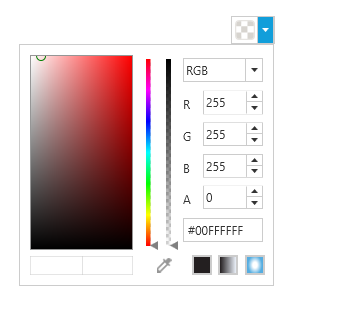
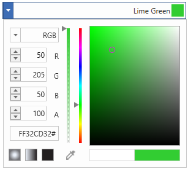
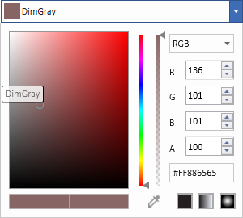

# Appearance in WPF color picker (ColorPicker)

This section explains the UI customization, styling, and theming options available for the [ColorPicker](https://help.syncfusion.com/cr/wpf/Syncfusion.Windows.Shared.ColorPicker.html) control.

## Change Header Template

You can customize the header of the `ColorPicker` by using the [HeaderTemplate](https://help.syncfusion.com/cr/wpf/Syncfusion.Windows.Shared.ColorPicker.html#Syncfusion_Windows_Shared_ColorPicker_HeaderTemplate) property.




<DataTemplate x:Key="CustomHeaderTemplate" 
              DataType="syncfusion:ColorPicker">
    <StackPanel Orientation="Horizontal">
        <Ellipse Fill="{Binding Brush,
            RelativeSource={RelativeSource FindAncestor,
            AncestorType={x:Type syncfusion:ColorPicker}}}"
                 Name="selectedColorEllipse" 
                 HorizontalAlignment="Left"
                 Width="20" Height="20"
                 Margin="2" />
    </StackPanel>
</DataTemplate>

<syncfusion:ColorPicker  HeaderTemplate="{StaticResource CustomHeaderTemplate}"
                         Name="colorPicker" 
                         Width ="50" Height="30"/>




N> [View Sample in GitHub](https://github.com/SyncfusionExamples/wpf-colorpicker-examples/tree/master/Samples/Appearance)

## Change flow direction

You can change the flow direction of the `ColorPicker` layout to right-to-left by setting the `FlowDirection` property to `RightToLeft`. The default value of `FlowDirection` is `LeftToRight`.




<syncfusion:ColorPicker FlowDirection="RightToLeft" Name="colorPicker"/>




ColorPicker colorPicker= new ColorPicker();
colorPicker.FlowDirection = FlowDirection.RightToLeft;




N> [View Sample in GitHub](https://github.com/SyncfusionExamples/wpf-colorpicker-examples/tree/master/Samples/Appearance)

## Setting ToolTip

The tooltip shows information about the color under the cursor. The selected color name is shown in a tooltip when you click and drag the mouse on the color palette. The tooltip is enabled by default; you can disable it by setting [EnableToolTip](https://help.syncfusion.com/cr/wpf/Syncfusion.Windows.Shared.ColorPicker.html#Syncfusion_Windows_Shared_ColorPicker_EnableToolTip) to `false`.




<syncfusion:ColorPicker EnableToolTip="True"  Name="colorPicker"/>




ColorPicker colorPicker = new ColorPicker();
colorPicker.EnableToolTip = true;




N> [View Sample in GitHub](https://github.com/SyncfusionExamples/wpf-colorpicker-examples/tree/master/Samples/Appearance)

## Theme

ColorPicker supports various built-in themes. Refer to the below links to apply themes for the ColorPicker,

  * [Apply theme using SfSkinManager](https://help.syncfusion.com/wpf/themes/skin-manager)
	
  * [Create a custom theme using ThemeStudio](https://help.syncfusion.com/wpf/themes/theme-studio#creating-custom-theme)

