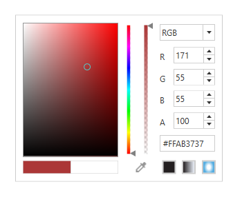
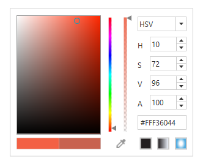

## Selection Mode

[ColorPicker](https://help.syncfusion.com/cr/wpf/Syncfusion.Shared.Wpf~Syncfusion.Windows.Shared.ColorPicker.html) and [ColorEdit](https://help.syncfusion.com/cr/wpf/Syncfusion.Shared.Wpf~Syncfusion.Windows.Shared.ColorEdit.html) controls can be displayed in two different modes. They are HSV and RGB modes. The [VisualizationStyle](https://help.syncfusion.com/cr/wpf/Syncfusion.Shared.Wpf~Syncfusion.Windows.Shared.ColorPicker~VisualizationStyle.html) property is used to switch between these modes.

## RGB

To set the [ColorSelectionMode](https://help.syncfusion.com/cr/wpf/Syncfusion.Shared.Wpf~Syncfusion.Windows.Tools.ColorSelectionMode.html) as "RGB" for ColorEdit control, use the below code.




<syncfusion:ColorEdit  Margin="20" VisualizationStyle="RGB" Name="colorEdit"/>





ColorEdit colorEdit = new ColorEdit();

colorEdit.VisualizationStyle = ColorSelectionMode.RGB; 

this.Content = colorEdit;




To set the [ColorSelectionMode](https://help.syncfusion.com/cr/wpf/Syncfusion.Shared.Wpf~Syncfusion.Windows.Tools.ColorSelectionMode.html) as "RGB" for ColorPicker control, use the below code.




<syncfusion:ColorPicker  Margin="20" VisualizationStyle="RGB" Name="colorpicker"/>





ColorPicker colorPicker = new ColorPicker();

colorPicker.VisualizationStyle = ColorSelectionMode.RGB;

this.Content = colorPicker;




## HSV

To set the [ColorSelectionMode](https://help.syncfusion.com/cr/wpf/Syncfusion.Shared.Wpf~Syncfusion.Windows.Tools.ColorSelectionMode.html) as "HSV" for ColorEdit control, use the below code.




<syncfusion:ColorEdit  Margin="20" VisualizationStyle="HSV" Name="colorEdit"/><





ColorEdit colorEdit = new ColorEdit();

VisualizationStyle = ColorSelectionMode.HSV;    

//Adding control to the window
this.Content = colorEdit;




To set the [ColorSelectionMode](https://help.syncfusion.com/cr/wpf/Syncfusion.Shared.Wpf~Syncfusion.Windows.Tools.ColorSelectionMode.html) as "HSV" for ColorPicker control, use the below code.




<syncfusion:ColorPicker  Margin="20" VisualizationStyle="HSV" Name="colorpicker"/><





ColorPicker colorPicker = new ColorPicker();

colorPicker.VisualizationStyle = ColorSelectionMode.HSV;    

this.Content = colorPicker;




## Eye Dropper

[ColorPicker](https://help.syncfusion.com/cr/wpf/Syncfusion.Shared.Wpf~Syncfusion.Windows.Shared.ColorPicker.html) consist of `eye-dropper` which can be dragged across the anywhere on the screen,picks the color it is currently hovering above, along with the associated hexadecimal (HEX) color value.

## Get color name from color property

[ColorPicker](https://help.syncfusion.com/cr/wpf/Syncfusion.Shared.Wpf~Syncfusion.Windows.Shared.ColorPicker.html) come along with method which returns the nearest names of color property, this can be obtained by [SuchColor](https://help.syncfusion.com/cr/wpf/Syncfusion.Shared.Wpf~Syncfusion.Windows.Shared.ColorEdit~SuchColor.html) method.




  private void ColorPicker_SelectedBrushChanged(DependencyObject d, DependencyPropertyChangedEventArgs e)
        {
            ColorPicker colorPicker = d as ColorPicker;
            textBlock.Text = Syncfusion.Windows.Shared.ColorEdit.SuchColor(colorPicker.Color)[0];
        }




## Tooltip

ColorPicker support to show selected color via Tooltip while hovering through the color palette, this can be enabled using [EnableToolTip](https://help.syncfusion.com/cr/wpf/Syncfusion.Shared.Wpf~Syncfusion.Windows.Shared.ColorPicker~EnableToolTip.html) property.




<syncfusion:ColorPicker  Width="300" EnableToolTip="True"  Name="colorpicker"/>





ColorPicker colorPicker = new ColorPicker();

colorPicker.EnableToolTip = true;

this.Content = colorPicker;




