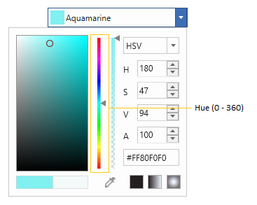
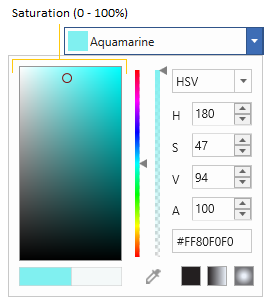
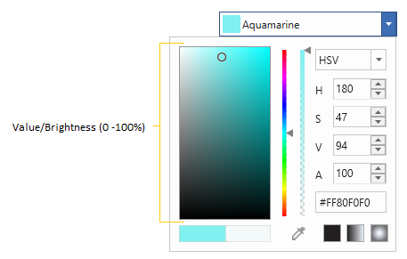
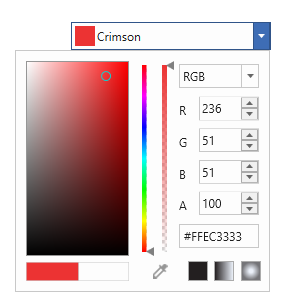
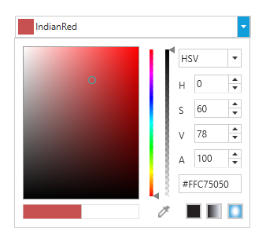
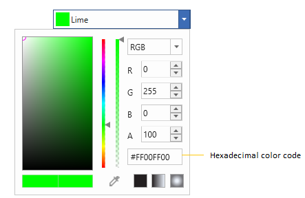
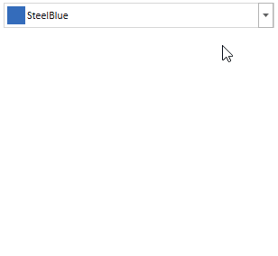
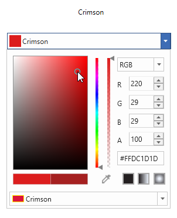

# Select Solid Color in WPF ColorPicker

This section explains how to select a solid color from different color models, how to modify their individual properties and also gives brief information about eye dropper, standard colors.

## What is solid color?

A solid color is defined by a single color with its alpha, red, blue, and green channels, or you can use one of the predefined colors provided by the `Colors` class.

## How to select your solid color

Choosing a solid color from HSV (Hue, Saturation, and Value) is explained below.

### Hue 

Hue is the color portion of the model, expressed as a number between `0` and `360` degrees, with all colors falling within a certain range. In [ColorPicker](https://help.syncfusion.com/cr/wpf/Syncfusion.Windows.Shared.ColorPicker.html), the Hue value can be modified using the slider or H-Hue value editor.

### Saturation

Saturation describes the amount of gray in a particular color, from 0 to 100 percent. The Saturation value can be modified using the slider or S-Saturation value editor.

### Value/Brightness

Value works in conjunction with saturation and describes the brightness or intensity of the color, from `0-100` percent, where `0` is completely black, and `100` is the brightest and reveals the most color. The Value/Brightness value can be modified using the slider or V-Value value editor.

## Select RGB and HSV color

`ColorPicker` controls can be displayed in two different modes. They are HSV and RGB modes. The [VisualizationStyle](https://help.syncfusion.com/cr/wpf/Syncfusion.Windows.Shared.ColorPicker.html#Syncfusion_Windows_Shared_ColorPicker_VisualizationStyle) property is used to switch between these modes. By default, the RGB mode is enabled.

### RGB

You can pick a color in the RGB (Red, Green, Blue) format by setting the `VisualizationStyle` property to [ColorSelectionMode.RGB](https://help.syncfusion.com/cr/wpf/Syncfusion.Windows.Tools.ColorSelectionMode.html). Color formats can be switched between HSV and RGB at runtime using the built-in color-model `ComboBox`.




<syncfusion:ColorPicker  VisualizationStyle="RGB" Name="colorpicker"/>




ColorPicker colorPicker = new ColorPicker();
colorPicker.VisualizationStyle = ColorSelectionMode.RGB;
this.Content = colorPicker;




### HSV

You can pick a color in the HSV (Hue, Saturation, Value/Brightness) format by setting the `VisualizationStyle` property to [ColorSelectionMode.HSV](https://help.syncfusion.com/cr/wpf/Syncfusion.Windows.Tools.ColorSelectionMode.html). Color formats can be switched between RGB and HSV at runtime using the built-in color-model `ComboBox`.




<syncfusion:ColorPicker VisualizationStyle="HSV" Name="colorpicker"/>




ColorPicker colorPicker = new ColorPicker();
colorPicker.VisualizationStyle = ColorSelectionMode.HSV;
this.Content = colorPicker;




## Get solid color using Hexadecimal code

Hexadecimal color values are also supported in `ColorPicker`. The built-in `TextBox` allows you to enter or edit a color by hex value. The color is selected based on the hex value entered in the `TextBox`.

## Pick a color from anywhere (Eye Dropper)

`ColorPicker` includes an eye-dropper that you can drag anywhere on the screen. The eye-dropper picks the color of the pixel under it, along with the associated hexadecimal (HEX) color value.

## Select a standard color

`ColorPicker` has a built-in color `ComboBox` to select a standard color easily. By default, the standard-color `ComboBox` is not shown. To display it, set the [IsColorPaletteVisible](https://help.syncfusion.com/cr/wpf/Syncfusion.Windows.Shared.ColorPicker.html#Syncfusion_Windows_Shared_ColorPicker_IsColorPaletteVisible) property to `true`. The default value of `IsColorPaletteVisible` is `false`.




 <syncfusion:ColorPicker x:Name="colorPicker" IsColorPaletteVisible="True"/>




ColorPicker colorPicker = new ColorPicker();
colorPicker.IsColorPaletteVisible = true;




## Solid color changed notification

The selected color in [ColorPicker](https://help.syncfusion.com/cr/wpf/Syncfusion.Windows.Shared.ColorPicker.html) can be observed using the [ColorChanged](https://help.syncfusion.com/cr/wpf/Syncfusion.Windows.Shared.ColorPicker.html#Syncfusion_Windows_Shared_ColorPicker_ColorChanged) event.




<syncfusion:ColorPicker ColorChanged="ColorPicker_ColorChanged"
                        Name="colorPicker"/>




ColorPicker  colorPicker = new ColorPicker();
colorPicker.ColorChanged += ColorPicker_ColorChanged;







//Invoked when the selected color is changed
private void ColorPicker_ColorChanged(DependencyObject d, DependencyPropertyChangedEventArgs e)
{
    // Enter your code here
}




## Get color name from color property

`ColorEdit` (the editable variant of `ColorPicker`) provides a [SuchColor](https://help.syncfusion.com/cr/wpf/Syncfusion.Windows.Shared.ColorEdit.html#Syncfusion_Windows_Shared_ColorEdit_SuchColor_System_Windows_Media_Color_) method that returns up to four similar color names for the current [Color](https://help.syncfusion.com/cr/wpf/Syncfusion.Windows.Shared.ColorEdit.html#Syncfusion_Windows_Shared_ColorEdit_Color) value. Pass an index from 0 to 3 to retrieve each name.




<StackPanel>
    <TextBlock Name="textBlock" Width="200" Height="30"/>
    <syncfusion:ColorEdit Name="colorPicker" SelectedBrushChanged="ColorPicker_SelectedBrushChanged"/>
</StackPanel>




ColorEdit colorPicker = new ColorEdit();
colorPicker.SelectedBrushChanged += ColorPicker_SelectedBrushChanged;







private void ColorPicker_SelectedBrushChanged(DependencyObject d, DependencyPropertyChangedEventArgs e) {
    //Display the nearest color name
    textBlock.Text = Syncfusion.Windows.Shared.ColorEdit.SuchColor(colorPicker.Color)[0];
}




N> `SuchColor` is defined on the `ColorEdit` control. If you are using `ColorPicker`, cast the underlying model or switch the example to `ColorEdit`.

 
 You can select a gradient color, which is explained in the [Select gradient color](https://help.syncfusion.com/wpf/color-picker/gradient-brush) page.

 Click [here](https://github.com/SyncfusionExamples/wpf-colorpicker-examples/tree/master/Samples/ChooseColor) to download the sample that showcases how to select a solid color from the `ColorPicker`.
