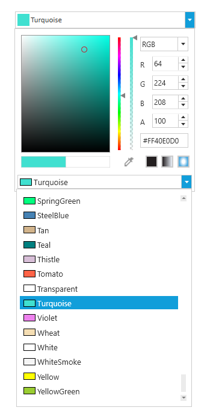
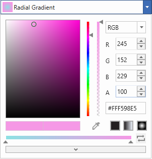
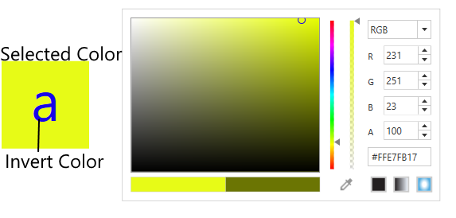
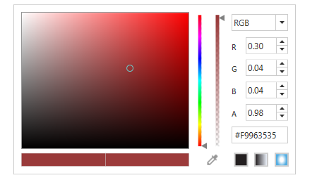

# Customization in WPF ColorPicker

[WPF ColorPicker](https://help.syncfusion.com/cr/wpf/Syncfusion.Windows.Shared.ColorPicker.html) has a built-in color palette to select a solid color easily. This can be enabled using the [IsColorPaletteVisible](https://help.syncfusion.com/cr/wpf/Syncfusion.Windows.Shared.ColorPicker.html#Syncfusion_Windows_Shared_ColorPicker_IsColorPaletteVisible) property.




<syncfusion:ColorEdit x:Name="colorEdit" IsColorPaletteVisible="True"/>





colorEdit.IsColorPaletteVisible = true;




## Gradient brush display mode

The brush representation of `WPF ColorPicker` can be customized using the [GradientBrushDisplayMode](https://help.syncfusion.com/cr/wpf/Syncfusion.Windows.Shared.ColorPicker.html#Syncfusion_Windows_Shared_ColorPicker_GradientBrushDisplayMode) property. The default value of `GradientBrushDisplayMode` is `Default`.




<syncfusion:ColorPicker x:Name="colorPicker" GradientBrushDisplayMode="Extended"/>





colorPicker.GradientBrushDisplayMode = Syncfusion.Windows.Tools.GradientBrushDisplayMode.Extended;







<syncfusion:ColorPicker x:Name="colorPicker" GradientBrushDisplayMode="Default"/>





colorPicker.GradientBrushDisplayMode = Syncfusion.Windows.Tools.GradientBrushDisplayMode.Default;




## Inverted Color

[ColorEdit](https://help.syncfusion.com/cr/wpf/Syncfusion.Windows.Shared.ColorEdit.html) provides a way to get the inverted color of the selected color using the [InvertColor](https://help.syncfusion.com/cr/wpf/Syncfusion.Windows.Shared.ColorEdit.html#Syncfusion_Windows_Shared_ColorEdit_InvertColor) property. This is useful for generating a contrast color for the current selection.




<syncfusion:ColorEdit x:Name="colorEdit"/>
<TextBlock Name="textBlock" Text="a" TextAlignment="Center" FontSize="70"
           Background="{Binding ElementName=colorEdit, Path=Brush, UpdateSourceTrigger=PropertyChanged}"
           HorizontalAlignment="Center" VerticalAlignment="Center" Height="110" Width="110">
    <TextBlock.Foreground>
        <SolidColorBrush Color="{Binding ElementName=colorEdit, Path=InvertColor, UpdateSourceTrigger=PropertyChanged}"/>
    </TextBlock.Foreground>
</TextBlock>





textBlock.Background = colorEdit.Brush;
textBlock.Foreground = new SolidColorBrush(colorEdit.InvertColor);




## ScRGB-Color

ScRGB is a wide-gamut color space that allows color values outside the sRGB range (such as those beyond 1.0 or below 0.0). To enable ScRGB color editing in `ColorEdit`, set the [IsScRGBColor](https://help.syncfusion.com/cr/wpf/Syncfusion.Windows.Shared.ColorEdit.html#Syncfusion_Windows_Shared_ColorEdit_IsScRGBColor) property to `true`. The default value of `IsScRGBColor` is `false`.




<syncfusion:ColorEdit x:Name="colorEdit" IsScRGBColor="True"/>





colorEdit.IsScRGBColor = true;




N> `IsScRGBColor` is a `ColorEdit`-only property and is not available in the `WPF ColorPicker`.