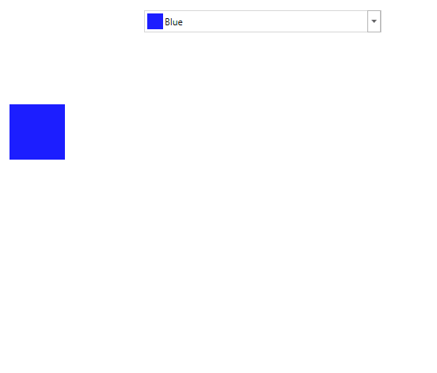

# Getting Started with ColorPicker

This section explains how to create a WPF [ColorPicker](https://help.syncfusion.com/cr/wpf/Syncfusion.Shared.Wpf~Syncfusion.Windows.Shared.ColorPicker.html) and explains about its structure and features.

## Structure of ColorPicker

## Assembly deployment

Refer to the [Control Dependencies](https://help.syncfusion.com/wpf/control-dependencies#colorpicker) section to get the list of assemblies or `NuGet` package that needs to be added as a reference to use the control in any application.

Refer to this [documentation](https://help.syncfusion.com/wpf/visual-studio-integration/nuget-packages) to find more details about installing nuget packages in a WPF application.

## Adding WPF ColorPicker via designer

1) `ColorPicker` can be added to an application by dragging it from the toolbox to a designer view. The following dependent assemblies will be added automatically:

* Syncfusion.Shared.WPF

   

2. Set the properties for the ColorPicker in the design mode, using the Smart Tag feature.

## Adding WPF ColorPicker via XAML

To add the `ColorPicker` manually in XAML, follow these steps:

1) Create a new WPF project in Visual Studio.

2) Add the following required assembly reference to the project:

* Syncfusion.Shared.WPF

3) Import Syncfusion WPF schema **http://schemas.syncfusion.com/wpf**, and declare the `ColorPicker` in WPF XAML page.




<Window x:Class="ColorPicker_sample.MainWindow"
        xmlns="http://schemas.microsoft.com/winfx/2006/xaml/presentation"
        xmlns:x="http://schemas.microsoft.com/winfx/2006/xaml"
        xmlns:d="http://schemas.microsoft.com/expression/blend/2008"
        xmlns:mc="http://schemas.openxmlformats.org/markup-compatibility/2006"
        xmlns:local="clr-namespace:ColorPicker_sample"
        xmlns:syncfusion="http://schemas.syncfusion.com/wpf"
        mc:Ignorable="d"
        Title="MainWindow" Height="450" Width="800">
<Grid Name="grid">
    <syncfusion:ColorPicker Name="colorPicker" Height="100" Width="280"/>
</Grid>




## Adding WPF ColorPicker via C#

To add the `ColorPicker` manually in C#, follow these steps:

1) Create a new WPF application via Visual Studio.

2) Add the following required assembly references to the project:

* Syncfusion.Shared.WPF

3) Include the required namespace.




using Syncfusion.Windows.Shared;




4) Create an instance of `ColorPicker`, and add it to the window.




ColorPicker colorPicker = new ColorPicker();
colorPicker.Width = 300;
colorPicker.Height=100;




## Select a Color

We can select a solid color or gradient brush from a `ColorPicker` using the [Color](https://help.syncfusion.com/cr/wpf/Syncfusion.Shared.Wpf~Syncfusion.Windows.Shared.ColorPicker~Color.html) and [Brush](https://help.syncfusion.com/cr/wpf/Syncfusion.Shared.Wpf~Syncfusion.Windows.Shared.ColorPicker~Brush.html) properties.

### Select Solid Color

We can select the solid color by using the `Color` and `Brush` properties.




<syncfusion:ColorPicker x:Name="colorPicker" Brush="Yellow"/>




colorPicker.Brush = Brushes.Yellow;







 <syncfusion:ColorPicker x:Name="colorPicker" Color="Yellow"/>




colorPicker.Color = Colors.Yellow;




### Select a Gradient Color

We can select a linear or radial gradient brushes  which holds the multiple colors from the `ColorPicker`.

**Linear Gradient**

Linear Gradient can be selected by the gradient colors and their location along the gradient axis using the `GradientStops` objects and [StartPoint](https://help.syncfusion.com/cr/wpf/Syncfusion.Shared.Wpf~Syncfusion.Windows.Shared.ColorEdit~Startpoint.html) and [EndPoint](https://help.syncfusion.com/cr/wpf/Syncfusion.Shared.Wpf~Syncfusion.Windows.Shared.ColorEdit~Endpoint.html) properties. Based on the `StartPoint` and `EndPoint`, the selected colors will be combined in linear manner.




 <syncfusion:ColorPicker x:Name="colorPicker" Width="200">
   <syncfusion:ColorPicker.Brush>
        <LinearGradientBrush StartPoint="0,0" EndPoint="1,1">
             <GradientStop Color="Yellow" Offset="0.0" />
             <GradientStop Color="Red" Offset="0.25" />
             <GradientStop Color="Blue" Offset="0.75" />
             <GradientStop Color="LimeGreen" Offset="1.0" />
        </LinearGradientBrush>
    </syncfusion:ColorPicker.Brush>
 </syncfusion:ColorPicker>



//Creating the linear gradient brush
LinearGradientBrush linearGradient = new LinearGradientBrush();
linearGradient.StartPoint = new Point(0, 0);
linearGradient.EndPoint = new Point(1, 1);
linearGradient.GradientStops.Add(new GradientStop(Colors.Yellow, 0.0));
linearGradient.GradientStops.Add(new GradientStop(Colors.Red, 0.25));
linearGradient.GradientStops.Add(new GradientStop(Colors.Blue, 0.75));
linearGradient.GradientStops.Add(new GradientStop(Colors.LimeGreen, 1.0));

//Assigning a linear gradient brush to ColorPicker
ColorPicker colorPicker= new ColorPicker();
colorPicker.Brush = linearGradient;




**Radial Gradient**

Radial Gradient is similar to Linear Gradient, except for the axis defined by the circle. Based on the [GradientOrigin](https://help.syncfusion.com/cr/wpf/Syncfusion.Shared.Wpf~Syncfusion.Windows.Shared.ColorEdit~GradientOrigin.html), `Center` and `RadiusPoint` properties values, the selected gradient colors are combined in a circle manner. 




 <syncfusion:ColorPicker x:Name="colorPicker" Width="200">
     <syncfusion:ColorPicker.Brush>
         <RadialGradientBrush GradientOrigin="0.5,0.5" Center="0.5,0.5" RadiusX="0.5" RadiusY="0.5">
            <GradientStop Color="Yellow" Offset="0" />
            <GradientStop Color="Red" Offset="0.25" />
            <GradientStop Color="Blue" Offset="0.75" />
            <GradientStop Color="LimeGreen" Offset="1" />
        </RadialGradientBrush>
     </syncfusion:ColorPicker.Brush>
 </syncfusion:ColorPicker>



//Creating a 
RadialGradientBrush radialGradient = new RadialGradientBrush();
radialGradient.GradientOrigin = new Point(0.5, 0.5);
radialGradient.Center = new Point(0.5, 0.5);
radialGradient.RadiusX = 0.5;
radialGradient.RadiusY = 0.5;
radialGradient.GradientStops.Add(new GradientStop(Colors.Yellow, 0.0));
radialGradient.GradientStops.Add(new GradientStop(Colors.Red, 0.25));
radialGradient.GradientStops.Add(new GradientStop(Colors.Blue, 0.75));
radialGradient.GradientStops.Add(new GradientStop(Colors.LimeGreen, 1.0));

colorPicker.Brush = radialGradient;




### Change Selected Color at runtime

`ColorPicker` consist of bunch of input components to select color and edit its properties at runtime.

## Color and Brush changed notification

Selected Color and Brush changed in [ColorPicker](https://help.syncfusion.com/cr/wpf/Syncfusion.Shared.Wpf~Syncfusion.Windows.Shared.ColorPicker.html) can be examined using [SelectedBrushChanged](https://help.syncfusion.com/cr/wpf/Syncfusion.Shared.Wpf~Syncfusion.Windows.Shared.ColorPicker~SelectedBrushChanged_EV.html) and [ColorChanged](https://help.syncfusion.com/cr/wpf/Syncfusion.Shared.Wpf~Syncfusion.Windows.Shared.ColorPicker~ColorChanged_EV.html) events.




<syncfusion:ColorPicker ColorChanged="ColorPicker_ColorChanged"
                        SelectedBrushChanged="ColorPicker_SelectedBrushChanged"
                        Name="colorPicker"/>




ColorPicker  colorPicker = new ColorPicker();
colorPicker.SelectedBrushChanged += ColorPicker_SelectedBrushChanged;
colorPicker.ColorChanged += ColorPicker_ColorChanged;







//Invoked when the selected color is changed
private void ColorPicker_ColorChanged(DependencyObject d, DependencyPropertyChangedEventArgs e)
{
    // Enter your code here
}

//Invoked when the selected brush is changed
private void ColorPicker_SelectedBrushChanged(DependencyObject d, DependencyPropertyChangedEventArgs e)
{
    // Enter your code here
}




## Switch between Solid, Linear and Gradient brush mode

We can change the brush mode directly by clicking on the corresponding Solid, Linear or Gradient mode buttons which are placed in the bottom right corner of the `ColorPicker`. We can restrict brush mode switching at runtime by setting the [EnableSolidToGradientSwitch](https://help.syncfusion.com/cr/wpf/Syncfusion.Shared.Wpf~Syncfusion.Windows.Shared.ColorPicker~EnableSolidToGradientSwitch.html) property value as `false`.  It will hide the Solid, Linear and Gradient brush buttons.

**EnableSolidToGradientSwitch == false**




<syncfusion:ColorPicker x:Name="colorPicker" EnableSolidToGradientSwitch="false"/>





ColorPicker colorPicker = new ColorPicker ();
colorPicker.EnableSolidToGradientSwitch = false;




