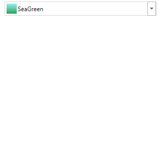
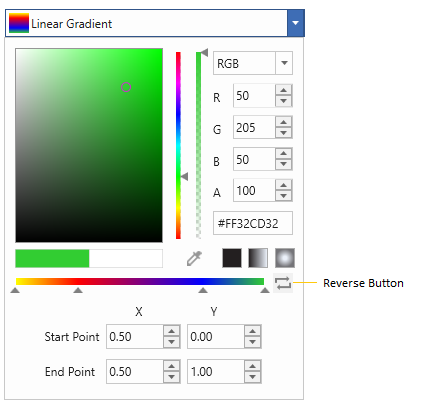
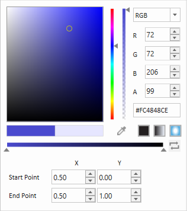

# Edit a gradient brush with WPF ColorPicker

This section gives a brief note on how to create gradient brushes, modify their stops and modify their properties.

### What is a gradient brush? 

A gradient brush paints an area with multiple colors that blend into each other along an axis. Color Picker now comes with Gradient tool which returns a brush of type Linear and Radial. The offsets can be added or dropped dynamically and its position can be changed to produce different color combinations.

## Gradient Stops

WPF [ColorPicker](https://help.syncfusion.com/cr/wpf/Syncfusion.Shared.Wpf~Syncfusion.Windows.Shared.ColorPicker.html) has gradient editor similar to that of VisualStudio brush editor. Adding new gradient stops, altering the offset and changing the color of the gradient stops can be done run-time.

### Add remove stops

Gradient stops can be added to existing gradient by clicking on the gradient brush. 

To delete a gradient stopper, select the stopper to be removed and press `Delete` key or mouse drag it away so that it will disappeared.

### Slide stops

Gradient stop positions can be altered just by dragging the stoppers along the gradient brush path.

### Change color of a stop

To change the color of a gradient stop, select that particular stop and change color of the color picker.

### Reverse stops

[ColorPicker](https://help.syncfusion.com/cr/wpf/Syncfusion.Shared.Wpf~Syncfusion.Windows.Shared.ColorPicker.html) comes with the reverse button which helps in changing the gradient upside down or in case of radial gradient inside out. 

## Configure linear gradient

Start and end point of the selected [Linear Gradient brush](https://docs.microsoft.com/en-us/dotnet/api/system.windows.media.lineargradientbrush?view=netframework-4.8) can be edited runtime through the input options as well as with their properties listed in below table.

<table>
<tr>
<th>
Properties</th><th>
Description</th></tr>
<tr>
<td>
{{ '[Startpoint](https://help.syncfusion.com/cr/wpf/Syncfusion.Shared.Wpf~Syncfusion.Windows.Shared.ColorEdit~Startpoint.html)' | markdownify }}</td><td>
Indicates the Start point of LinearGradientBrush.</td></tr>
<tr>
<td>
{{ '[Endpoint](https://help.syncfusion.com/cr/wpf/Syncfusion.Shared.Wpf~Syncfusion.Windows.Shared.ColorEdit~Endpoint.html)' | markdownify }}</td><td>
Indicates the End point of LinearGradientBrush.</td></tr>
</table>

**Diagonal Gradient (StartPoint(0,0), EndPoint(1,1))**

**Vertical Gradient (StartPoint(0, 0.5), EndPoint(1, 0.5)**

## Configure radial gradient

Gradient origin, Centre and Radius of the selected [Radial Gradient brush](https://docs.microsoft.com/en-us/dotnet/api/system.windows.media.radialgradientbrush?view=netframework-4.8) can be edited runtime through the input options as well as with their properties listed in below table.

<table>
<tr>
<th>
Properties</th><th>
Description</th></tr>
<tr>
<td>
{{ '[GradientOrigin](https://help.syncfusion.com/cr/wpf/Syncfusion.Shared.Wpf~Syncfusion.Windows.Shared.ColorEdit~GradientOrigin.html)' | markdownify }}</td><td>
Indicates the gradient origin of RadialGradientBrush.</td></tr>
<tr>
<td>
{{ '[CentrePoint](https://help.syncfusion.com/cr/wpf/Syncfusion.Shared.Wpf~Syncfusion.Windows.Shared.ColorEdit~CentrePoint.html)' | markdownify }}</td><td>
Indicates the centre point of RadialGradientBrush.</td></tr>
<tr>
<td>
{{ '[RadiusX](https://help.syncfusion.com/cr/wpf/Syncfusion.Shared.Wpf~Syncfusion.Windows.Shared.ColorEdit~RadiusX.html)' | markdownify }}</td><td>
Indicates the X value in Radius of RadialGradientBrush.</td></tr>
<tr>
<td>
{{ '[RadiusY](https://help.syncfusion.com/cr/wpf/Syncfusion.Shared.Wpf~Syncfusion.Windows.Shared.ColorEdit~RadiusY.html)' | markdownify }}</td><td>
Indicates the Y value in Radius of RadialGradientBrush.</td></tr>
</table>

**Gradient Origin (0.25, 0.25)**

**Centre (0.25, 0.25)**

**Radius (0.25, 0.25)**

## Hide gradient property editor

[GradientPropertyEditorMode](https://help.syncfusion.com/cr/wpf/Syncfusion.Shared.Wpf~Syncfusion.Windows.Shared.ColorPicker~GradientPropertyEditorMode.html) property specifies whether Gradient Editor should be displayed as a Popup or in extended mode.




<Syncfusion:ColorPicker x:Name="colorPicker" GradientPropertyEditorMode="Popup"/>




ColorPicker colorPicker = new ColorPicker();
colorPicker.GradientPropertyEditorMode =  GradientPropertyEditorMode.Popup;




The GradientEditor is displayed accordingly.

## Switch between Solid, Linear, Gradient mode

Brush type can be switched between solid to gradient or vice versa, runtime as well as programmatically. 

Code behind switching involves [BrushMode](https://help.syncfusion.com/cr/wpf/Syncfusion.Shared.Wpf~Syncfusion.Windows.Shared.ColorPicker~BrushMode.html) property.




<Syncfusion: ColorPicker x:Name="colorPicker" BrushMode="Gradient"/>





ColorPicker colorPicker = new ColorPicker();
colorPicker.BrushMode = BrushModes.Gradient;


