# Select Gradient Color in WPF ColorPicker

This section gives a brief note on how to create gradient color, modify their colors and modify their properties.

### What is a gradient color?

A gradient color paints an area with multiple colors that blend along an axis. [ColorPicker](https://www.syncfusion.com/wpf-ui-controls/colorpicker) includes gradient tools that return a brush of type `LinearGradientBrush` or `RadialGradientBrush`. Offsets can be added or removed dynamically, and their positions can be changed to produce different color combinations.

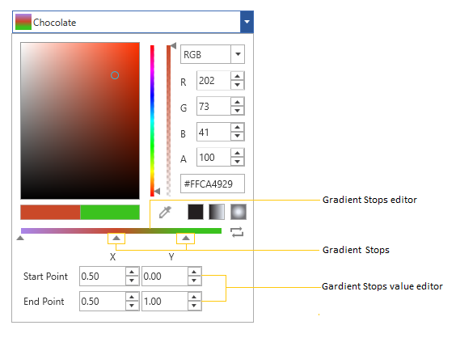

## Create Gradient colors using GradientStops Editor

You can add a multiple-color combination for the gradient color using the `GradientStopsEditor`. You can add new gradient stops, change the offset, and change the color of the gradient stops at runtime. The created gradient stops are combined together to provide a gradient color.

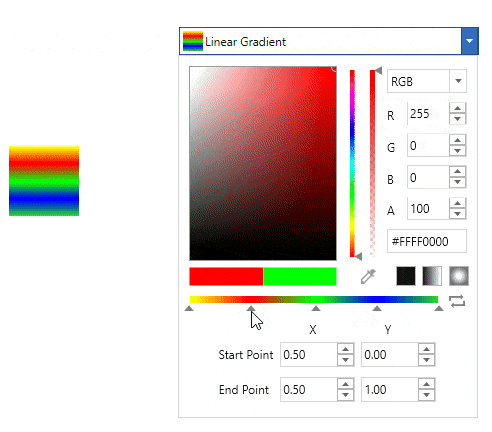

### Add or Remove GradientStops

You can add more colors to the gradient by using gradient stops. Gradient stops can be added to an existing gradient by clicking the `GradientStopEditor`.

To remove a gradient stop, select the gradient stop you want to remove and press the `Delete` key, or drag it away with the mouse so that it is removed from the `GradientStopEditor`.

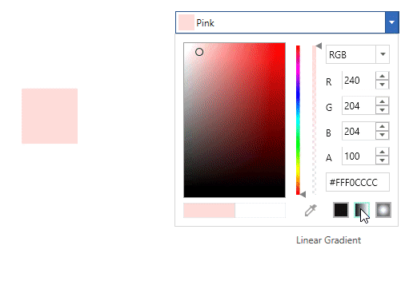

### Rearrange GradientStops

You can rearrange the color combination of the gradient by adjusting the gradient stops. Gradient-stop positions can be changed by dragging them along the `GradientStopEditor`. The gradient color is generated based on the order of the gradient stops.

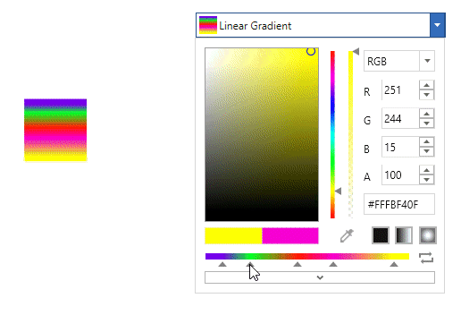

### Change GradientStops Colors

You can change the colors of a created gradient by changing the color of its gradient stops. The color of a gradient stop is changed by selecting that particular gradient stop and choosing a new color from the color picker.

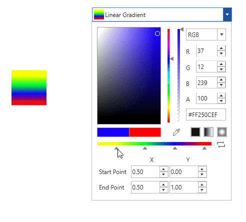

## Create Linear Gradient colors

You can create a linear gradient color programmatically using `LinearGradientBrush` with its `GradientStops`, `StartPoint`, and `EndPoint` properties. You can also create and change the linear gradient at runtime by using the `GradientStopsEditor` and the `StartPoint`/`EndPoint` input options available in the `GradientPropertyEditor`. By default, the linear gradient colors are combined horizontally. The default value of `StartPoint` is `(0.5, 0)`, and the default value of `EndPoint` is `(0.5, 1)`.

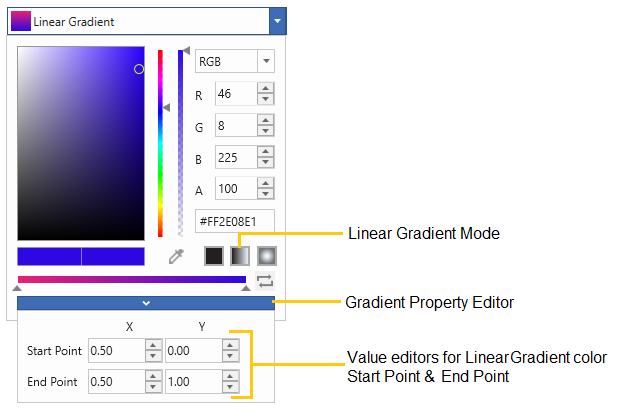

<table>
<tr>
<th>
Properties</th><th>
Description</th></tr>
<tr>
<td>
{{ '[Startpoint](https://help.syncfusion.com/cr/wpf/Syncfusion.Windows.Shared.ColorEdit.html#Syncfusion_Windows_Shared_ColorEdit_Startpoint)' | markdownify }}</td><td>
Indicates the Start point of LinearGradientBrush.</td></tr>
<tr>
<td>
{{ '[Endpoint](https://help.syncfusion.com/cr/wpf/Syncfusion.Windows.Shared.ColorEdit.html#Syncfusion_Windows_Shared_ColorEdit_Endpoint)' | markdownify }}</td><td>
Indicates the End point of LinearGradientBrush.</td></tr>
</table>




class ViewModel {
    public Brush LinearGradientBrush {get; set;}
    public ViewModel() {
        //Creating LinearGradient brush
        LinearGradientBrush LinearBrush = new LinearGradientBrush();
        LinearBrush.StartPoint = new Point(0, 1);
        LinearBrush.EndPoint = new Point(1, 1);
        LinearBrush.GradientStops.Add(new GradientStop(Colors.Yellow, 0.0));
        LinearBrush.GradientStops.Add(new GradientStop(Colors.Red, 0.25));
        LinearBrush.GradientStops.Add(new GradientStop(Colors.Blue, 0.75));
        LinearBrush.GradientStops.Add(new GradientStop(Colors.LimeGreen, 1.0));  
              
        // Assigning a created linear gradient brush to `LinearGradientBrush` property
        LinearGradientBrush = LinearBrush;
    }
}







<syncfusion:ColorPicker Brush="{Binding LinearGradientBrush}"
                        Name="colorPicker">
    <syncfusion:ColorPicker.DataContext>
        <local:ViewModel></local:ViewModel>
    </syncfusion:ColorPicker.DataContext>
</syncfusion:ColorPicker>







ColorPicker colorPicker = new ColorPicker();
colorPicker.DataContext = new ViewModel();
colorPicker.SetBinding(ColorPicker.BrushProperty, new Binding("LinearGradientBrush"));




Here, Linear Gradient created by the gradient colors and their location along the gradient axis using the `GradientStop` objects.

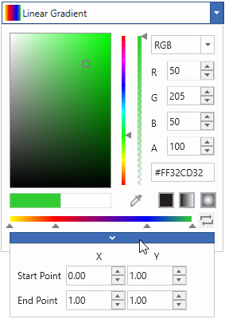

### Diagonal Linear Gradient (StartPoint(0,0), EndPoint(1,1))

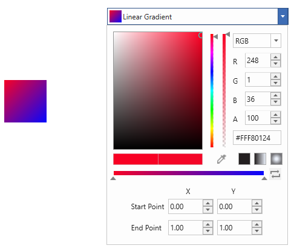

### Vertical Linear Gradient (StartPoint(0, 0.5), EndPoint(1, 0.5)

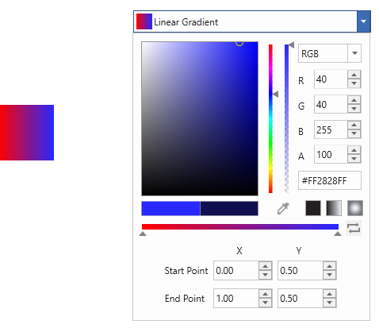

## Create Radial Gradient colors

You can create a radial gradient color programmatically using `RadialGradientBrush` with its `GradientStops`, `GradientOrigin`, `Radius`, and `Center` properties. Radial gradient brush colors can be changed at runtime using the `GradientStopsEditor`, and the `GradientOrigin`, `Center`, and `Radius` can be changed at runtime using the input options available in the `GradientPropertyEditor`.

<table>
<tr>
<th>
Properties</th><th>
Description</th></tr>
<tr>
<td>
{{ '[GradientOrigin](https://help.syncfusion.com/cr/wpf/Syncfusion.Windows.Shared.ColorEdit.html#Syncfusion_Windows_Shared_ColorEdit_GradientOrigin)' | markdownify }}</td><td>
Indicates the gradient origin of RadialGradientBrush.</td></tr>
<tr>
<td>
{{ '[CentrePoint](https://help.syncfusion.com/cr/wpf/Syncfusion.Windows.Shared.ColorEdit.html#Syncfusion_Windows_Shared_ColorEdit_CentrePoint)' | markdownify }}</td><td>
Indicates the centre point of RadialGradientBrush.</td></tr>
<tr>
<td>
{{ '[RadiusX](https://help.syncfusion.com/cr/wpf/Syncfusion.Windows.Shared.ColorEdit.html#Syncfusion_Windows_Shared_ColorEdit_RadiusX)' | markdownify }}</td><td>
Indicates the X value in Radius of RadialGradientBrush.</td></tr>
<tr>
<td>
{{ '[RadiusY](https://help.syncfusion.com/cr/wpf/Syncfusion.Windows.Shared.ColorEdit.html#Syncfusion_Windows_Shared_ColorEdit_RadiusY)' | markdownify }}</td><td>
Indicates the Y value in Radius of RadialGradientBrush.</td></tr>
</table>




class ViewModel {
    public Brush RadialGradientBrush { get; set; }    
    public ViewModel() {
         //Creating Radial Gradient brush
        RadialGradientBrush radialBrush = new RadialGradientBrush();
        radialBrush.GradientOrigin = new Point(0.5, 0.5);
        radialBrush.Center = new Point(0.5, 0.5);
        radialBrush.RadiusX = 0.5;
        radialBrush.RadiusY = 0.5;
        radialBrush.GradientStops.Add(new GradientStop(Colors.Yellow, 0.0));
        radialBrush.GradientStops.Add(new GradientStop(Colors.Red, 0.25));
        radialBrush.GradientStops.Add(new GradientStop(Colors.Blue, 0.75));
        radialBrush.GradientStops.Add(new GradientStop(Colors.LimeGreen, 1.0));

        // Assigning a created radial gradient brush to `RadialGradientBrush` property
        RadialGradientBrush = radialBrush;
    }
}







<syncfusion:ColorPicker Brush="{Binding RadialGradientBrush}"
                        Name="colorPicker">
    <syncfusion:ColorPicker.DataContext>
        <local:ViewModel></local:ViewModel>
    </syncfusion:ColorPicker.DataContext>
</syncfusion:ColorPicker>







ColorPicker colorPicker = new ColorPicker();
colorPicker.DataContext = new ViewModel();
colorPicker.SetBinding(ColorPicker.BrushProperty, new Binding("RadialGradientBrush"));




Here, Radial Gradient created by the gradient colors and their location along the gradient axis using the `GradientStop` objects.

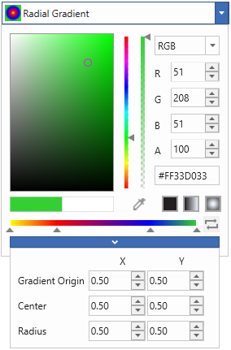

### Gradient Origin (0.25, 0.25)

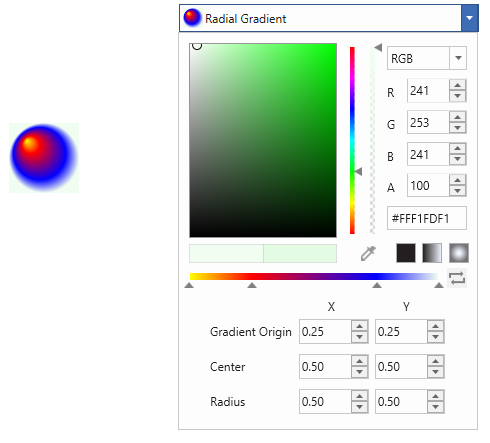

### Centre (0.25, 0.25)

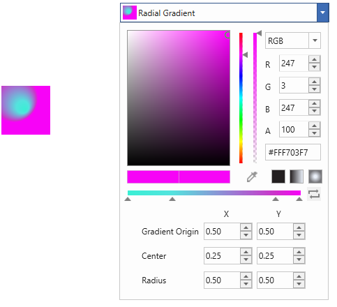

### Radius (0.25, 0.25)

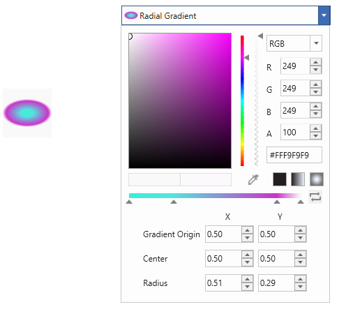

## Show or Hide RadialGradientBrush properties

You can control the visibility of RadialGradientBrush properties using the `IsGradientOriginVisible`, `IsCenterVisible`, and `IsRadiusVisible` properties. By default, all RadialGradientBrush properties are visible (`True`). To hide any of these properties, set its value to `False`.




<syncfusion:ColorPicker x:Name="colorPicker" IsCenterVisible="False"/>






ColorPicker colorPicker = new ColorPicker();
colorPicker.IsCenterVisible = false;




## Reverse the Gradient Colors

[ColorPicker](https://help.syncfusion.com/cr/wpf/Syncfusion.Windows.Shared.ColorPicker.html) includes a reverse button that flips the gradient — vertically for a linear gradient, and inside-out for a radial gradient.

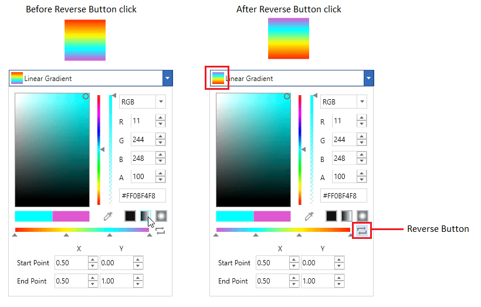

## Show selected gradient color name

By default, the selected gradient mode name is displayed in `ColorPicker`. To display the selected gradient color name instead, set the [GradientBrushDisplayMode](https://help.syncfusion.com/cr/wpf/Syncfusion.Windows.Shared.ColorPicker.html#Syncfusion_Windows_Shared_ColorPicker_GradientBrushDisplayMode) property to `Extended`. The default value of `GradientBrushDisplayMode` is `Default`.




<syncfusion:ColorPicker x:Name="colorPicker" GradientBrushDisplayMode="Extended"/>




ColorPicker colorPicker = new ColorPicker();
colorPicker.GradientBrushDisplayMode = GradientBrushDisplayMode.Extended;




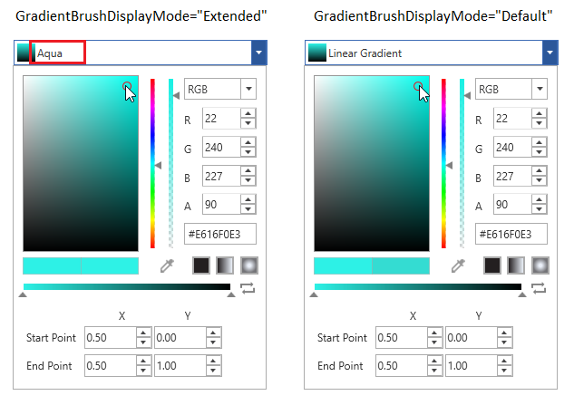

## Show gradient color value editor

You can display the gradient property editor in either pop-up mode or extended mode. By default, the editor is displayed in extended mode. To display the editor only in a pop-up, set the [GradientPropertyEditorMode](https://help.syncfusion.com/cr/wpf/Syncfusion.Windows.Shared.ColorPicker.html#Syncfusion_Windows_Shared_ColorPicker_GradientPropertyEditorMode) property to `Popup`. The default value of `GradientPropertyEditorMode` is `Extended`.




<syncfusion:ColorPicker x:Name="colorPicker" GradientPropertyEditorMode="Popup"/>




ColorPicker colorPicker = new ColorPicker();
colorPicker.GradientPropertyEditorMode = GradientPropertyEditorMode.Popup;




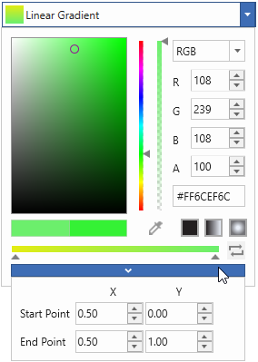

## Switch between Solid, Linear, and Gradient brush mode

You can switch the brush mode from solid to linear or radial gradient (and vice versa) either at runtime or programmatically. By default, the `Solid` brush mode is enabled. To enable the `Gradient` brush mode, set the [BrushMode](https://help.syncfusion.com/cr/wpf/Syncfusion.Windows.Shared.ColorEdit.html#Syncfusion_Windows_Shared_ColorEdit_BrushMode) property to `Gradient`. You can also switch the brush mode by clicking the corresponding Solid, Linear, or Gradient button placed in the bottom-right corner of the `ColorPicker`. To hide these buttons, set [EnableSolidToGradientSwitch](https://help.syncfusion.com/cr/wpf/Syncfusion.Windows.Shared.ColorPicker.html#Syncfusion_Windows_Shared_ColorPicker_EnableSolidToGradientSwitch) to `false`. The default value of `EnableSolidToGradientSwitch` is `true`.




<syncfusion:ColorPicker x:Name="colorPicker" BrushMode="Gradient" EnableSolidToGradientSwitch="false"/>





ColorPicker colorPicker = new ColorPicker();
colorPicker.BrushMode = BrushModes.Gradient;




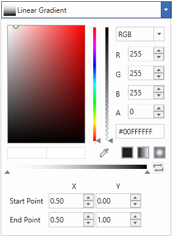

Here, The `ColorPicker` is in Gradient brush mode.

### Switch between Solid, Linear and Gradient brush mode

We can change the brush mode directly by clicking on the corresponding Solid, Linear or Gradient mode buttons which are placed in the bottom right corner of the `ColorPicker`.

## Disable Switching between Solid, Linear and Gradient brush mode at runtime

 If we want to disable the Solid, Linear and Gradient brush mode transition at runtime, use the [EnableSolidToGradientSwitch](https://help.syncfusion.com/cr/wpf/Syncfusion.Windows.Shared.ColorPicker.html#Syncfusion_Windows_Shared_ColorPicker_EnableSolidToGradientSwitch) property value as `false`. It will hide the Solid, Linear and Gradient brush buttons. The Default value of `EnableSolidToGradientSwitch` property is `true`.




<syncfusion:ColorPicker x:Name="colorPicker" EnableSolidToGradientSwitch="false"/>




ColorPicker colorPicker = new ColorPicker ();
colorPicker.EnableSolidToGradientSwitch = false;




## Gradient color changed notification

The selected gradient color in [ColorPicker](https://help.syncfusion.com/cr/wpf/Syncfusion.Windows.Shared.ColorPicker.html) can be observed using the [SelectedBrushChanged](https://help.syncfusion.com/cr/wpf/Syncfusion.Windows.Shared.ColorPicker.html#Syncfusion_Windows_Shared_ColorPicker_SelectedBrushChanged) event.




<syncfusion:ColorPicker SelectedBrushChanged="ColorPicker_SelectedBrushChanged"
                        Name="colorPicker"/>




ColorPicker colorPicker = new ColorPicker();
colorPicker.SelectedBrushChanged += ColorPicker_SelectedBrushChanged;







//Invoked when the selected brush is changed
private void ColorPicker_SelectedBrushChanged(DependencyObject d, DependencyPropertyChangedEventArgs e) {
    //Read the new and old brush
    Brush newBrush = (Brush)e.NewValue;
    Brush oldBrush = (Brush)e.OldValue;
}




Click [here](https://github.com/SyncfusionExamples/wpf-colorpicker-examples/tree/master/Samples/LinearGradient) to download the sample that showcases the Linear GradientBrush and its additional features.

Click [here](https://github.com/SyncfusionExamples/wpf-colorpicker-examples/tree/master/Samples/RadialGradient) to download the sample that showcases the Radial GradientBrush and its additional features.
