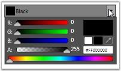
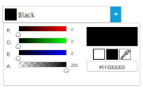

# Layout Related Features

This section illustrates the Layout-related features of ColorPicker and ColorEdit controls. The following features are discussed:

## Setting flow direction

Flow Direction of the ColorPicker and ColorEdit controls is set by using the FlowDirection property.

Properties table

<table>
<tr>
<th>
Property</th><th>
Description</th></tr>
<tr>
<td>
FlowDirection</td><td>
Sets the flow direction for the ColorPicker and ColorEdit controls. The options provided are as follows.* LeftToRight* RightToLeft</td></tr>
</table>

### Use the following code example to set this property.




<!-- Adding ColorPicker -->
<syncfusion:ColorPicker FlowDirection="RightToLeft" Name="colorPicker"/>

<!-- Adding ColorEdit -->
<syncfusion:ColorEdit FlowDirection="RightToLeft" Name="colorEdit"/>





// Setting flow direction as right to left for ColorEdit.
FlowDirection = FlowDirection.RightToLeft;

// Setting flow direction as right to left for ColorPicker
colorPicker.FlowDirection = FlowDirection.RightToLeft;




## Setting VisualStyle for ColorPicker and ColorEdit controls  

You can enhance the appearance of the ColorPicker and ColorEdit control, using the VisualStyle property. VisualStyle is an attached property, which gets or sets the value for the visual style. The various built-in visual styles are listed below.

Properties table

<table>
<tr>
<th>
Property</th><th>
Description</th></tr>
<tr>
<td>
VisualStyle</td><td>
Sets the visual style for the ColorPicker and ColorEdit controls. The options provided are as follows.BlendOffice2003Office2007BlueOffice2007BlackOffice2007SilverShinyBlueShinyRedSyncOrangeVS2010MetroTransparent</td></tr>
</table>

To set the visual style for the ColorPicker and ColorEdit controls, use the following code.




<!-- Adding ColorPicker -->
<syncfusion:ColorPicker  syncfusion:SkinStorage.VisualStyle="Office2003" Name="colorPicker"/>

<!-- Adding ColorEdit -->
<syncfusion:ColorEdit syncfusion:SkinStorage.VisualStyle="Office2007Blue" Name="colorEdit"/>





//Setting the visual style as Office2007Blue for ColorEdit 
SkinStorage.SetVisualStyle(colorEdit, "Office2007Blue"); 

 //Setting the visual style as Office2007Blue  for ColorPicker
 SkinStorage.SetVisualStyle(colorPicker, "Office2007Blue"); 




## Slider background color

The sliders available for the ColorEdit control are Alpha, Blue, Green and Red. The control provides options to customize the background of these sliders by using the respective background properties, i.e., BackgroundA, BackgroundB, BackgroundG, BackgroundR. These properties can be used to set the background for the Alpha, Blue, Green and Red sliders respectively.




<Tools:ColorEdit Name="myColorEditor" BackgroundA="DarkBlue" BackgroundB="Yellow" BackgroundG="Black" BackgroundR="Orange"/>





myColorEditor.BackgroundA = Brushes.DarkBlue;
myColorEditor.BackgroundB = Brushes.Yellow;
myColorEditor.BackgroundG = Brushes.Black
myColorEditor.BackgroundR = Brushes.Orange;




