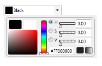
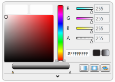
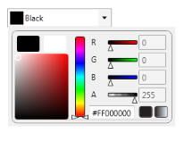
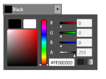
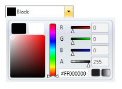

# New User Interface Support

The feature adds new additional User Interface to the Color Picker, so that you can have two more User Interfaces for the ColorPicker Control. Both will have same functionality, except that the User Interface will change. ColorPicker and ColorEdit controls can be displayed in four different modes. They are HSV, Classic HSV, RGB and Classic RGB modes. The VisualizationStyle property is used to switch between these modes. The HSV and RGB are the two User Interfaces which are user-friendly, more attractive and in general, it looks more professional.

## Use Case Scenarios

New User Interface support enables you to create the ColorPicker control with a visually rich interface.

## Adding New User Interface support to an Application 

New User Interface support can be added to an application by using XAML or with C#.

### Adding through XAML

The following code example illustrates how to add the New User Interface support feature to an application through XAML.



[XAML]

<sync:ColorPicker VisualizationStyle="HSV" BrushMode="Solid"/>

<sync:ColorEdit VisualizationStyle="HSV"/>



### Adding through C#

The following code example illustrates how to add the New User Interface support feature to an application through C#.



[C#]

   ColorPicker Picker = new ColorPicker();

   Picker.VisualizationStyle = 

                         Syncfusion.Windows.Tools.ColorSelectionMode.HSV;

   ColorEdit ColEdit = new ColorEdit();

   ColEdit.VisualizationStyle = 

                         Syncfusion.Windows.Tools.ColorSelectionMode.HSV;



## Properties

_New User Interface Support Property Table_

<table>
<tr>
<td>
Property </td><td>
Description </td><td>
Type </td><td>
Data Type </td><td>
Reference links </td></tr>
<tr>
<td>
VisualizationStyle</td><td>
Specifies the style that can be used to set ColorPicker /or ColorEdit UI.</td><td>
DependencyProperty</td><td>
ColorSelectionMode.HSV</td><td>
</td></tr>
</table>

## Sample Link

To view samples: 

1. Select Start -> Programs -> Syncfusion -> Essential Studio x.x.xx -> Dashboard.
2. Select Run Locally Installed Samples in WPF Button.
3. Now expand the DragAndDropManagerDemo tree-view item in the Sample Browser.
4. Choose any one of the samples listed under it to launch. 

## Theme Appearance

The appearance of the ColorPicker can be customized using Styles. The following are the various built-in visual styles for ColorPicker.

