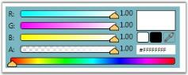

# ScRGB Color

Using the IsScRGBColor property, user can set the value indicating whether this instance is ScRGB color. To enable this property use the following code.

<table>
<tr>
<td>
[XAML]<!-- Adding ColorEdit --><syncfusion:ColorEdit IsScRGBColor="True" Margin="20" Name="colorEdit"/></td></tr>
<tr>
<td>
[C#]//Creating an instance of color editColorEdit colorEdit = new ColorEdit();//Setting ScRGBColorcolorEdit.IsScRGBColor = true;//Adding control to the windowthis.Content = colorEdit;</td></tr>
</table>

{{ '' | markdownify }}
{:.image }

