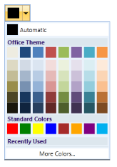
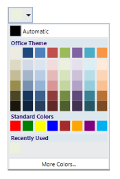
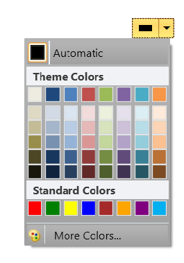
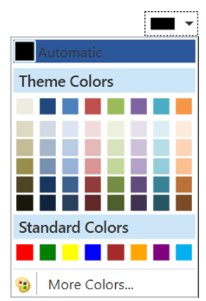

# Appearance

The appearance of the ColorPickerPalette control can be customized by using the VisualStyle property. The following are the various built-in visual styles for ColorPickerPalette control.

* Metro
* Blend
* Office2007Blue
* Office2007Black
* Office2007Silver
* Office2010Black
* Office2010Blue
* Office2010Silver
* Office2013
* Office2003
* VS2010
* Transparent

In the below code example, Metro theme is applied to the ColorPickerPalette control. 





<syncfusion:ColorPickerPalette x:Name="colorPickerPalette" Color="Orange" syncfusion:SkinStorage.VisualStyle="Metro"  ThemePanelVisibility="Visible" Width="200" Height="50”/> 





SkinStorage.SetVisualStyle(colorPickerPalette, "Metro"); 





SkinStorage.SetVisualStyle(colorPickerPalette, "Metro")





Metro

Blend

Office2007Blue

Office2007Black

Office2007Silver

Office2003

Transparent

Office2010Blue

Office2010Black

Office2010Silver

Office2013

## MouseOverBackGround Color of ColorPickerPalette

You can change the background color of the ColorPickerPalette at mouse over, based on the brush color set in the MouseOverBackground property.





<syncfusion:ColorPickerPalette  x:Name="ColorPickerPalette1" MouseOverBackground="Green">       
</syncfusion:ColorPickerPalette>





ColorPickerPalette ColorPickerPalette1 = new ColorPickerPalette();
ColorPickerPalette1.MouseOverBackground = Brushes.Green;





ColorPickerPalette ColorPickerPalette1 = new ColorPickerPalette()
ColorPickerPalette1.MouseOverBackground = Brushes.Green





### Properties

<table>
<tr>
<th>
Property</th><th>
Description</th><th>
Data Type</th><th>
Reference links</th></tr>
<tr>
<td>
MouseOverBackgroundBrush </td><td>
Gets or sets the MouseOver BackgroundBrush value of the ColorPickerPalette.</td><td>
Brush </td><td>
N/A </td></tr>
</table>

