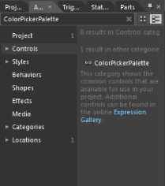
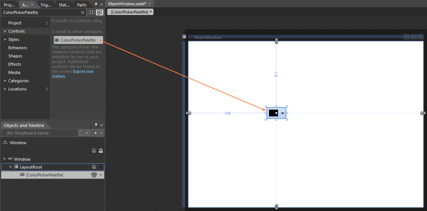

# Getting Started

## Structure of the ColorPickerPaletteControl

The various elements of the ColorPickerPalette are illustrated in the following screenshot.

* The Selected Color represents the color that you select.
* The Drop-Down represents a button, ColorPickerPalette window will open when you click on it.
* The Automatic Color represents the Color, which can be set by you.
* The ToolTip with Color Details represents the ToolTip, when the mouse hovers on the Color.
* The Standard Colors stores the standard colors like Red, Green, Blue and so on.
* The Recently User Colors stores the Colors that are recently selected.
* The More Colors Option provides wide range of color in addition to colors in the palette.
* The Theme Variant Colors represents the Theme colors with variant.

## Add ColorPickerPalette to an Application

ColorPickerPalette can be added to an application by using XAML or C# code.

### Adding through XAML

The following code example illustrates how to add the ColorPickerPalette control to an application through XAML.





<syncfusion:ColorPickerPalette x:Name="ColorPicker"/>





### Adding through C#

The following code example illustrates how to add the ColorPickerPalette control to an application through C#.





ColorPickerPalette colorpicker = new ColorPickerPalette();

this.LayoutRoot.Children.Add(colorpicker);





### Adding through Blend

The following are the step by step procedure for adding ColorPickerPalette control to an application through Microsoft Expression Blend.

To add a ColorPickerPalette control to an application through Microsoft Expression Blend, follow the below steps:

1. Create a new Silverlight application in Microsoft Expression Blend.
2. Add the following reference to the sample application.
3. Syncfusion.Tools.WPF.dll
4. On the Window menu, select Assets. This opens the Assets Library dialog box.
5. In the search box, type “ColorPickerPalette” then the search results are displayed as shown.

   

6. Drag and drop the ColorPickerPalette control to the sample application.

   
   
   

