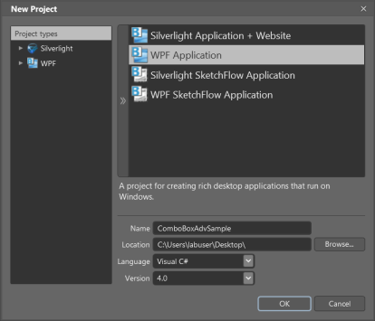
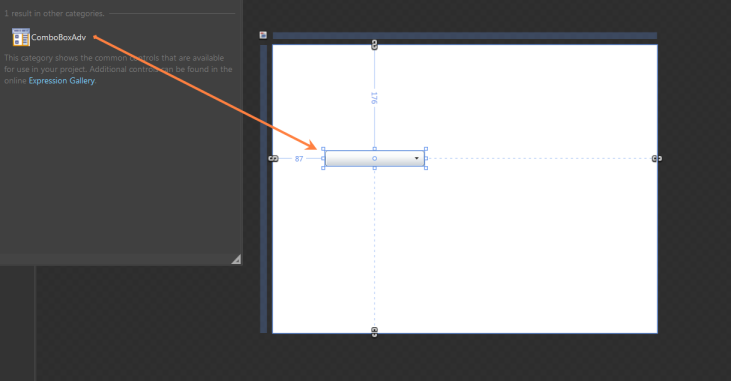

# Blendability in WPF ComboBox (ComboBoxAdv)

### Creating the ComboBoxAdv control in expression blend

To create ComboBoxAdv instance in Expression Blend:

1. Open Expression Blend.
2. On the File menu, select New Project. The New Project dialog box opens.

   

3. In the Project type’s pane, select WPF,and then select WPF Application.
4. In the Name field, type the name of the project, and then click OK.

   

5. On the Window menu, select Assets. The Assets Library dialog box opens.
6. In the Search box, type ComboBoxAdv. The search results are displayed.
7. Drag the ComboBoxAdv control to Design view. An instance of the ComboBoxAdv control is created. 

   

## Appearance

You can customize the appearance of the ComboBoxAdv control by editing the style of the control in Expression Blend or by using the following properties exposed by ComboBoxAdv control:

* Edit style in Expression Blend 
* Customizing by using properties

### Blendability

You can edit the style of ComboBoxAdv by using Expression Blend. To edit the ComboBoxAdv control’s style in Expression Blend:

1. Drag the ComboBoxAdv control to the Design view. The ComboBoxAdv control will appear as shown in the screen shot displayed below.
2. Right-click the ComboBoxAdv control, select Edit Template, and then select Edit a Copy.

