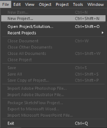
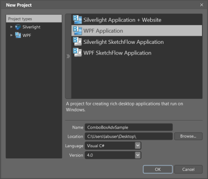
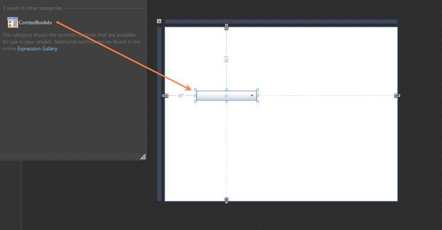
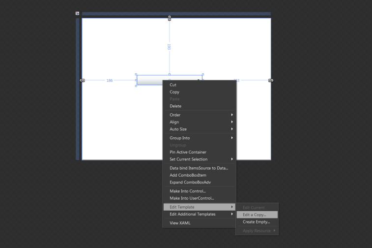

# Blendability in WPF ComboBox

## Creating the ComboBox control in expression blend

To create a `ComboBox` instance in Expression Blend:

1. Open Expression Blend.
2. On the **File** menu, select **New Project**. The **New Project** dialog box opens.

   

3. In the **Project type** pane, select **WPF**, and then select **WPF Application**.
4. In the **Name** field, type the name of the project, and then click **OK**.

   

5. On the **Window** menu, select **Assets**. The **Assets Library** dialog box opens.
6. In the **Search** box, type `ComboBox`. The search results are displayed.
7. Drag the `ComboBox` control to the **Design** view. An instance of the `ComboBox` control is created.

   

## Appearance

You can customize the appearance of the ComboBox control by editing the style of the control in Expression Blend or by using the following properties exposed by ComboBox control:

* Edit style in Expression Blend 
* Customizing by using properties

### Blendability

You can edit the style of ComboBox by using Expression Blend. To edit the ComboBox control's style in Expression Blend:

1. Drag the ComboBox control to the Design view. The ComboBox control will appear as shown in the screen shot displayed below.
2. Right-click the ComboBox control, select Edit Template, and then select Edit a Copy.

