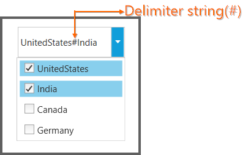

# Delimiter Support in WPF ComboBox

A delimiter string in a ComboBox is the string displayed between the selected items in the ComboBox. You can customize this string by using the `SelectedValueDelimiter` property. The default value is `"-"` (hyphen).

<table>
<tr>
<th>
Property</th><th>
Description</th><th>
Type</th><th>
Data Type</th><th>
Reference links</th></tr>
<tr>
<td>
SelectedValueDelimiter </td><td>
The selected items can be separated by the given string.</td><td>
Dependency Property</td><td>
String</td><td>
NA</td></tr>
</table>

## Adding delimiter string customization to an application

Delimiter string customization can be added directly to an application using the following code snippet.




<syncfusion:ComboBoxAdv SelectedValueDelimiter="#"></syncfusion:ComboBoxAdv>





ComboBoxAdv comboBox = new ComboBoxAdv();     
comboBox.SelectedValueDelimiter = "#";




