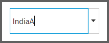

# Editable Support in WPF ComboBox (ComboBoxAdv)

## IsEditable

It allows user to edit the text in the ComboBoxAdv.

<table>
<tr>
<th>
Property</th><th>
Description</th><th>
Type</th><th>
Data Type</th><th>
Reference links</th></tr>
<tr>
<td>
IsEditable </td><td>
It is possible to edit the text of ComboBoxAdv.</td><td>
Dependency Property</td><td>
Boolean</td><td>
NA</td></tr>
</table>

## Adding IsEditable property to an application 

IsEditable property can be added directly to an application in the following way: 




<syncfusion:ComboBoxAdv IsEditable="true"></syncfusion:ComboBoxAdv>





ComboBoxAdv comboBox = new ComboBoxAdv();       
comboBox.IsEditable = true;



## Auto Complete Support in WPF ComboBox

You can able to find the expected item from the dropdown of the `ComboBoxAdv` and it can be enabled by using the `AutoCompleteMode` property. It can be used for both single and multiple selections on editable mode. 

 There are three different AutoComplete modes: 

•	`Suggest`: Suggestions are displayed in a drop-down menu.

•	`None`: No suggestion is made.

Default value is *None*.

### Suggest

By setting the `AutoCompleteMode` property to `Suggest`, a list of possible matches will be suggested and displayed in the drop-down list. The search text are included or start with the suggested items.




<syncfusion:ComboBoxAdv AutoCompleteMode="Suggest"/>





ComboBoxAdv comboBox = new ComboBoxAdv();       
combobox.AutoCompleteMode = AutoCompleModes.Suggest;




N> Suggest mode will be applicable only when the `ComboBoxAdv` is populated with `ItemSource` collection. When `AutoCompleteMode` is set to `Suggest` and `IsTextSearchEnabled` is set to `True` in editable mode, `AutoCompleteMode` will take precedence.