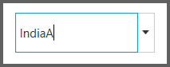

# Editable Support in WPF ComboBox (ComboBoxAdv)

## IsEditable

The `IsEditable` property allows the user to edit the text in the ComboBoxAdv. The default value is `false`.

<table>
<tr>
<th>
Property</th><th>
Description</th><th>
Type</th><th>
Data Type</th><th>
Reference links</th></tr>
<tr>
<td>
IsEditable </td><td>
It is possible to edit the text of ComboBoxAdv.</td><td>
Dependency Property</td><td>
Boolean</td><td>
NA</td></tr>
</table>

### Adding IsEditable to an application

The `IsEditable` property can be added directly to an application in the following way.




<syncfusion:ComboBoxAdv IsEditable="true"></syncfusion:ComboBoxAdv>





ComboBoxAdv comboBox = new ComboBoxAdv();       
comboBox.IsEditable = true;



## Auto Complete Support in WPF ComboBox

You can find the expected item from the drop-down of the [`ComboBoxAdv`](https://help.syncfusion.com/cr/wpf/Syncfusion.Windows.Tools.Controls.ComboBoxAdv.html) by using the [`AutoCompleteMode`](https://help.syncfusion.com/cr/wpf/Syncfusion.Windows.Tools.Controls.ComboBoxAdv.html#Syncfusion_Windows_Tools_Controls_ComboBoxAdv_AutoCompleteMode) property. It can be used for both single and multiple selections in editable mode.

There are three different `AutoCompleteMode` values.

* `None` – No suggestion is made. This is the default value.
* `Suggest` – Suggestions are displayed in a drop-down menu based on the typed text.

### Suggest

By setting the `AutoCompleteMode` property to `Suggest`, a list of possible matches is suggested and displayed in the drop-down list. The search text is included at the start of the suggested items.




<syncfusion:ComboBoxAdv AutoCompleteMode="Suggest"/>





ComboBoxAdv comboBox = new ComboBoxAdv();       
combobox.AutoCompleteMode = AutoCompleModes.Suggest;




N> Suggest mode applies only when the `ComboBoxAdv` is populated with an `ItemsSource` collection. When `AutoCompleteMode` is set to `Suggest` and `IsTextSearchEnabled` is set to `True` in editable mode, `AutoCompleteMode` takes precedence.

N> [View sample in GitHub](https://github.com/SyncfusionExamples/syncfusion-wpf-combobox-examples/tree/main/Samples/Autocomplete)
