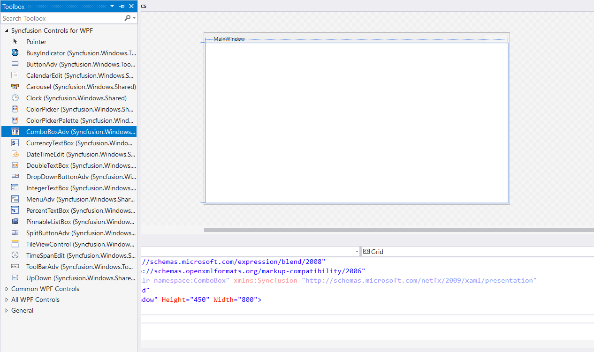
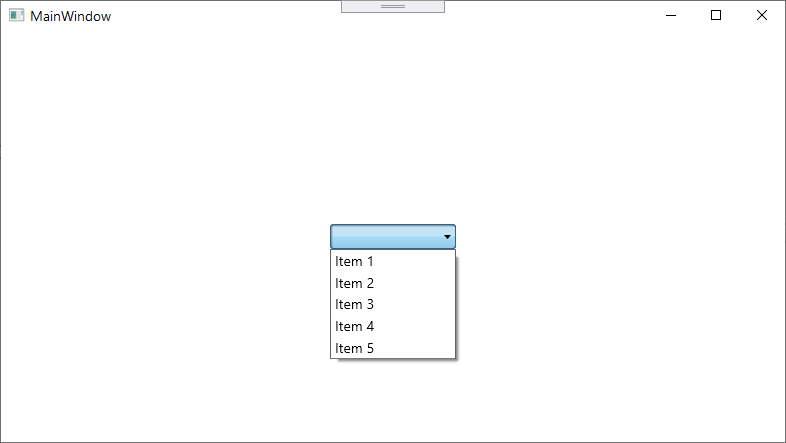
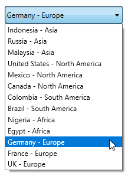
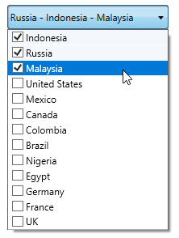
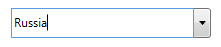

# Getting Started with WPF ComboBox (ComboBoxAdv)
This section provides a quick overview for working with the ComboBox (ComboBoxAdv).

## Assembly deployment
Refer to the [control dependencies](https://help.syncfusion.com/wpf/control-dependencies#comboboxadv) section to get the list of assemblies or NuGet package that needs to be added as a reference to use the [ComboBoxAdv](https://help.syncfusion.com/cr/wpf/Syncfusion.Shared.Wpf~Syncfusion.Windows.Tools.Controls.ComboBoxAdv.html) control in any application.

You can find more details about installing the NuGet package in a WPF application in the following link:
[How to install nuget packages](https://help.syncfusion.com/wpf/nuget-packages)

## Creating Application with ComboBoxAdv control
In this walk through, user will create a WPF application that contains [ComboBox](https://help.syncfusion.com/cr/wpf/Syncfusion.Shared.Wpf~Syncfusion.Windows.Tools.Controls.ComboBoxAdv.html) control.
1. [Creating project](#Creating-the-project)
2. [Adding control via designer](#Adding-control-via-designer)
3. [Adding control manually in XAML](#Adding-control-manually-in-XAML)
4. [Adding control manually in C#](#Adding control manually in C#)
5. [Creating Data Model for sample application](#Creating Data Model for sample application)
6. [Binding to Data ](#Creating Data Model for sample application)

### Creating project 
Create new project in Visual Studio to display [ComboBox](https://help.syncfusion.com/cr/wpf/Syncfusion.Shared.Wpf~Syncfusion.Windows.Tools.Controls.ComboBoxAdv.html).

### Adding control via designer
The [ComboBoxAdv](https://help.syncfusion.com/cr/wpf/Syncfusion.Shared.Wpf~Syncfusion.Windows.Tools.Controls.ComboBoxAdv.html) control can be added to the application by dragging it from Toolbox and dropping it in designer. The required assembly will be added automatically.

### Adding control manually in XAML
In order to add control manually in XAML, do the below steps,
1. Add the below required assembly references to the project,
           * Syncfusion.Shared.WPF
2.  Import Syncfusion WPF schema **http://schemas.syncfusion.com/wpf** in XAML page or Syncfusion.Windows.Tools.Controls namespace.
3. Declare ComboBoxAdv in XAML page.


<Window
        xmlns="http://schemas.microsoft.com/winfx/2006/xaml/presentation"
        xmlns:x="http://schemas.microsoft.com/winfx/2006/xaml"
        xmlns:d="http://schemas.microsoft.com/expression/blend/2008"
        xmlns:mc="http://schemas.openxmlformats.org/markup-compatibility/2006"
        xmlns:local="clr-namespace:GettingStartedComboBox"
        xmlns:syncfusion="http://schemas.syncfusion.com/wpf" x:Class="GettingStartedComboBox.MainWindow"
        mc:Ignorable="d"
        Title="MainWindow" Height="450" Width="800">
    <Grid>
        <syncfusion:ComboBoxAdv Height="30" Width="150"/>
    </Grid>
</Window>



### Adding control manually in C#
In order to add control manually in C#, do the below steps,

1. Add the below required assembly references to the project,
           * Syncfusion.Shared.WPF
2. Import ComboBoxAdv namespace **Syncfusion.Windows.Tools.Controls**.
3. Create ComboBoxAdv control instance and add it to the page.


using System.Windows;
using Syncfusion.Windows.Tools.Controls;
namespace ComboBox
{
    /// 

    /// Interaction logic for MainWindow.xaml
    /// 

    public partial class MainWindow : Window
    {
        public MainWindow()
        {
            InitializeComponent();
            ComboBoxAdv comboBoxAdv = new ComboBoxAdv();
            this.Content = comboBoxAdv;
            comboBoxAdv.Height = 30;
            comboBoxAdv.Width = 150;
            comboBoxAdv.DefaultText = "choose Items";
        }
    }
}



### Creating Data Model for sample application
1. Create data object class named **PopulationInfo** and declare properties as shown below,


 public class PopulationInfo
    {
        private string continent;
        private double population;
        private string country;
        private double growth;

        public string Continent
        {
            get { return continent; }
            set { continent = value; }
        }

        public string Country
        {
            get { return country; }
            set { country = value; }
        }

        public double Growth
        {
            get { return growth; }
            set { growth = value; }
        }

        public double Population
        {
            get { return population; }
            set { population = value; }
        }
    }



2. Create a **ViewModel** class with several data objects in constructor.
 

public class PopulationViewModel
{
     public PopulationViewModel()
     {
         this.PopulationDetails = new ObservableCollection<PopulationInfo>();
         PopulationDetails.Add(new PopulationInfo() { Continent = "Asia", Country = "Indonesia", Growth = 3, Population = 237641326 });
         PopulationDetails.Add(new PopulationInfo() { Continent = "Asia", Country = "Russia", Growth = 2, Population = 152518015 });
         PopulationDetails.Add(new PopulationInfo() { Continent = "Asia", Country = "Malaysia", Growth = 1, Population = 29672000 });
         PopulationDetails.Add(new PopulationInfo() { Continent = "North America", Country = "United States", Growth = 4, Population = 315645000 });
         PopulationDetails.Add(new PopulationInfo() { Continent = "North America", Country = "Mexico", Growth = 2, Population = 112336538 });
         PopulationDetails.Add(new PopulationInfo() { Continent = "North America", Country = "Canada", Growth = 1, Population = 35056064 });
         PopulationDetails.Add(new PopulationInfo() { Continent = "South America", Country = "Colombia", Growth = 1, Population = 47000000 });
         PopulationDetails.Add(new PopulationInfo() { Continent = "South America", Country = "Brazil", Growth = 3, Population = 193946886 });
         PopulationDetails.Add(new PopulationInfo() { Continent = "Africa", Country = "Nigeria", Growth = 2, Population = 170901000 });
         PopulationDetails.Add(new PopulationInfo() { Continent = "Africa", Country = "Egypt", Growth = 1, Population = 83661000 });
         PopulationDetails.Add(new PopulationInfo() { Continent = "Europe", Country = "Germany", Growth = 1, Population = 81993000 });
         PopulationDetails.Add(new PopulationInfo() { Continent = "Europe", Country = "France", Growth = 1, Population = 65605000 });
         PopulationDetails.Add(new PopulationInfo() { Continent = "Europe", Country = "UK", Growth = 1, Population = 63181775 });
     }

     public ObservableCollection<PopulationInfo> PopulationDetails
     {
         get;
         set;
     }
}



### Binding to Data 
To bind the [ComboBox](https://help.syncfusion.com/cr/wpf/Syncfusion.Shared.Wpf~Syncfusion.Windows.Tools.Controls.ComboBoxAdv.html) to data, bind the collection created in previous step to `ComboBoxAdv.ItemsSource` property in XAML by setting `PopulationViewModel` as `DataContext`.



<Window
        xmlns="http://schemas.microsoft.com/winfx/2006/xaml/presentation"
        xmlns:x="http://schemas.microsoft.com/winfx/2006/xaml"
        xmlns:d="http://schemas.microsoft.com/expression/blend/2008"
        xmlns:mc="http://schemas.openxmlformats.org/markup-compatibility/2006"
        xmlns:local="clr-namespace:GettingStartedComboBox"
        xmlns:syncfusion="http://schemas.syncfusion.com/wpf" x:Class="GettingStartedComboBox.MainWindow"
        mc:Ignorable="d"
        Title="MainWindow" Height="450" Width="800">
    <Grid>
        <Grid.DataContext>
            <local:PopulationViewModel/>
        </Grid.DataContext>
        <syncfusion:ComboBoxAdv x:Name="comboBoxAdv" Height="30" Width="200" ItemsSource="{Binding PopulationDetails}"/>
    </Grid>
</Window>



namespace ComboBox
{
    public partial class MainWindow : Window
    {
        public MainWindow()
        {
            InitializeComponent();
            this.DataContext = new PopulationViewModel();
        }
    }
}



### Binding display member

`DisplayMemberPath` denotes the path to a value on the data object for visual presentation of item to be displayed in combobox drop down list and displays the selected item in combobox.



<Grid>
    <Grid.DataContext>
        <local:PopulationViewModel/>
    </Grid.DataContext>
    <syncfusion:ComboBoxAdv x:Name="comboBoxAdv" Height="30" Width="200" ItemsSource="{Binding PopulationDetails}" DisplayMemberPath="Country"/>
</Grid>



// Initialize the display member path to comboboxadv.
this.comboBoxAdv.DisplayMemberPath = "Country";



Now, run the application and you can expert the below output.

N> [View the sample in GitHub](https://github.com/SyncfusionExamples/bind-the-data-to-comboboxadv)

### Defining ItemTemplate

You can customize the visualization of data object using the [ItemTemplate](https://docs.microsoft.com/en-us/dotnet/api/system.windows.controls.itemscontrol.itemtemplate?view=netframework-4.8).




<Grid>
    <Grid.DataContext>
        <local:PopulationViewModel/>
    </Grid.DataContext>
    <syncfusion:ComboBoxAdv x:Name="comboBoxAdv" Height="30" Width="200" ItemsSource="{Binding PopulationDetails}">
      <syncfusion:ComboBoxAdv.ItemTemplate>
        <DataTemplate>
            <StackPanel Orientation="Horizontal">
                <TextBlock Text="{Binding Country}"/>
                <TextBlock Text=" - "/>
                <TextBlock Text="{Binding Continent}"/>
            </StackPanel>
        </DataTemplate>
      </syncfusion:ComboBoxAdv.ItemTemplate>
    </syncfusion:ComboBoxAdv>
</Grid>




### Selection
If multiple choices are allowed for the user, then the ComboBoxAdv is useful to display and select those multiple choices. It allows the user to select multiple items from the drop down list. To enable this you have to enable [AllowMultiSelect](https://help.syncfusion.com/cr/wpf/Syncfusion.Shared.Wpf~Syncfusion.Windows.Tools.Controls.ComboBoxAdv~AllowMultiSelect.html) property. 

<Grid>
    <Grid.DataContext>
        <local:PopulationViewModel/>
    </Grid.DataContext>
    <syncfusion:ComboBoxAdv x:Name="comboBoxAdv" Height="30" Width="200" ItemsSource="{Binding PopulationDetails}" DisplayMemberPath="Country" AllowMultiSelect="True">
    </syncfusion:ComboBoxAdv>
</Grid>

### Editing
[IsEditable](https://help.syncfusion.com/cr/wpf/Syncfusion.Shared.Wpf~Syncfusion.Windows.Tools.Controls.ComboBoxAdv~IsEditable.html) property helps to edit the text in [ComboBox](https://help.syncfusion.com/cr/wpf/Syncfusion.Shared.Wpf~Syncfusion.Windows.Tools.Controls.ComboBoxAdv.html).

