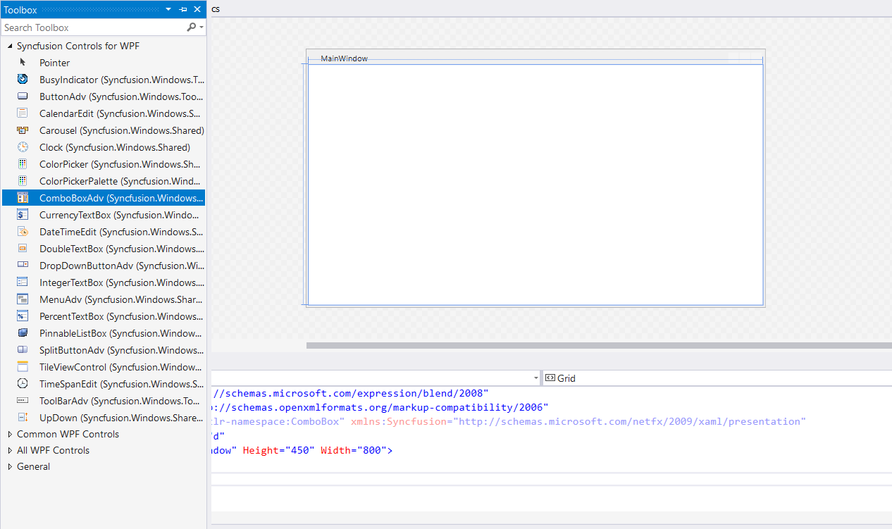
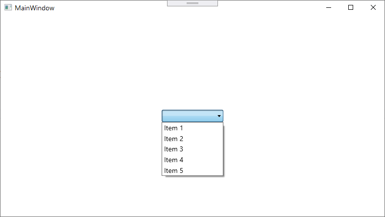
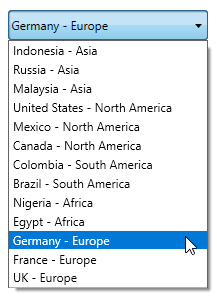
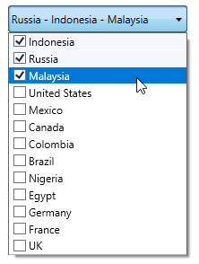
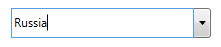
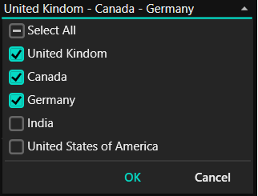

# Getting Started with WPF ComboBox
This section provides a quick overview for working with the ComboBox ([ComboBox](https://help.syncfusion.com/cr/wpf/Syncfusion.Windows.Tools.Controls.ComboBoxAdv.html)).

N> [View sample in GitHub](https://github.com/SyncfusionExamples/wpf-combobox-example/tree/master/ComboBoxAdv).

## Assembly deployment

Refer to the [control dependencies](https://help.syncfusion.com/wpf/control-dependencies#comboboxadv) section to get the list of assemblies or NuGet packages that need to be added as references to use the [ComboBox](https://help.syncfusion.com/cr/wpf/Syncfusion.Windows.Tools.Controls.ComboBoxAdv.html) control in any application. The minimum NuGet package required is `Syncfusion.Shared.WPF`.

You can find more details about installing the NuGet package in a WPF application in the following link:

[How to install NuGet packages](https://help.syncfusion.com/wpf/installation/install-nuget-packages)

## Creating an application with ComboBox

In this walk-through, the user will create a WPF application that contains the [ComboBox](https://help.syncfusion.com/cr/wpf/Syncfusion.Windows.Tools.Controls.ComboBoxAdv.html) control.

1. [Creating the project](#creating-the-project)
2. [Adding control via designer](#adding-control-via-designer)
3. [Adding control manually in XAML](#adding-control-manually-in-xaml)
4. [Adding control manually in C#](#adding-control-manually-in-c)
5. [Creating the data model for the sample application](#creating-the-data-model-for-the-sample-application)
6. [Binding to data](#binding-to-data)

### Creating the project

The section below provides detailed information to create a new project in Visual Studio to display [ComboBox](https://help.syncfusion.com/cr/wpf/Syncfusion.Windows.Tools.Controls.ComboBoxAdv.html).

1. Open Visual Studio and click **Create a new project**.
2. Select **WPF App (.NET Framework)** (or **WPF Application** for .NET/.NET Core) and click **Next**.
3. Type a project name, choose a location, and click **Create**.

### Adding control via designer

The [ComboBox](https://help.syncfusion.com/cr/wpf/Syncfusion.Windows.Tools.Controls.ComboBoxAdv.html) control can be added to the application by dragging it from the Toolbox and dropping it on the designer. The required [assemblies](https://help.syncfusion.com/wpf/control-dependencies#comboboxadv) will be added automatically.

### Adding control manually in XAML

To add [ComboBox](https://help.syncfusion.com/cr/wpf/Syncfusion.Windows.Tools.Controls.ComboBoxAdv.html) manually in XAML, do the steps below.

1. Add the required assembly reference to the project:
   * `Syncfusion.Shared.WPF`
2. Import the Syncfusion WPF schema `http://schemas.syncfusion.com/wpf` in the XAML page, or the `Syncfusion.Windows.Tools.Controls` namespace in code.
3. Declare [ComboBox](https://help.syncfusion.com/cr/wpf/Syncfusion.Windows.Tools.Controls.ComboBoxAdv.html) in the XAML page.






<Window
        xmlns="http://schemas.microsoft.com/winfx/2006/xaml/presentation"
        xmlns:x="http://schemas.microsoft.com/winfx/2006/xaml"
        xmlns:d="http://schemas.microsoft.com/expression/blend/2008"
        xmlns:mc="http://schemas.openxmlformats.org/markup-compatibility/2006"
        xmlns:local="clr-namespace:GettingStartedComboBox"
        xmlns:syncfusion="http://schemas.syncfusion.com/wpf" x:Class="GettingStartedComboBox.MainWindow"
        mc:Ignorable="d"
        Title="MainWindow" Height="450" Width="800">
    <Grid>
        <syncfusion:ComboBoxAdv Height="30" Width="150"/>
    </Grid>
</Window>





{{ codesnippet1 | OrderList_Indent_Level_1 }}

### Adding control manually in C#

To add [ComboBox](https://help.syncfusion.com/cr/wpf/Syncfusion.Windows.Tools.Controls.ComboBoxAdv.html) manually in C#, do the steps below.

1. Add the required assembly reference to the project:
   * `Syncfusion.Shared.WPF`
2. Import the `Syncfusion.Windows.Tools.Controls` namespace.
3. Create a `ComboBox` instance and add it to the page.






using System.Windows;
using Syncfusion.Windows.Tools.Controls;
namespace ComboBox
{
    /// 

    /// Interaction logic for MainWindow.xaml
    /// 

    public partial class MainWindow : Window
    {
        public MainWindow()
        {
            InitializeComponent();
            ComboBoxAdv comboBoxAdv = new ComboBoxAdv();
            this.Content = comboBoxAdv;
            comboBoxAdv.Height = 30;
            comboBoxAdv.Width = 150;
            comboBoxAdv.DefaultText = "choose Items";
        }
    }
}




{{ codesnippet2 | OrderList_Indent_Level_1 }}

## Adding items in ComboBox

Items can be added in the [ComboBox](https://help.syncfusion.com/cr/wpf/Syncfusion.Windows.Tools.Controls.ComboBoxAdv.html) control in the following ways.

1. Adding items by `ComboBoxItemAdv`.
2. Adding items by data binding.

### Add items using ComboBoxItemAdv

The items in [ComboBox](https://help.syncfusion.com/cr/wpf/Syncfusion.Windows.Tools.Controls.ComboBoxAdv.html) can be created by using [`ComboBoxItemAdv`](https://help.syncfusion.com/cr/wpf/Syncfusion.Windows.Tools.Controls.ComboBoxItemAdv.html) in XAML or C# code.



<syncfusion:ComboBoxAdv Height="30" Width="200"
                              HorizontalAlignment="Center" 
                              VerticalAlignment="Center" >
                
  <syncfusion:ComboBoxItemAdv Content="Denmark" />
  <syncfusion:ComboBoxItemAdv Content="New Zealand" />
  <syncfusion:ComboBoxItemAdv Content="Canada" />
  <syncfusion:ComboBoxItemAdv Content="Russia" />
  <syncfusion:ComboBoxItemAdv Content="Japan" />
</syncfusion:ComboBoxAdv>





public MainWindow()
{
    InitializeComponent();

    ComboBoxAdv comboBoxAdv = new ComboBoxAdv() { Height=30,Width= 200
    ,HorizontalAlignment= HorizontalAlignment.Center, VerticalAlignment = VerticalAlignment.Center };

    ComboBoxItemAdv item1 = new ComboBoxItemAdv() { Content = "Denmark" };
    ComboBoxItemAdv item2 = new ComboBoxItemAdv() { Content = "New Zealand" };
    ComboBoxItemAdv item3 = new ComboBoxItemAdv() { Content = "Canada" };
    ComboBoxItemAdv item4 = new ComboBoxItemAdv() { Content = "Russia" };
    ComboBoxItemAdv item5 = new ComboBoxItemAdv() { Content = "Japan" };

    comboBoxAdv.Items.Add(item1);
    comboBoxAdv.Items.Add(item2);
    comboBoxAdv.Items.Add(item3);
    comboBoxAdv.Items.Add(item4);
    comboBoxAdv.Items.Add(item5);

    this.Content = comboBoxAdv;
}





### Adding items by data binding

The items in [ComboBox](https://help.syncfusion.com/cr/wpf/Syncfusion.Windows.Tools.Controls.ComboBoxAdv.html) can be added by data binding by following the procedure below.

#### Creating the data model for the sample application

1. Create a data object class named `PopulationInfo` and declare the properties as shown below.




public class PopulationInfo
{
        private string continent;
        private double population;
        private string country;
        private double growth;

        public string Continent
        {
            get { return continent; }
            set { continent = value; }
        }

        public string Country
        {
            get { return country; }
            set { country = value; }
        }

        public double Growth
        {
            get { return growth; }
            set { growth = value; }
        }

        public double Population
        {
            get { return population; }
            set { population = value; }
        }
}



{{ codesnippet3 | OrderList_Indent_Level_1 }}

2. Create a `ViewModel` class with several data objects in its constructor.


 

public class PopulationViewModel
{
     public PopulationViewModel()
     {
         this.PopulationDetails = new ObservableCollection<PopulationInfo>();
         PopulationDetails.Add(new PopulationInfo() { Continent = "Asia", Country = "Indonesia", Growth = 3, Population = 237641326 });
         PopulationDetails.Add(new PopulationInfo() { Continent = "Asia", Country = "Russia", Growth = 2, Population = 152518015 });
         PopulationDetails.Add(new PopulationInfo() { Continent = "Asia", Country = "Malaysia", Growth = 1, Population = 29672000 });
         PopulationDetails.Add(new PopulationInfo() { Continent = "North America", Country = "United States", Growth = 4, Population = 315645000 });
         PopulationDetails.Add(new PopulationInfo() { Continent = "North America", Country = "Mexico", Growth = 2, Population = 112336538 });
         PopulationDetails.Add(new PopulationInfo() { Continent = "North America", Country = "Canada", Growth = 1, Population = 35056064 });
         PopulationDetails.Add(new PopulationInfo() { Continent = "South America", Country = "Colombia", Growth = 1, Population = 47000000 });
         PopulationDetails.Add(new PopulationInfo() { Continent = "South America", Country = "Brazil", Growth = 3, Population = 193946886 });
         PopulationDetails.Add(new PopulationInfo() { Continent = "Africa", Country = "Nigeria", Growth = 2, Population = 170901000 });
         PopulationDetails.Add(new PopulationInfo() { Continent = "Africa", Country = "Egypt", Growth = 1, Population = 83661000 });
         PopulationDetails.Add(new PopulationInfo() { Continent = "Europe", Country = "Germany", Growth = 1, Population = 81993000 });
         PopulationDetails.Add(new PopulationInfo() { Continent = "Europe", Country = "France", Growth = 1, Population = 65605000 });
         PopulationDetails.Add(new PopulationInfo() { Continent = "Europe", Country = "UK", Growth = 1, Population = 63181775 });
     }

     public ObservableCollection<PopulationInfo> PopulationDetails
     {
         get;
         set;
     }
}



{{ codesnippet4 | OrderList_Indent_Level_1 }}

#### Binding to data

To bind the [ComboBox](https://help.syncfusion.com/cr/wpf/Syncfusion.Windows.Tools.Controls.ComboBoxAdv.html) to data, bind the collection created in the previous step to the [ItemsSource](https://help.syncfusion.com/cr/wpf/Syncfusion.Windows.Tools.Controls.ComboBoxAdv.html) property by setting the `PopulationViewModel` as the `DataContext`.



<Window
        xmlns="http://schemas.microsoft.com/winfx/2006/xaml/presentation"
        xmlns:x="http://schemas.microsoft.com/winfx/2006/xaml"
        xmlns:d="http://schemas.microsoft.com/expression/blend/2008"
        xmlns:mc="http://schemas.openxmlformats.org/markup-compatibility/2006"
        xmlns:local="clr-namespace:GettingStartedComboBox"
        xmlns:syncfusion="http://schemas.syncfusion.com/wpf" x:Class="GettingStartedComboBox.MainWindow"
        mc:Ignorable="d"
        Title="MainWindow" Height="450" Width="800">
    <Grid>
        <Grid.DataContext>
            <local:PopulationViewModel/>
        </Grid.DataContext>
        <syncfusion:ComboBoxAdv x:Name="comboBoxAdv" Height="30" Width="200" ItemsSource="{Binding PopulationDetails}"/>
    </Grid>
</Window>



namespace ComboBox
{
    public partial class MainWindow : Window
    {
        public MainWindow()
        {
            InitializeComponent();
            this.DataContext = new PopulationViewModel();
        }
    }
}



#### Binding display member

The [`DisplayMemberPath`](https://help.syncfusion.com/cr/wpf/Syncfusion.Windows.Tools.Controls.ComboBoxAdv.html) property denotes the path to a value on the data object for visual presentation of items in the drop-down list and for displaying the selected item in [ComboBox](https://help.syncfusion.com/cr/wpf/Syncfusion.Windows.Tools.Controls.ComboBoxAdv.html). The default value is an empty string.



<Grid>
    <Grid.DataContext>
        <local:PopulationViewModel/>
    </Grid.DataContext>
    <syncfusion:ComboBoxAdv x:Name="comboBoxAdv" Height="30" Width="200" ItemsSource="{Binding PopulationDetails}" DisplayMemberPath="Country"/>
</Grid>



// Initialize the display member path for the ComboBox.
this.comboBoxAdv.DisplayMemberPath = "Country";



N> [View the sample in GitHub](https://github.com/SyncfusionExamples/bind-the-data-to-comboboxadv)

## Defining ItemTemplate

You can customize the visualization of a data object using the [`ItemTemplate`](https://learn.microsoft.com/en-us/dotnet/api/system.windows.controls.itemscontrol.itemtemplate) property.




<Grid>
    <Grid.DataContext>
        <local:PopulationViewModel/>
    </Grid.DataContext>
    <syncfusion:ComboBoxAdv x:Name="comboBoxAdv" Height="30" Width="200" ItemsSource="{Binding PopulationDetails}">
      <syncfusion:ComboBoxAdv.ItemTemplate>
        <DataTemplate>
            <StackPanel Orientation="Horizontal">
                <TextBlock Text="{Binding Country}"/>
                <TextBlock Text=" - "/>
                <TextBlock Text="{Binding Continent}"/>
            </StackPanel>
        </DataTemplate>
      </syncfusion:ComboBoxAdv.ItemTemplate>
    </syncfusion:ComboBoxAdv>
</Grid>




## Selection

[ComboBox](https://help.syncfusion.com/cr/wpf/Syncfusion.Windows.Tools.Controls.ComboBoxAdv.html) supports single and multiple selection of items. By default, selection in ComboBox is single selection. To select multiple items, enable the [`AllowMultiSelect`](https://help.syncfusion.com/cr/wpf/Syncfusion.Windows.Tools.Controls.ComboBoxAdv.html#Syncfusion_Windows_Tools_Controls_ComboBoxAdv_AllowMultiSelect) property and select those items from the drop-down list. For more details, see [MultiSelection Support](MultiSelection-Support.md).

 You can select the item or get the index of the selected item by using the [SelectedIndex](https://help.syncfusion.com/cr/wpf/Syncfusion.Windows.Tools.Controls.ComboBoxAdv.html#) property. When an item is selected in [ComboBox](https://help.syncfusion.com/cr/wpf/Syncfusion.Windows.Tools.Controls.ComboBoxAdv.html), you can get their information using [SelectedItem](https://help.syncfusion.com/cr/wpf/Syncfusion.Windows.Tools.Controls.ComboBoxAdv.html#) or [SelectedValue](https://help.syncfusion.com/cr/wpf/Syncfusion.Windows.Tools.Controls.ComboBoxAdv.html#) property. For multiple selected items, use [SelectedItems]([SelectedItems](https://help.syncfusion.com/cr/wpf/Syncfusion.Windows.Tools.Controls.ComboBoxAdv.html#Syncfusion_Windows_Tools_Controls_ComboBoxAdv_SelectedItems)) property. The selection of the items can be handled using [SelectionChanged](https://help.syncfusion.com/cr/wpf/Syncfusion.Windows.Tools.Controls.ComboBoxAdv.html#) event.

## Editing
[IsEditable](https://help.syncfusion.com/cr/wpf/Syncfusion.Windows.Tools.Controls.ComboBoxAdv.html#Syncfusion_Windows_Tools_Controls_ComboBoxAdv_IsEditable) property helps to edit the text in [ComboBox](https://help.syncfusion.com/cr/wpf/Syncfusion.Windows.Tools.Controls.ComboBoxAdv.html).

## Theme

ComboBox supports various built-in themes. Apply a theme to the ComboBox using the links below.

  * [Apply theme using SfSkinManager](https://help.syncfusion.com/wpf/themes/skin-manager)
	
  * [Create a custom theme using ThemeStudio](https://help.syncfusion.com/wpf/themes/theme-studio#creating-custom-theme)
 
  

## See Also

* [How to filter dropdown items in WPF editable ComboBox?](https://support.syncfusion.com/kb/article/9968/how-to-filter-dropdown-items-in-wpf-editable-comboboxadv)
* [How to define maximum number of items to be shown in combobox drop-down?](https://www.syncfusion.com/forums/153490/number-of-visible-items-in-comboboxadv-wpf)
