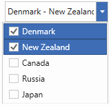
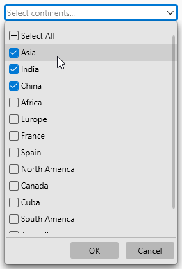
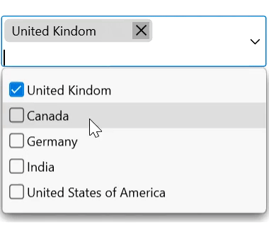

# MultiSelection Support in WPF ComboBox (ComboBoxAdv)

This section explains how to select multiple items and how to select items programmatically in the [WPF ComboBox](https://www.syncfusion.com/wpf-controls/combobox) (ComboBoxAdv) control.

## Properties

<table>
<tr>
<th>
Property</th><th>
Description</th><th>
Type</th><th>
Data Type</th><th>
Reference links</th></tr>
<tr>
<td>
AllowMultiSelect</td><td>
Multiple items can be selected.</td><td>
Dependency Property</td><td>
Boolean</td><td>
NA</td></tr>
<tr>
<td>
SelectedItems</td><td>
It contains the selected items value</td><td>
Dependency Property</td><td>
ObservableCollection&lt;object&gt;</td><td>
NA</td></tr>
</table>

## Adding multiple selection to an application

You can select multiple items in the WPF ComboBox (ComboBoxAdv) control by setting the [`AllowMultiSelect`](https://help.syncfusion.com/cr/wpf/Syncfusion.Windows.Tools.Controls.ComboBoxAdv.html#Syncfusion_Windows_Tools_Controls_ComboBoxAdv_AllowMultiSelect) property to `true`.





<syncfusion:ComboBoxAdv x:Name="comboBoxAdv" AllowMultiSelect="True">
</syncfusion:ComboBoxAdv>





ComboBoxAdv comboBoxAdv = new ComboBoxAdv();
comboBoxAdv.AllowMultiSelect = true;




## Selecting items programmatically

You can select items programmatically by using the [`SelectedItems`](https://help.syncfusion.com/cr/wpf/Syncfusion.Windows.Tools.Controls.ComboBoxAdv.html#Syncfusion_Windows_Tools_Controls_ComboBoxAdv_SelectedItems) property. When `AllowMultiSelect` is set to `true`, the `SelectedItems` property exposes the items that are selected in the drop-down list.

In the example below, the first two items from the observable collection are bound to the `SelectedItems` property.

### Creating the model and view-model

1. Create a data object class named `Country` and declare the property as follows.






public class Country
{
    public string Name { get; set; }
}





{{ codesnippet1 | OrderList_Indent_Level_1 }}

2. Create a `ViewModel` class with `SelectedItems`, which are initialized with data objects in the constructor.






public class ViewModel : INotifyPropertyChanged
{
    private ObservableCollection<object> _items;

    private ObservableCollection<object> selectedItems;
    public ObservableCollection<object> SelectedItems
    {
        get { return selectedItems; }
        set
        {
            selectedItems = value;
            RaisePropertyChanged("SelectedItems");
        }
    }
    private ObservableCollection<Country> countries;
    public ObservableCollection<Country> Countries
    {
        get { return countries; }
        set
        {
            countries = value;
        }
    }
    public ViewModel()
    {
        Countries = new ObservableCollection<Country>();
        Countries.Add(new Country() { Name = "Denmark" });
        Countries.Add(new Country() { Name = "New Zealand" });
        Countries.Add(new Country() { Name = "Canada" });
        Countries.Add(new Country() { Name = "Russia" });
        Countries.Add(new Country() { Name = "Japan" });

        _items = new ObservableCollection<object>();
        for (int i = 0; i < 2; i++)
        {
            _items.Add(Countries[i]);
        }
        SelectedItems = new ObservableCollection<object>(_items);
    }

    public event PropertyChangedEventHandler PropertyChanged;
    public void RaisePropertyChanged(string PropertyName)
    {
        var property = PropertyChanged;
        if (property != null)
            property(this, new PropertyChangedEventArgs(PropertyName));
    }
}





{{ codesnippet2 | OrderList_Indent_Level_1 }}

3. To bind the `ComboBoxAdv` to data, set the `ViewModel` as the `DataContext` and bind `Countries` to the [`ItemsSource`](https://learn.microsoft.com/en-us/dotnet/api/system.windows.controls.itemscontrol.itemssource) property.






<Window.DataContext>
    <local:ViewModel />
</Window.DataContext>
<Grid>
    <syncfusion:ComboBoxAdv DisplayMemberPath="Name" SelectedItems="{Binding SelectedItems, Mode=TwoWay, UpdateSourceTrigger=PropertyChanged}"
            AllowMultiSelect="True" Name="comboboxadv"  HorizontalAlignment="Center" Height="30"
            VerticalAlignment="Center" Width="150" ItemsSource="{Binding Countries}"/>
</Grid>





{{ codesnippet3 | OrderList_Indent_Level_1 }}

N> [View sample in GitHub](https://github.com/SyncfusionExamples/WPF-ComboBoxAdv-MultiSelection)

## Overriding the selected items programmatically

You can override the selected items programmatically by overriding the [`OnItemChecked`](https://help.syncfusion.com/cr/wpf/Syncfusion.Windows.Tools.Controls.ComboBoxAdv.html#Syncfusion_Windows_Tools_Controls_ComboBoxAdv_OnItemChecked_System_Object_System_Collections_ObjectModel_ObservableCollection_System_Object__) and [`OnItemUnchecked`](https://help.syncfusion.com/cr/wpf/Syncfusion.Windows.Tools.Controls.ComboBoxAdv.html#Syncfusion_Windows_Tools_Controls_ComboBoxAdv_OnItemUnchecked_System_Object_System_Collections_ObjectModel_ObservableCollection_System_Object__) methods. Build the project so the custom `ComboBoxExt` is available before the XAML is parsed.





<Window x:Class="ComboBoxExtDemo.MainWindow"
        xmlns="http://schemas.microsoft.com/winfx/2006/xaml/presentation"
        xmlns:x="http://schemas.microsoft.com/winfx/2006/xaml"
        xmlns:d="http://schemas.microsoft.com/expression/blend/2008"
        xmlns:mc="http://schemas.openxmlformats.org/markup-compatibility/2006"
        xmlns:local="clr-namespace:ComboBoxExtDemo" xmlns:syncfusion="http://schemas.syncfusion.com/wpf"
        mc:Ignorable="d"
        Title="MainWindow" Height="450" Width="800">
    <Grid>
          <local:ComboBoxExt
                Width="250"
                Height="24"
                AllowMultiSelect="True"
                AllowSelectAll="True"
                EnableOKCancel="True"
                DefaultText="Select continent..."
                DisplayMemberPath="Name"
                ItemsSource="{Binding Continent}" />
    </Grid>
</Window>





public class ComboBoxViewModel : NotificationObject
    {
        private ObservableCollection<object> continentCollection;
        public ComboBoxViewModel()
        {
            continentCollection = new ObservableCollection<object>()
            {
                new Country(){ Name = "Asia" },
                new Country(){ Name = "India" },
                new Country(){ Name = "China" },
                new Country(){ Name = "Africa" },
                new Country(){ Name = "Europe" },
            };
        }

        public ObservableCollection<object> Continent
        {
            get { return continentCollection; }
            set
            {
                continentCollection = value;
                RaisePropertyChanged("Continent");
            }
        }

        public class Country : NotificationObject
        {
            private string name;

            public string Name
            {
                get { return name; }
                set
                {
                    name = value;
                    RaisePropertyChanged("Name");
                }
            }
        }
    }    

public class ComboBoxExt : ComboBoxAdv
{
    protected override ObservableCollection<object> OnItemChecked(object checkedItem, ObservableCollection<object> selectedItems)
    {
         var item = ((FrameworkElement)checkedItem).DataContext;
            if (item == this.Items[0])
                AddItem(selectedItems, new int[] { 1, 2 });
            if (item == this.Items[4])
                AddItem(selectedItems, new int[] { 5, 6 });

        return base.OnItemChecked(checkedItem, selectedItems);      
    }

    protected override ObservableCollection<object> OnItemUnchecked(object unCheckedItem, ObservableCollection<object> selectedItems)
    {
        var item = ((FrameworkElement)uncheckedItem).DataContext;
            if (item == this.Items[0])
                RemoveItem(selectedItems, new int[] { 1, 2 });
            if (item == this.Items[4])
                RemoveItem(selectedItems, new int[] { 5, 6 });

        return base.OnItemUnchecked(unCheckedItem, selectedItems);
    }

    public void AddItem(ObservableCollection<object> selectedItems, int[] index)
    {
        foreach (int i in index)
        {
            if (!selectedItems.Contains(this.Items[i]))
                selectedItems.Add(this.Items[i]);
        }
    }

    public void RemoveItem(ObservableCollection<object> selectedItems, int[] index)
    {
        foreach (int i in index)
        {
            if (selectedItems.Contains(this.Items[i]))
                selectedItems.Remove(this.Items[i]);
        }
    }
}





On selecting Asia, the items at indices 1 and 2 (for example, India and China) are automatically added to the selected items.

N> [View sample in GitHub](https://github.com/SyncfusionExamples/syncfusion-wpf-combobox-examples/tree/main/Samples/Dynamic-checked-items)

## Multi-select edit using tokens

The selected items are represented by a rounded-polygon shape with a close icon, which can be interacted with by pressing the close button. The [`EnableToken`](https://help.syncfusion.com/cr/wpf/Syncfusion.Windows.Tools.Controls.ComboBoxAdv.html#Syncfusion_Windows_Tools_Controls_ComboBoxAdv_EnableToken) property determines whether the ComboBoxAdv's selected items should be displayed as tokens. The default value is `false`.

When an item is selected from the drop-down, it is added to the text area as a token. The corresponding item is removed from the text box when you click the close icon.




<syncfusion:ComboBoxAdv 
      AllowMultiSelect="true"
      IsEditable="true"
      EnableToken="true">
</syncfusion:ComboBoxAdv>





ComboBoxAdv comboBox = new ComboBoxAdv();       
combobox.AllowMultiSelect = true;
combobox.IsEditable = true;
combobox.EnableToken = true;




N> Token support is available only in multi-selection mode. The text area height automatically increases or decreases based on the placement of the selected items.

### Editing

You can type any text in the text box, and it will be added as a token only if it matches an item in the drop-down.

### Keyboard access

* Use the **Down Arrow**, **Up Arrow**, **Space**, **Enter**, and **Tab** keys to select an item from the drop-down.
* Use the **Enter** and **Tab** keys to validate the typed text. It is added as a token only if it matches an item in the drop-down.
* Use the **Backspace** key to remove the last token from the text area.
* Press the **Esc** key to close the drop-down if it is open.

N> [View sample in GitHub](https://github.com/SyncfusionExamples/syncfusion-wpf-combobox-examples/tree/main/Samples/Token-support)
