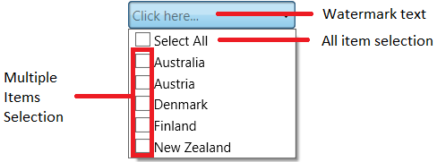

# WPF ComboBox (ComboBoxAdv) Overview

The [ComboBoxAdv](https://help.syncfusion.com/cr/wpf/Syncfusion.Windows.Tools.Controls.ComboBoxAdv.html) control allows the component that allows user to type a value or choose an option from a list of predefined options. It has several out of the box features such as data binding, multiselection, editing and more.

Key features are:

* [AllowMultiSelect](https://help.syncfusion.com/cr/wpf/Syncfusion.Windows.Tools.Controls.ComboBoxAdv.html#Syncfusion_Windows_Tools_Controls_ComboBoxAdv_AllowMultiSelect) : Support to select multiple values from drop-down list.
* [DefaultText](https://help.syncfusion.com/cr/wpf/Syncfusion.Windows.Tools.Controls.ComboBoxAdv.html#Syncfusion_Windows_Tools_Controls_ComboBoxAdv_DefaultText) :  Helps to prompt user by providing additional hints about the data that should be entered into the text box.
* [SelectedValueDelimiter](https://help.syncfusion.com/cr/wpf/Syncfusion.Windows.Tools.Controls.ComboBoxAdv.html#Syncfusion_Windows_Tools_Controls_ComboBoxAdv_SelectedValueDelimiter) : Allows customizing the delimiter string displayed between selected items during multiple selection.
* [EnableOkCancel](https://help.syncfusion.com/cr/wpf/Syncfusion.Windows.Tools.Controls.ComboBoxAdv.html#Syncfusion_Windows_Tools_Controls_ComboBoxAdv_EnableOKCancel) : Enables ok and cancel button at the bottom position in the dropdown box. 
* [AllowSelectAll](https://help.syncfusion.com/cr/wpf/Syncfusion.Windows.Tools.Controls.ComboBoxAdv.html#Syncfusion_Windows_Tools_Controls_ComboBoxAdv_AllowSelectAll) : Adds **Select All** item in ComboBoxAdv dropdown and allows to select all items in it.
