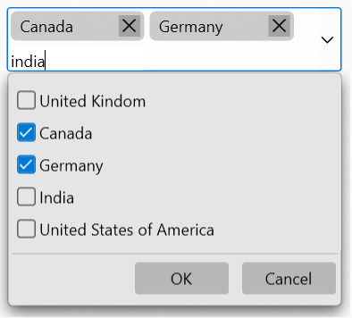

# Token Support in WPF ComboBox (ComboBoxAdv)

Token represents the selected item(s) in [ComboBoxAdv](https://help.syncfusion.com/cr/wpf/Syncfusion.Windows.Tools.Controls.ComboBoxAdv.html). The selected items are displayed in rounded-polygon shape with close icon.

The [EnableToken]() property determines whether the selected items in the [ComboBoxAdv](https://help.syncfusion.com/cr/wpf/Syncfusion.Windows.Tools.Controls.ComboBoxAdv.html) should be displayed as token. 

In [ComboBoxAdv](https://help.syncfusion.com/cr/wpf/Syncfusion.Windows.Tools.Controls.ComboBoxAdv.html) we can achieve this token support only while enabling the following properties. 




<syncfusion:ComboBoxAdv AllowMultiSelect="true"/>

<syncfusion:ComboBoxAdv IsEditable="true"/>

<syncfusion:ComboBoxAdv EnableToken="true"/>





ComboBoxAdv comboBox = new ComboBoxAdv();       
combobox.AllowMultiSelect = true;
combobox.IsEditable = true;
combobox.EnableToken = true;




The important characteristics of the token support are as follows.

### Editing

•	On multiselection, we can type any text to add the items

N> Typed text will be validated based on the dropdown items.

### Adding

•	When an item is selected from the dropdown, the item will be added as token in text area.

•	Token can be added by pressing the **Enter** or **Tab** key after type the text.

### Removing

•	By clicking the close icon, the appropriate item will be removed from the text area.

•	By pressing **BackSpace** key, the last selected item will be removed from the text area.

### AutoSizing

•	Text area height will be increased or decreased automatically based on the placement of the selected items.

## Keyboard access

•	Using the **Down Arrow**, **Up Arrow**, **Space**, **Enter** and **Tab** keys item can be selected from the combobox.

•	Using the **Enter** and **Tab** keys, typed text will be validated and added as token if it is available in dropdown items.

•	Using the **Backspace** key, the last positioned token will be removed from the text area.

•	When the **Esc** key is pressed, the drop-down area will be closed if it has been opened already.

View sample in [GitHub]().
