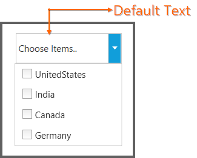

# Watermark Support in WPF ComboBox (ComboBoxAdv)

It displays the default text in the ComboBoxAdv when none of the items is selected in the drop down list.

<table>
<tr>
<th>
Property</th><th>
Description</th><th>
Type</th><th>
Data Type</th><th>
Reference links</th></tr>
<tr>
<td>
DefaultText </td><td>
It is possible to display the default text.</td><td>
Dependency Property</td><td>
String</td><td>
NA</td></tr>
</table>

#### Adding DefaultText property to an application 

DefaultText property can be added directly to an application in the following way: 




<syncfusion:ComboBoxAdv DefaultText="..Choose Items.."></syncfusion:ComboBoxAdv>





ComboBoxAdv comboBox = new ComboBoxAdv();       
comboBox.DefaultText = "..Choose Items..";




