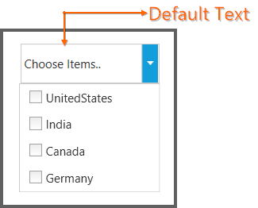

# Watermark Support in WPF ComboBox

The watermark displays a default text in the ComboBox when no item is selected in the drop-down list. The default text is hidden as soon as the user selects an item or starts editing (when `IsEditable` is `true`).

<table>
<tr>
<th>
Property</th><th>
Description</th><th>
Type</th><th>
Data Type</th><th>
Reference links</th></tr>
<tr>
<td>
DefaultText </td><td>
It is possible to display the default text.</td><td>
Dependency Property</td><td>
String</td><td>
NA</td></tr>
</table>

## Adding the DefaultText property to an application

The `DefaultText` property can be added directly to an application in the following way.




<syncfusion:ComboBoxAdv DefaultText="..Choose Items.."></syncfusion:ComboBoxAdv>





ComboBoxAdv comboBox = new ComboBoxAdv();       
comboBox.DefaultText = "..Choose Items..";




N> The default text is also shown when the user clears the selected item in the editor. If the bound `ItemsSource` is empty, the default text is still displayed.
