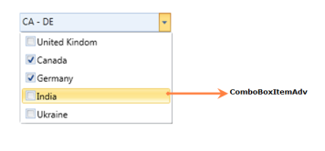
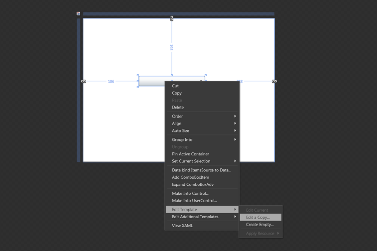
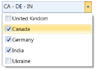
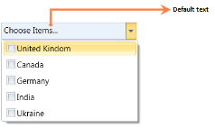
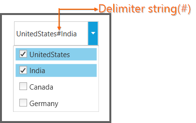

# ComboBoxAdv 

## Use Case Scenarios

If multiple choices are allowed for the user, then the ComboBoxAdv is useful to display those multiple choices.  Instead of displaying all the choices initially, the choices displayed with in the dropdown whenever the user click on the ComboBoxAdv control.

## Structure of the ComboBoxAdv Control

The following screenshot displays the ComboBoxAdv.

## ComboBoxItemAdv: It can be added inside the ComboBoxAdv control. It is originally derived from the ComboBoxItem.

## Sample link

To view samples:

1. Select Start -> Programs -> Syncfusion -> Essential Studio 9.2.0.136 -> Dashboard.
2. Select Run Locally Installed Samples in WPF Combo box.
3. Now move the mouse to the ComboBoxAdv menu in the Sample Browser.
4. Choose ComboBoxAdv demo.

## Adding ComboBoxAdv to an Application

The ComboBoxAdv control can be added to an application by using the following applications:

* Microsoft Visual Studio
* Microsoft Expression Blend

### Creating the ComboBoxAdv Control in Visual Studio

To create an ComboBoxAdv instance in Visual Studio:

1. Open Visual Studio. 
2. On the File menu, select New, and then select Project. The New Project dialog box displays.

   

3. In the New Project dialog box, select WPF Application.
4. In the Name field, type the name of the project. 
5. Click OK.

   

6. Drag the ComboBoxAdv control from the Toolbox window to the Design View. An instance of the ComboBoxAdv control is created in Design view.

   
   

### Creating the ComboBoxAdv Control in Expression Blend

To create ComboBoxAdv instance in Expression Blend:

1. Open Expression Blend.
2. On the File menu, select New Project. The New Project dialog box opens.

   

3. In the Project type’s pane, select WPF,and then select WPF Application.
4. In the Name field, type the name of the project, and then click OK.

   

5. On the Window menu, select Assets. The Assets Library dialog box opens.
6. In the Search box, type ComboBoxAdv. The search results are displayed.
7. Drag the ComboBoxAdv control to Design view. An instance of the ComboBoxAdv control is created. 

   
   

## Appearance

You can customize the appearance of the ComboBoxAdv control by editing the style of the control in Expression Blend or by using the following properties exposed by ComboBoxAdv control:

* Edit style in Expression Blend 
* Customizing by using properties

### Blendability

You can edit the style of ComboBoxAdv by using Expression Blend. To edit the ComboBoxAdv control’s style in Expression Blend:

1. Drag the ComboBoxAdv control to the Design view. The ComboBoxAdv control will appear as shown in the screen shot displayed below.
2. Right-click the ComboBoxAdv control, select Edit Template, and then select Edit a Copy.

## Features of ComboBoxAdv control

### Multiple Selections

If we want to select more than one item in the ComboBoxAdv, AllowMultiSelect property will be helpful to do this. It allows you to select multiple items in the drop down list. The selected items will be displayed in ascending order as shown in the drop down list. When AllowMutliSelect property is true, the SelectedItems property exposes the items that are selected in the drop down list.

#### Properties

<table>
<tr>
<th>
Property</th><th>
Description</th><th>
Type</th><th>
Data Type</th><th>
Reference links</th></tr>
<tr>
<td>
AllowMultiSelect</td><td>
Multiple items can be selected.</td><td>
Dependency Property</td><td>
Boolean</td><td>
NA</td></tr>
<tr>
<td>
SelectedItems</td><td>
It contains the selected items value</td><td>
Dependency Property</td><td>
ObservableCollection&lt;object&gt;</td><td>
NA</td></tr>
</table>

#### Adding Multiple Selections to an Application 

AllowMultiSelect property can be added directly to an application using the following code snippet.



<syncfusion:ComboBoxAdv AllowMultiSelect="True"></syncfusion:ComboBoxAdv></td></tr>




ComboBoxAdv comboBox = new ComboBoxAdv();
comboBox.AllowMultiSelect = true;


### Default Text

It displays the default text in the ComboBoxAdv when none of the items is selected in the drop down list.

<table>
<tr>
<th>
Property</th><th>
Description</th><th>
Type</th><th>
Data Type</th><th>
Reference links</th></tr>
<tr>
<td>
DefaultText </td><td>
It is possible to display the default text.</td><td>
Dependency Property</td><td>
String</td><td>
NA</td></tr>
</table>

#### Adding DefaultText property to an Application 

DefaultText property can be added directly to an application in the following way: 



<syncfusion:ComboBoxAdv DefaultText="..Choose Items.."></syncfusion:ComboBoxAdv>




ComboBoxAdv comboBox = new ComboBoxAdv();       
comboBox.DefaultText = "..Choose Items..";


### Delimiter String Customization

A delimiter string in a ComboBoxAdv is “A string that can be displayed between the selected items in the ComboBoxAdv”. We can customize this string by using the property called “SelectedValueDelimiter” in the ComboBoxAdv.

<table>
<tr>
<th>
Property</th><th>
Description</th><th>
Type</th><th>
Data Type</th><th>
Reference links</th></tr>
<tr>
<td>
SelectedValueDelimiter </td><td>
The selected items can be separated by the given string.</td><td>
Dependency Property</td><td>
String</td><td>
NA</td></tr>
</table>

### Adding Delimiter String Customization to an Application 

Delimiter string customization can be added directly to an application using the following code snippet: 



<syncfusion:ComboBoxAdv SelectedValueDelimiter="#"></syncfusion:ComboBoxAdv>




ComboBoxAdv comboBox = new ComboBoxAdv();     
comboBox.SelectedValueDelimiter = "#";



