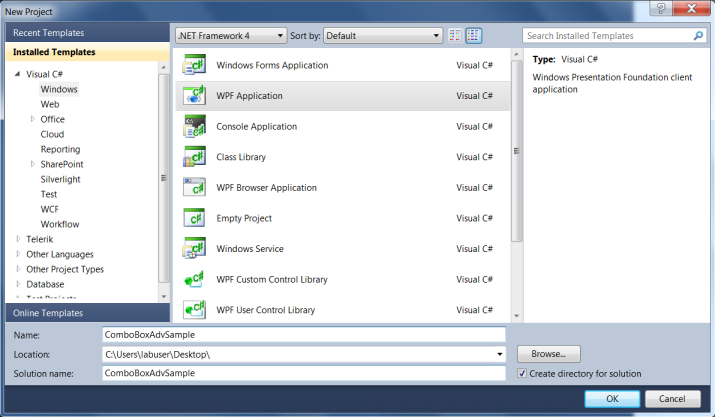

# Overview

The ComboBoxAdv control allows the user to select multiple items. It also allows displaying the default text when none of the items is selected. With ComboBoxAdv,it is possible to customize the delimiter string that is displayed between the selected items.

### Creating the ComboBoxAdv control in Visual Studio

To create an ComboBoxAdv instance in Visual Studio:

1. Open Visual Studio. 
2. On the File menu, select New, and then select Project. The New Project dialog box displays.

   

3. In the New Project dialog box, select WPF Application.
4. In the Name field, type the name of the project. 
5. Click OK.

   

6. Drag the ComboBoxAdv control from the Toolbox window to the Design View. An instance of the ComboBoxAdv control is created in Design view.

   
