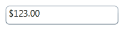
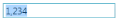
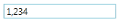

# Layout and Behavior Related Features

## IsReadOnly

If the CurrencyTextBox is read-only, then no user input or edits are allowed but programmatic changes can be made. The user can still select text and the cursor still appears.

## CornerRadius

The [CornerRadius](https://help.syncfusion.com/cr/cref_files/wpf/Syncfusion.Shared.Wpf~Syncfusion.Windows.Shared.EditorBase~CornerRadius.html) describes the degree to which corners are rounded. This property has no default value.




<syncfusion:CurrencyTextBox x:Name="currencyTextBox" Value="123" Height="25" Width="150" CornerRadius="4"/>




## Negative foreground

The Foreground of the CurrencyTextBox can be customized based on the [Value](https://help.syncfusion.com/cr/wpf/Syncfusion.Shared.Wpf~Syncfusion.Windows.Shared.CurrencyTextBox~Value.html) property. When Negative value is assigned to the Value property, then automatically the NegativeForeground value gets assigned to the Foreground property.

N> The [NegativeForeground](https://help.syncfusion.com/cr/cref_files/wpf/Syncfusion.Shared.Wpf~Syncfusion.Windows.Shared.EditorBase~NegativeForeground.html) in the CurrencyTextBox can be enabled by setting the [ApplyNegativeForeground](https://help.syncfusion.com/cr/cref_files/wpf/Syncfusion.Shared.Wpf~Syncfusion.Windows.Shared.EditorBase~ApplyNegativeForeground.html) property to true.




<syncfusion:CurrencyTextBox x:Name="currencyTextBox" Height="25" Width="150" 
                            CornerRadius="2" Value="-123" NegativeForeground="Red" 
                            ApplyNegativeForeground="True"/>




## Zero color

The Foreground of the CurrencyTextBox can be customized based on the [Value](https://help.syncfusion.com/cr/wpf/Syncfusion.Shared.Wpf~Syncfusion.Windows.Shared.CurrencyTextBox~Value.html) property. When zero is assigned as a value to the [Value](https://help.syncfusion.com/cr/wpf/Syncfusion.Shared.Wpf~Syncfusion.Windows.Shared.CurrencyTextBox~Value.html) property, then automatically the [ZeroColor](https://help.syncfusion.com/cr/cref_files/wpf/Syncfusion.Shared.Wpf~Syncfusion.Windows.Shared.EditorBase~ZeroColor.html) is set to the Foreground property.

N> The [ZeroColor](https://help.syncfusion.com/cr/cref_files/wpf/Syncfusion.Shared.Wpf~Syncfusion.Windows.Shared.EditorBase~ZeroColor.html) in the CurrencyTextBox can be enabled by setting the [ApplyZeroColor](https://help.syncfusion.com/cr/cref_files/wpf/Syncfusion.Shared.Wpf~Syncfusion.Windows.Shared.EditorBase~ApplyZeroColor.html) property to true.




<syncfusion:CurrencyTextBox x:Name="currencyTextBox" Height="25" Width="150" 
                            CornerRadius="2" Value="0" ZeroColor="Magenta" 
                            ApplyZeroColor="True"/>



## EnterToMoveNext

If you press the Enter key in the CurrencyTextBox then the Focus moves to the next element in the application. To enable this feature you have to set the [EnterToMoveNext](https://help.syncfusion.com/cr/cref_files/wpf/Syncfusion.Shared.Wpf~Syncfusion.Windows.Shared.EditorBase~EnterToMoveNext.html) property to true.

## TextSelectionOnFocus

The [TextSelectionOnFocus](https://help.syncfusion.com/cr/cref_files/wpf/Syncfusion.Shared.Wpf~Syncfusion.Windows.Shared.EditorBase~TextSelectionOnFocus.html) property allows the CurrencyTextBox to act like standard text boxes when the cursor hovers over. 

