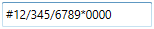
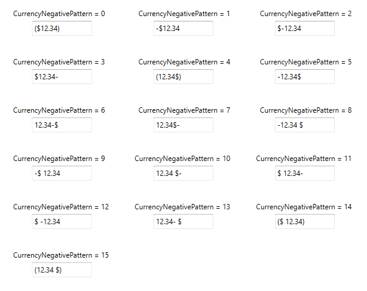
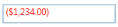

# Culture and Formatting in WPF Currency TextBox

Value of `CurrencyTextBox` can be formatted in following ways:

* Culture
* NumberFormatInfo
* Dedicated properties (CurrencyGroupSeparator, CurrencyGroupSizes, CurrencyDecimalDigits, CurrencyDecimalSeparator)

## Culture based formatting

The [CurrencyTextBox](https://www.syncfusion.com/wpf-ui-controls/currency-textbox) provides support for globalization by using the [Culture](https://help.syncfusion.com/cr/wpf/Syncfusion.Windows.Shared.EditorBase.html#Syncfusion_Windows_Shared_EditorBase_Culture) property. The `Culture` property is used to format the decimal separator and group separator of the `CurrencyTextBox` value based on the respective culture.




<syncfusion:CurrencyTextBox x:Name="currencyTextBox" Height="25" Width="150" Culture="fr-FR" Value="1234567"/>





CurrencyTextBox currencyTextBox = new CurrencyTextBox();
currencyTextBox.Width = 100;
currencyTextBox.Height = 25;
currencyTextBox.Value = 1234567;
currencyTextBox.Culture = new CultureInfo("fr-FR");




By default the US culture uses “,” as the `CurrencyGroupSeparator` "$" as `CurrencySymbol` and "." as the `CurrencyDecimalSeparator` where as the France culture uses “Space” as the `CurrencyGroupSeparator`, "€" as `CurrencySymbol` and "," as the `CurrencyDecimalSeparator`. 

**Default Culture**

**France Culture**

## NumberFormatInfo based formatting

The number formatting of `CurrencyTextBox` can be customized by setting [NumberFormat](https://help.syncfusion.com/cr/wpf/Syncfusion.Windows.Shared.EditorBase.html#Syncfusion_Windows_Shared_EditorBase_NumberFormat) property.




<syncfusion:CurrencyTextBox x:Name="currencyTextBox" Height="25" Width="150"  Value="1234567">
    <syncfusion:CurrencyTextBox.NumberFormat >
        <numberformat:NumberFormatInfo CurrencyGroupSeparator="/" 
                                       CurrencyDecimalDigits="4" 
                                       CurrencyDecimalSeparator="*" 
                                       CurrencySymbol="$"/>
    </syncfusion:CurrencyTextBox.NumberFormat>
</syncfusion:CurrencyTextBox>





CurrencyTextBox currencyTextBox = new CurrencyTextBox();
currencyTextBox.Width = 150;
currencyTextBox.Height = 25;
currencyTextBox.Value = 1234567;
currencyTextBox.NumberFormat = new NumberFormatInfo()
{
    CurrencyGroupSeparator = "/", 
    CurrencyDecimalDigits = 4,     
    CurrencyDecimalSeparator = "*", 
    CurrencySymbol = "$"
};




The following code illustrate how to set currency group size by using the `NumberFormat` property.




CurrencyTextBox currencyTextBox = new CurrencyTextBox();
currencyTextBox.Width = 150;
currencyTextBox.Height = 25;
currencyTextBox.Value = 123456789;
currencyTextBox.NumberFormat = new NumberFormatInfo()
{
    CurrencySymbol = "&",
    CurrencyDecimalDigits = 4,
    CurrencyGroupSeparator = "/",
    CurrencyDecimalSeparator = "*",

    // Adding the currency group size via NumberFormat property.
    CurrencyGroupSizes = new int[] { 2, 3, 4 }
};




## Formatting with dedicated properties

The number formatting of `CurrencyTextBox` can also be customized by setting the [CurrencyGroupSeparator](https://help.syncfusion.com/cr/wpf/Syncfusion.Windows.Shared.CurrencyTextBox.html#Syncfusion_Windows_Shared_CurrencyTextBox_CurrencyGroupSeparator), [CurrencyGroupSizes](https://help.syncfusion.com/cr/wpf/Syncfusion.Windows.Shared.CurrencyTextBox.html#Syncfusion_Windows_Shared_CurrencyTextBox_CurrencyGroupSizes), [CurrencyDecimalDigits](https://help.syncfusion.com/cr/wpf/Syncfusion.Windows.Shared.CurrencyTextBox.html#Syncfusion_Windows_Shared_CurrencyTextBox_CurrencyDecimalDigits) and [CurrencyDecimalSeparator](https://help.syncfusion.com/cr/wpf/Syncfusion.Windows.Shared.CurrencyTextBox.html#Syncfusion_Windows_Shared_CurrencyTextBox_CurrencyDecimalSeparator), [CurrencySymbol](https://help.syncfusion.com/cr/wpf/Syncfusion.Windows.Shared.CurrencyTextBox.html#Syncfusion_Windows_Shared_CurrencyTextBox_CurrencySymbol), [CurrencyNegativePattern](https://help.syncfusion.com/cr/wpf/Syncfusion.Windows.Shared.CurrencyTextBox.html#Syncfusion_Windows_Shared_CurrencyTextBox_CurrencyNegativePattern), and [CurrencyPositivePattern](https://help.syncfusion.com/cr/wpf/Syncfusion.Windows.Shared.CurrencyTextBox.html#Syncfusion_Windows_Shared_CurrencyTextBox_CurrencyPositivePattern) properties of CurrencyTextBox. You can show the group separator by enable the [GroupSeperatorEnabled](https://help.syncfusion.com/cr/wpf/Syncfusion.Windows.Shared.CurrencyTextBox.html#Syncfusion_Windows_Shared_CurrencyTextBox_GroupSeperatorEnabled) property to `true`. 

The following code illustrate how to format using the `CurrencyDecimalSeparator`, `CurrencyDecimalDigits`, `CurrencyGroupSeparator`, `CurrencyGroupSizes` property of the `CurrencyTextBox`.




CurrencyTextBox currencyTextBox = new CurrencyTextBox();
currencyTextBox.Width = 150;
currencyTextBox.Height = 25;
currencyTextBox.Value = 123456789;
currencyTextBox.CurrencySymbol = "#";
currencyTextBox.CurrencyDecimalDigits = 4;
currencyTextBox.GroupSeperatorEnabled = true;
currencyTextBox.CurrencyGroupSeparator = "/";
currencyTextBox.CurrencyDecimalSeparator = "*";

// Adding the currency group size via CurrencyGroupSizes property.
currencyTextBox.CurrencyGroupSizes = new Int32Collection() { 4, 3, 2 };




N> When you use both the `NumberFormat` and the dedicated properties (`CurrencyGroupSeparator`, `CurrencySymbol`, `CurrencyDecimalDigits`, `CurrencyDecimalSeparator` and `CurrencyGroupSizes`) to format the value of `CurrencyTextBox`, the `CurrencyGroupSeparator`and `CurrencyGroupSizes` properties have higher priority.

N> When you use both `NumberFormat` and  `Culture`, the `NumberFormat` will have a higher priority.

### Positive Value Pattern

You can use the [CurrencyPositivePattern](https://help.syncfusion.com/cr/wpf/Syncfusion.Windows.Shared.CurrencyTextBox.html#Syncfusion_Windows_Shared_CurrencyTextBox_CurrencyPositivePattern) property to customize the location of the currency symbol and the positive currency values. In the table below,"$" denotes the symbol of the currency, and "n" denotes the number.

**CurrencyPositivePattern table**

<table>
<tr>
<th>
Value</th><th>
Associated Pattern</th></tr>
<tr>
<td>
0</td><td>
$n</td></tr>
<tr>
<td>
1</td><td>
n$</td></tr>
<tr>
<td>
2</td><td>
$ n</td></tr>
<tr>
<td>
3</td><td>
n $</td></tr>
</table>




<syncfusion:CurrencyTextBox x:Name="currencyTextBox" Height="25" Width="150" Value="1234" CurrencyPositivePattern="3"/>




CurrencyTextBox currencyTextBox = new CurrencyTextBox();
currencyTextBox.Width = 150;
currencyTextBox.Height = 25;
currencyTextBox.Value = 1234;
currencyTextBox.CurrencyPositivePattern = 3;




###  Negative Value Pattern

You can use the [CurrencyNegativePattern](https://help.syncfusion.com/cr/wpf/Syncfusion.Windows.Shared.CurrencyTextBox.html#Syncfusion_Windows_Shared_CurrencyTextBox_CurrencyNegativePattern) property to customize the location of the currency symbol and the negative currency values. In the table below,"$" denotes the symbol of the currency, and "n" denotes the number.

**CurrencyNegativePattern table**

<table>
<tr>
<th>
Value</th><th>
Associated Pattern</th></tr>
<tr>
<td>
0</td><td>
($n)</td></tr>
<tr>
<td>
1</td><td>
-$n</td></tr>
<tr>
<td>
2</td><td>
$-n</td></tr>
<tr>
<td>
3</td><td>
$n-</td></tr>
<tr>
<td>
4</td><td>
(n$)</td></tr>
<tr>
<td>
5</td><td>
-n$</td></tr>
<tr>
<td>
6</td><td>
n-$</td></tr>
<tr>
<td>
7</td><td>
n$-</td></tr>
<tr>
<td>
8</td><td>
-n $</td></tr>
<tr>
<td>
9</td><td>
-$ n</td></tr>
<tr>
<td>
10</td><td>
n $-</td></tr>
<tr>
<td>
11</td><td>
$ n-</td></tr>
<tr>
<td>
12</td><td>
$ -n</td></tr>
<tr>
<td>
13</td><td>
n- $</td></tr>
<tr>
<td>
14</td><td>
($ n)</td></tr>
<tr>
<td>
15</td><td>
(n $)</td></tr>
</table>




<syncfusion:CurrencyTextBox x:Name="currencyTextBox" Height="25" Width="150" Value="-1234" CurrencyNegativePattern="0"/>




CurrencyTextBox currencyTextBox = new CurrencyTextBox();
currencyTextBox.Width = 150;
currencyTextBox.Height = 25;
currencyTextBox.Value = -1234;
currencyTextBox.CurrencyNegativePattern = 0;




