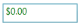
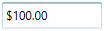
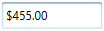
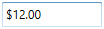
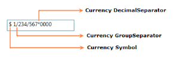

# Getting Started with WPF Currency TextBox

This section explains how to create a WPF `CurrencyTextBox` control and its features.

## Assembly deployment

Refer to the [control dependencies](https://help.syncfusion.com/wpf/control-dependencies#currencytextbox) section to get the list of assemblies or NuGet package that needs to be added as a reference to use the control in any application.

You can find more details about installing the NuGet package in a WPF application in the following link: 

[How to install nuget packages](https://help.syncfusion.com/wpf/nuget-packages)

## Adding WPF CurrencyTextBox via designer

You can add the [CurrencyTextBox](https://www.syncfusion.com/wpf-ui-controls/currency-textbox) control to an application by dragging it from the toolbox to a view of the designer. The following dependent assembly will be added automatically:

* Syncfusion.Shared.WPF

## Adding WPF CurrencyTextBox via XAML

To add the CurrencyTextBox control manually in XAML, follow these steps:
1. Create a new WPF project in Visual Studio.

2. Add the **Syncfusion.Shared.WPF** assembly references to the project.
 
3. Import Syncfusion WPF schema **http://schemas.syncfusion.com/wpf** and declare the `CurrencyTextBox` control in XAML page.



<Window xmlns="http://schemas.microsoft.com/winfx/2006/xaml/presentation"
        xmlns:x="http://schemas.microsoft.com/winfx/2006/xaml"
        xmlns:syncfusion="http://schemas.syncfusion.com/wpf" 
        x:Class="CurrencyTextBoxSample.MainWindow"
        Title="CurrencyTextBox Sample" Height="350" Width="525">
    <Grid>
        <!--Adding CurrencyTextBox control -->
        <syncfusion:CurrencyTextBox x:Name="currencyTextBox" Width="100" Height="25" VerticalAlignment="Center" HorizontalAlignment="Center"/>
    </Grid>
</Window>



## Adding WPF CurrencyTextBox via C\#

To add the CurrencyTextBox control manually in C#, follow these steps:

1. Create a new WPF application via Visual Studio.

2. Add the **Syncfusion.Shared.WPF** assembly references to the project.

3. Include the required namespace.




using Syncfusion.Windows.Shared;




4. Create an instance of CurrencyTextBox and add it to the window.




//Creating an instance of CurrencyTextBox control

CurrencyTextBox currencyTextBox = new CurrencyTextBox();

// Setting height and width to CurrencyTextBox

currencyTextBox.Height = 25;
currencyTextBox.Width = 100;

//Adding CurrencyTextBox as window content

this.Content = currencyTextBox;




## Setting Value

The value of the `CurrencyTextBox` can be set by using the [Value](https://help.syncfusion.com/cr/wpf/Syncfusion.Windows.Shared.CurrencyTextBox.html#Syncfusion_Windows_Shared_CurrencyTextBox_Value) property.




<syncfusion:CurrencyTextBox x:Name="currencyTextBox" Width="100" Height="23" Value="100"/>




CurrencyTextBox currencyTextBox = new CurrencyTextBox();
currencyTextBox.Width = 100;
currencyTextBox.Height = 23;
currencyTextBox.Value = 100;




N> Do not use the [Text](https://docs.microsoft.com/en-us/dotnet/api/system.windows.controls.textbox.text?redirectedfrom=MSDN&view=netframework-4.7.2#System_Windows_Controls_TextBox_Text) property to set the value for the CurrencyTextBox. Use only the `Value` property.

### Binding Value

Data binding is the method of forming a connection between the application  UI and business logic. Data binding can be unidirectional (source -> target or target <- source) or bidirectional (source <-> target). You can bind data to the `CurrencyTextBox` using the `Value` Property.

The following code snippets illustrate the value binding from one `CurrencyTextBox` to another.



<StackPanel>
<syncfusion:CurrencyTextBox x:Name="currencyTextBox1" Height="25" Width="100" Value="{Binding MyValue,UpdateSourceTrigger=PropertyChanged}"/>
<syncfusion:CurrencyTextBox x:Name="currencyTextBox2" Width="100" Height="25" Value="{Binding MyValue,UpdateSourceTrigger=PropertyChanged}" />
</StackPanel>



ViewModel.cs




class ViewModel : NotificationObject
{
    private double myValue;
    public double MyValue
    {
        get
        {
            return myValue;
        }
        set
        {
            myValue = value;
            RaisePropertyChanged("MyValue");
        }
    }
}




## Value Changed Notification

The `CurrencyTextBox` control can notifies the value changes through the [ValueChanged](https://help.syncfusion.com/cr/wpf/Syncfusion.Windows.Shared.CurrencyTextBox.html) event. You can get old value and new Value from `OldValue` and `NewValue` properties in `ValueChanged` event.


 

<syncfusion:CurrencyTextBox ValueChanged="CurrencyTextBox_ValueChanged"/>


 

CurrencyTextBox currencyTextBox = new CurrencyTextBox();
currencyTextBox.ValueChanged += new PropertyChangedCallback(CurrencyTextBox_ValueChanged);




You can handle the event as follows:




private void CurrencyTextBox_ValueChanged(DependencyObject d, DependencyPropertyChangedEventArgs e)
{
    // Get old and new value
    var newValue = e.NewValue;
    var oldValue = e.OldValue;
}




## Min Max Value Restriction

The `Value` of `CurrencyTextBox` can be restricted within maximum and minimum limit. You can define the minimum and maximum values by setting the [MinValue](https://help.syncfusion.com/cr/wpf/Syncfusion.Windows.Shared.CurrencyTextBox.html#Syncfusion_Windows_Shared_CurrencyTextBox_MinValue) and [MaxValue](https://help.syncfusion.com/cr/wpf/Syncfusion.Windows.Shared.CurrencyTextBox.html#Syncfusion_Windows_Shared_CurrencyTextBox_MaxValue) properties. It allows the user to enter the value between `MinValue` and `MaxValue`. 




<syncfusion:CurrencyTextBox x:Name="currencyTextBox" Width="100" Height="25" Value="455" MaxValue="999.99" MinValue="-999.99"/>



CurrencyTextBox currencyTextBox = new CurrencyTextBox();
currencyTextBox.Width = 100;
currencyTextBox.Height = 25;
//Setting minimum value
currencyTextBox.MinValue = -999.99;
//Setting maximum value
currencyTextBox.MaxValue = 999.99;
currencyTextBox.Value = 455;




## Step Interval to increase or decrease the value

The `CurrencyTextBox` control allows to increase or decrease the value by pressing up and down arrow keys in keyboard or mouse wheel over the control. The [ScrollInterval](https://help.syncfusion.com/cr/wpf/Syncfusion.Windows.Shared.CurrencyTextBox.html#Syncfusion_Windows_Shared_CurrencyTextBox_ScrollInterval) property is used to specify the increment or decrement intervals. The default value of `ScrollInterval` is 1.




<syncfusion:CurrencyTextBox x:Name="currencyTextBox" Width="100" Height="25" Value="8" 
                          IsScrollingOnCircle="True" ScrollInterval="4"/>




CurrencyTextBox currencyTextBox = new CurrencyTextBox();
currencyTextBox.Width = 100;
currencyTextBox.Height = 25;
currencyTextBox.MinValue = 0;
currencyTextBox.MaxValue = 100;
currencyTextBox.Value = 8;
currencyTextBox.IsScrollingOnCircle = true;
currencyTextBox.ScrollInterval = 4;




## Formatting the value

You can customize the number format by using either the [NumberFormat](https://help.syncfusion.com/cr/wpf/Syncfusion.Windows.Shared.EditorBase.html#Syncfusion_Windows_Shared_EditorBase_NumberFormat) property or the [CurrencyGroupSeparator](https://help.syncfusion.com/cr/wpf/Syncfusion.Windows.Shared.CurrencyTextBox.html#Syncfusion_Windows_Shared_CurrencyTextBox_CurrencyGroupSeparator), [CurrencyGroupSizes](https://help.syncfusion.com/cr/wpf/Syncfusion.Windows.Shared.CurrencyTextBox.html#Syncfusion_Windows_Shared_CurrencyTextBox_CurrencyGroupSizes), [CurrencyDecimalDigits](https://help.syncfusion.com/cr/wpf/Syncfusion.Windows.Shared.CurrencyTextBox.html#Syncfusion_Windows_Shared_CurrencyTextBox_CurrencyDecimalDigits) and [CurrencyDecimalSeparator](https://help.syncfusion.com/cr/wpf/Syncfusion.Windows.Shared.CurrencyTextBox.html#Syncfusion_Windows_Shared_CurrencyTextBox_CurrencyDecimalSeparator), [CurrencySymbol](https://help.syncfusion.com/cr/wpf/Syncfusion.Windows.Shared.CurrencyTextBox.html#Syncfusion_Windows_Shared_CurrencyTextBox_CurrencySymbol), [CurrencyNegativePattern](https://help.syncfusion.com/cr/wpf/Syncfusion.Windows.Shared.CurrencyTextBox.html#Syncfusion_Windows_Shared_CurrencyTextBox_CurrencyNegativePattern), and [CurrencyPositivePattern](https://help.syncfusion.com/cr/wpf/Syncfusion.Windows.Shared.CurrencyTextBox.html#Syncfusion_Windows_Shared_CurrencyTextBox_CurrencyPositivePattern) properties of CurrencyTextBox.




<syncfusion:CurrencyTextBox x:Name="currencyTextBox" Height="25" Width="150"  Value="1234567">
    <syncfusion:CurrencyTextBox.NumberFormat >
        <numberformat:NumberFormatInfo CurrencyGroupSeparator="/" CurrencyDecimalDigits="4" CurrencyDecimalSeparator="*"   CurrencySymbol="$"/>
    </syncfusion:CurrencyTextBox.NumberFormat>
</syncfusion:CurrencyTextBox>




CurrencyTextBox currencyTextBox = new CurrencyTextBox();
currencyTextBox.Width = 100;
currencyTextBox.Height = 25;
currencyTextBox.Value = 1234567;
currencyTextBox.NumberFormat = new NumberFormatInfo()
{
    CurrencyGroupSeparator = "/",
    CurrencyDecimalDigits = 4,
    CurrencyDecimalSeparator = "*",
    CurrencySymbol = "$"
};




## Setting the Culture

The `CurrencyTextBox` provides support for globalization by using the [Culture](https://help.syncfusion.com/cr/wpf/Syncfusion.Windows.Shared.EditorBase.html#Syncfusion_Windows_Shared_EditorBase_Culture) property. The `Culture` is used to format the decimal separator and group separator of the `CurrencyTextBox` value based on the respective culture.


 

<syncfusion:CurrencyTextBox x:Name="currencyTextBox" Height="25" Width="100" Culture="en-US" Value="1234567"/>


 

CurrencyTextBox currencyTextBox = new CurrencyTextBox();
currencyTextBox.Width = 100;
currencyTextBox.Height = 25;
currencyTextBox.Value = 1234567;
currencyTextBox.Culture = new System.Globalization.CultureInfo("en-US");




N> When you use both `NumberFormat` and  `Culture`, the `NumberFormat` will have a higher priority.

## Theme

CurrencyTextBox supports various built-in themes. Refer to the below links to apply themes for the CurrencyTextBox,

  * [Apply theme using SfSkinManager](https://help.syncfusion.com/wpf/themes/skin-manager)
	
  * [Create a custom theme using ThemeStudio](https://help.syncfusion.com/wpf/themes/theme-studio#creating-custom-theme)

  