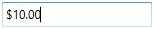
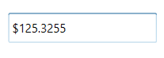
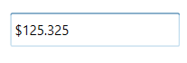

# Restriction or Validation in WPF Currency TextBox

This section explains how to validate or restrict the `CurrencyTextBox` control value.

## Restrict the value within minimum and maximum value

The [Value](https://help.syncfusion.com/cr/wpf/Syncfusion.Windows.Shared.CurrencyTextBox.html#Syncfusion_Windows_Shared_CurrencyTextBox_Value) of the [CurrencyTextBox](https://www.syncfusion.com/wpf-ui-controls/currency-textbox) can be restricted within the maximum and minimum limits. Once the value has reached the maximum or minimum value , the value does not exceed the limit. We can change the maximum and minimum limits by using the [MinValue](https://help.syncfusion.com/cr/wpf/Syncfusion.Windows.Shared.CurrencyTextBox.html#Syncfusion_Windows_Shared_CurrencyTextBox_MinValue) property and [MaxValue](https://help.syncfusion.com/cr/wpf/Syncfusion.Windows.Shared.CurrencyTextBox.html#Syncfusion_Windows_Shared_CurrencyTextBox_MaxValue) property.

You can choose when to validate the maximum and minimum limits while changing the values by using the [MinValidation](https://help.syncfusion.com/cr/wpf/Syncfusion.Windows.Shared.EditorBase.html#Syncfusion_Windows_Shared_EditorBase_MinValidation) and [MaxValidation](https://help.syncfusion.com/cr/wpf/Syncfusion.Windows.Shared.EditorBase.html#Syncfusion_Windows_Shared_EditorBase_MaxValidation) properties.

* `OnKeyPress` — When setting the `MaxValidation` or `MinValidation` to `OnKeyPress`, the value in the `CurrencyTextBox` will be validated shortly after pressing a key. So, it is not possible to provide any invalid input at all and the value does not exceed the maximum and minimum limits.

* `OnLostFocus` - When setting `MaxValidation` or `MinValidation` to `OnLostFocus`, the value in the `CurrencyTextBox` is validated, when the `CurrencyTextBox` loses the focus. That is, the `CurrencyTextBox` will accept any value, validation will only take place after the `CurrencyTextBox` has lost its keyboard focus. After validation, when the value of the `CurrencyTextBox` is greater than the `MaxValue` or less than the `MinValue`, the value will be automatically set to `MaxValue` or `MinValue`.

* [MaxValueOnExceedMaxDigit](https://help.syncfusion.com/cr/wpf/Syncfusion.Windows.Shared.EditorBase.html#Syncfusion_Windows_Shared_EditorBase_MaxValueOnExceedMaxDigit) - When you give input greater than specified maximum limit, `MaxValueOnExceedMaxDigit` property will decide either it should retain the old value or reset to maximum limit that is specified. For example, if `MaxValue` is set to 100 and you are trying to input 200. `Value` will changed to 100 when `MaxValueOnExceedMaxDigit` is `true`. When `MaxValueOnExceedMaxDigit` is `false`, 20 will be retained and last entered 0 will be ignored.

  N> `MaxValueOnExceedMinDigit` property will be enabled only when the `MaxValidation` is set to `OnKeyPress`.

* [MinValueOnExceedMinDigit](https://help.syncfusion.com/cr/wpf/Syncfusion.Windows.Shared.EditorBase.html#Syncfusion_Windows_Shared_EditorBase_MinValueOnExceedMinDigit) - When you give input less than specified minimum limit, `MinValueOnExceedMinDigit` property will decide either it should retain the old value or reset to minimum limit that is specified. For example, if `MinValue` is set to 200 and the `Value` is 205 and you are trying change the value to 20. `Value` will changed to 200 when `MinValueOnExceedMinDigit` is `true`. When `MinValueOnExceedMinDigit` is `false`, Old value 205 will be retained.

  N> `MinValueOnExceedMinDigit` will be enabled only when the `MinValidation` is set to `OnKeyPress`.




<syncfusion:CurrencyTextBox x:Name="currencyTextBox" Width="150" MaxValue="100" MinValue="10"
                          MinValueOnExceedMinDigit="True" MaxValueOnExceedMaxDigit="True"
                          MinValidation="OnKeyPress" MaxValidation="OnLostFocus"/>




CurrencyTextBox currencyTextBox = new CurrencyTextBox();
currencyTextBox.Width = 150;
currencyTextBox.Height = 25;
currencyTextBox.MinValue = 10;
currencyTextBox.MaxValue =100;
currencyTextBox.MinValidation = MinValidation.OnKeyPress;
currencyTextBox.MaxValidation = MaxValidation.OnLostFocus;
currencyTextBox.MinValueOnExceedMinDigit = true;
currencyTextBox.MaxValueOnExceedMaxDigit = true;




`MinValidation` is set to OnKeyPress, it cannot let to enter a value less than the `MinValue`. If try to enter a value less than the `MinValue`, then the `MinValue` will set to the `Value` property because `MinValueOnExceedMinDigit` is set to `true`.

`MaxValidation` is set to OnLostFocus, so the `MaxValidation` will be performed only in the lost focus.

## Restrict number of decimal digits

You can format the decimal digits in the [CurrencyTextBox](https://www.syncfusion.com/wpf-ui-controls/currency-textbox) control using [CurrencyDecimalDigits](https://help.syncfusion.com/cr/wpf/Syncfusion.Windows.Shared.CurrencyTextBox.html#Syncfusion_Windows_Shared_CurrencyTextBox_CurrencyDecimalDigits) property. You can also restrict the decimal digits of the text within minimum and maximum limit in `CurrencyTextBox` control using [MinimumCurrencyDecimalDigits](https://help.syncfusion.com/cr/wpf/Syncfusion.Windows.Shared.CurrencyTextBox.html#Syncfusion_Windows_Shared_CurrencyTextBox_MinimumCurrencyDecimalDigits) and [MaximumCurrencyDecimalDigits](https://help.syncfusion.com/cr/wpf/Syncfusion.Windows.Shared.CurrencyTextBox.html#Syncfusion_Windows_Shared_CurrencyTextBox_MaximumCurrencyDecimalDigits) properties. The default value of `MinimumCurrencyDecimalDigits`,`MaximumCurrencyDecimalDigits` and `CurrencyDecimalDigits` properties is **-1**.

N> If the value of `MinimumCurrencyDecimalDigits` property is greater than the value of `MaximumCurrencyDecimalDigits` property, the text of `CurrencyTextBox` will be updated based on value of `MinimumCurrencyDecimalDigits` property.




<syncfusion:CurrencyTextBox Value="125.32545" HorizontalAlignment="Center" VerticalAlignment="Center"
                            MaximumCurrencyDecimalDigits="4"
                            MinimumCurrencyDecimalDigits="1" />




CurrencyTextBox currencyTextBox = new CurrencyTextBox();
currencyTextBox.Value = 125.32545;
currencyTextBox.MaximumCurrencyDecimalDigits = 4;
currencyTextBox.MinimumCurrencyDecimalDigits = 1;




When the value of `MinimumCurrencyDecimalDigits`, `MaximumCurrencyDecimalDigits` and `CurrencyDecimalDigits` properties are specified, `CurrencyDecimalDigits` property takes high precedence and updates the text of `CurrencyTextBox` property. 




<syncfusion:CurrencyTextBox Value="125.32545" HorizontalAlignment="Center" VerticalAlignment="Center"
                            MaximumCurrencyDecimalDigits="4"
                            MinimumCurrencyDecimalDigits="1" 
                            CurrencyDecimalDigits="3"
                            />




CurrencyTextBox currencyTextBox = new CurrencyTextBox();
currencyTextBox.Value = 125.32545;
currencyTextBox.MaximumCurrencyDecimalDigits = 4;
currencyTextBox.MinimumCurrencyDecimalDigits = 1;
currencyTextBox.CurrencyDecimalDigits = 3;




## Read only mode

The `CurrencyTextBox` cannot allow the user input, edits when [IsReadOnly](https://docs.microsoft.com/en-us/dotnet/api/system.windows.controls.primitives.textboxbase.isreadonly?redirectedfrom=MSDN&view=netframework-4.7.2#System_Windows_Controls_Primitives_TextBoxBase_IsReadOnly) property is sets to `true`. The user can still select text and display the cursor on the `CurrencyTextBox` by setting the [IsReadOnlyCaretVisible](https://docs.microsoft.com/en-us/dotnet/api/system.windows.controls.primitives.textboxbase.isreadonlycaretvisible?view=netframework-4.8) property to `true`. However, value can be changed programmatically in readonly mode.




<syncfusion:CurrencyTextBox x:Name="currencyTextBox" IsReadOnly="True" Value="10" IsReadOnlyCaretVisible="True"/>




CurrencyTextBox currencyTextBox = new CurrencyTextBox();
currencyTextBox.Value = 10;
currencyTextBox.IsReadOnly = true;
currencyTextBox.IsReadOnlyCaretVisible = true;




