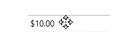

# Step Interval in WPF CurrencyTextBox

The [CurrencyTextBox](https://www.syncfusion.com/wpf-ui-controls/currency-textbox) control allows you to increase or decrease the value by pressing up-arrow and down-arrow keys in keyboard or mouse wheel over the control. The [ScrollInterval](https://help.syncfusion.com/cr/wpf/Syncfusion.Windows.Shared.CurrencyTextBox.html#Syncfusion_Windows_Shared_CurrencyTextBox_ScrollInterval) property is used to specify the increment or decrement interval. The default value of `ScrollInterval` is 1.

 For example, the `ScrollInterval` value is set to 4. So, that the `CurrencyTextBox` control [Value](https://help.syncfusion.com/cr/wpf/Syncfusion.Windows.Shared.CurrencyTextBox.html#Syncfusion_Windows_Shared_CurrencyTextBox_Value) increases or decreases by 4 while pressing Up arrow or Down arrow keys and Mouse wheel scrolling up or down.

## Change Value on Up, Down arrow key

The `CurrencyTextBox` control allows you to increase or decrease the `Value` of `CurrencyTextBox` based on the `ScrollInterval` by pressing the up arrow and down arrow keys on the keyboard.




<syncfusion:CurrencyTextBox x:Name="currencyTextBox" Width="150"
                          Height="25" Value ="34" ScrollInterval="3"/>




CurrencyTextBox currencyTextBox = new CurrencyTextBox();
currencyTextBox.Width = 150;
currencyTextBox.Height = 25;
currencyTextBox.Value = 34;
currencyTextBox.ScrollInterval = 3;




## Change Value on Mouse Wheel

The `CurrencyTextBox` allows you to increase or decrease the `Value` based on the `ScrollInterval` by the Mouse scrolling over the control When the [IsScrollingOnCircle](https://help.syncfusion.com/cr/wpf/Syncfusion.Windows.Shared.Editorbase.html#Syncfusion_Windows_Shared_EditorBase_IsScrollingOnCircle) property is `true`. The default value of `IsScrollingOnCircle` property is `true`.




<syncfusion:CurrencyTextBox x:Name="currencyTextBox" Width="150" Height="25" Value ="10" 
                          IsScrollingOnCircle="True" ScrollInterval="2"/>




CurrencyTextBox currencyTextBox = new CurrencyTextBox();
currencyTextBox.Width = 150;
currencyTextBox.Height = 25;
currencyTextBox.Value = 10;
currencyTextBox.IsScrollingOnCircle = true;
currencyTextBox.ScrollInterval = 2;




## Change Value on Click and Drag

The `CurrencyTextBox` allows you to increase or decrease the value based on the `ScrollInterval` by clicking and dragging the mouse when the [EnableExtendedScrolling](https://help.syncfusion.com/cr/wpf/Syncfusion.Windows.Shared.EditorBase.html#Syncfusion_Windows_Shared_EditorBase_EnableExtendedScrolling) property is `true`. `CurrencyTextBox` value increases when the cursor moves to the right or the top of the screen and decreases when you click and drag the mouse to the left or the bottom of the screen. Before that, the control should be in an unfocused state.




<syncfusion:CurrencyTextBox x:Name="currencyTextBox" Width="120" Height="25" Value ="10" 
                          ScrollInterval="5" EnableExtendedScrolling="True"/>




CurrencyTextBox currencyTextBox = new CurrencyTextBox();
currencyTextBox.Width = 120;
currencyTextBox.Height = 25;
currencyTextBox.Value = 10;
currencyTextBox.ScrollInterval = 5;
currencyTextBox.EnableExtendedScrolling = true;




## Allow or restrict selection on focus

`CurrencyTextBox` allows you to automatically select text by setting [TextSelectionOnFocus](https://help.syncfusion.com/cr/wpf/Syncfusion.Windows.Shared.EditorBase.html#Syncfusion_Windows_Shared_EditorBase_TextSelectionOnFocus) property to `true` and when the control got focus.  If you want to restrict the selection on when control got focus, use the `TextSelectionOnFocus` property value as `false`. The default value of the `TextSelectionOnFocus` property is `true`.




<syncfusion:CurrencyTextBox x:Name="currencyTextBox" TextSelectionOnFocus="False"/>




CurrencyTextBox currencyTextBox = new CurrencyTextBox();
currencyTextBox.TextSelectionOnFocus = true;




**TextSelectionOnFocus = "False"**

**TextSelectionOnFocus = "True"**

