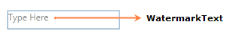

# Watermark Support

Watermark is the dummy content displayed in the CurrencyTextBox when the value is null. The WatermarkText support behavior can be enabled by setting the [WatermarkTextIsVisible](https://help.syncfusion.com/cr/cref_files/wpf/Syncfusion.Shared.Wpf~Syncfusion.Windows.Shared.EditorBase~WatermarkTextIsVisible.html) property to true.




<syncfusion:CurrencyTextBox x:Name="currencyTextBox" Width="150" Height="25" 
            WatermarkText="Type Here" WatermarkTextIsVisible="True" 
            WatermarkOpacity="0.5" UseNullOption="True"/>



CurrencyTextBox currencyTextBox = new CurrencyTextBox();
currencyTextBox.Width = 150;
currencyTextBox.Height = 25;
currencyTextBox.WatermarkText = "Type Here";
currencyTextBox.WatermarkTextIsVisible = true;
currencyTextBox.WatermarkOpacity = 0.5;
currencyTextBox.UseNullOption = true;



WatermarkText automatically collapses when the control is in focus. When the control loses its focus the WatermarkText comes to visible state if Value is null and WatermarkTextIsVisible is true.

## Using the WatermarkTemplate

You can customize the Visual appearance of the [WatermarkText](https://help.syncfusion.com/cr/cref_files/wpf/Syncfusion.Shared.Wpf~Syncfusion.Windows.Shared.EditorBase~WatermarkText.html) by using the [WatermarkTemplate](https://help.syncfusion.com/cr/cref_files/wpf/Syncfusion.Shared.Wpf~Syncfusion.Windows.Shared.EditorBase~WatermarkTemplate.html) property.




<syncfusion:CurrencyTextBox x:Name="currencyTextBox" Width="150" Height="25" 
                            WatermarkText="Type Here" CornerRadius="3" 
                            WatermarkTextIsVisible="True" WatermarkOpacity="0.5" 
                            UseNullOption="True">
<syncfusion:CurrencyTextBox.WatermarkTemplate>
<DataTemplate>
<Border Background="LightGray">
<TextBlock Text="{Binding}" VerticalAlignment="Center" Margin="5,0,0,0"/>
</Border>
</DataTemplate>
</syncfusion:CurrencyTextBox.WatermarkTemplate>
</syncfusion:CurrencyTextBox>




