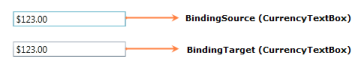
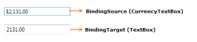

# Data Binding Support

Data binding is the process of establishing a connection between the application UI and business logic. Data binding can be unidirectional (source -> target or target <- source) or bidirectional (source <-> target). You can bind the data to the CurrencyTextBox through the [Value](https://help.syncfusion.com/cr/wpf/Syncfusion.Shared.Wpf~Syncfusion.Windows.Shared.CurrencyTextBox~Value.html) property.

The following example shows a simple binding between the value of the CurrencyTextBox and another CurrencyTextBox value that reflects the typed value:




<StackPanel>
<syncfusion:CurrencyTextBox x:Name="currencyTextBox1" Width="150" Margin="10"/>
<syncfusion:CurrencyTextBox x:Name="currencyTextBox2" Width="150" Margin="10" Value="{Binding ElementName=currencyTextBox1,Path=Value,Mode=TwoWay}"/>
</StackPanel>




The Data Context property provides its value to child elements. So you can set the Data Context on a superior layout container and its value is provided to all child elements. This is very useful if you want to build a form that is bound to multiple properties of the same data object. If you don't explicitly define a source of binding, it takes the data context by default.




<StackPanel DataContext="{StaticResource myCustomer}">
<TextBox Text="{Binding FirstName}"/>
<TextBox Text ="{Binding LastName}"/>
<syncfusion:CurrencyTextBox Value="{Binding Phone}"/>
<syncfusion:CurrencyTextBox Value="{Binding Income}"/>
</StackPanel>




If you want to bind values other than decimal values, then you need to use the Value Converter. The following example shows a simple binding between the value of the CurrencyTextBox and the Textbox text that reflects the typed value:




<StackPanel>
<StackPanel.Resources>
<c:StringToDecimalConverter x:Key="stringToDecimalConverter"/>
</StackPanel.Resources>
<syncfusion:CurrencyTextBox x:Name="currencyTextBox" Width="150" Margin="10"/>
<TextBox x:Name="textBox" Width="150" Margin="10" Text="{Binding ElementName=currencyTextBox,Path=Value,Mode=TwoWay,Converter={StaticResource stringToDecimalConverter}}"/>
</StackPanel>




