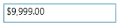
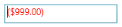

# Maximum and Minimum Value

## MinValue

Minimum allowed value for the CurrencyTextBox. If the new [MinValue](https://help.syncfusion.com/cr/wpf/Syncfusion.Shared.Wpf~Syncfusion.Windows.Shared.CurrencyTextBox~MinValue.html) property value is greater than the [MaxValue](https://help.syncfusion.com/cr/wpf/Syncfusion.Shared.Wpf~Syncfusion.Windows.Shared.CurrencyTextBox~MaxValue.html) property value, then the MaxValue is set equal to the [MinValue](https://help.syncfusion.com/cr/wpf/Syncfusion.Shared.Wpf~Syncfusion.Windows.Shared.CurrencyTextBox~MinValue.html). If the Value is less than the new MinValue, then the Value property is also set equal to the MinValue.

## MaxValue

Maximum allowed value for the CurrencyTextBox. If the [MinValue](https://help.syncfusion.com/cr/wpf/Syncfusion.Shared.Wpf~Syncfusion.Windows.Shared.CurrencyTextBox~MinValue.html) property is greater than the new [MaxValue](https://help.syncfusion.com/cr/wpf/Syncfusion.Shared.Wpf~Syncfusion.Windows.Shared.CurrencyTextBox~MaxValue.html) property, then the [MinValue](https://help.syncfusion.com/cr/wpf/Syncfusion.Shared.Wpf~Syncfusion.Windows.Shared.CurrencyTextBox~MinValue.html) property value is set equal to the [MaxValue](https://help.syncfusion.com/cr/wpf/Syncfusion.Shared.Wpf~Syncfusion.Windows.Shared.CurrencyTextBox~MaxValue.html). If the current Value is greater than the new [MaxValue](https://help.syncfusion.com/cr/wpf/Syncfusion.Shared.Wpf~Syncfusion.Windows.Shared.CurrencyTextBox~MaxValue.html), then the Value property is set equal to the [MaxValue](https://help.syncfusion.com/cr/wpf/Syncfusion.Shared.Wpf~Syncfusion.Windows.Shared.CurrencyTextBox~MaxValue.html).

## MinValidation

You can validate the MinValue in two ways:

* OnKeyPress – MinValue of the CurrencyTextBox is validated on the key press.
* OnLostFocus – MinValue of the CurrencyTextBox is validated on the lost focus only.

## MaxValidation

You can validate the MaxValue in two ways:

* OnKeyPress – MaxValue of the CurrencyTextBox is validated on the key press.
* OnLostFocus – MaxValue of the CurrencyTextBox is validated on the lost focus only.

## MinValueOnExceedMinDigit

If this property is set to true, then when you enter a value less than the MinValue then it will automatically assign the MinValue to the Value property. Otherwise it will not allow the key press.

N> This will be enabled only when MinValidation is set to OnKeyPress.

## MaxValueOnExceedMaxDigit

If this property is set to true, then when you enter a value greater than the MaxValue then it will automatically assign the MaxValue to the Value property. Otherwise it will not allow the key press.

N> This will be enabled only when the MaxValidation is set to OnKeyPress.




<syncfusion:CurrencyTextBox x:Name="currencyTextBox" Height="25" Width="150"  MinValue="-999" MaxValue="999" MinValidation="OnKeyPress" MaxValidation="OnLostFocus"  MinValueOnExceedMinDigit="   MaxValueOnExceedMaxDigit="True"/> 





Syncfusion.Windows.Shared.CurrencyTextBox currencyTextBox = new   Syncfusion.Windows.Shared.CurrencyTextBox();
currencyTextBox.Width = 100;
currencyTextBox.Height = 25;
currencyTextBox.MinValue = -999;
currencyTextBox.MaxValue = 999;
currencyTextBox.MinValidation = Syncfusion.Windows.Shared.MinValidation.OnKeyPress;
currencyTextBox.MaxValidation = Syncfusion.Windows.Shared.MaxValidation.OnLostFocus;
currencyTextBox.MinValueOnExceedMinDigit = true;
currencyTextBox.MaxValueOnExceedMaxDigit = true;




Initially there is no value assigned to the CurrencyTextBox. So it displays the default value as zero.

MaxValidation is set to OnLostFocus, so the MaxValidation will be performed only in the lost focus.

MinValidation is set to OnKeyPress, so you cannot enter a value less than the MinValue. If you try to enter a value less than the MinValue, then the MinValue will be set to the Value property if the MinValueOnExceedMinDigit is set to true, otherwise it will not allow the key press.

