# Column Types in WPF DataGrid (SfDataGrid)

SfDataGrid provides support for various built-in column types. Each column has its own properties and renderer to handle different types of data. 

You can also add or override existing columns and renderers as you need.

<table>
<tr>
<th>
Column Type
</th>
<th>
Renderer 
</th>
<th>
Description
</th>
</tr>
<tr>
<td>
{{'[GridTextColumn](https://help.syncfusion.com/cr/wpf/Syncfusion.UI.Xaml.Grid.GridTextColumn.html)'| markdownify }}
</td>
<td>
{{'[GridCellTextBoxRenderer](https://help.syncfusion.com/cr/wpf/Syncfusion.UI.Xaml.Grid.Cells.GridCellTextBoxRenderer.html)'| markdownify }}
</td>
<td>
Use to display the string data. 
</td>
</tr>
<tr>
<td>
{{'[GridNumericColumn](https://help.syncfusion.com/cr/wpf/Syncfusion.UI.Xaml.Grid.GridNumericColumn.html)'| markdownify }}
</td>
<td>
{{'[GridCellNumericRenderer](https://help.syncfusion.com/cr/wpf/Syncfusion.UI.Xaml.Grid.Cells.GridCellNumericRenderer.html)'| markdownify }}
</td>
<td>
Use to display the numeric data.
</td>
</tr>
<tr>
<td>
{{'[GridCurrencyColumn](https://help.syncfusion.com/cr/wpf/Syncfusion.UI.Xaml.Grid.GridCurrencyColumn.html)'| markdownify }}
</td>
<td>
{{'[GridCellCurrencyRenderer](https://help.syncfusion.com/cr/wpf/Syncfusion.UI.Xaml.Grid.Cells.GridCellCurrencyRenderer.html)'| markdownify }}
</td>
<td>
Use to display the currency value.
</td>
</tr>
<tr>
<td>
{{'[GridPercentColumn](https://help.syncfusion.com/cr/wpf/Syncfusion.UI.Xaml.Grid.GridPercentColumn.html)'| markdownify }}
</td>
<td>
{{'[GridCellPercentageRenderer](https://help.syncfusion.com/cr/wpf/Syncfusion.UI.Xaml.Grid.Cells.GridCellPercentageRenderer.html)'| markdownify }}
</td>
<td>
Use to display the percent value.
</td>
</tr>
<tr>
<td>
{{'[GridMaskColumn](https://help.syncfusion.com/cr/wpf/Syncfusion.UI.Xaml.Grid.GridMaskColumn.html)'| markdownify }}
</td>
<td>
{{'[GridCellMaskRenderer](https://help.syncfusion.com/cr/wpf/Syncfusion.UI.Xaml.Grid.Cells.GridCellMaskRenderer.html)'| markdownify }}
</td>
<td>
Use to display the data to be masked.
</td>
</tr>
<tr>
<td>
{{'[GridTimeSpanColumn](https://help.syncfusion.com/cr/wpf/Syncfusion.UI.Xaml.Grid.GridTimeSpanColumn.html)'| markdownify }}
</td>
<td>
{{'[GridCellTimeSpanRenderer](https://help.syncfusion.com/cr/wpf/Syncfusion.UI.Xaml.Grid.Cells.GridCellTimeSpanRenderer.html)'| markdownify }}
</td>
<td>
Use to display the time span value.
</td>
</tr>
<tr>
<td>
{{'[GridDateTimeColumn](https://help.syncfusion.com/cr/wpf/Syncfusion.UI.Xaml.Grid.GridDateTimeColumn.html)'| markdownify }}
</td>
<td>
{{'[GridCellDateTimeRenderer](https://help.syncfusion.com/cr/wpf/Syncfusion.UI.Xaml.Grid.Cells.GridCellDateTimeRenderer.html)'| markdownify }}
</td>
<td>
Use to display the date time value.
</td>
</tr>
<tr>
<td>
{{'[GridComboBoxColumn](https://help.syncfusion.com/cr/wpf/Syncfusion.UI.Xaml.Grid.GridComboBoxColumn.html)'| markdownify }}
</td>
<td>
{{'[GridCellComboBoxRenderer](https://help.syncfusion.com/cr/wpf/Syncfusion.UI.Xaml.Grid.Cells.GridCellComboBoxRenderer.html)'| markdownify }}
</td>
<td>
Use to display the IEnumerable data using ComboBox.
</td>
</tr>
<tr>
<td>
{{'[GridCheckBoxColumn](https://help.syncfusion.com/cr/wpf/Syncfusion.UI.Xaml.Grid.GridCheckBoxColumn.html)'| markdownify }}
</td>
<td>
{{'[GridCellCheckBoxRenderer](https://help.syncfusion.com/cr/wpf/Syncfusion.UI.Xaml.Grid.Cells.GridCellCheckBoxRenderer.html)'| markdownify }}
</td>
<td>
Use to display the boolean type data.
</td>
</tr>
<tr>
<td>
{{'[GridImageColumn](https://help.syncfusion.com/cr/wpf/Syncfusion.UI.Xaml.Grid.GridImageColumn.html)'| markdownify }}
</td>
<td>
{{'[GridCellImageRenderer](https://help.syncfusion.com/cr/wpf/Syncfusion.UI.Xaml.Grid.Cells.GridCellImageRenderer.html)'| markdownify }}
</td>
<td>
Use to display the image in each row.
</td>
</tr>
<tr>
<td>
{{'[GridHyperlinkColumn](https://help.syncfusion.com/cr/wpf/Syncfusion.UI.Xaml.Grid.GridHyperlinkColumn.html)'| markdownify }}
</td>
<td>
{{'[GridCellHyperLinkRenderer](https://help.syncfusion.com/cr/wpf/Syncfusion.UI.Xaml.Grid.Cells.GridCellHyperlinkRenderer.html)'| markdownify }}
</td>
<td>
Use to display the URI data.
</td>
</tr>
<tr>
<td>
{{'[GridTemplateColumn](https://help.syncfusion.com/cr/wpf/Syncfusion.UI.Xaml.Grid.GridTemplateColumn.html)'| markdownify }}
</td>
<td>
{{'[GridCellTemplateRenderer](https://help.syncfusion.com/cr/wpf/Syncfusion.UI.Xaml.Grid.Cells.GridCellTemplateRenderer.html)'| markdownify }}
</td>
<td>
Use to display the custom template-specified content.
</td>
</tr>
<tr>
<td>
{{'[GridUnboundColumn](https://help.syncfusion.com/cr/wpf/Syncfusion.UI.Xaml.Grid.GridUnBoundColumn.html)'| markdownify }}
</td>
<td>
{{'[GridUnBoundCellTextBoxRenderer](https://help.syncfusion.com/cr/wpf/Syncfusion.UI.Xaml.Grid.Cells.GridUnBoundCellTextBoxRenderer.html)'| markdownify }}
{{'[GridUnBoundCellTemplateRenderer](https://help.syncfusion.com/cr/wpf/Syncfusion.UI.Xaml.Grid.Cells.GridUnBoundCellTemplateRenderer.html)'| markdownify }}
</td>
<td>
Use to display custom information of each record.
</td>
</tr>
<tr>
<td>
{{'[GridMultiColumnDropDownList](https://help.syncfusion.com/cr/wpf/Syncfusion.UI.Xaml.Grid.GridMultiColumnDropDownList.html)'| markdownify }}
</td>
<td>
{{'[GridCellMultiColumnDropDownRenderer](https://help.syncfusion.com/cr/wpf/Syncfusion.UI.Xaml.Grid.Cells.GridCellMultiColumnDropDownRenderer.html)'| markdownify }}
</td>
<td>
Use to display the IEnumerable data using {{'[SfMultiColumnDropdownControl](https://help.syncfusion.com/cr/wpf/Syncfusion.UI.Xaml.Grid.SfMultiColumnDropDownControl.html)'| markdownify }}.
</td>
</tr>
<tr>
<td>
{{'[GridCheckBoxSelectorColumn](https://help.syncfusion.com/cr/wpf/Syncfusion.UI.Xaml.Grid.GridCheckBoxSelectorColumn.html)'| markdownify }}
</td>
<td>
{{'[GridCellCheckBoxSelectorRenderer](https://help.syncfusion.com/cr/wpf/Syncfusion.UI.Xaml.Grid.Cells.GridCellCheckBoxSelectorRenderer.html)'| markdownify }}
</td>
<td>
Selects or deselects rows based on the check box value, which is not bound with data object.
</td>
</tr>
</table>

## GridColumn

[GridColumn](https://help.syncfusion.com/cr/wpf/Syncfusion.UI.Xaml.Grid.GridColumn.html) is an abstract class provides base functionalities for all the column types in SfDataGrid. 

### Column mapping

Column can be bound to a property in data object using [GridColumn.MappingName](https://help.syncfusion.com/cr/wpf/Syncfusion.UI.Xaml.Grid.GridColumnBase.html#Syncfusion_UI_Xaml_Grid_GridColumnBase_MappingName) property. In addition, it supports to format or bind different property for display and edit mode separately via [GridColumn.DisplayBinding](https://help.syncfusion.com/cr/wpf/Syncfusion.UI.Xaml.Grid.GridColumnBase.html#Syncfusion_UI_Xaml_Grid_GridColumnBase_DisplayBinding) and [GridColumn.ValueBinding](https://help.syncfusion.com/cr/wpf/Syncfusion.UI.Xaml.Grid.GridColumnBase.html#Syncfusion_UI_Xaml_Grid_GridColumnBase_ValueBinding).
 
When you set `MappingName`, `DisplayBinding` and `ValueBinding` are created based on `MappingName`, if these properties are not defined explicitly. 

You can use `DisplayBinding` property to format the column in display, by setting `StringFormat` or `Converter` properties of `Binding`.



<syncfusion:SfDataGrid x:Name="dataGrid"                                                                       
                       ColumnSizer="Star"
                       AutoGenerateColumns="False" 
                       ItemsSource="{Binding Orders}">
    <syncfusion:SfDataGrid.Columns>
        <syncfusion:GridTextColumn  DisplayBinding="{Binding Path=UnitPrice,
                                    StringFormat='{}{0:C}'}"
                                    HeaderText="Unit Price"
                                    MappingName="UnitPrice"
                                    ValueBinding="{Binding Path=Quantity}" />
    </syncfusion:SfDataGrid.Columns>
</syncfusion:SfDataGrid>



In the below screenshot, `Unit Price` column display value is formatted to currency by setting `DisplayBinding` property.

By default, Columns handling the data operations (sorting and grouping) based on `MappingName` property. You can perform data operations based on `ValueBinding` by setting [GridColumn.UseBindingValue](https://help.syncfusion.com/cr/wpf/Syncfusion.UI.Xaml.Grid.GridColumn.html#Syncfusion_UI_Xaml_Grid_GridColumn_UseBindingValue) to `true`, when the standard reflection not works or binding column with complex or indexer properties.

## Column CellTemplate

You can load any WPF control in the display mode for all columns by setting [GridColumn.CellTemplate](https://help.syncfusion.com/cr/wpf/Syncfusion.UI.Xaml.Grid.GridColumnBase.html#Syncfusion_UI_Xaml_Grid_GridColumnBase_CellTemplate) property. In edit mode, corresponding editor will be loaded based on column type.

Using `CellTemplate`, you can format data or conditionally change the properties using [DataTrigger](https://learn.microsoft.com/en-us/dotnet/api/system.windows.datatrigger?view=windowsdesktop-7.0&viewFallbackFrom=net-5.0).

In the below code snippet, `GridNumericColumn` is loaded with `ProgressBar and TextBlock`. When you start editing `DoubleTextBox` will be loaded as Editor.



<syncfusion:SfDataGrid x:Name="dataGrid"                                                                       
                       ColumnSizer="Star"
                       AutoGenerateColumns="False" 
                       ItemsSource="{Binding Orders}">
    <syncfusion:SfDataGrid.Columns>         
        <syncfusion:GridNumericColumn   HeaderText="Unit Price"
                                        MappingName="UnitPrice">
            <syncfusion:GridNumericColumn.CellTemplate>
                <DataTemplate>
                    <Grid>
                        <ProgressBar x:Name="progressBar" 
                                     Background="Transparent"  
                                     Visibility="Visible" 
                                     Minimum="0" 
                                     Maximum="100"   
                                     BorderThickness="0" 
                                     Value="{Binding Path=UnitPrice}" />
                        <TextBlock  Text="{Binding Path=UnitPrice}"                
                                    HorizontalAlignment="Right"
                                    VerticalAlignment="Center" 
                                    TextAlignment="Center"/>
                    </Grid>
                </DataTemplate>
            </syncfusion:GridNumericColumn.CellTemplate>
        </syncfusion:GridNumericColumn>
    </syncfusion:SfDataGrid.Columns>
</syncfusion:SfDataGrid>



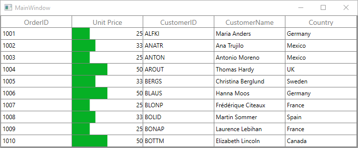

`CellTemplate` is not support by `GridHyperlinkColumn`, `GridCheckboxColumn` and `GridImageColumn` columns

N> When using a cell template, a column mapping name is optional during the initial load. For data operations, the mapping name is mandatory; otherwise, an InvalidOperationException is thrown.

### Reusing same DataTemplate for multiple columns

By default, underlying record is `DataContext` for CellTemplate. So you have to define, template for each column to display values based on `MappingName`. 

You can use the same [DataTemplate](https://learn.microsoft.com/en-us/dotnet/api/system.windows.datatemplate?view=windowsdesktop-7.0&viewFallbackFrom=net-5.0) for all columns to display value based on MappingName by setting [GridColumn.SetCellBoundValue](https://help.syncfusion.com/cr/wpf/Syncfusion.UI.Xaml.Grid.GridColumnBase.html#Syncfusion_UI_Xaml_Grid_GridColumnBase_SetCellBoundValue) property to `true`. Setting `SetCellBoundValue` to `true`, changes the DataContext for CellTemplate to [DataContextHelper](https://help.syncfusion.com/cr/wpf/Syncfusion.UI.Xaml.Grid.Cells.DataContextHelper.html) which has the following members,

* `Value` - Return the value base on `MappingName`.
* `Record` - Returns the underlying data object.



<Window.Resources>
    <DataTemplate   x:Key="cellTemplate">
        <TextBlock  Foreground="Red"
                    Margin="3,0,0,0"
                    Text="{Binding Path=Value}"/>
    </DataTemplate>        
</Window.Resources>

<syncfusion:SfDataGrid x:Name="dataGrid"                                                                       
                       ColumnSizer="Star"
                       AutoGenerateColumns="False" 
                       ItemsSource="{Binding Orders}">
    <syncfusion:SfDataGrid.Columns>
        <syncfusion:GridTextColumn SetCellBoundValue="True" 
                                   MappingName="OrderID" 
                                   CellTemplate="{StaticResource cellTemplate}" />
        <syncfusion:GridTextColumn MappingName="CustomerName" 
                                   SetCellBoundValue="True"                           
                                   CellTemplate="{StaticResource cellTemplate}"/>
    </syncfusion:SfDataGrid.Columns>
</syncfusion:SfDataGrid>



### Setting CellTemplate based on custom logic using template selector

`GridColumn` provides support to choose different [DataTemplate](https://learn.microsoft.com/en-us/dotnet/api/system.windows.datatemplate?view=windowsdesktop-7.0&viewFallbackFrom=net-5.0) based on underlying data object using [GridColumn.CellTemplateSelector](https://help.syncfusion.com/cr/wpf/Syncfusion.UI.Xaml.Grid.GridColumnBase.html#Syncfusion_UI_Xaml_Grid_GridColumnBase_CellTemplateSelector) property.

For example, two different templates loaded alternatively in `OrderID` column. 



<Window.Resources>
    <local:CustomCellTemplateSelector x:Key="cellTemplateSelector"/>

    <DataTemplate   x:Key="DefaultTemplate">
        <TextBlock  Background="Wheat"
                    Foreground="Red"
                    Text="{Binding Path=OrderID}"
                    TextAlignment="Center" />
    </DataTemplate>

    <DataTemplate   x:Key="AlternateTemplate">
        <TextBlock  Background="Beige"
                    Foreground="Green"
                    Text="{Binding Path=OrderID}"
                    TextAlignment="Center" />
    </DataTemplate>    

</Window.Resources>



Below code returns the `DefaultTemplate` and `AlternateTemplate` based on OrderID’s value
.


public class CustomCellTemplateSelector : DataTemplateSelector
{

    public override System.Windows.DataTemplate SelectTemplate(object item, System.Windows.DependencyObject container)
    {

        if (item == null)
            return null ;
        var data = item as OrderInfo;

        if (data.OrderID % 2 == 0)
            return Application.Current.MainWindow.FindResource("AlternateTemplate") as DataTemplate;

        else
            return Application.Current.MainWindow.FindResource("DefaultTemplate") as DataTemplate;
    }
}



In the below code, the custom template selector set to `GridColumn.CellTemplateSelector` and set `SetCellBoundValue` to `true`.



<syncfusion:SfDataGrid x:Name="dataGrid"                                                                       
                       ColumnSizer="Star"
                       AutoGenerateColumns="False" 
                       ItemsSource="{Binding Orders}">
    <syncfusion:SfDataGrid.Columns>
        <syncfusion:GridTextColumn MappingName="OrderID" 
                                   CellTemplateSelector="{StaticResource cellTemplateSelector}"/>
    </syncfusion:SfDataGrid.Columns>
</syncfusion:SfDataGrid>



N> Non-Editable columns does not support `CellTemplate`.

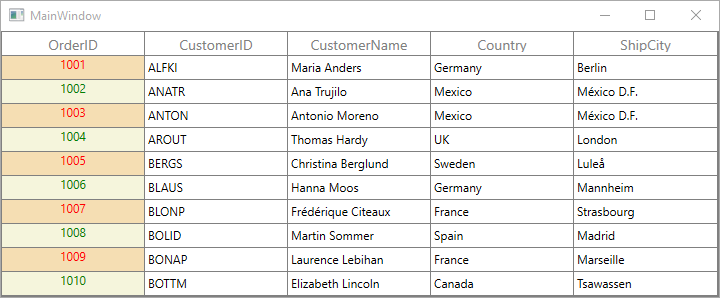

### Binding ViewModel properties with CellTemplate

You can bind properties in ViewModel with the controls in CellTemplate.
 
Below command defined in ViewModel is bound to `Button` inside CellTemplate. Below code, denote the base command.



public class BaseCommand:ICommand
{
    #region Fields
    readonly Action<object> _execute;
    readonly Predicate<object> _canExecute;
    #endregion 

    #region Constructors
    /// 

    /// Creates a new command that always execute.
    /// 

    /// <param name="execute">The execution logic.</param>

    public BaseCommand(Action<object> execute)

        : this(execute, null)
    {
    }

    /// 

    /// Creates a new command.
    /// 

    /// <param name="execute">The execution logic.</param>
    /// <param name="canExecute">The execution status logic.</param>

    public BaseCommand(Action<object> execute, Predicate<object> canExecute)
    {

        if (execute == null)
            throw new ArgumentNullException("execute");
        _execute = execute;
        _canExecute = canExecute;
    }
    #endregion 

    #region ICommand Members

    public bool CanExecute(object parameter)
    {
        return _canExecute == null ? true : _canExecute(parameter);
    }

    public event EventHandler CanExecuteChanged
    {
        add { CommandManager.RequerySuggested += value; }
        remove { CommandManager.RequerySuggested -= value; }
    }

    public void Execute(object parameter)
    {
        _execute(parameter);
    }
    #endregion 
}



Below code, defines the command for `Button` in `ViewModel`.



public class ViewModel
{    
    private BaseCommand deleteRecord;

    public BaseCommand DeleteRecord
    {
        get
        {

            if (deleteRecord == null)
                deleteRecord = new BaseCommand(OnDeleteRecordClicked, OnCanDelete);
            return deleteRecord;
        }
    }

    private static bool OnCanDelete(object obj)
    {
        return true;
    }

    private void OnDeleteRecordClicked(object obj)
    {
        //TODO ACTION.
    }
}



In the below code, Button inside CellTemplate bound to the command in ViewModel. 



<syncfusion:SfDataGrid x:Name="dataGrid"
                    AutoGenerateColumns="False" 
                    ItemsSource="{Binding Orders}">
    <syncfusion:SfDataGrid.Columns>
        <syncfusion:GridTextColumn MappingName="Delete">
            <syncfusion:GridTextColumn.CellTemplate>
                <DataTemplate>
                    <Button Command="{Binding DataContext.DeleteRecord, ElementName=dataGrid}"
                            CommandParameter="{Binding}"
                            Content="Delete" />
                    <!--or-->
                    <Button Command="{Binding DeleteRecord,
                            Source={StaticResource viewModel}}"
                            CommandParameter="{Binding}"
                            Content="Delete" />
                </DataTemplate>
            </syncfusion:GridTextColumn.CellTemplate>
        </syncfusion:GridTextColumn>
    </syncfusion:SfDataGrid.Columns>
</syncfusion:SfDataGrid>



## Column Formatting

`GridColumn` supports to format the data using [StringFormat](https://learn.microsoft.com/en-us/dotnet/api/system.windows.data.bindingbase.stringformat?view=windowsdesktop-7.0&viewFallbackFrom=net-5.0) and [Converter](https://learn.microsoft.com/en-us/dotnet/api/system.windows.data.binding.converter?view=windowsdesktop-7.0&viewFallbackFrom=net-5.0) properties, by defining `GridColumn.DisplayBinding` and `GridColumn.ValueBinding`. `GridColumn.DisplayBinding` formats the data in display mode. `GridColumn.ValueBinding` formats the data in edit mode.

### Column formatting using Binding

You can apply format for the column using [StringFormat](https://learn.microsoft.com/en-us/dotnet/api/system.windows.data.bindingbase.stringformat?view=windowsdesktop-7.0&viewFallbackFrom=net-5.0) property by defining `DisplayBinding`.  `StringFormat` applies to `GridTexColumn` alone. Refer the [Converter](#_Format_column_using) section to format the other column types.



<syncfusion:SfDataGrid x:Name="dataGrid"                                                                       
                       ColumnSizer="Star"
                       AutoGenerateColumns="False" 
                       ItemsSource="{Binding Orders}">
    <syncfusion:SfDataGrid.Columns>
        <syncfusion:GridTextColumn  DisplayBinding="{Binding Path=UnitPrice,
                                    StringFormat='{}{0:C}'}"
                                    HeaderText="Unit Price"
                                    MappingName="UnitPrice"
                                    ValueBinding="{Binding Path=UnitPrice}" />
    </syncfusion:SfDataGrid.Columns>
</syncfusion:SfDataGrid>



When column is auto-generated, you can set the `StringFormat` by handling `AutoGeneratingColumn` event.



void dataGrid_AutoGeneratingColumn(object sender, AutoGeneratingColumnArgs e)
{

    if (e.Column.MappingName == "UnitPrice")
    {

        if (e.Column is GridNumericColumn)
        {
            e.Column = new GridTextColumn() { MappingName = "UnitPrice", HeaderText = "Unit Price" };
        }
        e.Column.DisplayBinding = new Binding() { Path = new PropertyPath(e.Column.MappingName), StringFormat = "{0:C}" };
        e.Column.ValueBinding = new Binding() { Path = new PropertyPath(e.Column.MappingName),StringFormat="{0:C}" };
    }
} 



### Column formatting using converter

You can format the column using `Converter` property by defining `DisplayBinding`. 



<Window.Resources>
    <local:CurrencyFormatConverter x:Key="currencyFormatConverter" />
</Window.Resources>

<syncfusion:SfDataGrid x:Name="dataGrid"                                                                                              
                       AutoGenerateColumns="False" 
                       ItemsSource="{Binding Orders}">
    <syncfusion:SfDataGrid.Columns>               
        <syncfusion:GridNumericColumn   DisplayBinding="{Binding Path=UnitPrice,
                                        Converter={StaticResource currencyFormatConverter}}"
                                        HeaderText="Unit Price"
                                        MappingName="UnitPrice" />      
    </syncfusion:SfDataGrid.Columns>
</syncfusion:SfDataGrid>


public class CurrencyFormatConverter:IValueConverter
{
    object IValueConverter.Convert(object value, Type targetType, object parameter, System.Globalization.CultureInfo culture)
    {
        return string.Format("{0:C}", value);
    }

    object IValueConverter.ConvertBack(object value, Type targetType, object parameter, System.Globalization.CultureInfo culture)
    {
        return value;
    }
}



When column is auto-generated, you can set the `Converter` by handling `AutoGeneratingColumn` event



void dataGrid_AutoGeneratingColumn(object sender, AutoGeneratingColumnArgs e)
{

    if (e.Column.MappingName == "UnitPrice")
    {

        if (e.Column is GridNumericColumn)
        {
            e.Column = new GridTextColumn() { MappingName = "UnitPrice", HeaderText = "Unit Price" };
        }
        e.Column.DisplayBinding = new Binding() { Path = new PropertyPath(e.Column.MappingName), Converter = new CurrencyFormatConverter() };
    }
}



## Column styling

`GridColumn` support to customize the style of particular column using [GridColumn.CellStyle](https://help.syncfusion.com/cr/wpf/Syncfusion.UI.Xaml.Grid.GridColumnBase.html#Syncfusion_UI_Xaml_Grid_GridColumnBase_CellStyle) property. For more information, refer [Styling and Template](https://help.syncfusion.com/wpf/sfdatagrid/styles-and-templates) section.

### Change the column font setting

You can change the font settings such as FontSize, FontFamily, FontWeight etc. by writing style of TargetType [GridCell](https://help.syncfusion.com/cr/wpf/Syncfusion.UI.Xaml.Grid.GridCell.html) or `GridColumn.CellStyle` property.



<syncfusion:SfDataGrid x:Name="dataGrid"                                                                       
                       AutoGenerateColumns="False" 
                       ItemsSource="{Binding Orders}">
    <syncfusion:SfDataGrid.Columns>
        <syncfusion:GridTextColumn MappingName="CustomerName">
            <syncfusion:GridTextColumn.CellStyle>
                
            </syncfusion:GridTextColumn.CellStyle>
        </syncfusion:GridTextColumn>
    </syncfusion:SfDataGrid.Columns>
</syncfusion:SfDataGrid>



When column is auto-generated, you can style the column by handling `AutoGeneratingColumn` event



this.dataGrid.AutoGeneratingColumn += dataGrid_AutoGeneratingColumn;

void dataGrid_AutoGeneratingColumn(object sender, AutoGeneratingColumnArgs e)
{   

    if (e.Column.MappingName == "CustomerName")
        e.Column.CellStyle = this.FindResource("cellStyle") as Style;
}



### Styles based on custom logic

You can apply the styles to columns based on certain condition using [GridColumn.CellStyleSelector](https://help.syncfusion.com/cr/wpf/Syncfusion.UI.Xaml.Grid.GridColumnBase.html#Syncfusion_UI_Xaml_Grid_GridColumnBase_CellStyleSelector) property.

Below code creates two different styles by TargetType `GridCell`.



<Application.Resources>
    
    
</Application.Resources>




In the below code, returns the style based on `OrderID` value. Using `Container` you can format the columns data based on `GridCell`.



public class CustomCellStyleSelector : StyleSelector
{

    public override Style SelectStyle(object item, System.Windows.DependencyObject container)
    {
            var gridCell = container as GridCell;
            var mappingName = gridCell.ColumnBase.GridColumn.MappingName;            
            var record = gridCell.DataContext;
            var cellValue = record.GetType().GetProperty(mappingName).GetValue(record);

            if (mappingName.Equals("OrderID"))
            {

                if (Convert.ToInt16(cellValue) <= 1005)
                    return App.Current.Resources["cellStyle1"] as Style;

                else
                    return App.Current.Resources["cellStyle2"] as Style;
            }
            return base.SelectStyle(item, container);
    }
}



Below code, sets the customized style selector to `GridColumn.CellStyleSelector` property.



<syncfusion:SfDataGrid x:Name="dataGrid"
                       ItemsSource="{Binding Orders}"  
                       AutoGenerateColumns="True" >
    <syncfusion:SfDataGrid.Columns>
        <syncfusion:GridTextColumn MappingName="OrderID" CellStyleSelector="{StaticResource cellStyleSelector}"/>
    </syncfusion:SfDataGrid.Columns>
</syncfusion:SfDataGrid>



When column is auto-generated, you can style the column by handling `AutoGeneratingColumn` event



this.dataGrid.AutoGeneratingColumn += dataGrid_AutoGeneratingColumn;

void dataGrid_AutoGeneratingColumn(object sender, AutoGeneratingColumnArgs e)
{

    if (e.Column.MappingName == "OrderID")
    {
        e.Column.CellStyleSelector = new CustomCellStyleSelector();  
    }
}



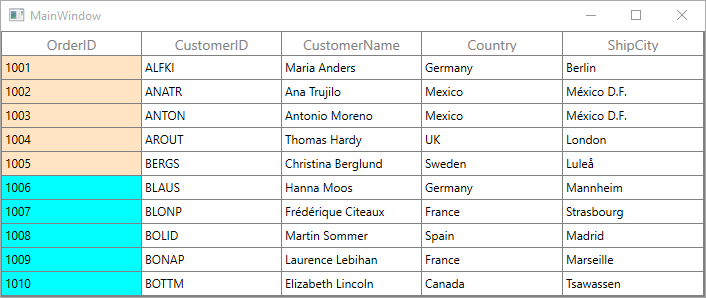

## End-user interaction

### Hide Column

You can hide or unhide the particular column programmatically by setting [GridColumn.IsHidden](https://help.syncfusion.com/cr/wpf/Syncfusion.UI.Xaml.Grid.GridColumnBase.html#Syncfusion_UI_Xaml_Grid_GridColumnBase_IsHidden) property. For allowing end-user to hide or unhide column in UI refer [Resizing Columns](#_Resizing_Columns) section.

### Disable column

You can disable column by setting [GridColumn.AllowFocus](https://help.syncfusion.com/cr/wpf/Syncfusion.UI.Xaml.Grid.GridColumnBase.html#Syncfusion_UI_Xaml_Grid_GridColumnBase_AllowFocus) property. Therefore, that column can’t be selected or edited.

## Column width, alignment and padding

### Column width

The width of `GridColumn` can be changed by setting [Width](https://help.syncfusion.com/cr/wpf/Syncfusion.UI.Xaml.Grid.GridColumnBase.html#Syncfusion_UI_Xaml_Grid_GridColumnBase_Width) property. Column width set based on [GridColumn.MinimumWidth](https://help.syncfusion.com/cr/wpf/Syncfusion.UI.Xaml.Grid.GridColumnBase.html#Syncfusion_UI_Xaml_Grid_GridColumnBase_MinimumWidth) and [GridColumn.MaximumWidth](https://help.syncfusion.com/cr/wpf/Syncfusion.UI.Xaml.Grid.GridColumnBase.html#Syncfusion_UI_Xaml_Grid_GridColumnBase_MaximumWidth) properties.

N> If the `GridColumn.Width` is defined explicitly takes priority than `GridColumn.ColumnSizer`.

### Column padding

GridColumn allows you to the change the padding of cell content by setting [Padding](https://help.syncfusion.com/cr/wpf/Syncfusion.UI.Xaml.Grid.GridColumnBase.html#Syncfusion_UI_Xaml_Grid_GridColumnBase_Padding) property.

### Column alignment

GridColumn allows  you to change the alignment of `GridCell` and `GridHeaderCell` content using [TextAlignment](https://help.syncfusion.com/cr/wpf/Syncfusion.UI.Xaml.Grid.GridColumnBase.html#Syncfusion_UI_Xaml_Grid_GridColumnBase_TextAlignment), [VerticalAlignment](https://help.syncfusion.com/cr/wpf/Syncfusion.UI.Xaml.Grid.GridColumnBase.html#Syncfusion_UI_Xaml_Grid_GridColumnBase_VerticalAlignment) and [HorizontalHeaderContentAlignment](https://help.syncfusion.com/cr/wpf/Syncfusion.UI.Xaml.Grid.GridColumnBase.html#Syncfusion_UI_Xaml_Grid_GridColumnBase_HorizontalHeaderContentAlignment) properties.

## GridTextColumnBase

[GridTextColumnBase](https://help.syncfusion.com/cr/wpf/Syncfusion.UI.Xaml.Grid.GridTextColumnBase.html) is the abstract class derived from `GridColumn`. The following columns are derived from the `GridTextColumnBase`.

1. GridTextColumn
2. GridDateTimeColumn
3. GridTimeSpanColumn
4. GridMaskColumn
5. GridTemplateColumn
6. GridMultiColumnDropDownList

### GridTextColumnBase properties

* **Text decorations** - You can [decorate](https://learn.microsoft.com/en-us/dotnet/api/system.windows.textdecorations?view=windowsdesktop-7.0&viewFallbackFrom=net-5.0) column’s data using [TextDecorations](https://help.syncfusion.com/cr/wpf/Syncfusion.UI.Xaml.Grid.GridTextColumnBase.html#Syncfusion_UI_Xaml_Grid_GridTextColumnBase_TextDecorations) property.

* **Text trimming** - You can [trim](https://learn.microsoft.com/en-us/dotnet/api/system.windows.texttrimming?view=windowsdesktop-7.0&viewFallbackFrom=net-5.0) the column’s data using [TextTrimming](https://help.syncfusion.com/cr/wpf/Syncfusion.UI.Xaml.Grid.GridTextColumnBase.html#Syncfusion_UI_Xaml_Grid_GridTextColumnBase_TextTrimming) property.

* **Text wrapping** - You can [wrap](https://learn.microsoft.com/en-us/dotnet/api/system.windows.textwrapping?view=windowsdesktop-7.0&viewFallbackFrom=net-5.0) the column’s data using [TextWrapping](https://help.syncfusion.com/cr/wpf/Syncfusion.UI.Xaml.Grid.GridTextColumnBase.html#Syncfusion_UI_Xaml_Grid_GridTextColumnBase_TextWrapping) property.



<syncfusion:SfDataGrid x:Name="dataGrid"                                                                       
                       AutoGenerateColumns="False" 
                       ItemsSource="{Binding Orders}">
    <syncfusion:SfDataGrid.Columns>
        <syncfusion:GridTextColumn  HeaderText="Customer Name"
                                    MappingName="CustomerName"
                                    TextDecorations="StrikeThrough"
                                    TextTrimming="WordEllipsis"
                                    TextWrapping="Wrap" />
    </syncfusion:SfDataGrid.Columns>
</syncfusion:SfDataGrid>



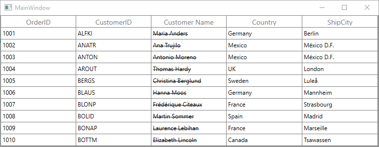

## GridEditorColumn

[GridEditorColumn](https://help.syncfusion.com/cr/wpf/Syncfusion.UI.Xaml.Grid.GridEditorColumn.html) is the abstract class derived from `GridTextColumnBase`. The following columns derived from `GridEditorColumn` class.

1. GridNumericColumn
2. GirdCurrencyColumn
3. GridPercentColumn

### Auto increment

You can allow end-user to increment or decrement the column value’s when `MouseWheel` or pressing <kbd>up</kbd> and <kbd>down</kbd> arrow keys by setting [AllowScrollingOnCircle](https://help.syncfusion.com/cr/wpf/Syncfusion.UI.Xaml.Grid.GridEditorColumn.html#Syncfusion_UI_Xaml_Grid_GridEditorColumn_AllowScrollingOnCircle) property to `true`.

### Null value support

GridEditorColumn provides support to restrict or allow null value in columns based on [AllowNullValue](https://help.syncfusion.com/cr/wpf/Syncfusion.UI.Xaml.Grid.GridEditorColumn.html#Syncfusion_UI_Xaml_Grid_GridEditorColumn_AllowNullValue) property. Instead of displaying null values, you can display hint text using [NullText](https://help.syncfusion.com/cr/wpf/Syncfusion.UI.Xaml.Grid.GridEditorColumn.html#Syncfusion_UI_Xaml_Grid_GridEditorColumn_NullText) property or you can set the default value when `null` value encountered using [NullValue](https://help.syncfusion.com/cr/wpf/Syncfusion.UI.Xaml.Grid.GridEditorColumn.html#Syncfusion_UI_Xaml_Grid_GridEditorColumn_NullValue) property.

The `NullText` and `NullValue` properties won’t work, when the `AllowNullValue` is `false`.

### Setting input range

You can restrict and display the input value with in the range using [MinValue](https://help.syncfusion.com/cr/wpf/Syncfusion.UI.Xaml.Grid.GridEditorColumn.html#Syncfusion_UI_Xaml_Grid_GridEditorColumn_MinValue) and [MaxValue](https://help.syncfusion.com/cr/wpf/Syncfusion.UI.Xaml.Grid.GridEditorColumn.html#Syncfusion_UI_Xaml_Grid_GridEditorColumn_MaxValue) properties. You can set the constraint to validate the maximum value using [MaxValidation](https://help.syncfusion.com/cr/wpf/Syncfusion.UI.Xaml.Grid.GridEditorColumn.html#Syncfusion_UI_Xaml_Grid_GridEditorColumn_MaxValidation) and minimum value using [MinValidation](https://help.syncfusion.com/cr/wpf/Syncfusion.UI.Xaml.Grid.GridEditorColumn.html#Syncfusion_UI_Xaml_Grid_GridEditorColumn_MinValidation) properties. Below are the two constraints that specify when to validate.

* `LostFocus`	- Validates input when the focus is lost.
* `OnKeyPress` - Validates input, when user type the value.

## GridTextColumn

`GridTextColumn` derived from `GridTextColumnBase` which hosts `TextBox` in edit mode.



<syncfusion:SfDataGrid x:Name="dataGrid"                                                                       
                       AutoGenerateColumns="False" 
                       ItemsSource="{Binding Orders}">
    <syncfusion:SfDataGrid.Columns>
        <syncfusion:GridTextColumn HeaderText="Customer Name" 
                                   MappingName="CustomerName" />
    </syncfusion:SfDataGrid.Columns>
</syncfusion:SfDataGrid>



this.dataGrid.Columns.Add(new GridTextColumn()
{
    HeaderText = "Customer Name",
    MappingName = "CustomerName",                               
});



## GridNumericColumn

`GridNumericColumn ` derived from `GridEditorColumn` which displays columns data as numeric. It hosts `DoubleTextBox` in editing mode.



<syncfusion:SfDataGrid x:Name="dataGrid"                                                                       
                       AutoGenerateColumns="False" 
                       ItemsSource="{Binding Orders}">
    <syncfusion:SfDataGrid.Columns>
        <syncfusion:GridNumericColumn HeaderText="Quantity" MappingName="Quantity" />
    </syncfusion:SfDataGrid.Columns>
</syncfusion:SfDataGrid>


this.dataGrid.Columns.Add(new GridNumericColumn() { MappingName = "Quantity", HeaderText = "Quantity" });




### Data formatting

`GridNumericColumn` allows you to format the numeric data with culture-specific information.

* [NumberDecimalDigits](https://help.syncfusion.com/cr/wpf/Syncfusion.UI.Xaml.Grid.GridNumericColumn.html#Syncfusion_UI_Xaml_Grid_GridNumericColumn_NumberDecimalDigits)  **-** You can change the [Number of decimal digits](https://learn.microsoft.com/en-us/dotnet/api/system.globalization.numberformatinfo.numberdecimaldigits?view=net-5.0) to be displayed after the decimal point using `NumberDecimalDigits` property. 

* [NumberDecimalSeparator](https://help.syncfusion.com/cr/wpf/Syncfusion.UI.Xaml.Grid.GridNumericColumn.html#Syncfusion_UI_Xaml_Grid_GridNumericColumn_NumberDecimalSeparator)  **-** By default, the dot (.) operator [separates the decimal part](https://learn.microsoft.com/en-us/dotnet/api/system.globalization.numberformatinfo.numberdecimalseparator?view=net-5.0) of numeric value .You can use any operator as decimal separator using `NumberDecimalSeparator` property.  

* [NumberGroupSeparator](https://help.syncfusion.com/cr/wpf/Syncfusion.UI.Xaml.Grid.GridNumericColumn.html#Syncfusion_UI_Xaml_Grid_GridNumericColumn_NumberGroupSeparator)  **-** By default, the comma (,) [separates group of digits](https://learn.microsoft.com/en-us/dotnet/api/system.globalization.numberformatinfo.numbergroupseparator?view=net-5.0) before the decimal point. You can use any operator as group separator using `NumberGroupSeparator` property.

* [NumberGroupSizes](https://help.syncfusion.com/cr/wpf/Syncfusion.UI.Xaml.Grid.GridNumericColumn.html#Syncfusion_UI_Xaml_Grid_GridNumericColumn_NumberGroupSizes) **-** You can change the [number of digits in each group](https://learn.microsoft.com/en-us/dotnet/api/system.globalization.numberformatinfo.numbergroupsizes?view=net-5.0) before the decimal point on numeric values using `NumberGroupSizes` property.

* `Formatting negative pattern` **-** You can format the [pattern of negative](https://learn.microsoft.com/en-us/dotnet/api/system.globalization.numberformatinfo.numbernegativepattern?view=net-5.0) numeric values using `NumberNegativePattern`. 



<syncfusion:SfDataGrid x:Name="dataGrid"                                                                       
                       AutoGenerateColumns="False" 
                       ItemsSource="{Binding Orders}">
    <syncfusion:SfDataGrid.Columns>
        <syncfusion:GridNumericColumn   HeaderText="Quantity"
                                        MappingName="Quantity"
                                        NumberDecimalDigits="2"
                                        NumberDecimalSeparator="."
                                        NumberGroupSeparator=","
                                        NumberGroupSizes="3"/>
    </syncfusion:SfDataGrid.Columns>
</syncfusion:SfDataGrid>



### ParsingMode support 

GridNumericColumn process int, double and decimal data types. By default, it treats all values as double internally and return the same. When you are binding dynamic property, we need to maintain the type which can be achieved by setting [GridNumericColumn.ParsingMode](https://help.syncfusion.com/cr/wpf/Syncfusion.UI.Xaml.Grid.GridNumericColumn.html#Syncfusion_UI_Xaml_Grid_GridNumericColumn_ParsingMode) property.
For example, you have dynamic object with property OrderID type int. When you edit the OrderID using GridNumericColumn, its type will be changed as double. To avoid this, you must set ParsingMode property based on the type of property you are binding to GridNumericColumn or you need to use ValueBinding converter change type according to your underlying property type.



<Syncfusion:GridNumericColumn ParsingMode="Int"  MappingName="OrderID" HeaderText="OrderID"/>


datagrid.Columns.Add(new GridNumericColumn() { MappingName = "OrderID", ParsingMode = ParseMode.Int });



## GridCurrencyColumn

` GridCurrencyColumn` derived from `GridEditorColumn` and it displays columns data as currency. It hosts `CurrencyTextBox` element in editing mode.



<syncfusion:SfDataGrid x:Name="dataGrid"                                                                       
                       AutoGenerateColumns="False" 
                       ItemsSource="{Binding Orders}">
    <syncfusion:SfDataGrid.Columns>
        <syncfusion:GridCurrencyColumn HeaderText="Unit Price" MappingName="UnitPrice" />
    </syncfusion:SfDataGrid.Columns>
</syncfusion:SfDataGrid>


this.dataGrid.Columns.Add(new GridCurrencyColumn() { MappingName = "UnitPrice", HeaderText = "Unit Price" });



### Data formatting

`GridCurrencyColumn` allows you to format the parsing currency data with culture-specific information.

* [CurrencySymbol](https://help.syncfusion.com/cr/wpf/Syncfusion.UI.Xaml.Grid.GridCurrencyColumn.html#Syncfusion_UI_Xaml_Grid_GridCurrencyColumn_CurrencySymbol) - By default, the currency symbol will be displayed based on culture. You can change the symbol using `CurrencySymbol` property. 

* [CurrencyDecimalDigits](https://help.syncfusion.com/cr/wpf/Syncfusion.UI.Xaml.Grid.GridCurrencyColumn.html#Syncfusion_UI_Xaml_Grid_GridCurrencyColumn_CurrencyDecimalDigits) - You can change the [number of decimal digits](https://learn.microsoft.com/en-us/dotnet/api/system.globalization.numberformatinfo.currencydecimaldigits?view=net-5.0) to be displayed after the decimal point on currency values using `CurrencyDecimalDigits` property. 

* [CurrencyDecimalSeparator](https://help.syncfusion.com/cr/wpf/Syncfusion.UI.Xaml.Grid.GridCurrencyColumn.html#Syncfusion_UI_Xaml_Grid_GridCurrencyColumn_CurrencyDecimalSeparator) - By default, the dot (.) operator [separates the decimal part](https://learn.microsoft.com/en-us/dotnet/api/system.globalization.numberformatinfo.currencydecimalseparator?view=net-5.0) of currency value .You can use any operator as decimal separator through `CurrencyDecimalSeparator` property. 

* [CurrencyGroupSeparator](https://help.syncfusion.com/cr/wpf/Syncfusion.UI.Xaml.Grid.GridCurrencyColumn.html#Syncfusion_UI_Xaml_Grid_GridCurrencyColumn_CurrencyGroupSeparator) - By default, the comma (,) [separates the group](https://learn.microsoft.com/en-us/dotnet/api/system.globalization.numberformatinfo.currencygroupseparator?view=net-5.0) of digits before the decimal point on currency value .You can use any operator as group separator through CurrencyGroupSeparator property. 

* [CurrencyGroupSizes](https://help.syncfusion.com/cr/wpf/Syncfusion.UI.Xaml.Grid.GridCurrencyColumn.html#Syncfusion_UI_Xaml_Grid_GridCurrencyColumn_CurrencyGroupSizes) - You can specify [the number of digits in each group](https://learn.microsoft.com/en-us/dotnet/api/system.globalization.numberformatinfo.currencygroupsizes?view=net-5.0) before the decimal point on currency value using `CurrencyGroupSizes` property. 

* `Pattern` - You can format the pattern for both [positive](https://learn.microsoft.com/en-us/dotnet/api/system.globalization.numberformatinfo.currencypositivepattern?view=net-5.0) and [negative](https://learn.microsoft.com/en-us/dotnet/api/system.globalization.numberformatinfo.currencynegativepattern?view=net-5.0) currency values through [CurrencyPositivePattern](https://help.syncfusion.com/cr/wpf/Syncfusion.UI.Xaml.Grid.GridCurrencyColumn.html#Syncfusion_UI_Xaml_Grid_GridCurrencyColumn_CurrencyPositivePattern) and [CurrencyNegativePattern](https://help.syncfusion.com/cr/wpf/Syncfusion.UI.Xaml.Grid.GridCurrencyColumn.html#Syncfusion_UI_Xaml_Grid_GridCurrencyColumn_CurrencyNegativePattern). 



<syncfusion:SfDataGrid x:Name="dataGrid"                                                                       
                       AutoGenerateColumns="False" 
                       ItemsSource="{Binding Orders}">
    <syncfusion:SfDataGrid.Columns>
        <syncfusion:GridCurrencyColumn  CurrencyDecimalDigits="2"
                                        CurrencyDecimalSeparator="."
                                        CurrencyGroupSeparator=","
                                        CurrencyGroupSizes="3"
                                        CurrencyPositivePattern="1"
                                        CurrencySymbol="$"
                                        HeaderText="Unit Price"
                                        MappingName="UnitPrice" />
    </syncfusion:SfDataGrid.Columns>
</syncfusion:SfDataGrid>



## GridPercentColumn

` GridPercentColumn` derived from `GridEditorColumn` and it displays columns data as percent. It hosts `PercentTextBox` element in editing mode. 

You can display data as percent value or double value using [PercentEditMode](https://help.syncfusion.com/cr/wpf/Syncfusion.UI.Xaml.Grid.GridPercentColumn.html#Syncfusion_UI_Xaml_Grid_GridPercentColumn_PercentEditMode) property. `PercentEditMode.PercentMode` returns the value as percentage. `PercentEditMode.DoubleMode` returns the value as numeric.



<syncfusion:SfDataGrid x:Name="dataGrid"                                                                       
                       AutoGenerateColumns="False" 
                       ItemsSource="{Binding Orders}">
    <syncfusion:SfDataGrid.Columns>
        <syncfusion:GridPercentColumn HeaderText="Discount" MappingName="Discount" />
    </syncfusion:SfDataGrid.Columns>
</syncfusion:SfDataGrid>


this.dataGrid.Columns.Add(new GridPercentColumn() { HeaderText = "Discount", MappingName = "Discount" });



### Data formatting

`GridPercentColumn` allows you to format the parsing percent data with culture-specific information.

* [PercentSymbol](https://help.syncfusion.com/cr/wpf/Syncfusion.UI.Xaml.Grid.GridPercentColumn.html#Syncfusion_UI_Xaml_Grid_GridPercentColumn_PercentSymbol) **-** By default, the percent operator (%) will be loaded with the value. You can change the symbol using `PercentSymbol` property. 

* [PercentDecimalDigits](https://help.syncfusion.com/cr/wpf/Syncfusion.UI.Xaml.Grid.GridPercentColumn.html#Syncfusion_UI_Xaml_Grid_GridPercentColumn_PercentDecimalDigits) **-** You can change the [number of decimal digits](https://learn.microsoft.com/en-us/dotnet/api/system.globalization.numberformatinfo.percentdecimaldigits?view=net-5.0) to be displayed after the decimal point on percent value can be specified using `PercentDecimalDigits` property. 

* [PercentDecimalSeparator](https://help.syncfusion.com/cr/wpf/Syncfusion.UI.Xaml.Grid.GridPercentColumn.html#Syncfusion_UI_Xaml_Grid_GridPercentColumn_PercentDecimalSeparator) **-** By default, the dot (.) operator [separates the decimal part](https://learn.microsoft.com/en-us/dotnet/api/system.globalization.numberformatinfo.percentdecimalseparator?view=net-5.0) of percent value .You can use any operator as decimal separator using `PercentDecimalSeparator` property.

* [PercentGroupSeparator](https://help.syncfusion.com/cr/wpf/Syncfusion.UI.Xaml.Grid.GridPercentColumn.html#Syncfusion_UI_Xaml_Grid_GridPercentColumn_PercentGroupSeparator) **-** By default, the comma (,) operator [separates the group](https://learn.microsoft.com/en-us/dotnet/api/system.globalization.numberformatinfo.percentgroupseparator?view=net-5.0) of digits left to the decimal point on currency value .You can use any operator as group separator using `PercentGroupSeparator` property. 

* [PercentGroupSizes](https://help.syncfusion.com/cr/wpf/Syncfusion.UI.Xaml.Grid.GridPercentColumn.html#Syncfusion_UI_Xaml_Grid_GridPercentColumn_PercentGroupSizes) **-** You can specify [the number of digits in each group](https://learn.microsoft.com/en-us/dotnet/api/system.globalization.numberformatinfo.percentgroupsizes?view=net-5.0) before the decimal point through `PercentGroupSizes` property. 

* `Pattern` **-** You can specify the pattern for both [positive](https://learn.microsoft.com/en-us/dotnet/api/system.globalization.numberformatinfo.percentpositivepattern?view=net-5.0) and [negative](https://learn.microsoft.com/en-us/dotnet/api/system.globalization.numberformatinfo.percentnegativepattern?view=net-5.0) percent values through [PercentPositivePattern](https://help.syncfusion.com/cr/wpf/Syncfusion.UI.Xaml.Grid.GridPercentColumn.html#Syncfusion_UI_Xaml_Grid_GridPercentColumn_PercentPositivePattern) and [PercentNegativePattern](https://help.syncfusion.com/cr/wpf/Syncfusion.UI.Xaml.Grid.GridPercentColumn.html#Syncfusion_UI_Xaml_Grid_GridPercentColumn_PercentNegativePattern).



<syncfusion:SfDataGrid x:Name="dataGrid"                                                                       
                       AutoGenerateColumns="False" 
                       ItemsSource="{Binding Orders}">
    <syncfusion:SfDataGrid.Columns>
        <syncfusion:GridPercentColumn   HeaderText="Discount"
                                        MappingName="Discount"
                                        PercentDecimalDigits="2"
                                        PercentDecimalSeparator="."
                                        PercentEditMode="PercentMode"
                                        PercentGroupSeparator=","
                                        PercentGroupSizes="2"
                                        PercentPositivePattern="0" />
    </syncfusion:SfDataGrid.Columns>
</syncfusion:SfDataGrid>



## GridDateTimeColumn

`GridDateTimeColumn` derived from `GridTextColumnBase` and it displays columns data as date time. It hosts `DateTimeEdit` element in editing mode.



<syncfusion:SfDataGrid x:Name="dataGrid"                                                                       
                       AutoGenerateColumns="False" 
                       ItemsSource="{Binding Orders}">
    <syncfusion:SfDataGrid.Columns>
        <syncfusion:GridDateTimeColumn HeaderText="Order Date" MappingName="OrderDate" />
    </syncfusion:SfDataGrid.Columns>
</syncfusion:SfDataGrid>


this.dataGrid.Columns.Add(new GridDateTimeColumn() { HeaderText = "Order Date", MappingName = "OrderDate" });



### Change the pattern of date time value

You can format the date time value using [GridDateTimeColumn.Pattern](https://help.syncfusion.com/cr/wpf/Syncfusion.UI.Xaml.Grid.GridDateTimeColumn.html#Syncfusion_UI_Xaml_Grid_GridDateTimeColumn_Pattern) property, which contains the set of predefined date time patterns,

<table>
<tr>
<th>
Pattern
</th>
<th>
Expected
</th>
</tr>
<tr>
<td>
<code>LongDate</code>
</td>
<td>
Monday, June 15, 2016
</td>
</tr>
<tr>
<td>
<code>LongTime</code>
</td>
<td>
1:45:30 PM
</td>
</tr>
<tr>
<td>
<code>ShortDate</code>
</td>
<td>
6/15/2016
</td>
</tr>
<tr>
<td>
<code>ShortTime</code>
</td>
<td>
1:45 PM
</td>
</tr>
<tr>
<td>
<code>FullDateTime</code>
</td>
<td>
Monday, June 15, 2016 1:45 PM
</td>
</tr>
<tr>
<td>
<code>MonthDay</code>
</td>
<td>
June 15 
</td>
</tr>
<tr>
<td>
<code>RFC1123</code>
</td>
<td>
Mon, 15 Jun 2016 20:45:30 GMT
</td>
</tr>
<tr>
<td>
<code>SortableDateTime</code>
</td>
<td>
2016-06-15T13:45:30
</td>
</tr>
<tr>
<td>
<code>UniversalSortableDateTime</code>
</td>
<td>
2016-06-15 13:45:30Z
</td>
</tr>
<tr>
<td>
<code>YearMonth</code>
</td>
<td>
June, 2016
</td>
</tr>
</table>

When the predefined `Pattern` does not meet your requirement, you can set the custom pattern using [CustomPattern](https://help.syncfusion.com/cr/wpf/Syncfusion.UI.Xaml.Grid.GridDateTimeColumn.html#Syncfusion_UI_Xaml_Grid_GridDateTimeColumn_CustomPattern) property.



<syncfusion:SfDataGrid x:Name="dataGrid"                                                                       
                       AutoGenerateColumns="False" 
                       ItemsSource="{Binding Orders}">
    <syncfusion:SfDataGrid.Columns>
        <syncfusion:GridDateTimeColumn  CustomPattern="dd-m-yyyy hh:mm:ss"
                                        HeaderText="Order Date"
                                        MappingName="OrderDate"
                                        Pattern="CustomPattern" />
    </syncfusion:SfDataGrid.Columns>
</syncfusion:SfDataGrid>



You can also change the format of standard date time pattern such as short pattern, long pattern, etc.  by using [GridDateTimeColumn.DateTimeFormat](https://help.syncfusion.com/cr/wpf/Syncfusion.UI.Xaml.Grid.GridDateTimeColumn.html#Syncfusion_UI_Xaml_Grid_GridDateTimeColumn_DateTimeFormat) property.



<syncfusion:SfDataGrid x:Name="dataGrid"                                                                       
                       AutoGenerateColumns="False" 
                       ItemsSource="{Binding Orders}">
    <syncfusion:SfDataGrid.Columns>
        <syncfusion:GridDateTimeColumn  HeaderText="Order Date"
                                        MappingName="OrderDate"
                                        Pattern="LongDate">
            <syncfusion:GridDateTimeColumn.DateTimeFormat>
                <global:DateTimeFormatInfo LongDatePattern="dd-MM-yyyy hh:mm:ss" />
            </syncfusion:GridDateTimeColumn.DateTimeFormat>
        </syncfusion:GridDateTimeColumn>
    </syncfusion:SfDataGrid.Columns>
</syncfusion:SfDataGrid>



### Auto increment

You can allow end-user to increment or decrement the value when `MouseWheel` or pressing <kbd>up</kbd> and <kbd>down</kbd> arrow keys by setting [AllowScrollingOnCircle](https://help.syncfusion.com/cr/wpf/Syncfusion.UI.Xaml.Grid.GridDateTimeColumn.html#Syncfusion_UI_Xaml_Grid_GridDateTimeColumn_AllowScrollingOnCircle) property to `true`.

### Null value support

`GridDateTimeColumn` provides support to restrict or allow null value in columns based on [AllowNullValue](https://help.syncfusion.com/cr/wpf/Syncfusion.UI.Xaml.Grid.GridDateTimeColumn.html#Syncfusion_UI_Xaml_Grid_GridDateTimeColumn_AllowNullValue) property. Instead of displaying null values, you can display hint text using [NullText](https://help.syncfusion.com/cr/wpf/Syncfusion.UI.Xaml.Grid.GridDateTimeColumn.html#Syncfusion_UI_Xaml_Grid_GridDateTimeColumn_NullText) property or you can set the default value using [NullValue](https://help.syncfusion.com/cr/wpf/Syncfusion.UI.Xaml.Grid.GridDateTimeColumn.html#Syncfusion_UI_Xaml_Grid_GridDateTimeColumn_NullValue) property.

The `NullText` and `NullValue` properties won’t work, when the `AllowNullValue` is `false`.



<syncfusion:SfDataGrid x:Name="dataGrid"                                                                       
                       AutoGenerateColumns="False" 
                       ItemsSource="{Binding Orders}">
    <syncfusion:SfDataGrid.Columns>
        <syncfusion:GridDateTimeColumn  AllowNullValue="True"
                                        HeaderText="Order Date"
                                        MappingName="OrderDate"
                                        NullValue="07/05/2010" />
    </syncfusion:SfDataGrid.Columns>
</syncfusion:SfDataGrid>



### Setting date time value range

You can restrict and display the input value within the range using [MinDateTime](https://help.syncfusion.com/cr/wpf/Syncfusion.UI.Xaml.Grid.GridDateTimeColumn.html#Syncfusion_UI_Xaml_Grid_GridDateTimeColumn_MinDateTime) and [MaxDateTime](https://help.syncfusion.com/cr/wpf/Syncfusion.UI.Xaml.Grid.GridDateTimeColumn.html#Syncfusion_UI_Xaml_Grid_GridDateTimeColumn_MaxDateTime) properties.

### Editing support
 
By default, the user can input the date time value by selecting through Calendar in dropdown. You allow users to input or delete the date time value from the key board by setting [GridDateTimeColumn.CanEdit](https://help.syncfusion.com/cr/wpf/Syncfusion.UI.Xaml.Grid.GridDateTimeColumn.html#Syncfusion_UI_Xaml_Grid_GridDateTimeColumn_CanEdit) to `true`.

### Disable date selection 

You can disable the date selection on dropdown popup by setting the [DisableDateSelection](https://help.syncfusion.com/cr/wpf/Syncfusion.UI.Xaml.Grid.GridDateTimeColumn.html#Syncfusion_UI_Xaml_Grid_GridDateTimeColumn_DisableDateSelection) property to `true`, so dropdown calender displays months to select.

### EnableBackSpaceKey and EnableDeleteKey 

You can delete using <kbd>backspace</kbd> and <kbd>delete</kbd> keys by setting [EnableBackSpaceKey](https://help.syncfusion.com/cr/wpf/Syncfusion.UI.Xaml.Grid.GridDateTimeColumn.html#Syncfusion_UI_Xaml_Grid_GridDateTimeColumn_EnableBackspaceKey) and [EnableDeleteKey](https://help.syncfusion.com/cr/wpf/Syncfusion.UI.Xaml.Grid.GridDateTimeColumn.html#Syncfusion_UI_Xaml_Grid_GridDateTimeColumn_EnableDeleteKey) properties to `true`.

### Enable clock and calendar

By default, the Calendar displayed in dropdown popup. You can enable both Calendar and Clock control in dropdown popup by setting the [EnableClassicStyle](https://help.syncfusion.com/cr/wpf/Syncfusion.UI.Xaml.Grid.GridDateTimeColumn.html#Syncfusion_UI_Xaml_Grid_GridDateTimeColumn_EnableClassicStyle) to `true`. 

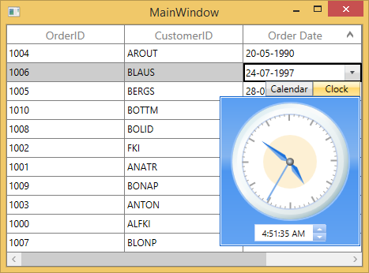

### Show repeat button 

You can increment or decrement the selected part of date time value by enabling the repeat button through [GridDateTimeColumn.ShowRepeatButton](https://help.syncfusion.com/cr/wpf/Syncfusion.UI.Xaml.Grid.GridDateTimeColumn.html#Syncfusion_UI_Xaml_Grid_GridDateTimeColumn_ShowRepeatButton) property.

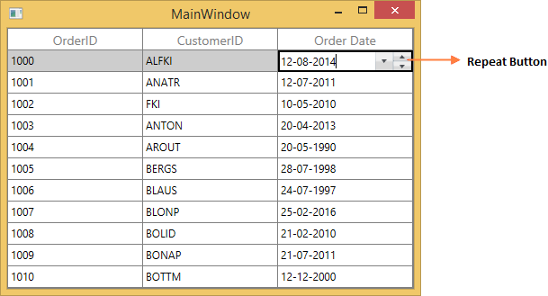

### Format using Converter

`GridDateTimeColumn`  allows you to set different cultures by setting [ConverterCulture](https://learn.microsoft.com/en-us/dotnet/api/system.windows.data.binding.converterculture?view=windowsdesktop-7.0&viewFallbackFrom=net-5.0) property in [DisplayBinding](https://help.syncfusion.com/cr/wpf/Syncfusion.UI.Xaml.Grid.GridColumnBase.html#Syncfusion_UI_Xaml_Grid_GridColumnBase_DisplayBinding) and [ValueBinding](https://help.syncfusion.com/cr/wpf/Syncfusion.UI.Xaml.Grid.GridColumnBase.html#Syncfusion_UI_Xaml_Grid_GridColumnBase_ValueBinding).



<Window.Resources>
    <local:CultureFormatConverter x:Key="converter"/>
</Window.Resources>

<syncfusion:SfDataGrid x:Name="dataGrid"                                                                       
                       AutoGenerateColumns="False" 
                       ItemsSource="{Binding Orders}">
    <syncfusion:SfDataGrid.Columns>
        <syncfusion:GridDateTimeColumn  DisplayBinding="{Binding Path=OrderDate,
                                        ConverterCulture=fr-FR,
                                        Converter={StaticResource converter}}"
                                        HeaderText="Order Date"
                                        ValueBinding="{Binding  Path=OrderDate,
                                        ConverterCulture=fr-FR}" />
    </syncfusion:SfDataGrid.Columns>
</syncfusion:SfDataGrid>



N> By default, short date pattern is applied in GridDateTimeColumn.

Below code, returns the culture-specified date time value instead of default pattern. 



public class CultureFormatConverter:IValueConverter
{

    public object Convert(object value, Type targetType, object parameter, System.Globalization.CultureInfo culture)
    {
        return value;
    }

    public object ConvertBack(object value, Type targetType, object parameter, System.Globalization.CultureInfo culture)
    {
        throw new NotImplementedException();
    }
}



## GridCheckBoxColumn

`GridCheckBoxColumn` derived from `GridColumn` and it used display and edit `Boolean` type data. It hosts `CheckBox` element as `GridCell` content.



<syncfusion:SfDataGrid x:Name="dataGrid"                                                                       
                       AutoGenerateColumns="False" 
                       ItemsSource="{Binding Orders}">
    <syncfusion:SfDataGrid.Columns>
        <syncfusion:GridCheckBoxColumn HeaderText="Is Delivered" MappingName="IsDelivered" />
    </syncfusion:SfDataGrid.Columns>
</syncfusion:SfDataGrid>


this.dataGrid.Columns.Add(new GridCheckBoxColumn() { HeaderText = "Is Delivered", MappingName = "IsDelivered" });



`GridCheckBoxColumn` allows you to customize check box state and its alignment.

* [IsThreeState](https://help.syncfusion.com/cr/wpf/Syncfusion.UI.Xaml.Grid.GridCheckBoxColumn.html#Syncfusion_UI_Xaml_Grid_GridCheckBoxColumn_IsThreeState) - By default, the `GridCheckBoxColumn` has `Checked` and `Unchecked` state. You can enable another `Intermediate` state setting `IsThreeState` property to `true`.

* [HorizontalAlignment](https://help.syncfusion.com/cr/wpf/Syncfusion.UI.Xaml.Grid.GridCheckBoxColumn.html#Syncfusion_UI_Xaml_Grid_GridCheckBoxColumn_HorizontalAlignment) - You can change the horizontal alignment of CheckBox using `HorizontalAlignment` property. 

### Canceling the check box state change
The checkbox state change can be canceled by setting `CellCheckBoxClickEventArgs.Cancel` to true in the `SfDataGrid.CellCheckBoxClick` event. Additionally, the checkbox value can be modified by setting `CellCheckBoxClickEventArgs.NewValue` within the event.



this.sfDataGrid1.CellCheckBoxClick += OnCellCheckBoxClick;

void OnCellCheckBoxClick(object sender, CellCheckBoxClickEventArgs e)
{
    if (e.RowIndex == 1)
        e.Cancel = true;
    else if (e.RowIndex == 2)
        e.NewValue = CheckState.Checked;
}



AddHandler sfDataGrid1.CellCheckBoxClick, AddressOf OnCellCheckBoxClick
	
Private Sub OnCellCheckBoxClick(ByVal sender As Object, ByVal e As CellCheckBoxClickEventArgs)
	If e.RowIndex = 1 Then
		e.Cancel = True
    ElseIf e.RowIndex = 2 Then
        e.NewValue = CheckState.Checked
    End If
End Sub



## GridTemplateColumn

`GridTemplateColumn` derived from `GridTextColumnBase` and it displays the template-specified cell content. You can load any WPF control in the display mode for all columns by setting [CellTemplate](https://help.syncfusion.com/cr/wpf/Syncfusion.UI.Xaml.Grid.GridColumnBase.html#Syncfusion_UI_Xaml_Grid_GridColumnBase_CellTemplate) and [EditTemplate](https://help.syncfusion.com/cr/wpf/Syncfusion.UI.Xaml.Grid.GridTemplateColumn.html#Syncfusion_UI_Xaml_Grid_GridTemplateColumn_EditTemplate)   properties.

Using `CellTemplate`, you can format data or conditionally change the properties using [DataTrigger](https://learn.microsoft.com/en-us/dotnet/api/system.windows.datatrigger?view=windowsdesktop-7.0&viewFallbackFrom=net-5.0).



<syncfusion:SfDataGrid x:Name="dataGrid"                                                                       
                       AutoGenerateColumns="False" 
                       ItemsSource="{Binding Orders}">
    <syncfusion:SfDataGrid.Columns>
        <syncfusion:GridTemplateColumn MappingName="CustomerID">           
            <syncfusion:GridTemplateColumn.CellTemplate>
                <DataTemplate>
                    <TextBlock Text="{Binding CustomerID}" />
                </DataTemplate>
            </syncfusion:GridTemplateColumn.CellTemplate>

            <syncfusion:GridTemplateColumn.EditTemplate>
                <DataTemplate>
                    <TextBox Text="{Binding CustomerID, Mode=TwoWay}" />
                </DataTemplate>
            </syncfusion:GridTemplateColumn.EditTemplate>            
        </syncfusion:GridTemplateColumn>       
    </syncfusion:SfDataGrid.Columns>
</syncfusion:SfDataGrid>


//CellTemplate creation.
DataTemplate cellTemplate = new DataTemplate();
FrameworkElementFactory frameworkElement1 = new FrameworkElementFactory(typeof(TextBlock));
Binding displayBinding = new Binding() { Path = new PropertyPath("CustomerID") };
frameworkElement1.SetValue(TextBlock.TextProperty, displayBinding);
cellTemplate.VisualTree = frameworkElement1;
            
//EditTemplate creation.
DataTemplate editTemplate = new DataTemplate();
FrameworkElementFactory frameworkElement2 = new FrameworkElementFactory(typeof(TextBox));
Binding editBinding = new Binding() { Path = new PropertyPath("CustomerID"), Mode = BindingMode.TwoWay };
frameworkElement2.SetValue(TextBox.TextProperty, editBinding);     
editTemplate.VisualTree = frameworkElement2;
this.dataGrid.Columns.Add(new GridTemplateColumn() { HeaderText = "Customer ID", MappingName = "CustomerID", CellTemplate = cellTemplate, EditTemplate = editTemplate, SetCellBoundValue = false });



### Mouse interaction for UIElement loaded inside template 

You can allow `UIElement` loaded inside `CellTemplate` or `EditTemplate` to handle mouse interaction in required cases by setting [VisualContainer.WantsMouseInput](https://help.syncfusion.com/cr/wpf/Syncfusion.UI.Xaml.Grid.VisualContainer.html#Syncfusion_UI_Xaml_Grid_VisualContainer_WantsMouseInputProperty) attached property to the particular `UIElement` inside template. 



<syncfusion:SfDataGrid x:Name="dataGrid"                                                                       
                       AutoGenerateColumns="False" 
                       ItemsSource="{Binding Orders}">
    <syncfusion:SfDataGrid.Columns>
        <syncfusion:GridTemplateColumn MappingName="ProductName">
            <syncfusion:GridTemplateColumn.CellTemplate>
                <DataTemplate>
                    <ComboBox ItemsSource="{Binding ComboItems, Source={StaticResource viewModel}}" syncfusion:VisualContainer.WantsMouseInput="True" />
                </DataTemplate>
            </syncfusion:GridTemplateColumn.CellTemplate>
        </syncfusion:GridTemplateColumn>
    </syncfusion:SfDataGrid.Columns>
</syncfusion:SfDataGrid>



### Keyboard interaction for UIElement loaded inside CellTemplate

You can allow `UIElement` loaded inside `CellTemplate` to handle keyboard interaction by setting [FocusManagerHelper.WantsKeyInput](https://help.syncfusion.com/cr/wpf/Syncfusion.UI.Xaml.Grid.FocusManagerHelper.html#Syncfusion_UI_Xaml_Grid_FocusManagerHelper_WantsKeyInputProperty) attached property to `GridColumn`. You can use this when loading edit element in CellTemplate. 

In this case SfDataGrid handles the below key operations and other keys are handled by UIElement loaded inside `CellTemplate`. 

* <kbd>Tab</kbd>
* <kbd>Enter</kbd>
* <kbd>PageUp</kbd>
* <kbd>PageDown</kbd>



<syncfusion:SfDataGrid x:Name="dataGrid"
                       AutoGenerateColumns="False" 
                       ItemsSource="{Binding Orders}">
    <syncfusion:SfDataGrid.Columns>
        <syncfusion:GridTemplateColumn MappingName="CustomerName" syncfusion:FocusManagerHelper.WantsKeyInput="True">
            <syncfusion:GridTemplateColumn.CellTemplate>
                <TextBox Text="{Binding Country}" />
            </syncfusion:GridTemplateColumn.CellTemplate>
        </syncfusion:GridTemplateColumn>
    </syncfusion:SfDataGrid.Columns>
</syncfusion:SfDataGrid>



### Setting focus to particular element inside Template when cell gets activated or edited

You can allow logical focus to specific UIElement loaded inside `EditTemplate` or `CellTemplate` by setting [FocusManagerHelper.FocusedElement](https://help.syncfusion.com/cr/wpf/Syncfusion.UI.Xaml.Grid.FocusManagerHelper.html#Syncfusion_UI_Xaml_Grid_FocusManagerHelper_FocusedElementProperty) attached property. You can use this property to start editing the template column value as like normal column when the user gets into edit mode.



<syncfusion:SfDataGrid x:Name="dataGrid"                                                                       
                       AutoGenerateColumns="False" 
                       ItemsSource="{Binding Orders}">
    <syncfusion:SfDataGrid.Columns>
        <syncfusion:GridTemplateColumn MappingName="CustomerName">
            <syncfusion:GridTemplateColumn.CellTemplate>
                <DataTemplate>
                    <Grid>
                        <TextBlock Text="{Binding CustomerName}" />
                    </Grid>
                </DataTemplate>
            </syncfusion:GridTemplateColumn.CellTemplate>
            <syncfusion:GridTemplateColumn.EditTemplate>
                <DataTemplate>
                    <Grid>
                        <TextBox Text="{Binding CustomerName}" syncfusion:FocusManagerHelper.FocusedElement="True" />
                    </Grid>
                </DataTemplate>
            </syncfusion:GridTemplateColumn.EditTemplate>
        </syncfusion:GridTemplateColumn>
    </syncfusion:SfDataGrid.Columns>
</syncfusion:SfDataGrid>



### Binding CellTemplate and EditTemplate based on MappingName

By default, underlying record is `DataContext` for CellTemplate. So you have to define, template for each column to display values based on `MappingName`. 

You can use the same [DataTemplate](https://learn.microsoft.com/en-us/dotnet/api/system.windows.datatemplate?view=windowsdesktop-7.0&viewFallbackFrom=net-5.0) for all columns to display value based on MappingName by setting [SetCellBoundValue](https://help.syncfusion.com/cr/wpf/Syncfusion.UI.Xaml.Grid.GridColumnBase.html#Syncfusion_UI_Xaml_Grid_GridColumnBase_SetCellBoundValue) property to `true`. Setting `SetCellBoundValue` to `true`, changes the DataContext for CellTemplate to [DataContextHelper](https://help.syncfusion.com/cr/wpf/Syncfusion.UI.Xaml.Grid.Cells.DataContextHelper.html) which has the following members,

* `Value` - Return the value base on `MappingName`.
* `Record` - Returns the underlying data object.

N> EditTemplate support available only for GridTemplateColumn.



<syncfusion:SfDataGrid x:Name="dataGrid"                                                                       
                       AutoGenerateColumns="False" 
                       ItemsSource="{Binding Orders}">
    <syncfusion:SfDataGrid.Columns>
        <syncfusion:GridTemplateColumn MappingName="OrderID" SetCellBoundValue="True">
            <syncfusion:GridTemplateColumn.CellTemplate>
                <DataTemplate>
                    <Grid>
                        <TextBlock Text="{Binding Value}" />
                    </Grid>
                </DataTemplate>
            </syncfusion:GridTemplateColumn.CellTemplate>
            <syncfusion:GridTemplateColumn.EditTemplate>
                <DataTemplate>
                    <Grid>
                        <TextBox Text="{Binding Value}" />
                    </Grid>
                </DataTemplate>
            </syncfusion:GridTemplateColumn.EditTemplate>
        </syncfusion:GridTemplateColumn>
    </syncfusion:SfDataGrid.Columns>
</syncfusion:SfDataGrid>



### Sets EditTemplate based on custom logic

`GridTemplateColumn` provides support to load different edit elements based on underlying data object using [GridTemplateColumn.EditTemplateSelector](https://help.syncfusion.com/cr/wpf/Syncfusion.UI.Xaml.Grid.GridTemplateColumn.html#Syncfusion_UI_Xaml_Grid_GridTemplateColumn_EditTemplateSelector) property.

Below code returns the `DefaultTemplate` and `AlternateTemplate` based on OrderID’s value.



public class CustomEditTemplateSelector:DataTemplateSelector
{
    public override System.Windows.DataTemplate SelectTemplate(object item, System.Windows.DependencyObject container)
    {

        if (item == null)
            return null ;
        var data = item as OrderInfo;

        if (data.OrderID % 2 == 0)
            return App.Current.Resources["AlternateTemplate"] as DataTemplate;

        else
            return App.Current.Resources["DefaultTemplate"] as DataTemplate;
    }
}	



In the below code, custom template selector set to `GridTemplateColumn.EditTemplateSelector`.



<syncfusion:SfDataGrid x:Name="dataGrid"                                                                       
                       AutoGenerateColumns="False" 
                       ItemsSource="{Binding Orders}">
    <syncfusion:SfDataGrid.Columns>
        <syncfusion:GridTemplateColumn MappingName="OrderID"
                                       CellTemplateSelector="{StaticResource cellTemplateSelector}"    
                                       EditTemplateSelector="{StaticResource editTemplateSelector}"/>
    </syncfusion:SfDataGrid.Columns>
</syncfusion:SfDataGrid>



## GridComboBoxColumn

`GridComboBoxColumn` derived from `GridColumn` which hosts `ComboBox` as edit element.You can enable editing in ComboBox by setting [IsEditable](https://help.syncfusion.com/cr/wpf/Syncfusion.UI.Xaml.Grid.GridComboBoxColumn.html#Syncfusion_UI_Xaml_Grid_GridComboBoxColumn_IsEditable) property to `true`.  The data source to ComboBox can be set by using `GridComboBoxColumn.ItemsSource` property.

By default, `GridComboBoxColumn` displays the value using `MappingName` property. You can set [DisplayMemberPath](https://help.syncfusion.com/cr/wpf/Syncfusion.UI.Xaml.Grid.GridComboBoxColumn.html#Syncfusion_UI_Xaml_Grid_GridComboBoxColumn_DisplayMemberPath) which denotes the path to a value on the source object(GridComboBoxColumn.ItemsSource) to serve as visual representation of object. You can set [SelectedValuePath](https://help.syncfusion.com/cr/wpf/Syncfusion.UI.Xaml.Grid.GridComboBoxColumn.html#Syncfusion_UI_Xaml_Grid_GridComboBoxColumn_SelectedValuePath) which denotes the path to get the SelectedValue from the SelectedItem.



<Window.Resources>
    <local:ViewModel x:key="viewModel"/>
</Window.Resources>

<syncfusion:SfDataGrid x:Name="dataGrid"                                                                       
                       AutoGenerateColumns="False" 
                       ItemsSource="{Binding Orders}">
    <syncfusion:SfDataGrid.Columns>
        <syncfusion:GridComboBoxColumn  HeaderText="Product Name"
                                        ItemsSource="{Binding ComboItems,
                                        Source={StaticResource viewModel}}"
                                        MappingName="ProductName" />
    </syncfusion:SfDataGrid.Columns>
</syncfusion:SfDataGrid>


this.dataGrid.Columns.Add(new GridComboBoxColumn() { HeaderText = "Product Name", MappingName = "ProductName", ItemsSource = viewModel.ComboItems });



SfDataGrid triggers, [CurrentCellDropDownSelectionChanged](https://help.syncfusion.com/cr/wpf/Syncfusion.UI.Xaml.Grid.SfDataGrid.html#Syncfusion_UI_Xaml_Grid_SfDataGrid_CurrentCellDropDownSelectionChanged) event, when the SelectedValue is changed.[CurrentCellDropDownSelectionChangedEventArgs](https://help.syncfusion.com/cr/wpf/Syncfusion.UI.Xaml.Grid.CurrentCellDropDownSelectionChangedEventArgs.html) of `CurrentCellDropDownSelectionChanged` event provides the information about the changed cell value.

`SelectedIndex` property returns the index of selected item.

`SelectedItem` property returns the selected item from drop down list.

### Keep the dropdown to be opened

You can keep the drop-down control open when start editing on the text box of `ComboBox` also by setting [StaysOpenOnEdit](https://help.syncfusion.com/cr/wpf/Syncfusion.UI.Xaml.Grid.GridComboBoxColumn.html#Syncfusion_UI_Xaml_Grid_GridComboBoxColumn_StaysOpenOnEdit) property to `true`.

### Improving dropdown opening time

You can improve the drop-down opening time on loading by setting [VirtualizingStackPanel](https://learn.microsoft.com/en-us/previous-versions/windows/silverlight/dotnet-windows-silverlight/ms617901(v=vs.95)) as [ItemsPanelTemplate](https://learn.microsoft.com/en-us/dotnet/api/system.windows.controls.itemspaneltemplate?view=windowsdesktop-7.0&viewFallbackFrom=net-5.0) of `ComboBox`, when the large number of items loaded in it.



<Window.Resources>
    
</Window.Resources>



### Opening dropdown popup in single-click

You can open the drop down within single click by setting [ComboBox.IsDropDownOpen](https://learn.microsoft.com/en-us/dotnet/api/system.windows.controls.combobox.isdropdownopen?view=windowsdesktop-7.0&viewFallbackFrom=net-5.0) property to `true` in [OnEditElementLoaded](https://help.syncfusion.com/cr/wpf/Syncfusion.UI.Xaml.Grid.Cells.GridCellComboBoxRenderer.html#Syncfusion_UI_Xaml_Grid_Cells_GridCellComboBoxRenderer_OnEditElementLoaded_System_Object_System_Windows_RoutedEventArgs_) method by overriding existing renderer.

Below code, creates `GridCellComboBoxRendererExt` to set `IsDropDownOpen` property. Replace the default renderer with created renderer in [SfDataGrid.CellRenderers](https://help.syncfusion.com/cr/wpf/Syncfusion.UI.Xaml.Grid.SfDataGrid.html#Syncfusion_UI_Xaml_Grid_SfDataGrid_CellRenderers) collection.



this.dataGrid.CellRenderers.Remove("ComboBox");
this.dataGrid.CellRenderers.Add("ComboBox", new GridCellComboBoxRendererExt());

public class GridCellComboBoxRendererExt:GridCellComboBoxRenderer
{

    protected override void OnEditElementLoaded(object sender, System.Windows.RoutedEventArgs e)
    {
        base.OnEditElementLoaded(sender, e);
        var combobox = sender as ComboBox;
        combobox.IsDropDownOpen = true;
    }
}



N> This is applicable when the [SfDataGrid.EditTrigger](https://help.syncfusion.com/cr/wpf/Syncfusion.UI.Xaml.Grid.SfGridBase.html#Syncfusion_UI_Xaml_Grid_SfGridBase_EditTrigger) is set as `OnTap`.

### Customizing GroupCaptionText based on DisplayMemberPath

By default, the `GroupCaptionText` will be displayed based on `MappingName`. You can display the `GroupCaptionText` based on [DisplayMemberPath](https://help.syncfusion.com/cr/wpf/Syncfusion.UI.Xaml.Grid.GridComboBoxColumn.html#Syncfusion_UI_Xaml_Grid_GridComboBoxColumn_DisplayMemberPath) using [GroupColumnDescription.Converter](https://help.syncfusion.com/cr/wpf/Syncfusion.UI.Xaml.Grid.GroupColumnDescription.html#Syncfusion_UI_Xaml_Grid_GroupColumnDescription_Converter) property.



<syncfusion:SfDataGrid x:Name="dataGrid"                                                                       
                       AutoGenerateColumns="False" 
                       ItemsSource="{Binding Orders}">
    <syncfusion:SfDataGrid.Columns>
        <syncfusion:GridComboBoxColumn  DisplayMemberPath="OrderID"
                                        HeaderText="Order ID"
                                        IsEditable="True"
                                        ItemsSource="{Binding ComboItems}"
                                        MappingName="ProductName"
                                        SelectedValuePath="ProductName" />
    </syncfusion:SfDataGrid.Columns>
</syncfusion:SfDataGrid>



Below code returns the group caption based on `GridComboBoxColumn.ItemsSource`.



public class GroupCaptionConverter:IValueConverter
{

    public object Convert(object value, Type targetType, object parameter, System.Globalization.CultureInfo culture)
    {

        if (!(parameter is GridComboBoxColumn))
            return value;
        var column = parameter as GridComboBoxColumn;
        var record = value as OrderInfo;

        foreach (var item in column.ItemsSource)
        {

            if (record.ProductName == (item as OrderDetails).ProductName)
                return (item as OrderDetails).OrderID;
        }
        return null; 
    }

    public object ConvertBack(object value, Type targetType, object parameter, System.Globalization.CultureInfo culture)
    {
        throw new NotImplementedException();
    }
}



In the below code snippet, `GroupCaptionConverter` set to `GroupColumnDescription.Converter` while grouping.



this.dataGrid.GroupColumnDescriptions.CollectionChanged += GroupColumnDescriptions_CollectionChanged;

void GroupColumnDescriptions_CollectionChanged(object sender, System.Collections.Specialized.NotifyCollectionChangedEventArgs e)
{   

    if (e.Action == NotifyCollectionChangedAction.Add)
    {
        var groupDescription = e.NewItems[0] as GroupColumnDescription;

        if (groupDescription.ColumnName == "ProductName")
            groupDescription.Converter = new GroupCaptionConverter();
    }
}



### Loading Different ItemSource for each row of GridComboBoxColumn

You can load the different ItemsSource to each row of GridComboBoxColumn by setting  [SfDataGrid.ItemsSourceSelector](https://help.syncfusion.com/cr/wpf/Syncfusion.UI.Xaml.Grid.GridComboBoxColumn.html#Syncfusion_UI_Xaml_Grid_GridComboBoxColumn_ItemsSourceSelector) property. 

### Implementing IItemsSourceSelector

`ItemsSourceSelector` needs to implement [IItemsSourceSelector](https://help.syncfusion.com/cr/wpf/Syncfusion.UI.Xaml.Grid.IItemsSourceSelector.html) interface which requires you to implement [GetItemsSource](https://help.syncfusion.com/cr/wpf/Syncfusion.UI.Xaml.Grid.IItemsSourceSelector.html#Syncfusion_UI_Xaml_Grid_IItemsSourceSelector_GetItemsSource_System_Object_System_Object_) method which receives the below parameters,
<ul>
<li> <b>Record</b> – data object associated with row.</li>
<li> <b>Data Context</b>  – Data context of data grid.</li>
</ul>

In the below code, ItemsSource for ShipCity column returned based on ShipCountry column value using the record and data context of data grid passed to `GetItemsSource` method.




<Window.Resources>
    <local:ItemsSourceSelector x:Key="itemSourceSelector" />
</Window.Resources>

<syncfusion:SfDataGrid x:Name="sfdatagrid"
                        AllowEditing="True"
                        AutoGenerateColumns="False"
                        ItemsSource="{Binding OrderDetails}"
                        ColumnSizer="Star">            
    <interactivity:Interaction.Behaviors>
        <local:ItemsSourceSelectorBehavior />
    </interactivity:Interaction.Behaviors>            
    <syncfusion:SfDataGrid.Columns>        
        <syncfusion:GridComboBoxColumn MappingName="ShipCountry"  ItemsSource="{Binding Path=DataContext.CountryList, ElementName=sfdatagrid}"/>
        <syncfusion:GridComboBoxColumn  HeaderText="ShipCity" DisplayMemberPath="ShipCityName"
                                ItemsSourceSelector="{StaticResource itemSourceSelector}"
                                MappingName="ShipCityID" SelectedValuePath="ShipCityID"/>
    </syncfusion:SfDataGrid.Columns>
</syncfusion:SfDataGrid>


/// 

/// Implementation class for ItemsSourceSelector interface
/// 

public class ItemsSourceSelector : IItemsSourceSelector
{
    public IEnumerable GetItemsSource(object record, object dataContext)
    {
        if (record == null)
            return null;
  
        var orderinfo = record as OrderDetails;
        var countryName = orderinfo.ShipCountry;
  
        var viewModel = dataContext as ViewModel;
  
        //Returns ShipCity collection based on ShipCountry.
        if (viewModel.ShipCities.ContainsKey(countryName))
        {
            ObservableCollection<ShipCityDetails> shipCities = null;
            viewModel.ShipCities.TryGetValue(countryName, out shipCities);
            return shipCities.ToList();
        }
        return null;
    }
}



The following screenshot illustrates the different ShipCity ItemsSource bound to each row of the ComboBox based on the Country Name.

You can download the sample from [here](https://www.syncfusion.com/downloads/support/directtrac/general/ze/ComboBoxColumnsDemo-1585046085.zip).

## GridMultiColumnDropDownList

`GridMultiColumnDropDownList` derived from `GridTextColumnBase` and it displays enumeration as cell contents. It hosts [SfMultiDropDownControl](https://help.syncfusion.com/cr/wpf/Syncfusion.UI.Xaml.Grid.SfMultiColumnDropDownControl.html) in editing mode. `GridMultiColumnDropDownList` allows you to define the predefined columns in its drop-down like SfDataGrid.  

You can change the value by selecting the item from drop down or you can edit the `SfMultiColumnDropDownControl.Editor`. You can disable the editing by setting [IsTextReadOnly](https://help.syncfusion.com/cr/wpf/Syncfusion.UI.Xaml.Grid.GridMultiColumnDropDownList.html#Syncfusion_UI_Xaml_Grid_GridMultiColumnDropDownList_IsTextReadOnly).



<syncfusion:SfDataGrid x:Name="dataGrid"                                                                       
                       AutoGenerateColumns="False" 
                       ItemsSource="{Binding Orders}">
    <syncfusion:SfDataGrid.Columns>
        <syncfusion:GridMultiColumnDropDownList AutoGenerateColumns="False"
                                                DisplayMember="CustomerID"
                                                HeaderText="Customer ID"
                                                ItemsSource="{Binding Orders}"
                                                MappingName="OrderID"
                                                ValueMember="OrderID">
            <syncfusion:GridMultiColumnDropDownList.Columns>
                <syncfusion:Columns>
                    <syncfusion:GridTextColumn HeaderText="Customer ID" MappingName="CustomerID" />
                    <syncfusion:GridTextColumn HeaderText="Order ID" MappingName="OrderID" />
                </syncfusion:Columns>
            </syncfusion:GridMultiColumnDropDownList.Columns>
        </syncfusion:GridMultiColumnDropDownList>
    </syncfusion:SfDataGrid.Columns>
</syncfusion:SfDataGrid>


Columns columns = new Columns();
columns.Add(new GridTextColumn() { HeaderText = "Order ID", MappingName = "OrderID" });
columns.Add(new GridTextColumn() { HeaderText = "Customer ID", MappingName = "CustomerID" });
this.dataGrid.Columns.Add(new GridMultiColumnDropDownList() { ItemsSource = viewModel.Orders, MappingName = "OrderID", HeaderText = "Customer ID", DisplayMember = "CustomerID", ValueMember = "OrderID", AutoGenerateColumns = false, Columns = columns });



SfDataGrid triggers, [CurrentCellDropDownSelectionChanged](https://help.syncfusion.com/cr/wpf/Syncfusion.UI.Xaml.Grid.SfDataGrid.html#Syncfusion_UI_Xaml_Grid_SfDataGrid_CurrentCellDropDownSelectionChanged) event, when the SelectedValue is changed.[CurrentCellDropDownSelectionChangedEventArgs](https://help.syncfusion.com/cr/wpf/Syncfusion.UI.Xaml.Grid.CurrentCellDropDownSelectionChangedEventArgs.html) of `CurrentCellDropDownSelectionChanged` event provides the information about the changed cell value.

`SelectedIndex` property returns the index of selected item.
`SelectedItem` property returns the selected item from drop down list.

### Auto-complete support

You can allow SfMultiDropDownControl to complete the entered input value automatically by setting the [AllowAutoComplete](https://help.syncfusion.com/cr/wpf/Syncfusion.UI.Xaml.Grid.GridMultiColumnDropDownList.html#Syncfusion_UI_Xaml_Grid_GridMultiColumnDropDownList_AllowAutoComplete) property to `true`. `AllowAutoComplete` property will autocomplete the input value by comparing it to each item of the underlying data source of `GridMultiColumnDropDownList` and returns the matched value by `DisplayMember`. 

### Filtering

You can allow SfMultiDropDownControl to filter the drop-down list items dynamically based on the text typed on editor by setting [AllowIncrementalFiltering](https://help.syncfusion.com/cr/wpf/Syncfusion.UI.Xaml.Grid.GridMultiColumnDropDownList.html#Syncfusion_UI_Xaml_Grid_GridMultiColumnDropDownList_AllowIncrementalFiltering) property to `true`. `GridMultiColumnDropDownList` allows you to filter the items based on case by setting [AllowCasingforFilter](https://help.syncfusion.com/cr/wpf/Syncfusion.UI.Xaml.Grid.GridMultiColumnDropDownList.html#Syncfusion_UI_Xaml_Grid_GridMultiColumnDropDownList_AllowCasingforFilter) to `true`. This will help users to select from large number of items.

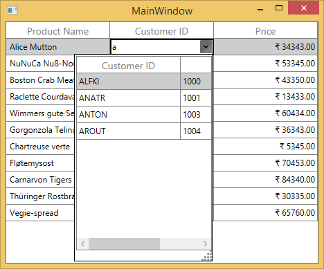

### Auto increment

You can increment or decrement the value via the `Mouse-Wheel` or <kbd>up</kbd> and <kbd>down</kbd> key by setting [AllowSpinOnMouseWheel](https://help.syncfusion.com/cr/wpf/Syncfusion.UI.Xaml.Grid.GridMultiColumnDropDownList.html#Syncfusion_UI_Xaml_Grid_GridMultiColumnDropDownList_AllowSpinOnMouseWheel) to `true`. 

### Null value support

You can allow the null values by setting the [AllowNullInput](https://help.syncfusion.com/cr/wpf/Syncfusion.UI.Xaml.Grid.GridMultiColumnDropDownList.html#Syncfusion_UI_Xaml_Grid_GridMultiColumnDropDownList_AllowNullInput) property to `true`. 

N> The AllowNullInput will work only when the underlying property type is Nullable.

### Popup customization

#### Size

You can allow change the size of drop-down popup by setting [PopUpWidth](https://help.syncfusion.com/cr/wpf/Syncfusion.UI.Xaml.Grid.GridMultiColumnDropDownList.html#Syncfusion_UI_Xaml_Grid_GridMultiColumnDropDownList_PopUpWidth) and [PopUpHeight](https://help.syncfusion.com/cr/wpf/Syncfusion.UI.Xaml.Grid.GridMultiColumnDropDownList.html#Syncfusion_UI_Xaml_Grid_GridMultiColumnDropDownList_PopUpHeight) property. The `PopUpWidth` will be set based on [PopUpMinWidth](https://help.syncfusion.com/cr/wpf/Syncfusion.UI.Xaml.Grid.GridMultiColumnDropDownList.html#Syncfusion_UI_Xaml_Grid_GridMultiColumnDropDownList_PopUpMinWidth) and [PopUpMaxWidth](https://help.syncfusion.com/cr/wpf/Syncfusion.UI.Xaml.Grid.GridMultiColumnDropDownList.html#Syncfusion_UI_Xaml_Grid_GridMultiColumnDropDownList_PopUpMaxWidth) properties when the value is not between them. By default, the `PopUpMinWidth` value is 200.0. 

Similarly, the `PopUpHeight` based on [PopUpMinHeight](https://help.syncfusion.com/cr/wpf/Syncfusion.UI.Xaml.Grid.GridMultiColumnDropDownList.html#Syncfusion_UI_Xaml_Grid_GridMultiColumnDropDownList_PopUpMinHeight) and [PopUpMaxHeight](https://help.syncfusion.com/cr/wpf/Syncfusion.UI.Xaml.Grid.GridMultiColumnDropDownList.html#Syncfusion_UI_Xaml_Grid_GridMultiColumnDropDownList_PopUpMaxHeight) when the value is not between them. The default value of `PopUpMinHeight` is 300.0. 

SfMultiDropDownControl can automatically adjust the popup width based on the actual size of SfDataGrid when setting [IsAutoPopupSize](https://help.syncfusion.com/cr/wpf/Syncfusion.UI.Xaml.Grid.GridMultiColumnDropDownList.html#Syncfusion_UI_Xaml_Grid_GridMultiColumnDropDownList_IsAutoPopupSize) to `true`.

#### Resizing drop-down popup

You can allow end-user to resize the drop-down popup by showing resizing thumb by setting [ShowResizeThumb](https://help.syncfusion.com/cr/wpf/Syncfusion.UI.Xaml.Grid.GridMultiColumnDropDownList.html#Syncfusion_UI_Xaml_Grid_GridMultiColumnDropDownList_ShowResizeThumb) property to `Visible`.

#### Keep popup open on editing

You can open the drop-down popup, when the user start editing on text editor using [AllowImmediatePopup](https://help.syncfusion.com/cr/wpf/Syncfusion.UI.Xaml.Grid.SfMultiColumnDropDownControl.html#Syncfusion_UI_Xaml_Grid_SfMultiColumnDropDownControl_AllowImmediatePopup) property to `true` in [OnEditElementLoaded](https://help.syncfusion.com/cr/wpf/Syncfusion.UI.Xaml.Grid.Cells.GridCellMultiColumnDropDownRenderer.html#Syncfusion_UI_Xaml_Grid_Cells_GridCellMultiColumnDropDownRenderer_OnEditElementLoaded_System_Object_System_Windows_RoutedEventArgs_) method by overriding existing renderer.

Below code, creates `GridCellMultiColumnDropDownRendererExt` to set `AllowImmediatePopup` property. Replace the default renderer with created renderer in [SfDataGrid.CellRenderers](https://help.syncfusion.com/cr/wpf/Syncfusion.UI.Xaml.Grid.SfDataGrid.html#Syncfusion_UI_Xaml_Grid_SfDataGrid_CellRenderers) collection.



this.dataGrid.CellRenderers.Remove("MultiColumnDropDown");
this.dataGrid.CellRenderers.Add("MultiColumnDropDown", new GridCellMultiColumnDropDownRendererExt());

public class GridCellMultiColumnDropDownRendererExt : GridCellMultiColumnDropDownRenderer
{

    protected override void OnEditElementLoaded(object sender, System.Windows.RoutedEventArgs e)
    {
        (sender as SfMultiColumnDropDownControl).AllowImmediatePopup = true;                     
        (sender as SfMultiColumnDropDownControl).Text = PreviewInputText;
        base.OnEditElementLoaded(sender, e);
    }
}



### Loading different ItemsSource for each row

You can load different ItemsSource to each row of `GridMultiColumnDropDownList` by setting the `SfDataGrid.ItemsSourceSelector` property. 

### Implementing IItemsSourceSelector

`ItemsSourceSelector` needs to implement the `IItemsSourceSelector` interface, which is required to implement the `GetItemsSource` method. The `GetItemsSource` method receives the following parameters:
<ul>
<li> <b>Record</b> – Data object associated with row.</li>
<li> <b>Data Context</b>  – Data context of data grid.</li>
</ul>

In the following code, ItemsSource for `ShipCity` column is returned based on `ShipCountry` column value using the record and data context of data grid passed to the `GetItemsSource` method.




<Window.Resources>
        <local:ItemsSourceSelector x:Key="itemSourceSelector" />
</Window.Resources>
<syncfusion:SfDataGrid x:Name="sfdatagrid"
                         AllowEditing="True"
                         AutoGenerateColumns="False"
                         AllowFiltering="False"
                         ItemsSource="{Binding OrderDetails}"
                         ColumnSizer="Star">            
    <syncfusion:SfDataGrid.Columns>
        <syncfusion:GridTextColumn MappingName="OrderID" />
        <syncfusion:GridTextColumn MappingName="CustomerID" />
        <syncfusion:GridTextColumn MappingName="NoOfOrders" />
        <syncfusion:GridComboBoxColumn MappingName="ShipCountry" ItemsSource="{Binding Path=DataContext.CountryList, ElementName=sfdatagrid}"/>
        <syncfusion:GridMultiColumnDropDownList AllowEditing="True"	 HeaderText="ShipCity" DisplayMember="ShipCityName"
                        ItemsSourceSelector="{StaticResource itemSourceSelector}"
                        MappingName="ShipCityID" ValueMember="ShipCityID"/>
    </syncfusion:SfDataGrid.Columns>
 </syncfusion:SfDataGrid>


/// 

/// Implementation class for ItemsSourceSelector interface
/// 

public class ItemsSourceSelector : IItemsSourceSelector
{
    public IEnumerable GetItemsSource(object record, object dataContext)
    {
        if (record == null)
            return null;
  
        var orderinfo = record as OrderDetails;
        var countryName = orderinfo.ShipCountry;
  
        var viewModel = dataContext as ViewModel;
  
        //Returns ShipCity collection based on ShipCountry.
        if (viewModel.ShipCities.ContainsKey(countryName))
        {
            ObservableCollection<ShipCityDetails> shipCities = null;
            viewModel.ShipCities.TryGetValue(countryName, out shipCities);
            return shipCities.ToList();
        }
        return null;
    }
}



The following screenshot illustrates different `ShipCity` ItemsSource bound to each row of the `MultiColumnDropDownList` based on country name.

You can download the sample from the following link: [Sample](https://github.com/SyncfusionExamples/how-to-load-different-items-for-each-row-in-multicolumn-dropdown-column-in-wpf-and-uwp-datagrid).

## GridHyperlinkColumn

`GridHyperlinkColumn` derived from `GridTextColumn` and it displays columns data as `HyperLinkControl`. It hosts `TextBlock` element as `GridCell` content.



<syncfusion:SfDataGrid x:Name="dataGrid"                                                                       
                       AutoGenerateColumns="False" 
                       ItemsSource="{Binding Orders}">
    <syncfusion:SfDataGrid.Columns>
        <syncfusion:GridHyperlinkColumn HeaderText="Country Link" MappingName="Country" />
    </syncfusion:SfDataGrid.Columns>
</syncfusion:SfDataGrid>


this.dataGrid.Columns.Add(new GridHyperlinkColumn() { HeaderText = "Country Link", MappingName = "Country" });



You can allow end-user to navigate the `Uri` when the cell value contains valid `Uri` address or using [CurrentCellRequestNavigate](https://help.syncfusion.com/cr/wpf/Syncfusion.UI.Xaml.Grid.SfDataGrid.html#Syncfusion_UI_Xaml_Grid_SfDataGrid_CurrentCellRequestNavigate) event. The `CurrentCellRequestNavigate` occurs when the current cell in `GridHyperlinkColumn` is clicked for navigation.

[CurrentCellRequestNavigateEventArgs](https://help.syncfusion.com/cr/wpf/Syncfusion.UI.Xaml.Grid.CurrentCellRequestNavigateEventArgs.html) of `CurrentCellRequestNavigate` event provide information about the hyperlink triggered this event. `CurrentCellRequestNavigateEventArgs.NavigateText` returns the value using `ValueBinding` or `MappingName` to navigate. 



this.dataGrid.CurrentCellRequestNavigate += dataGrid_CurrentCellRequestNavigate;

void dataGrid_CurrentCellRequestNavigate(object sender, CurrentCellRequestNavigateEventArgs args)
{
    string address = "https://en.wikipedia.org/wiki/" + args.NavigateText;
    Process.Start(new ProcessStartInfo(address));
}



### Cancel the navigation

You can cancel the navigation by setting [CurrentCellRequestNavigateEventArgs.Handled](https://help.syncfusion.com/cr/wpf/Syncfusion.UI.Xaml.Grid.CurrentCellRequestNavigateEventArgs.html#Syncfusion_UI_Xaml_Grid_CurrentCellRequestNavigateEventArgs_Handled) to `true`. 



this.dataGrid.CurrentCellRequestNavigate += dataGrid_CurrentCellRequestNavigate;

void dataGrid_CurrentCellRequestNavigate(object sender, CurrentCellRequestNavigateEventArgs args)
{
    args.Handled = true;
}



### Customize HyperLink

#### Change the alignment

You can change the horizontal alignment of `GridHyperlinkColumn` using [HorizontalAlignment](https://help.syncfusion.com/cr/wpf/Syncfusion.UI.Xaml.Grid.GridHyperlinkColumn.html#Syncfusion_UI_Xaml_Grid_GridHyperlinkColumn_HorizontalAlignment) property.

#### Change the foreground color

You can change the foreground color of `GridHyperlinkColumn` by writing the style with target type `Hyperlink`.



<syncfusion:SfDataGrid x:Name="dataGrid"                                                                                                                
                       AllowEditing="True"
                       AutoGenerateColumns="False" 
                       ItemsSource="{Binding Orders}">
    <syncfusion:SfDataGrid.Columns>
                <syncfusion:GridHyperlinkColumn MappingName="HyperLink">
                    <syncfusion:GridHyperlinkColumn.CellStyle>
                        
                            </Style.Resources>
                        </Style>
                    </syncfusion:GridHyperlinkColumn.CellStyle>
                </syncfusion:GridHyperlinkColumn>                               
    </syncfusion:SfDataGrid.Columns>
</syncfusion:SfDataGrid>



## GridImageColumn

`GridImageColumn` derived from `GridColumn` and it displays columns data as Image. It hosts `Image` element as `GridCell` content.



public class OrderInfo
{
    private BitmapImage _imageLink;

    public BitmapImage ImageLink
    {
        get {  return _imageLink;}
        set { _imageLink = value;    }
    }

    public OrderInfo(int orderId, string customerName, string country, string
        customerId, string shipCity)
    {
        ImageLink = new System.Windows.Media.Imaging.BitmapImage(new Uri(string.Format(@"..\..\Images\{0}", this.Country + ".jpg"), UriKind.Relative));
    }
}



In the below code `GridImageColumn` defined with `ImageLink` property using `MappingName`



<syncfusion:SfDataGrid x:Name="dataGrid"
                       AutoGenerateColumns="False" 
                       ItemsSource="{Binding Orders}">
    <syncfusion:SfDataGrid.Columns>
        <syncfusion:GridImageColumn MappingName="ImageLink"
                                    HeaderText="Image"
                                    Stretch="Uniform"
                                    TextAlignment="Center" />
    </syncfusion:SfDataGrid.Columns>
</syncfusion:SfDataGrid>



#### Read image from path using ValueBinding

You can use converter to read image from resource by setting `Converter` in `ValueBinding` definition.

Below code, returns the `Image URI` using `ValueBinding` property.



public class StringToImageConverter:IValueConverter
{

    public object Convert(object value, Type targetType, object parameter, System.Globalization.CultureInfo culture)
    {
        string imageName = value as string+".jpg";
        return new BitmapImage(new Uri(string.Format(@"..\..\Images\{0}", imageName), UriKind.Relative));
    }

    public object ConvertBack(object value, Type targetType, object parameter, System.Globalization.CultureInfo culture)
    {
        return null;
    }
}





<syncfusion:SfDataGrid x:Name="dataGrid"                                                                       
                       AutoGenerateColumns="False" 
                       ItemsSource="{Binding Orders}">
    <syncfusion:SfDataGrid.Columns>
        <syncfusion:GridImageColumn MappingName="Country"
                                    HeaderText="Image"
                                    Stretch="Uniform"
                                    TextAlignment="Center"
                                    ValueBinding="{Binding Path=Country,
                                    Converter={StaticResource ImageConverter}}" />
    </syncfusion:SfDataGrid.Columns>
</syncfusion:SfDataGrid>


this.dataGrid.Columns.Add(new GridImageColumn() { HeaderText = "Image", MappingName = "Country", ValueBinding = new Binding() { Path = new PropertyPath("Country"), Converter = new StringToImageConverter() }, TextAlignment = TextAlignment.Center, Stretch = Stretch.Uniform });



### Customize Image

`GridImageColumn` allows you to customize the image with below properties.

* `Width and Height`**-** You can change the height and width of the image using [GridImageColumn.ImageHeight](https://help.syncfusion.com/cr/wpf/Syncfusion.UI.Xaml.Grid.GridImageColumn.html#Syncfusion_UI_Xaml_Grid_GridImageColumn_ImageHeight) and [GridImageColumn.ImageWidth](https://help.syncfusion.com/cr/wpf/Syncfusion.UI.Xaml.Grid.GridImageColumn.html#Syncfusion_UI_Xaml_Grid_GridImageColumn_ImageWidth) properties.

* [Stretch](https://help.syncfusion.com/cr/wpf/Syncfusion.UI.Xaml.Grid.GridImageColumn.html#Syncfusion_UI_Xaml_Grid_GridImageColumn_Stretch) **-** The image can be stretch by setting `Stretch` property.

* [Scale](https://learn.microsoft.com/en-us/dotnet/api/system.windows.controls.image.stretchdirection?view=windowsdesktop-7.0&viewFallbackFrom=net-5.0) - You can `scale` the image using [StretchDirection](https://help.syncfusion.com/cr/wpf/Syncfusion.UI.Xaml.Grid.GridImageColumn.html#Syncfusion_UI_Xaml_Grid_GridImageColumn_StretchDirection) property.

## GridMaskColumn

`GridMaskColumn` derived from `GridTextColumnBase` and it displays columns data with specified mask pattern. It hosts `MaskedTextBox` element in editing mode.

You can set the input mask at runtime by setting [GridMaskColumn.Mask](https://help.syncfusion.com/cr/wpf/Syncfusion.UI.Xaml.Grid.GridMaskColumn.html#Syncfusion_UI_Xaml_Grid_GridMaskColumn_Mask) property.

For example, 

In the below code snippet, `Mask` applied to format and validate the user input to get five digit numeric value for phone number.



<syncfusion:SfDataGrid x:Name="dataGrid"                                                                       
                       AutoGenerateColumns="False" 
                       ItemsSource="{Binding Orders}">
    <syncfusion:SfDataGrid.Columns>
        <syncfusion:GridMaskColumn  HeaderText="Contact Number"
                                    MappingName="ContactNumber"
                                    Mask="(99)999" />
    </syncfusion:SfDataGrid.Columns>
</syncfusion:SfDataGrid>


this.dataGrid.Columns.Add(new GridMaskColumn() { HeaderText = "Contact Number", MappingName = "ContactNumber", Mask = "(99)999" });



Mask for numeric value not exceeds two digits to the left of the decimal point. 

In the below code snippet, `Mask` applied to format and validate the user input to enter one digit double value.



<syncfusion:SfDataGrid x:Name="dataGrid"                                                                       
                       AutoGenerateColumns="False" 
                       ItemsSource="{Binding Orders}">
    <syncfusion:SfDataGrid.Columns>
        <syncfusion:GridMaskColumn MappingName="UnitPrice" Mask="#.0" />
    </syncfusion:SfDataGrid.Columns>
</syncfusion:SfDataGrid>



### Specifying prompt character

By default, an underscore (_) is displayed when the user input is absent. This can be changed by setting [GridMaskColumn.PromptChar](https://help.syncfusion.com/cr/wpf/Syncfusion.UI.Xaml.Grid.GridMaskColumn.html#Syncfusion_UI_Xaml_Grid_GridMaskColumn_PromptChar) property.



<syncfusion:SfDataGrid x:Name="dataGrid"                                                                       
                       AutoGenerateColumns="False" 
                       ItemsSource="{Binding Orders}">
    <syncfusion:SfDataGrid.Columns>
        <syncfusion:GridMaskColumn  MappingName="OrderID"
                                    Mask="#####"
                                    PromptChar="^" />
    </syncfusion:SfDataGrid.Columns>
</syncfusion:SfDataGrid>



### Setting mask format

You can decide whether the value contains the literals and prompt characters in it through [GridMaskColumn.MaskFormat](https://help.syncfusion.com/cr/wpf/Syncfusion.UI.Xaml.Grid.GridMaskColumn.html#Syncfusion_UI_Xaml_Grid_GridMaskColumn_MaskFormat) property.

The `GridMaskColumn.MaskFormat` property has the following format.

* `ExcludePromptAndLiterals`
* `IncludePrompt`
* `IncludeLiterals`
* `IncludePromptAndLiterals`

## GridTimeSpanColumn

`GridTimeSpanColumn` derived from `GridTextColumnBase` and it displays columns data as time span. It hosts `TimeSpanEdit` element in editing mode.



<syncfusion:SfDataGrid x:Name="dataGrid"                                                                       
                       AutoGenerateColumns="False" 
                       ItemsSource="{Binding Orders}">
    <syncfusion:SfDataGrid.Columns>
        <syncfusion:GridTimeSpanColumn HeaderText="Delivery Time" 
                                       MappingName="DeliveryTime" />
    </syncfusion:SfDataGrid.Columns>
</syncfusion:SfDataGrid>


this.dataGrid.Columns.Add(new GridTimeSpanColumn() { HeaderText = "DeliveryTime", MappingName = "DeliveryTime" });



### Auto increment

You can allow end-user to increment or decrement the column value’s when `MouseWheel` or pressing <kbd>up</kbd> arrow keys by setting [AllowScrollingOnCircle](https://help.syncfusion.com/cr/wpf/Syncfusion.UI.Xaml.Grid.GridTimeSpanColumn.html#Syncfusion_UI_Xaml_Grid_GridTimeSpanColumn_AllowScrollingOnCircle) property to `true`. You can also use ArrowButtons to change the value by setting [ShowArrowButtons](https://help.syncfusion.com/cr/wpf/Syncfusion.UI.Xaml.Grid.GridTimeSpanColumn.html#Syncfusion_UI_Xaml_Grid_GridTimeSpanColumn_ShowArrowButtons) to `true`.

### Null value support

`GridTimeSpanColumn` provides support to restrict or allow null value in columns based on [AllowNull](https://help.syncfusion.com/cr/wpf/Syncfusion.UI.Xaml.Grid.GridTimeSpanColumn.html#Syncfusion_UI_Xaml_Grid_GridTimeSpanColumn_AllowNull) property. Instead of displaying null values, you can display hint text using [NullText](https://help.syncfusion.com/cr/wpf/Syncfusion.UI.Xaml.Grid.GridTimeSpanColumn.html#Syncfusion_UI_Xaml_Grid_GridTimeSpanColumn_NullText) property.

The `NullText` properties won’t work, when the `AllowNull` is `false`.

### Setting input value range

You can restrict and display the input value with in the range using [MinValue](https://help.syncfusion.com/cr/wpf/Syncfusion.UI.Xaml.Grid.GridTimeSpanColumn.html#Syncfusion_UI_Xaml_Grid_GridTimeSpanColumn_MinValue) and [MaxValue](https://help.syncfusion.com/cr/wpf/Syncfusion.UI.Xaml.Grid.GridTimeSpanColumn.html#Syncfusion_UI_Xaml_Grid_GridTimeSpanColumn_MaxValue) properties.

### Data formatting

You can format the time span values by setting [Format](https://help.syncfusion.com/cr/wpf/Syncfusion.UI.Xaml.Grid.GridTimeSpanColumn.html#Syncfusion_UI_Xaml_Grid_GridTimeSpanColumn_Format) property.



<syncfusion:SfDataGrid x:Name="dataGrid"
                       AutoGenerateColumns="False" 
                       ItemsSource="{Binding Orders}">
    <syncfusion:SfDataGrid.Columns>
        <syncfusion:GridTimeSpanColumn  Format="d 'days' h'hours'"
                                        HeaderText="Delivery Time"
                                        MappingName="DeliveryTime" />
    </syncfusion:SfDataGrid.Columns>
</syncfusion:SfDataGrid>



## GridCheckBoxSelectorColumn

`SfDataGrid` allows you to select or deselect individual rows through `CheckBox` using [GridCheckBoxSelectorColumn](https://help.syncfusion.com/cr/wpf/Syncfusion.UI.Xaml.Grid.GridCheckBoxSelectorColumn.html), which is not bound with data object from underlying data source, and it can be added like normal columns. The selector column supports row selection alone, and selection in selector column works based on the [SelectionMode](https://help.syncfusion.com/cr/wpf/Syncfusion.UI.Xaml.Grid.SfGridBase.html#Syncfusion_UI_Xaml_Grid_SfGridBase_SelectionMode).



<syncfusion:SfDataGrid x:Name="dataGrid"                                                                       
                       AutoGenerateColumns="False" 
                       ItemsSource="{Binding Orders}">
      <syncfusion:SfDataGrid.Columns>
            <syncfusion:GridCheckBoxSelectorColumn MappingName="SelectorColumn" 
                                                   Width="30"/>
      </syncfusion:SfDataGrid.Columns>
</syncfusion:SfDataGrid>


this.dataGrid.Columns.Add(new GridCheckBoxSelectorColumn() 
{ 
       MappingName = "SelectorColumn", 
       Width = 30 
});



By default, check box is displayed in the header of selector column, which is used to select or deselect all the rows in the datagrid.

### Text on column header

You can display text instead of check box in header of selector column by setting the [AllowCheckBoxOnHeader](https://help.syncfusion.com/cr/wpf/Syncfusion.UI.Xaml.Grid.GridCheckBoxSelectorColumn.html#Syncfusion_UI_Xaml_Grid_GridCheckBoxSelectorColumn_AllowCheckBoxOnHeader) property to `False`.



<syncfusion:SfDataGrid x:Name="dataGrid"                                                                       
                       AutoGenerateColumns="False" 
                       ItemsSource="{Binding Orders}">
      <syncfusion:SfDataGrid.Columns>
            <syncfusion:GridCheckBoxSelectorColumn MappingName="SelectorColumn"
                                                   AllowCheckBoxOnHeader="False"
                                                   HeaderText="Selector" 
                                                   Width="70"/>         
      </syncfusion:SfDataGrid.Columns>
</syncfusion:SfDataGrid>


this.dataGrid.Columns.Add(new GridCheckBoxSelectorColumn() 
{ 
       HeaderText = "Selector", 
       MappingName = "SelectorColumn", 
       AllowCheckBoxOnHeader = false , 
       Width = 70 
});



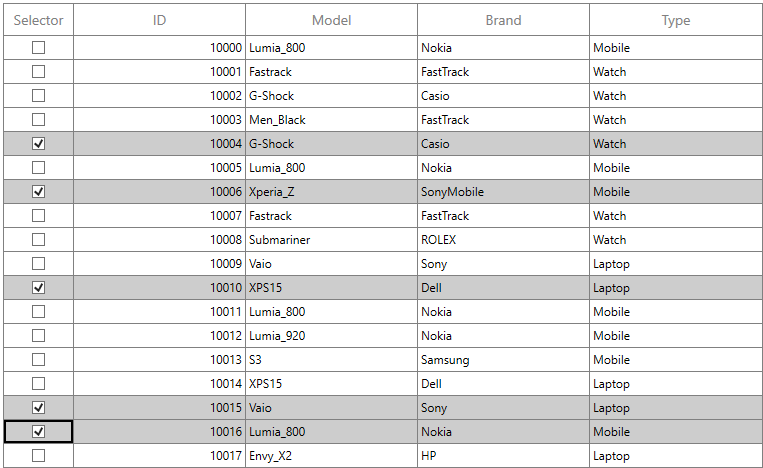

### Styling selector column

The style of checkbox in record cells can be customized using the `CellStyle` property.



<syncfusion:SfDataGrid x:Name="dataGrid"                                                                       
                       AutoGenerateColumns="False" 
                       ItemsSource="{Binding Orders}">
      <syncfusion:SfDataGrid.Columns>
            <syncfusion:GridCheckBoxSelectorColumn MappingName="SelectorColumn" 
                                                   Width="30">
                    <syncfusion:GridCheckBoxSelectorColumn.CellStyle>
                        
                            </Style.Resources>
                        </Style>
                    </syncfusion:GridCheckBoxSelectorColumn.CellStyle> 
                </syncfusion:GridCheckBoxSelectorColumn>
      </syncfusion:SfDataGrid.Columns>
</syncfusion:SfDataGrid>



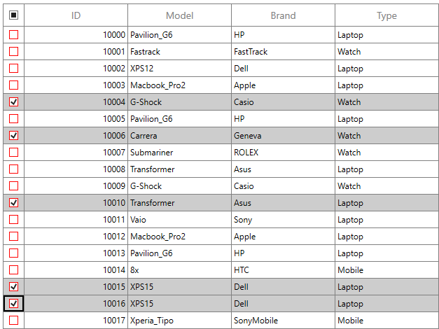

As above, style of the header check box can be customized using the `HeaderCellStyle` property.



<syncfusion:SfDataGrid x:Name="dataGrid"                                                                       
                       AutoGenerateColumns="False" 
                       ItemsSource="{Binding Orders}">
      <syncfusion:SfDataGrid.Columns>
            <syncfusion:GridCheckBoxSelectorColumn MappingName="SelectorColumn" 
                                                   Width="30"> 
                    <syncfusion:GridCheckBoxSelectorColumn.HeaderStyle>
                        
                            </Style.Resources>
                        </Style>
                    </syncfusion:GridCheckBoxSelectorColumn.HeaderStyle>
                </syncfusion:GridCheckBoxSelectorColumn>
      </syncfusion:SfDataGrid.Columns>
</syncfusion:SfDataGrid>



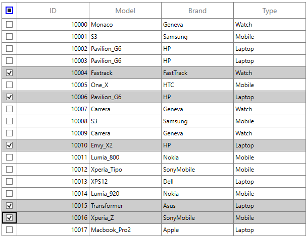

### Canceling the check box state change
The checkbox state change in the `GridCheckBoxSelectorColumn` can be canceled by setting `CellCheckBoxClickEventArgs.Cancel` to true in the `SfDataGrid.CellCheckBoxClick` event. Additionally, the checkbox value can be modified by setting `CellCheckBoxClickEventArgs.NewValue` within the same event.

Based on this, the selection state is not changed when `e.Cancel` is set to true, and the selection is applied according to the value specified in `e.NewValue`.



this.sfDataGrid1.CellCheckBoxClick += OnCellCheckBoxClick;

void OnCellCheckBoxClick(object sender, CellCheckBoxClickEventArgs e)
{
    if (e.RowIndex == 1)
        e.Cancel = true;
    else if (e.RowIndex == 2)
        e.NewValue = CheckState.Checked;
}



AddHandler sfDataGrid1.CellCheckBoxClick, AddressOf OnCellCheckBoxClick
	
Private Sub OnCellCheckBoxClick(ByVal sender As Object, ByVal e As CellCheckBoxClickEventArgs)
	If e.RowIndex = 1 Then
		e.Cancel = True
    ElseIf e.RowIndex = 2 Then
        e.NewValue = CheckState.Checked
    End If
End Sub



### Limitations

The following are the limitations of `GridCheckBoxSelectorColumn`:

* Selector column does not support cell selection.
* Selector column does not support data operations such as sorting, filtering, and grouping.
* Selector column will be excluded in operations such as printing and exporting.
* Selector column does not have filter row support.

## Custom column support

SfDataGrid allows you to create your own column by overriding predefined column type or creating a new custom column.

### Creating column from existing column

You can create your own column by overriding the [predefined](#_Overriding_existing_cell) column types in SfDataGrid.

For example, the `GridDateTimeColumn` loads the `DateTime` value by default. If you want to display [DateTimeOffset](https://learn.microsoft.com/en-us/dotnet/api/system.datetimeoffset?view=net-5.0) value, you can create a new column by overriding the `GridDateTimeColumn` class.

In the below code snippet, converter created to format the DateTimeOffSet value to DateTime by defining `ValueBinding` (edit) and `DisplayBinding` (non-edit).



public class DateTimeOffsetFormatConverter : IValueConverter
{
    private GridDateTimeOffsetColumn cachedColumn;

    public DateTimeOffsetFormatConverter(GridDateTimeOffsetColumn column)
    {
        cachedColumn = column;
    }

    public object Convert(object value, Type targetType, object parameter, System.Globalization.CultureInfo culture)
    {
        value = ((DateTimeOffset)value).DateTime;
        var column = cachedColumn as GridDateTimeColumn;

        if (value == null || DBNull.Value == value)
        {

            if (column.AllowNullValue && column.MaxDateTime != System.DateTime.MaxValue && column.NullText == string.Empty)
                return column.MaxDateTime;

            if (column.AllowNullValue && column.NullValue != null)
                return column.NullValue;

            else if (column.AllowNullValue && column.NullText != string.Empty)
                return column.NullText;

            if (column.MaxDateTime != System.DateTime.MaxValue)
                return column.MaxDateTime;
        }

        DateTime _columnValue;
        _columnValue = (DateTime)value;

        if (_columnValue < column.MinDateTime)
            _columnValue = column.MinDateTime;

        if (_columnValue > column.MaxDateTime)
            _columnValue = column.MaxDateTime;

        return DateTimeFormatString(_columnValue, column);
    }

    private string DateTimeFormatString(DateTime columnValue, GridDateTimeColumn column)
    {

        switch (column.Pattern)
        {

            case DateTimePattern.ShortDate:
                return columnValue.ToString("d", column.DateTimeFormat);

            case DateTimePattern.LongDate:
                return columnValue.ToString("D", column.DateTimeFormat);

            case DateTimePattern.LongTime:
                return columnValue.ToString("T", column.DateTimeFormat);

            case DateTimePattern.ShortTime:
                return columnValue.ToString("t", column.DateTimeFormat);

            case DateTimePattern.FullDateTime:
                return columnValue.ToString("F", column.DateTimeFormat);

            case DateTimePattern.RFC1123:
                return columnValue.ToString("R", column.DateTimeFormat);

            case DateTimePattern.SortableDateTime:
                return columnValue.ToString("s", column.DateTimeFormat);

            case DateTimePattern.UniversalSortableDateTime:
                return columnValue.ToString("u", column.DateTimeFormat);

            case DateTimePattern.YearMonth:
                return columnValue.ToString("Y", column.DateTimeFormat);

            case DateTimePattern.MonthDay:
                return columnValue.ToString("M", column.DateTimeFormat);

            case DateTimePattern.CustomPattern:
                return columnValue.ToString(column.CustomPattern, column.DateTimeFormat);

            default:
                return columnValue.ToString("MMMM", column.DateTimeFormat);
        }
    }

    public object ConvertBack(object value, Type targetType, object parameter, System.Globalization.CultureInfo culture)
    {
        throw new NotImplementedException();
    }
}

public class DateTimeOffsetToDateTimeConverter : IValueConverter
{

    public object Convert(object value, Type targetType, object parameter, System.Globalization.CultureInfo culture)
    {

        if (value == null)
            return null;
        return ((DateTimeOffset)value).DateTime;
    }

    public object ConvertBack(object value, Type targetType, object parameter, System.Globalization.CultureInfo culture)
    {

        if (value == null)
            return null;
        return value is DateTimeOffset ? value : new DateTimeOffset((DateTime)value);
    }
}



In the below code snippet, `GridDateTimeOffsetColumn` column created from `GridDateTimeColumn`.



public class GridDateTimeOffsetColumn : GridDateTimeColumn
{

    protected override void SetDisplayBindingConverter()
    {

        if ((DisplayBinding as Binding).Converter == null)
            (DisplayBinding as Binding).Converter = new DateTimeOffsetFormatConverter(this);

        if ((ValueBinding as Binding).Converter == null)
            (ValueBinding as Binding).Converter = new DateTimeOffsetToDateTimeConverter();
    }
}




In the below code snippet, created `GridDateTimeOffsetColumn` added to [SfDataGrid.Columns](https://help.syncfusion.com/cr/wpf/Syncfusion.UI.Xaml.Grid.SfDataGrid.html#Syncfusion_UI_Xaml_Grid_SfDataGrid_Columns) collection and specify the Pattern as FullDateTime. Since the `ShortDate` is the default pattern of `GridDateTimeColumn`.



<syncfusion:SfDataGrid x:Name="dataGrid"                                                                       
                       AutoGenerateColumns="False" 
                       ItemsSource="{Binding Orders}">
    <syncfusion:SfDataGrid.Columns>
        <local:GridDateTimeOffsetColumn MappingName="OrderDate" Pattern="FullDateTime" UseBindingValue="True"/>
    </syncfusion:SfDataGrid.Columns>
</syncfusion:SfDataGrid>


this.datagrid1.Columns.Add(new GridDateTimeOffsetColumn()
{
    MappingName = "OrderDate",
    Pattern = Syncfusion.Windows.Shared.DateTimePattern.FullDateTime,
    UseBindingValue = true
});



You can get the sample from [here](https://github.com/SyncfusionExamples/how-to-create-a-custom-column-from-existing-column-in-wpf-and-uwp-datagrid/tree/master/WPF).

### Customize column renderer

SfDataGrid allows you to customize the column related operations like key navigation and UI related interactions by overriding the corresponding renderer associated with the column. Each column has its own renderer with set of virtual methods for handling the column level operations. 

Below table lists the available cell types for columns and its renderers.

<table>
<tr>
<th>
Column Name
</th>
<th>
Renderer 
</th>
<th>
Cell Type
</th>
</tr>
<tr>
<td>
GridTextColumn
</td>
<td>
{{'[GridCellTextBoxRenderer](https://help.syncfusion.com/cr/wpf/Syncfusion.UI.Xaml.Grid.Cells.GridCellTextBoxRenderer.html)'| markdownify }}
</td>
<td>
TextBox
</td>
</tr>
<tr>
<td>
GridNumericColumn
</td>
<td>
{{'[GridCellNumericRenderer](https://help.syncfusion.com/cr/wpf/Syncfusion.UI.Xaml.Grid.Cells.GridCellNumericRenderer.html)'| markdownify }}
</td>
<td>
Numeric
</td>
</tr>
<tr>
<td>
GridCheckBoxColumn
</td>
<td>
{{'[GridCellCheckBoxRenderer](https://help.syncfusion.com/cr/wpf/Syncfusion.UI.Xaml.Grid.Cells.GridCellCheckBoxRenderer.html)'| markdownify }}
</td>
<td>
CheckBox
</td>
</tr>
<tr>
<td>
GridTemplateColumn
</td>
<td>
{{'[GridCellTemplateRenderer](https://help.syncfusion.com/cr/wpf/Syncfusion.UI.Xaml.Grid.Cells.GridCellTemplateRenderer.html)'| markdownify }}
</td>
<td>
Template
</td>
</tr>
<tr>
<td>
GridImageColumn
</td>
<td>
{{'[GridCellImageRenderer](https://help.syncfusion.com/cr/wpf/Syncfusion.UI.Xaml.Grid.Cells.GridCellImageRenderer.html)'| markdownify }}
</td>
<td>
Image
</td>
</tr>
<tr>
<td>
GridUnBoundColumn
</td>
<td>
{{'[GridUnBoundCellTextBoxRenderer](https://help.syncfusion.com/cr/wpf/Syncfusion.UI.Xaml.Grid.Cells.GridUnBoundCellTextBoxRenderer.html)'| markdownify }}
{{'[GridUnBoundCellTemplateRenderer](https://help.syncfusion.com/cr/wpf/Syncfusion.UI.Xaml.Grid.Cells.GridUnBoundCellTemplateRenderer.html)'| markdownify }}
</td>
<td>
UnBoundTextColumn
UnBoundTemplateColumn
</td>
</tr>
<tr>
<td>
GridComboBoxColumn
</td>
<td>
{{'[GridCellComboBoxRenderer](https://help.syncfusion.com/cr/wpf/Syncfusion.UI.Xaml.Grid.Cells.GridCellComboBoxRenderer.html)'| markdownify }}
</td>
<td>
ComboBox
</td>
</tr>
<tr>
<td>
GridDateTimeColumn
</td>
<td>
{{'[GridCellDateTimeRenderer](https://help.syncfusion.com/cr/wpf/Syncfusion.UI.Xaml.Grid.Cells.GridCellDateTimeRenderer.html)'| markdownify }}
</td>
<td>
DateTime
</td>
</tr>
<tr>
<td>
GridHyperlinkColumn
</td>
<td>
{{'[GridCellHyperLinkRenderer](https://help.syncfusion.com/cr/wpf/Syncfusion.UI.Xaml.Grid.Cells.GridCellHyperlinkRenderer.html)'| markdownify }}
</td>
<td>
HyperLink
</td>
</tr>
<tr>
<td>
GridMaskColumn
</td>
<td>
{{'[GridCellMaskRenderer](https://help.syncfusion.com/cr/wpf/Syncfusion.UI.Xaml.Grid.Cells.GridCellMaskRenderer.html)'| markdownify }}
</td>
<td>
Mask
</td>
</tr>
<tr>
<td>
GridPercentColumn
</td>
<td>
{{'[GridCellPercentageRenderer](https://help.syncfusion.com/cr/wpf/Syncfusion.UI.Xaml.Grid.Cells.GridCellPercentageRenderer.html)'| markdownify }}
</td>
<td>
Percent
</td>
</tr>
<tr>
<td>
GridCurrencyColumn
</td>
<td>
{{'[GridCellCurrencyRenderer](https://help.syncfusion.com/cr/wpf/Syncfusion.UI.Xaml.Grid.Cells.GridCellCurrencyRenderer.html)'| markdownify }}
</td>
<td>
Currency
</td>
</tr>
<tr>
<td>
GridMultiColumnDropDownList
</td>
<td>
{{'[GridCellMultiColumnDropDownRenderer](https://help.syncfusion.com/cr/wpf/Syncfusion.UI.Xaml.Grid.Cells.GridCellMultiColumnDropDownRenderer.html)'| markdownify }}
</td>
<td>
MultiColumnDropDown
</td>
</tr>
<tr>
<td>
GridTimeSpanColumn
</td>
<td>
{{'[GridCellTimeSpanRenderer](https://help.syncfusion.com/cr/wpf/Syncfusion.UI.Xaml.Grid.Cells.GridCellTimeSpanRenderer.html)'| markdownify }}
</td>
<td>
TimeSpan
</td>
</tr>
<tr>
<td>
GridCheckBoxSelectorColumn
</td>
<td>
{{'[GridCellCheckBoxSelectorRenderer](https://help.syncfusion.com/cr/wpf/Syncfusion.UI.Xaml.Grid.Cells.GridCellCheckBoxSelectorRenderer.html)'| markdownify }}
</td>
<td>
Selector
</td>
</tr>
</table>

Below code, creates the `GridCellTextBoxRendererExt` to change the fore ground of CustomerID column and replacing created renderer to `CellRenderers`.



this.dataGrid.CellRenderers.Remove("TextBox");
this.dataGrid.CellRenderers.Add("TextBox", new GridCellTextBoxRendererExt());

public class GridCellTextBoxRendererExt:GridCellTextBoxRenderer
{

    public override void OnInitializeDisplayElement(DataColumnBase dataColumn, TextBlock uiElement, object dataContext)
    {
        base.OnInitializeDisplayElement(dataColumn, uiElement, dataContext);

        if(dataColumn.GridColumn.MappingName.Equals("CustomerID"))
            uiElement.Foreground = new SolidColorBrush(Colors.Blue);
    }

    public override void OnUpdateDisplayBinding(DataColumnBase dataColumn, TextBlock uiElement, object dataContext)
    {
        base.OnUpdateDisplayBinding(dataColumn, uiElement, dataContext);

        if (dataColumn.GridColumn.MappingName.Equals("CustomerID"))
            uiElement.Foreground = new SolidColorBrush(Colors.Blue);
    }
}



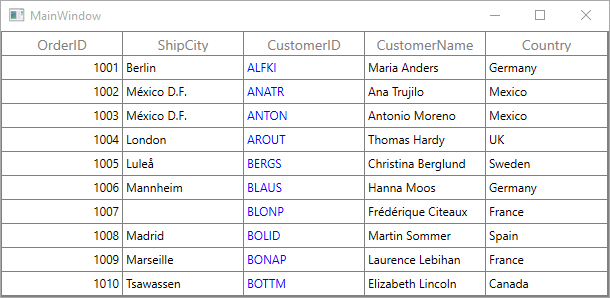

### Create the renderer of existing column

You can change the renderer of existing column by removing the predefined cell type value from [CellRenderers](https://help.syncfusion.com/cr/wpf/Syncfusion.UI.Xaml.Grid.SfDataGrid.html#Syncfusion_UI_Xaml_Grid_SfDataGrid_CellRenderers) collection and add the newly derived renderer from [GridVirtualizingCellRenderer](https://help.syncfusion.com/cr/wpf/Syncfusion.UI.Xaml.Grid.Cells.GridVirtualizingCellRenderer-2.html#Syncfusion_UI_Xaml_Grid_Cells_GridVirtualizingCellRenderer_2__ctor).

For Non-Editable columns, [SupportsRenderOptimization](https://help.syncfusion.com/cr/wpf/Syncfusion.UI.Xaml.Grid.Cells.GridCellRendererBase.html#Syncfusion_UI_Xaml_Grid_Cells_GridCellRendererBase_SupportsRenderOptimization) property should be set as `false` to set focus for the control loaded as `DisplayElement` in the column when interact through mouse.

Below code creates the new `GridComboBoxRenderer` with `ComboBoxAdv` as edit element for `GridComboBoxColumn` and replacing created renderer to `CellRenderers`.



dataGrid.CellRenderers.Remove("ComboBox");
dataGrid.CellRenderers.Add("ComboBox", new GridComboBoxRenderer());

public class GridComboBoxRenderer : GridVirtualizingCellRenderer<TextBlock, ComboBoxAdv>
{

    public GridComboBoxRenderer()
    {
    }
    /// 

    /// Create new display element.
    /// 

    /// <returns></returns>

    protected override TextBlock OnCreateDisplayUIElement()
    {
        return new TextBlock();
    }
    /// 

    /// Create new edit element.
    /// 

    /// <returns></returns>

    protected override ComboBoxAdv OnCreateEditUIElement()
    {
        return new ComboBoxAdv();
    }
    /// 

    /// Initialize binding for display element.
    /// 

    /// <param name="dataColumn"></param>
    /// <param name="uiElement"></param>
    /// <param name="dataContext"></param>

    public override void OnInitializeDisplayElement(Syncfusion.UI.Xaml.Grid.DataColumnBase dataColumn, TextBlock uiElement, object dataContext)
    {
        base.OnInitializeDisplayElement(dataColumn, uiElement, dataContext);
        SetDisplayBinding(uiElement, dataColumn.GridColumn, dataContext);
    }

    /// 

    /// custom binding for display element.
    /// 

    /// <param name="element"></param>
    /// <param name="column"></param>
    /// <param name="dataContext"></param>

    private static void SetDisplayBinding(TextBlock element, GridColumn column, object dataContext)
    {
        var comboBoxColumn = (GridComboBoxColumn)column;
        var binding = new Binding
        {
            Path = new PropertyPath(comboBoxColumn.MappingName),
            Mode = BindingMode.TwoWay,
            UpdateSourceTrigger = UpdateSourceTrigger.PropertyChanged,
            Converter = new DisplayConverter(comboBoxColumn),
        };
        element.SetBinding(TextBlock.TextProperty, binding);
    }
    /// 

    /// Update binding for display element.
    /// 

    /// <param name="dataColumn"></param>
    /// <param name="uiElement"></param>
    /// <param name="dataContext"></param>

    public override void OnUpdateDisplayBinding(DataColumnBase dataColumn, TextBlock uiElement, object dataContext)
    {
        base.OnUpdateDisplayBinding(dataColumn, uiElement, dataContext);
        SetDisplayBinding(uiElement, dataColumn.GridColumn, dataContext);
    }
    /// 

    /// Initialize binding for edit element.
    /// 

    /// <param name="dataColumn"></param>
    /// <param name="uiElement"></param>
    /// <param name="dataContext"></param>

    public override void OnInitializeEditElement(DataColumnBase dataColumn, ComboBoxAdv uiElement, object dataContext)
    {
        base.OnInitializeEditElement(dataColumn, uiElement, dataContext);
        SetEditBinding(uiElement, dataColumn.GridColumn, dataContext);
    }

    /// 

    /// Update binding for edit element.
    /// 

    /// <param name="dataColumn"></param>
    /// <param name="uiElement"></param>
    /// <param name="dataContext"></param>

    public override void OnUpdateEditBinding(DataColumnBase dataColumn, ComboBoxAdv element, object dataContext)
    {
        base.OnUpdateEditBinding(dataColumn, element, dataContext);
        SetEditBinding(element, dataColumn.GridColumn, dataContext);
    }

    /// 

    /// custom binding for display element.
    /// 

    /// <param name="element"></param>
    /// <param name="column"></param>
    /// <param name="dataContext"></param>

    private static void SetEditBinding(ComboBoxAdv element, GridColumn column, object dataContext)
    {
        var comboboxColumn = (GridComboBoxColumn)column;
        var binding = new Binding
        {
            Source = dataContext,
            Path = new PropertyPath(comboboxColumn.MappingName),
            Mode = BindingMode.TwoWay,
            UpdateSourceTrigger = UpdateSourceTrigger.PropertyChanged,
        };
        element.SetBinding(ComboBoxAdv.SelectedItemsProperty, binding);

        var itemsSourceBinding = new Binding { Path = new PropertyPath("ItemsSource"), Mode = BindingMode.TwoWay, Source = comboboxColumn };
        element.SetBinding(ComboBoxAdv.ItemsSourceProperty, itemsSourceBinding);

        var displayMemberBinding = new Binding { Path = new PropertyPath("DisplayMemberPath"), Mode = BindingMode.TwoWay, Source = comboboxColumn };
        element.SetBinding(ComboBoxAdv.DisplayMemberPathProperty, displayMemberBinding);

        var selectedValuePathBinding = new Binding { Path = new PropertyPath("SelectedValuePath"), Mode = BindingMode.TwoWay, Source = comboboxColumn };
        element.SetBinding(ComboBoxAdv.SelectedValuePathProperty, selectedValuePathBinding);

        element.AllowMultiSelect = true;
    }

    /// 

    /// Let Renderer decide whether the parent grid should be allowed to handle keys and prevent
    /// the key event from being handled by the visual UIElement for this renderer. 
    /// 

    /// <param name="e">A <see cref="KeyEventArgs" /> object.</param>
    /// <returns>
    /// True if the parent grid should be allowed to handle keys; false otherwise.
    /// </returns>

    protected override bool ShouldGridTryToHandleKeyDown(System.Windows.Input.KeyEventArgs e)
    {
        if (!HasCurrentCellState || !IsInEditing)
            return true;

        switch (e.Key)
        {
            case Key.End:
            case Key.Home:
            case Key.Enter:
            case Key.Escape:
                return !((ComboBoxAdv)CurrentCellRendererElement).IsDropDownOpen;

            case Key.Down:
            case Key.Up:
            case Key.Left:
            case Key.Right:
                return !((ComboBoxAdv)CurrentCellRendererElement).IsDropDownOpen;
        }
        return base.ShouldGridTryToHandleKeyDown(e);
    }
    /// 

    /// Gets the control value.
    /// 

    public override object GetControlValue()
    {

        if (!HasCurrentCellState)
            return base.GetControlValue();

        return CurrentCellRendererElement.GetValue(IsInEditing ? ComboBoxAdv.SelectedValueProperty : TextBlock.TextProperty);
    }

    /// 

    /// Sets the control value.
    /// 

    /// <param name="value">The value.</param>

    public override void SetControlValue(object value)
    {

        if (!HasCurrentCellState)
            return;

        if (IsInEditing)
            ((ComboBoxAdv)CurrentCellRendererElement).SelectedValue = value;

        else
            throw new Exception("Value cannot be Set for Unloaded Editor");
    }
}



Below code, returns the display value from multiple selected items.


 
public class DisplayConverter : IValueConverter
{
    GridColumn cachedColumn;

    public DisplayConverter()
    {

    }

    public DisplayConverter(GridColumn column)
    {
        cachedColumn = column;
    }

    public object Convert(object value, Type targetType, object parameter, System.Globalization.CultureInfo culture)
    {        
        var selectedItems = value as IEnumerable;
        var displayMemberPath = string.Empty;

        var column = cachedColumn as GridComboBoxColumn;               
        displayMemberPath = column.DisplayMemberPath;                    

        if (selectedItems == null)
            return null;
        
        string selectedItem = string.Empty;
         PropertyDescriptorCollection pdc = null;
         var enumerator = selectedItems.GetEnumerator();

        while (enumerator.MoveNext())
        {
            var type = enumerator.Current.GetType();

            pdc = pdc ?? TypeDescriptor.GetProperties(type);

                if (!string.IsNullOrEmpty(displayMemberPath))
                    selectedItem +=  pdc.GetValue(enumerator.Current, displayMemberPath) + " - ";                    
            }
        return selectedItem.Substring(0,selectedItem.Length - 2);
    }

    public object ConvertBack(object value, Type targetType, object parameter, System.Globalization.CultureInfo culture)
    {
        return value;
    }
}



### Creating new column and renderer

You can create a new column by deriving [GridColumn](https://help.syncfusion.com/cr/wpf/Syncfusion.UI.Xaml.Grid.GridColumn.html), rendered in UI using customized [CellType](https://help.syncfusion.com/cr/wpf/Syncfusion.UI.Xaml.Grid.GridColumn.html#Syncfusion_UI_Xaml_Grid_GridColumn_CellType) using [GridVirtualizingCellRenderer](https://help.syncfusion.com/cr/wpf/Syncfusion.UI.Xaml.Grid.Cells.GridVirtualizingCellRenderer-2.html).

Below steps to create custom column in SfDataGrid.

* [Creating custom column.](#creating-custom-column)
* [Creating renderer.](#creating-renderer)
* [Adding the custom renderer to SfDataGrid.CellRenderers collection.](#adding-the-custom-renderer-to-sfdatagridcellrenderers-collection)
* [Defining custom column.](#loading-custom-column)

#### Creating custom column

You can create custom column by overriding a new class from `GridColumn` class.

Below code creates the converter to format the date time value.



public class CustomConverter : IValueConverter
{

    public object Convert(object value, Type targetType, object parameter, System.Globalization.CultureInfo culture)
    {

        if (string.IsNullOrEmpty(value.ToString()))
            return null;
        return new ConvertToDateTimeClass().ConvertToDateTime(value);
    }

    public object ConvertBack(object value, Type targetType, object parameter, System.Globalization.CultureInfo culture)
    {
        return new ConvertToDateTimeClass().ConvertToDateTime(value);
    }
}    

public class ConvertToDateTimeClass
{

    public string ConvertToDateTime(object value)
    {
        DateTime date = Convert.ToDateTime(value);
        return date.Year + "/" + date.Month + "/" +date.Day;
    }
}



In the below code, new column created with converter using `SetDisplayBindingConverter` method.



public class DatePickerColumn : GridColumn
{

    public DatePickerColumn()
    {
        SetCellType("DatePickerRenderer");
    }

    protected override void SetDisplayBindingConverter()
    {
        (this.DisplayBinding as Binding).Converter = new CustomConverter();
    }

    protected override Freezable CreateInstanceCore()
    {
        return new DatePickerColumn();
    }
}



#### Creating renderer

After creating custom column, you need to create renderer for the custom column. Below are the steps to create custom renderer. You can create custom renderer either by deriving `GridVirtualizingCellRenderer` class or overriding [existing renderers](#_Customize_column_renderer). 

In the below code snippet, display and edit `UIElement` defined via `GridVirtualizingCellRenderer` parameter.



/// 

/// CustomRenderer Creation
/// 

/// <param name="TextBlock">Display Control</param>
/// <param name="DatePicker">Edit Control</param>

public class DatePickerRenderer : GridVirtualizingCellRenderer<TextBlock, DatePicker>
{

    public DatePickerRenderer()
    {

    }
}



With the below code snippet, you can create the display and edit element for renderer by overriding [OnCreateDisplayUIElement](https://help.syncfusion.com/cr/wpf/Syncfusion.UI.Xaml.Grid.Cells.GridVirtualizingCellRendererBase-2.html#Syncfusion_UI_Xaml_Grid_Cells_GridVirtualizingCellRendererBase_2_OnCreateDisplayUIElement) and [OnCreateEditUIElement](https://help.syncfusion.com/cr/wpf/Syncfusion.UI.Xaml.Grid.Cells.GridVirtualizingCellRendererBase-2.html#Syncfusion_UI_Xaml_Grid_Cells_GridVirtualizingCellRendererBase_2_OnCreateEditUIElement) methods.



/// 

/// Create new display element.
/// 

/// <returns></returns>

protected override TextBlock OnCreateDisplayUIElement()
{
    return new TextBlock();
}
/// 

/// Create new edit element.
/// 

/// <returns></returns>

protected override DatePicker OnCreateEditUIElement()
{
    return new DatePicker();
}



With the below code snippet, you can initialize the binding for display element by overriding the [OnInitializeDisplayElement](https://help.syncfusion.com/cr/wpf/Syncfusion.UI.Xaml.Grid.Cells.GridVirtualizingCellRenderer-2.html#Syncfusion_UI_Xaml_Grid_Cells_GridVirtualizingCellRenderer_2_OnInitializeDisplayElement_Syncfusion_UI_Xaml_Grid_DataColumnBase__0_System_Object_) method.



/// 

/// Initialize binding for display element.
/// 

/// <param name="dataColumn"></param>
/// <param name="uiElement"></param>
/// <param name="dataContext"></param>

public override void OnInitializeDisplayElement(Syncfusion.UI.Xaml.Grid.DataColumnBase dataColumn, TextBlock uiElement, object dataContext)
{
    base.OnInitializeDisplayElement(dataColumn, uiElement, dataContext);
    SetDisplayBinding(uiElement, dataColumn.GridColumn, dataContext);
}

/// 

/// custom binding for display element.
/// 

/// <param name="element"></param>
/// <param name="column"></param>
/// <param name="dataContext"></param>

private static void SetDisplayBinding(TextBlock element, GridColumn column, object dataContext)
{
    var customColumn = (DatePickerColumn)column;
    var binding = new Binding
    {
        Path = new PropertyPath(customColumn.MappingName),
        Mode = BindingMode.TwoWay,
        UpdateSourceTrigger = UpdateSourceTrigger.PropertyChanged,
        Converter = (column.DisplayBinding as Binding).Converter, 
    };
    element.SetBinding(TextBlock.TextProperty, binding);
}



With the below code snippet, updates the binding while UI interaction by overriding [OnUpdateDisplayBinding](https://help.syncfusion.com/cr/wpf/Syncfusion.UI.Xaml.Grid.Cells.GridVirtualizingCellRenderer-2.html#Syncfusion_UI_Xaml_Grid_Cells_GridVirtualizingCellRenderer_2_OnUpdateDisplayBinding_Syncfusion_UI_Xaml_Grid_DataColumnBase__0_System_Object_) method.



/// 

/// Update binding for display element.
/// 

/// <param name="dataColumn"></param>
/// <param name="uiElement"></param>
/// <param name="dataContext"></param>

public override void OnUpdateDisplayBinding(DataColumnBase dataColumn, TextBlock uiElement, object dataContext)
{
    base.OnUpdateDisplayBinding(dataColumn, uiElement, dataContext);
    SetDisplayBinding(uiElement, dataColumn.GridColumn, dataContext);
}



Similarly, you can initialize and update the binding for edit element by overriding [OnInitializeEditElement](https://help.syncfusion.com/cr/wpf/Syncfusion.UI.Xaml.Grid.Cells.GridVirtualizingCellRenderer-2.html#Syncfusion_UI_Xaml_Grid_Cells_GridVirtualizingCellRenderer_2_OnInitializeEditElement_Syncfusion_UI_Xaml_Grid_DataColumnBase__1_System_Object_) and [OnUpdateEditBinding](https://help.syncfusion.com/cr/wpf/Syncfusion.UI.Xaml.Grid.Cells.GridVirtualizingCellRenderer-2.html#Syncfusion_UI_Xaml_Grid_Cells_GridVirtualizingCellRenderer_2_OnUpdateEditBinding_Syncfusion_UI_Xaml_Grid_DataColumnBase__1_System_Object_) methods.



/// 

/// Initialize binding for edit element.
/// 

/// <param name="dataColumn"></param>
/// <param name="uiElement"></param>
/// <param name="dataContext"></param>

public override void OnInitializeEditElement(DataColumnBase dataColumn, DatePicker uiElement, object dataContext)
{
    base.OnInitializeEditElement(dataColumn, uiElement, dataContext);
    SetEditBinding(uiElement, dataColumn.GridColumn, dataContext);
}

/// 

/// Update binding for edit element.
/// 

/// <param name="dataColumn"></param>
/// <param name="uiElement"></param>
/// <param name="dataContext"></param>

public override void OnUpdateEditBinding(DataColumnBase dataColumn, DatePicker element, object dataContext)
{
    base.OnUpdateEditBinding(dataColumn, element, dataContext);
    SetEditBinding(element, dataColumn.GridColumn, dataContext);
}

/// 

/// custom binding for display element.
/// 

/// <param name="element"></param>
/// <param name="column"></param>
/// <param name="dataContext"></param>

private static void SetEditBinding(DatePicker element, GridColumn column, object dataContext)
{
    var customColumn = (DatePickerColumn)column;
    var binding = new Binding
    {
        Source = dataContext,
        Path = new PropertyPath(customColumn.MappingName),
        Mode = BindingMode.TwoWay,
        UpdateSourceTrigger = UpdateSourceTrigger.PropertyChanged,
    };

    element.SetBinding(DatePicker.TextProperty, binding);
}



You can customize the editor control while loading by overriding [OnEditElementLoaded](https://help.syncfusion.com/cr/wpf/Syncfusion.UI.Xaml.Grid.Cells.GridVirtualizingCellRendererBase-2.html#Syncfusion_UI_Xaml_Grid_Cells_GridVirtualizingCellRendererBase_2_OnEditElementLoaded_System_Object_System_Windows_RoutedEventArgs_) method.



/// 

/// Handling operations on edit mode UIElement.
/// 

/// <param name="sender"></param>
/// <param name="e"></param>

protected override void OnEditElementLoaded(object sender, RoutedEventArgs e)
{
    var datePicker = (sender as DatePicker);
    datePicker.Focus();

    DatePickerTextBox datePickerTextBox =
        (DatePickerTextBox)GridUtil.FindDescendantChildByType(datePicker, typeof(DatePickerTextBox));

    if ((this.DataGrid.EditorSelectionBehavior == EditorSelectionBehavior.SelectAll ||
            this.DataGrid.IsAddNewIndex(this.CurrentCellIndex.RowIndex)) && PreviewInputText == null)
    {
        datePickerTextBox.SelectAll();
    }

    else
    {
        datePickerTextBox.Select(datePickerTextBox.SelectedText.Length, 0);
    }
    PreviewInputText = null;
}



With the below code snippet, you can customize the keyboard interactions for the custom column by overriding [ShouldGridTryToHandleKeyDown](https://help.syncfusion.com/cr/wpf/Syncfusion.UI.Xaml.Grid.Cells.GridVirtualizingCellRenderer-2.html#Syncfusion_UI_Xaml_Grid_Cells_GridVirtualizingCellRenderer_2_ShouldGridTryToHandleKeyDown_System_Windows_Input_KeyEventArgs_) method.



/// 

/// Let Renderer decide whether the parent grid should be allowed to handle keys and prevent
/// the key event from being handled by the visual UIElement for this renderer. 
/// 

/// <param name="e">A <see cref="KeyEventArgs" /> object.</param>
/// <returns>
/// True if the parent grid should be allowed to handle keys; false otherwise.
/// </returns>

protected override bool ShouldGridTryToHandleKeyDown(System.Windows.Input.KeyEventArgs e)
{
    if (!HasCurrentCellState || !IsInEditing)
        return true;

    DatePickerTextBox datePickerTextBox =
        (DatePickerTextBox)
            GridUtil.FindDescendantChildByType(CurrentCellRendererElement as DatePicker,
                typeof(DatePickerTextBox));

    switch (e.Key)
    {
        case Key.End:
        case Key.Home:
        case Key.Enter:
        case Key.Escape:
            return !((DatePicker)CurrentCellRendererElement).IsDropDownOpen;

        case Key.Down:
        case Key.Up:
        case Key.Left:
        case Key.Right:
            return !((DatePicker)CurrentCellRendererElement).IsDropDownOpen;
    }
    return base.ShouldGridTryToHandleKeyDown(e);
}



You can handle the cell value for the custom renderer by overriding [GetControlValue](https://help.syncfusion.com/cr/wpf/Syncfusion.UI.Xaml.Grid.Cells.GridCellRendererBase.html#Syncfusion_UI_Xaml_Grid_Cells_GridCellRendererBase_GetControlValue) and [SetControlValue](https://help.syncfusion.com/cr/wpf/Syncfusion.UI.Xaml.Grid.Cells.GridCellRendererBase.html#Syncfusion_UI_Xaml_Grid_Cells_GridCellRendererBase_SetControlValue_System_Object_) methods.



/// 

/// Gets the control value.
/// 

public override object GetControlValue()
{

    if (!HasCurrentCellState)
        return base.GetControlValue();

    return CurrentCellRendererElement.GetValue(IsInEditing ? DatePicker.TextProperty : TextBlock.TextProperty);
}

/// 

/// Sets the control value.
/// 

/// <param name="value">The value.</param>

public override void SetControlValue(object value)
{

    if (!HasCurrentCellState)
        return;

    if (IsInEditing)
        ((TextBox)CurrentCellRendererElement).Text = value.ToString();

    else
        throw new Exception("Value cannot be Set for Unloaded Editor");
}



#### Adding the custom renderer to SfDataGrid.CellRenderers collection

By below code, you can add the previous created custom renderer to [SfDataGrid.CellRenderers](https://help.syncfusion.com/cr/wpf/Syncfusion.UI.Xaml.Grid.SfDataGrid.html#Syncfusion_UI_Xaml_Grid_SfDataGrid_CellRenderers) collection.



dataGrid.CellRenderers.Add("DatePickerRenderer", new DatePickerRenderer());



#### Loading custom column

By below code, you can define the custom column in SfDataGrid.



<syncfusion:SfDataGrid x:Name="dataGrid"                                                                       
                       AutoGenerateColumns="False" 
                       ItemsSource="{Binding Orders}">
    <syncfusion:SfDataGrid.Columns>
        <local:DatePickerColumn MappingName="OrderDate"/>
    </syncfusion:SfDataGrid.Columns>
</syncfusion:SfDataGrid>


this.dataGrid.Columns.Add(new DatePickerColumn() {AllowEditing=true, MappingName = "DateOfMonth"} );



## How To

### Restrict the input content length

You can restrict the range of input using `MaxLength` property on `GridColumn` in below ways.

* Using Converter property in DisplayBinding and ValueBinding 
* Using control style 
* Overriding existing cell types

#### Using Converter

You can restrict the length of user input in both display and edit element using `Converter` using `DisplayBinding` and `ValueBinding`.



<Window.Resources>
    <local:MaxLengthConverter x:Key="converter" />
</Window.Resources>

<syncfusion:SfDataGrid x:Name="dataGrid"                                                                       
                       AutoGenerateColumns="False" 
                       ItemsSource="{Binding Orders}">
    <syncfusion:SfDataGrid.Columns>
        <syncfusion:GridTextColumn  DisplayBinding="{Binding CustomerName,
                                    Converter={StaticResource converter}}"
                                    HeaderText="Customer Name"
                                    MappingName="CustomerName"
                                    ValueBinding="{Binding CustomerName,
                                    Converter={StaticResource converter}}" />
    </syncfusion:SfDataGrid.Columns>
</syncfusion:SfDataGrid>


public class MaxLengthConverter : IValueConverter
{

    public object Convert(object value, Type targetType, object parameter, System.Globalization.CultureInfo culture)
    {
        int maxLength = 5;            
        var columnValue = System.Convert.ToString(value);

        if (columnValue.Length < maxLength)
            return columnValue;

        else
            return columnValue.Substring(0, maxLength);
    }

    public object ConvertBack(object value, Type targetType, object parameter, System.Globalization.CultureInfo culture)
    {
        return value;
    }
}



#### Using control style 

You can set the `MaxLength` property in edit mode by writing style of TargetType edit element of the corresponding column.

N> TextBlock does not have the MaxLength property. Therefore, you can use the converter to format in display.



<Window.Resources>
    
</Window.Resources>

<syncfusion:SfDataGrid x:Name="dataGrid"                                                                       
                       AutoGenerateColumns="False" 
                       ItemsSource="{Binding Orders}">
    <syncfusion:SfDataGrid.Columns>
        <syncfusion:GridTextColumn  MappingName="CustomerName"/>
    </syncfusion:SfDataGrid.Columns>
</syncfusion:SfDataGrid>



#### Overriding existing cell types

You can set the `MaxLength` property to the edit element of the particular column by overriding existing cell types. 

Below code, overrides the [OnInitializeEditElement](https://help.syncfusion.com/cr/wpf/Syncfusion.UI.Xaml.Grid.Cells.GridCellTextBoxRenderer.html#Syncfusion_UI_Xaml_Grid_Cells_GridCellTextBoxRenderer_OnInitializeEditElement_Syncfusion_UI_Xaml_Grid_DataColumnBase_System_Windows_Controls_TextBox_System_Object_) method of the corresponding renderer and set the `MaxLength` to the UIElement and add the renderer to [SfDataGrid.CellRenderers](https://help.syncfusion.com/cr/wpf/Syncfusion.UI.Xaml.Grid.SfDataGrid.html#Syncfusion_UI_Xaml_Grid_SfDataGrid_CellRenderers) collection.



this.dataGrid.CellRenderers.Remove("TextBox");
this.dataGrid.CellRenderers.Add("TextBox", new GridCellTextBoxRendererExt());

public class GridCellTextBoxRendererExt:GridCellTextBoxRenderer
{

    public override void OnInitializeEditElement(Syncfusion.UI.Xaml.Grid.DataColumnBase dataColumn, System.Windows.Controls.TextBox uiElement, object dataContext)
    {

        if (dataColumn.GridColumn != null && dataColumn.GridColumn.MappingName == "ProductName")
            uiElement.MaxLength = 7;

        else
            uiElement.MaxLength = 0;
        base.OnInitializeEditElement(dataColumn, uiElement, dataContext);
    }
}


