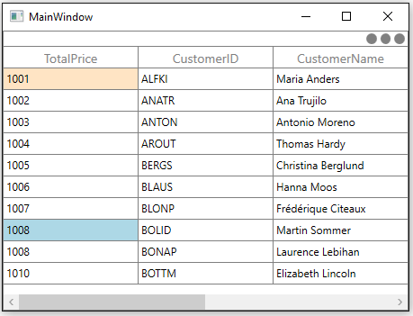
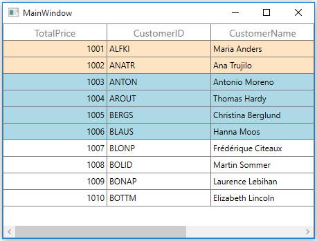

# Conditional Styling

You can style the SfDataGrid and its inner elements conditionally based on data in three ways,

1. Using Converter
2. Using Data Triggers
3. Using StyleSelector 

<table>
<tr>
<td>
{{'**Styling ways**'| markdownify }}
</td>
<td>
{{'**Performance details**'| markdownify }}
</td>
</tr>
<tr>
<td>
Using Converter
</td>
<td>
Provide good performance when compared other two ways.
</td>
</tr>
<tr>
<td>
Using Data Triggers
</td>
<td>
When compared to converter, performance is slow while styling more number of columns or rows.
</td>
</tr>
<tr>
<td>
Using StyleSelector
</td>
<td>
It affects scrolling performance while styling more number of columns based on number of columns visible.
</td>
</tr>
</table>

## Cells

### Styling cells using Converter

The record cells ([GridCell](http://help.syncfusion.com/cr/cref_files/wpf/Syncfusion.SfGrid.WPF~Syncfusion.UI.Xaml.Grid.GridCell.html)) can be customized conditionally by changing its property value based on `cell value` or `data object` using `converter`. 

Here, `GridCell` background is changed using `converter`, where converter returns the value based on `OrderID` property of underlying record.



<Window.Resources>
    <local:ColorConverter x:Key="converter"/>
</Window.Resources>

<syncfusion:GridTextColumn MappingName="TotalPrice">
    <syncfusion:GridTextColumn.CellStyle>
        
    </syncfusion:GridTextColumn.CellStyle>
</syncfusion:GridTextColumn>


public class ColorConverter : IValueConverter
{

    public object Convert(object value, Type targetType, object parameter, CultureInfo culture)
    {
        int input = (int)value;

      //custom condition is checked based on data.

        if (input < 1003)
            return new SolidColorBrush(Colors.LightBlue);

        else if (input < 1007)
            return new SolidColorBrush(Colors.Bisque);

        else
            return DependencyProperty.UnsetValue;
    }

    public object ConvertBack(object value, Type targetType, object parameter, CultureInfo culture)
    {
        throw new NotImplementedException();
    }
}



### Styling cells based on record using Converter

You can also style the cells based on record instead of passing single property to converter, where `converter` returns the value based on underlying record. This can be assigned to `GridColumn.CellStyle` to style the column based on other column properties.



<Window.Resources>
    <local:ColorConverter x:Key="converter"/>
    
</Window.Resources>

<syncfusion:SfDataGrid x:Name="dataGrid"
                       ItemsSource="{Binding Orders}" />



public class ColorConverter : IValueConverter
{

    public object Convert(object value, Type targetType, object parameter, CultureInfo culture)
    {
        var data = value as OrderInfo;

        //custom condition is checked based on data.

        if (data.OrderID < 1003)
            return new SolidColorBrush(Colors.LightBlue);

        else if (data.OrderID < 1007)
            return new SolidColorBrush(Colors.Bisque);

        else
            return DependencyProperty.UnsetValue;
    }

    public object ConvertBack(object value, Type targetType, object parameter, CultureInfo culture)
    {
        throw new NotImplementedException();
    }
}



### Styling cells using Style.Triggers

The record cells ([GridCell](http://help.syncfusion.com/cr/cref_files/wpf/Syncfusion.SfGrid.WPF~Syncfusion.UI.Xaml.Grid.GridCell.html)) can be customized by setting [Style.Triggers](https://msdn.microsoft.com/en-us/library/system.windows.style.triggers(v=vs.110).aspx) that apply property values based on specified conditions. Multiple conditions can be specified by setting [MultiDataTrigger](https://msdn.microsoft.com/en-us/library/system.windows.multidatatrigger(v=vs.110).aspx).



<syncfusion:GridTextColumn MappingName="OrderID" >
    <syncfusion:GridTextColumn.CellStyle>
        
    </syncfusion:GridTextColumn.CellStyle>
</syncfusion:GridTextColumn>



Here, GridCell’s are conditionally customized based on `OrderID` value.

### Styling cells using StyleSelector

The record cells ([GridCell](http://help.syncfusion.com/cr/cref_files/wpf/Syncfusion.SfGrid.WPF~Syncfusion.UI.Xaml.Grid.GridCell.html)) can be customized conditionally based on data by setting [SfDataGrid.CellStyleSelector](http://help.syncfusion.com/cr/cref_files/wpf/Syncfusion.SfGrid.WPF~Syncfusion.UI.Xaml.Grid.SfDataGrid~CellStyleSelector.html) property and the particular column record cells can be customized by setting [GridColumn.CellStyleSelector](http://help.syncfusion.com/cr/cref_files/wpf/Syncfusion.SfGrid.WPF~Syncfusion.UI.Xaml.Grid.GridColumnBase~CellStyleSelector.html) property and you can get the container as `GridCell` in the StyleSelector.

N> `GridColumn.CellStyleSelector` takes higher priority than `SfDataGrid.CellStyleSelector` property.



<Application.Resources>
         <local:SelectorClass x:Key="styleSelector"/>
    
        
</Application.Resources>

<syncfusion:SfDataGrid x:Name="dataGrid"
        ItemsSource="{Binding Orders}" CellStyleSelector="{StaticResource styleSelector}"/>


public class SelectorClass : StyleSelector
{

    public override Style SelectStyle(object item, DependencyObject container)
    {
        var data = item as OrderInfo;

        if (data != null && ((container as GridCell).ColumnBase.GridColumn.MappingName == "TotalPrice"))
        {

            //custom condition is checked based on data.

            if (data.TotalPrice < 1005)
                return App.Current.Resources["redCellStyle"] as Style;
            return App.Current.Resources["blueCellStyle"] as Style;
        }
        return base.SelectStyle(item, container);
    }
}



Here, GridCell’s are customized based on `TotalPrice` property of underlying record.

## Rows

### Styling rows using Converter

The record rows ([VirtualizingCellsControl](http://help.syncfusion.com/cr/cref_files/wpf/Syncfusion.SfGrid.WPF~Syncfusion.UI.Xaml.Grid.VirtualizingCellsControl.html) ) can be customized conditionally by changing its property value based on ‘cell value’ or ‘data object’ by using `converter`, where converter returns the value based on Underlying record.



<Window.Resources>
    <local:ColorConverter x:Key="converter"/>
    
</Window.Resources>

<syncfusion:SfDataGrid x:Name="dataGrid"
ItemsSource="{Binding Orders}"/>


public class ColorConverter : IValueConverter
{

    public object Convert(object value, Type targetType, object parameter, CultureInfo culture)
    {
        var input = (value as OrderInfo).TotalPrice;

       //custom condition is checked based on data.

        if (input < 1003)
            return new SolidColorBrush(Colors.Bisque);

        else if (input < 1007)
            return new SolidColorBrush(Colors.LightBlue);

        else
            return DependencyProperty.UnsetValue;
    }

    public object ConvertBack(object value, Type targetType, object parameter, CultureInfo culture)
    {
        throw new NotImplementedException();
    }
}



Here, rows are customized based on `TotalPrice` property of underlying record.

### Styling rows using StyleSelector

The record rows ([VirtualizingCellsControl](http://help.syncfusion.com/cr/cref_files/wpf/Syncfusion.SfGrid.WPF~Syncfusion.UI.Xaml.Grid.VirtualizingCellsControl.html) ) can be customized conditionally based on data by setting [SfDataGrid.RowStyleSelector](http://help.syncfusion.com/cr/cref_files/wpf/Syncfusion.SfGrid.WPF~Syncfusion.UI.Xaml.Grid.SfDataGrid~RowStyleSelector.html) property and you can get the container as `VirtualizingCellsControl` in StyleSelector.



<Application.Resources>
    
    
</Application.Resources>

<Window.Resources>
    <local:CustomRowStyleSelector x:Key="rowStyleSelector" />
</Window.Resources>

<syncfusion:SfDataGrid x:Name="dataGrid"
                       ItemsSource="{Binding Orders}"
                       RowStyleSelector="{StaticResource rowStyleSelector}"/>


public class CustomRowStyleSelector : StyleSelector
{

    public override Style SelectStyle(object item, DependencyObject container)
    {
        var row = (item as DataRowBase).RowData;
        var data = row as OrderInfo;

        if (data.TotalPrice < 1004)
            return App.Current.Resources["rowStyle1"] as Style;
        return App.Current.Resources["rowStyle2"] as Style;
    }
}



Here, rows are customized based on `TotalPrice` property of underlying record.

### Styling Alternate Rows

The appearance of alternating rows can be customized conditionally based on data by setting [SfDataGrid.AlternatingRowStyleSelector](http://help.syncfusion.com/cr/cref_files/wpf/Syncfusion.SfGrid.WPF~Syncfusion.UI.Xaml.Grid.SfDataGrid~AlternatingRowStyleSelector.html) property.



<Application.Resources>
    
    
</Application.Resources>

<Window.Resources>
    <local:CustomRowStyleSelector x:Key="alternatingRowStyleSelector" />
</Window.Resources>

<syncfusion:SfDataGrid x:Name="dataGrid"
                       ItemsSource="{Binding Orders}"                             
                       AlternatingRowStyleSelector="{StaticResource alternatingRowStyleSelector}"/>


public class CustomRowStyleSelector : StyleSelector
{

    public override Style SelectStyle(object item, DependencyObject container)
    {
        var row = (item as DataRowBase).RowData;
        var data = row as OrderInfo;

        // Applying alternating background for rows.

        if (data.OrderID < 1006)
            return App.Current.Resources["rowStyle1"] as Style;
        return App.Current.Resources["rowStyle2"] as Style;
    }
}



Here, alternating rows are customized based on `OrderID` property of underlying record.

## CaptionSummaryCell

### Styling caption summary cell using Converter

The appearance of caption summary cell can be customized conditionally based on summary value by using `converter`, where converter returns the value based on summary value. 



<Window.Resources>
    <local:ColorConverter x:Key="converter"/>
    
</Window.Resources>

<syncfusion:SfDataGrid x:Name="dataGrid" 
                       ShowGroupDropArea="True"
                       ItemsSource="{Binding Orders}">
        <syncfusion:SfDataGrid.CaptionSummaryRow>
            <syncfusion:GridSummaryRow ShowSummaryInRow="False">
                <syncfusion:GridSummaryRow.SummaryColumns>
                    <syncfusion:GridSummaryColumn Name="price"
                                                  Format="'{Sum:c}'"
                                                  MappingName="TotalPrice"
                                                  SummaryType="DoubleAggregate" />
                    <syncfusion:GridSummaryColumn Name="customerID"
                                                  Format="'{Count:c}'"
                                                  MappingName="CustomerID"
                                                  SummaryType="CountAggregate" />
                </syncfusion:GridSummaryRow.SummaryColumns>
            </syncfusion:GridSummaryRow>
        </syncfusion:SfDataGrid.CaptionSummaryRow>
    </syncfusion:SfDataGrid>


public class ColorConverter : IValueConverter
{

    public object Convert(object value, Type targetType, object parameter, CultureInfo culture)
    {
        var summaryValue = (value as Group).SummaryDetails.SummaryValues[0];
        var aggregateValue = summaryValue.AggregateValues.ElementAt(0);
        var calculatedValue = aggregateValue.Value;

        //custom condition is checked.

        if ((double)calculatedValue < 1005)
            return new SolidColorBrush(Colors.Red);
        return new SolidColorBrush(Colors.DarkBlue);
    }

    public object ConvertBack(object value, Type targetType, object parameter, CultureInfo culture)
    {
        throw new NotImplementedException();
    }
}



Here, caption summary cells are customized based on `TotalPrice` summary value.

### Styling caption summary using StyleSelector

The appearance of caption summary cell can be customized conditionally based on summary value by setting [SfDataGrid.CaptionSummaryCellStyleSelector](http://help.syncfusion.com/cr/cref_files/wpf/Syncfusion.SfGrid.WPF~Syncfusion.UI.Xaml.Grid.SfDataGrid~CaptionSummaryCellStyleSelector.html) and you can get the container as GridCaptionSummaryCell using StyleSelector.



<Application.Resources>
    
</Application.Resources>

<Window.Resources>
    <local:SelectorClass x:Key="selector"/>
</Window.Resources>	

<syncfusion:SfDataGrid x:Name="dataGrid" 
                       ShowGroupDropArea="True"
                       CaptionSummaryCellStyleSelector="{StaticResource  selector}"
                       ItemsSource="{Binding Orders}">

    <syncfusion:SfDataGrid.CaptionSummaryRow>
        <syncfusion:GridSummaryRow ShowSummaryInRow="False">
            <syncfusion:GridSummaryRow.SummaryColumns>
                <syncfusion:GridSummaryColumn Name="price"
                                              Format="'{Sum:c}'"
                                              MappingName="TotalPrice"
                                              SummaryType="DoubleAggregate" />
                <syncfusion:GridSummaryColumn Name="customerID"
                                              Format="'{Count:c}'"
                                              MappingName="CustomerID"
                                              SummaryType="CountAggregate" />
            </syncfusion:GridSummaryRow.SummaryColumns>
        </syncfusion:GridSummaryRow>
    </syncfusion:SfDataGrid.CaptionSummaryRow>
</syncfusion:SfDataGrid>


public class SelectorClass : StyleSelector
{

    public override Style SelectStyle(object item, DependencyObject container)
    {
        var summaryValue = (item as Group).SummaryDetails.SummaryValues[0];
        var aggregateValue = summaryValue.AggregateValues.ElementAt(0);
        var calculatedValue = aggregateValue.Value;

        //custom condition is checked.

        if ((double)calculatedValue < 0)
            return App.Current.Resources["captionSummaryStyle"] as Style;
        return base.SelectStyle(item, container);
    }
}



Here, caption summary cells are customized based on `TotalPrice` summary value.

### Styling caption summary cell based on column

The caption summary cells can be conditionally customized summary column. 

Here, caption summary cells are customized based on `TotalPrice` summary column.



<Application.Resources>
    
</Application.Resources>

<Window.Resources>
    <local:SelectorClass x:Key="selector"/>
</Window.Resources>	

<syncfusion:SfDataGrid x:Name="dataGrid" 
                       ShowGroupDropArea="True"
                       CaptionSummaryCellStyleSelector="{StaticResource  selector}"
                       ItemsSource="{Binding Orders}">

    <syncfusion:SfDataGrid.CaptionSummaryRow>
        <syncfusion:GridSummaryRow ShowSummaryInRow="False">
            <syncfusion:GridSummaryRow.SummaryColumns>
                <syncfusion:GridSummaryColumn Name="price"
                                              Format="'{Sum:c}'"
                                              MappingName="TotalPrice"
                                              SummaryType="DoubleAggregate" />
                <syncfusion:GridSummaryColumn Name="customerID"
                                              Format="'{Count:c}'"
                                              MappingName="CustomerID"
                                              SummaryType="CountAggregate" />
            </syncfusion:GridSummaryRow.SummaryColumns>
        </syncfusion:GridSummaryRow>
    </syncfusion:SfDataGrid.CaptionSummaryRow>
</syncfusion:SfDataGrid>


public class SelectorClass : StyleSelector
{

    public override Style SelectStyle(object item, DependencyObject container)
    {
        var cell = container as GridCaptionSummaryCell;

        if (cell.ColumnBase.GridColumn.MappingName == "TotalPrice")
        {
            var groupKey = (int)(item as Group).Key;

            //custom condition is checked.

            if (groupKey < 0)
                return App.Current.Resources["captionSummaryStyle"] as Style;
        }
        return null;
    }
}



## CaptionSummaryRow

### Styling caption summary row using Converter

The appearance of caption summary row can be customized conditionally based on summary value by using `converter`, where converter returns the value based on summary value. 



<Window.Resources>
    <local:ColorConverter x:Key="converter"/>
    
</Window.Resources>

<syncfusion:SfDataGrid x:Name="dataGrid" 
                       ShowGroupDropArea="True"
                       ItemsSource="{Binding Orders}">
    <syncfusion:SfDataGrid.CaptionSummaryRow>
        <syncfusion:GridSummaryRow Title="Total Price : {price}" ShowSummaryInRow="True">
            <syncfusion:GridSummaryRow.SummaryColumns>
                <syncfusion:GridSummaryColumn Name="price"
                                              Format="'{Sum:c}'"
                                              MappingName="TotalPrice"
                                              SummaryType="DoubleAggregate" />
                <syncfusion:GridSummaryColumn Name="customerID"
                                              Format="'{Count:c}'"
                                              MappingName="CustomerID"
                                              SummaryType="CountAggregate" />
            </syncfusion:GridSummaryRow.SummaryColumns>
        </syncfusion:GridSummaryRow>
    </syncfusion:SfDataGrid.CaptionSummaryRow>
</syncfusion:SfDataGrid>


public class ColorConverter : IValueConverter
{

    public object Convert(object value, Type targetType, object parameter, CultureInfo culture)
    {
        var summaryValue = (value as Group).SummaryDetails.SummaryValues[0];
        var aggregateValue = summaryValue.AggregateValues.ElementAt(0);
        var calculatedValue = aggregateValue.Value;

        //custom condition is checked.

        if ((double)calculatedValue < 1005)
            return new SolidColorBrush(Colors.LightBlue);
        return new SolidColorBrush(Colors.Bisque);
    }

    public object ConvertBack(object value, Type targetType, object parameter, CultureInfo culture)
    {
        throw new NotImplementedException();
    }
}



Here, caption summary rows are customized based on `TotalPrice` summary value.

### Styling caption summary row using StyleSelector

In another way, appearance of caption summary row can be customized conditionally based on summary value by setting [SfDataGrid.CaptionSummaryRowStyleSelector](http://help.syncfusion.com/cr/cref_files/wpf/Syncfusion.SfGrid.WPF~Syncfusion.UI.Xaml.Grid.SfDataGrid~CaptionSummaryRowStyleSelector.html) and you can get the container as `CaptionSummaryRowControl` in StyleSelector.

Here, caption summary rows are customized where [group key](http://help.syncfusion.com/cr/cref_files/wpf/Syncfusion.Data.WPF~Syncfusion.Data.Group~Key.html) value is negative.



<Application.Resources>
    
</Application.Resources>

<Window.Resources>
    <local:SelectorClass x:Key="styleSelector"/>    
</Window.Resources>

<syncfusion:SfDataGrid x:Name="dataGrid" 
                       ShowGroupDropArea="True"
                       CaptionSummaryRowStyleSelector="{StaticResource styleSelector}"
                       ItemsSource="{Binding Orders}">
    <syncfusion:SfDataGrid.CaptionSummaryRow>
        <syncfusion:GridSummaryRow Title="Total Price : {price}" ShowSummaryInRow="True">
            <syncfusion:GridSummaryRow.SummaryColumns>
                <syncfusion:GridSummaryColumn Name="price"
                                              Format="'{Sum:c}'"
                                              MappingName="TotalPrice"
                                              SummaryType="DoubleAggregate" />
                <syncfusion:GridSummaryColumn Name="customerID"
                                              Format="'{Count:c}'"
                                              MappingName="CustomerID"
                                              SummaryType="CountAggregate" />
            </syncfusion:GridSummaryRow.SummaryColumns>
        </syncfusion:GridSummaryRow>
    </syncfusion:SfDataGrid.CaptionSummaryRow>
</syncfusion:SfDataGrid>


public class SelectorClass : StyleSelector
{
    public override Style SelectStyle(object item, DependencyObject container)
    {
        var row = (item as SpannedDataRow).RowData;
        var groupKey = (int)(row as Group).Key;        
        //custom condition is checked.
        if (groupKey < 0)
            return App.Current.Resources["captionSummaryStyle"] as Style;
        return null;
    }
}



Here, caption summary rows are customized based on `TotalPrice` summary value.

### Styling caption summary row based on grouping level

The appearance of caption summary row can be conditionally customized based on [grouping level](http://help.syncfusion.com/cr/cref_files/wpf/Syncfusion.SfGrid.WPF~Syncfusion.UI.Xaml.Grid.DataRowBase~Level.html) using StyleSelector. 



<Application.Resources>

    
    
    

</Application.Resources>

<Window.Resources>
    <local:CustomCaptionSummaryRowStyleSelector x:Key="styleSelector" />
</Window.Resources>

<syncfusion:SfDataGrid x:Name="dataGrid"
                       CaptionSummaryRowStyleSelector="{StaticResource styleSelector}"
                       ItemsSource="{Binding Orders}"
                       ShowGroupDropArea="True">


public class CustomCaptionSummaryRowStyleSelector : StyleSelector
{

    public override Style SelectStyle(object item, DependencyObject container)
    {
        var dataRow = item as DataRowBase;
        var level = dataRow.Level;

        //based on group levels, style applied to CaptionSummaryRow

        if (level == 1)
            return App.Current.Resources["rowStyle1"] as Style;

        else if (level == 2)
            return App.Current.Resources["rowStyle2"] as Style;

        else if (level == 3)
            return App.Current.Resources["rowStyle3"] as Style;
        return base.SelectStyle(item, container);
    }
}



Here, caption summary rows are customized based on `grouping level` (example: level1, level2, level3, etc.).

## GroupSummaryCell

Group summary cells can be customized conditionally by getting particular summary value from [SummaryValues](http://help.syncfusion.com/cr/cref_files/wpf/Syncfusion.Data.WPF~Syncfusion.Data.SummaryRecordEntry~SummaryValues.html) through converter or style selector. Likewise, you can also customize the group summary cell based on various properties exposed in [GridSummaryRow](http://help.syncfusion.com/cr/cref_files/wpf/Syncfusion.SfGrid.WPF~Syncfusion.UI.Xaml.Grid.GridSummaryRow_members.html) (example: [ShowSummaryInRow](http://help.syncfusion.com/cr/cref_files/wpf/Syncfusion.SfGrid.WPF~Syncfusion.UI.Xaml.Grid.GridSummaryRow~ShowSummaryInRow.html) property).

### Styling group summary cell using Converter

The appearance of group summary cell can be customized conditionally based on summary value by using ‘converter’, where converter returns the value based on summary value.



<Window.Resources>
    <local:ColorConverter x:Key="converter"/>
    
</Window.Resources>

<syncfusion:SfDataGrid x:Name="dataGrid" 
                       ShowGroupDropArea="True"
                       ItemsSource="{Binding Orders}">
         <syncfusion:SfDataGrid.GroupSummaryRows>
                <syncfusion:GridSummaryRow ShowSummaryInRow="False">
                    <syncfusion:GridSummaryRow.SummaryColumns>
                        <syncfusion:GridSummaryColumn Name="price"
                                                      Format="'{Sum:c}'"
                                                      MappingName="TotalPrice"
                                                      SummaryType="DoubleAggregate" />
                        <syncfusion:GridSummaryColumn Name="customerID"
                                                      Format="'{Count:c}'"
                                                      MappingName="CustomerID"
                                                      SummaryType="CountAggregate" />
                    </syncfusion:GridSummaryRow.SummaryColumns>
                </syncfusion:GridSummaryRow>
                <syncfusion:GridSummaryRow Title="TotalPrice:  {totalPrice}" ShowSummaryInRow="True">
                    <syncfusion:GridSummaryRow.SummaryColumns>
                        <syncfusion:GridSummaryColumn Name="totalPrice"
                                                      Format="'{Sum:c}'"
                                                      MappingName="TotalPrice"
                                                      SummaryType="DoubleAggregate" />
                    </syncfusion:GridSummaryRow.SummaryColumns>
                </syncfusion:GridSummaryRow>
            </syncfusion:SfDataGrid.GroupSummaryRows>
  </syncfusion:SfDataGrid>


public class ColorConverter : IValueConverter
{

    public object Convert(object value, Type targetType, object parameter, CultureInfo culture)
    {
        var summaryValue = (value as SummaryRecordEntry).SummaryValues[0];
        var aggregateValue = summaryValue.AggregateValues.ElementAt(0);      
        var calculatedValue = aggregateValue.Value;

        //custom condition is checked.

        if ((double)calculatedValue < 1500)
            return new SolidColorBrush(Colors.Red);
        return new SolidColorBrush(Colors.DarkBlue);
    }

    public object ConvertBack(object value, Type targetType, object parameter, CultureInfo culture)
    {
        throw new NotImplementedException();
    }
}



Here, group summary cells are customized based on `TotalPrice` summary value.

### Styling group summary cell using StyleSelector

The appearance of group summary cell can be customized conditionally based on summary value by setting [SfDataGrid.GroupSummaryCellStyleSelector](http://help.syncfusion.com/cr/cref_files/wpf/Syncfusion.SfGrid.WPF~Syncfusion.UI.Xaml.Grid.SfDataGrid~GroupSummaryCellStyleSelector.html) and you can get the container as `GridGroupSummaryCell` in StyleSelector.

Here, group summary cells are customized based on summary values whether it’s positive or negative.



<Application.Resources>
    
    
</Application.Resources>

<Window.Resources>
    <local:SelectorClass x:Key="styleSelector"/>        
</Window.Resources>

<syncfusion:SfDataGrid x:Name="dataGrid"
                       ShowGroupDropArea="True"
                       GroupSummaryCellStyleSelector="{StaticResource styleSelector}"
                       ItemsSource="{Binding Orders}">
            <syncfusion:SfDataGrid.GroupSummaryRows>
                <syncfusion:GridSummaryRow ShowSummaryInRow="False">
                    <syncfusion:GridSummaryRow.SummaryColumns>
                        <syncfusion:GridSummaryColumn Name="price"
                                                      Format="'{Sum:c}'"
                                                      MappingName="TotalPrice"
                                                      SummaryType="DoubleAggregate" />
                        <syncfusion:GridSummaryColumn Name="customerID"
                                                      Format="'{Count:c}'"
                                                      MappingName="CustomerID"
                                                      SummaryType="CountAggregate" />
                    </syncfusion:GridSummaryRow.SummaryColumns>
                </syncfusion:GridSummaryRow>
                <syncfusion:GridSummaryRow Title="TotalPrice:  {totalPrice}" ShowSummaryInRow="True">
                    <syncfusion:GridSummaryRow.SummaryColumns>
                        <syncfusion:GridSummaryColumn Name="totalPrice"
                                                      Format="'{Sum:c}'"
                                                      MappingName="TotalPrice"
                                                      SummaryType="DoubleAggregate" />
                    </syncfusion:GridSummaryRow.SummaryColumns>
                </syncfusion:GridSummaryRow>
            </syncfusion:SfDataGrid.GroupSummaryRows>
     </syncfusion:SfDataGrid>


public class SelectorClass : StyleSelector
{

    public override Style SelectStyle(object item, DependencyObject container)
    {
        var summaryValue = (item as SummaryRecordEntry).SummaryValues[0];
        var aggregateValue = summaryValue.AggregateValues.ElementAt(0);
        var calculatedValue = aggregateValue.Value;

        //custom condition is checked.

        if ((double)calculatedValue < 0)
            return App.Current.Resources["customGroupSummary1"] as Style;

        return App.Current.Resources["customGroupSummary"] as Style;                 
    }
}



Here, group summary cells are customized based on `TotalPrice` summary value.

### Styling group summary cell based on column

The group summary cells can be conditionally customized based on summary column. 

Here, group summary cells are customized based on `TotalPrice` summary column.



<Application.Resources>
    
    
</Application.Resources>

<Window.Resources>
    <local:SelectorClass x:Key="styleSelector"/>        
</Window.Resources>

<syncfusion:SfDataGrid x:Name="dataGrid"
                       ShowGroupDropArea="True"
                       GroupSummaryCellStyleSelector="{StaticResource styleSelector}"
                       ItemsSource="{Binding Orders}">
            <syncfusion:SfDataGrid.GroupSummaryRows>
                <syncfusion:GridSummaryRow ShowSummaryInRow="False">
                    <syncfusion:GridSummaryRow.SummaryColumns>
                        <syncfusion:GridSummaryColumn Name="price"
                                                      Format="'{Sum:c}'"
                                                      MappingName="TotalPrice"
                                                      SummaryType="DoubleAggregate" />
                        <syncfusion:GridSummaryColumn Name="customerID"
                                                      Format="'{Count:c}'"
                                                      MappingName="CustomerID"
                                                      SummaryType="CountAggregate" />
                    </syncfusion:GridSummaryRow.SummaryColumns>
                </syncfusion:GridSummaryRow>
                <syncfusion:GridSummaryRow Title="TotalPrice:  {totalPrice}" ShowSummaryInRow="True">
                    <syncfusion:GridSummaryRow.SummaryColumns>
                        <syncfusion:GridSummaryColumn Name="totalPrice"
                                                      Format="'{Sum:c}'"
                                                      MappingName="TotalPrice"
                                                      SummaryType="DoubleAggregate" />
                    </syncfusion:GridSummaryRow.SummaryColumns>
                </syncfusion:GridSummaryRow>
            </syncfusion:SfDataGrid.GroupSummaryRows>
     </syncfusion:SfDataGrid>


public class SelectorClass : StyleSelector
{

    public override Style SelectStyle(object item, DependencyObject container)
    {
        var cell = container as GridGroupSummaryCell;

        if (cell.ColumnBase.GridColumn.MappingName == "TotalPrice")
        {            
            var summaryValue = (item as SummaryRecordEntry).SummaryValues[0];
            var aggregateValue = summaryValue.AggregateValues.ElementAt(0);
            var calculatedValue = aggregateValue.Value;

            //custom condition is checked.

            if (aggregateValue.Key != "Count" && (double)calculatedValue < 0)
                return App.Current.Resources["customGroupSummary1"] as Style;
        }
        return App.Current.Resources["customGroupSummary"] as Style;
    }
}



## GroupSummaryRow

Group summary row can be customized conditionally by getting particular summary value from [SummaryValues](http://help.syncfusion.com/cr/cref_files/wpf/Syncfusion.Data.WPF~Syncfusion.Data.SummaryRecordEntry~SummaryValues.html) through `converter` or `style selector`. Likewise, you can also customize the group summary row based on various properties exposed in [GridSummaryRow](http://help.syncfusion.com/cr/cref_files/wpf/Syncfusion.SfGrid.WPF~Syncfusion.UI.Xaml.Grid.GridSummaryRow_members.html) (example: [ShowSummaryInRow](http://help.syncfusion.com/cr/cref_files/wpf/Syncfusion.SfGrid.WPF~Syncfusion.UI.Xaml.Grid.GridSummaryRow~ShowSummaryInRow.html) property).

### Styling group summary row using Converter

The appearance of group summary row can be customized conditionally based on summary value by using ‘converter’, where converter returns the value based on summary value.



<Window.Resources>
    <local:ColorConverter x:Key="converter"/>
    
</Window.Resources>

<syncfusion:SfDataGrid x:Name="dataGrid" 
                       ShowGroupDropArea="True"
                       ItemsSource="{Binding Orders}">
            <syncfusion:SfDataGrid.GroupSummaryRows>
                <syncfusion:GridSummaryRow ShowSummaryInRow="False">
                    <syncfusion:GridSummaryRow.SummaryColumns>
                        <syncfusion:GridSummaryColumn Name="price"
                                                      Format="'{Sum:c}'"
                                                      MappingName="TotalPrice"
                                                      SummaryType="DoubleAggregate" />
                        <syncfusion:GridSummaryColumn Name="customerID"
                                                      Format="'{Count:c}'"
                                                      MappingName="CustomerID"
                                                      SummaryType="CountAggregate" />
                    </syncfusion:GridSummaryRow.SummaryColumns>
                </syncfusion:GridSummaryRow>
                <syncfusion:GridSummaryRow Title="TotalPrice:  {totalPrice}" ShowSummaryInRow="True">
                    <syncfusion:GridSummaryRow.SummaryColumns>
                        <syncfusion:GridSummaryColumn Name="totalPrice"
                                                      Format="'{Sum:c}'"
                                                      MappingName="TotalPrice"
                                                      SummaryType="DoubleAggregate" />
                    </syncfusion:GridSummaryRow.SummaryColumns>
                </syncfusion:GridSummaryRow>
            </syncfusion:SfDataGrid.GroupSummaryRows>
    </syncfusion:SfDataGrid>


public class ColorConverter : IValueConverter
{

    public object Convert(object value, Type targetType, object parameter, CultureInfo culture)
    {
        var summaryValue = (value as SummaryRecordEntry).SummaryValues[0];
        var aggregateValue = summaryValue.AggregateValues.ElementAt(0);      
        var calculatedValue = aggregateValue.Value;

        //custom condition is checked.

        if (aggregateValue.Key != "Count" && (double)calculatedValue < 1500)
            return new SolidColorBrush(Colors.LightBlue);
        return new SolidColorBrush(Colors.Bisque);
    }

    public object ConvertBack(object value, Type targetType, object parameter, CultureInfo culture)
    {
        throw new NotImplementedException();
    }
}



Here, group summary rows are customized based on `TotalPrice` summary value.

### Styling group summary row using StyleSelector

The appearance of group summary row can be customized conditionally based on summary value by setting [SfDataGrid.GroupSummaryRowStyleSelector](http://help.syncfusion.com/cr/cref_files/wpf/Syncfusion.SfGrid.WPF~Syncfusion.UI.Xaml.Grid.SfDataGrid~GroupSummaryRowStyleSelector.html) and you can get the container as `GridGroupSummaryRowControl` in StyleSelector.



<Application.Resources>
    
    
</Application.Resources>

<Window.Resources>
    <local:SelectorClass x:Key="styleSelector"/>    
</Window.Resources>

<syncfusion:SfDataGrid x:Name="dataGrid"
                       GroupSummaryRowStyleSelector="{StaticResource styleSelector}"
                       ShowGroupDropArea="True"
                       ItemsSource="{Binding Orders}">
            <syncfusion:SfDataGrid.GroupSummaryRows>
                <syncfusion:GridSummaryRow ShowSummaryInRow="False">
                    <syncfusion:GridSummaryRow.SummaryColumns>
                        <syncfusion:GridSummaryColumn Name="price"
                                                      Format="'{Sum:c}'"
                                                      MappingName="TotalPrice"
                                                      SummaryType="DoubleAggregate" />
                        <syncfusion:GridSummaryColumn Name="customerID"
                                                      Format="'{Count:c}'"
                                                      MappingName="CustomerID"
                                                      SummaryType="CountAggregate" />
                    </syncfusion:GridSummaryRow.SummaryColumns>
                </syncfusion:GridSummaryRow>
                <syncfusion:GridSummaryRow Title="TotalPrice:  {totalPrice}" ShowSummaryInRow="True">
                    <syncfusion:GridSummaryRow.SummaryColumns>
                        <syncfusion:GridSummaryColumn Name="totalPrice"
                                                      Format="'{Sum:c}'"
                                                      MappingName="TotalPrice"
                                                      SummaryType="DoubleAggregate" />
                    </syncfusion:GridSummaryRow.SummaryColumns>
                </syncfusion:GridSummaryRow>
            </syncfusion:SfDataGrid.GroupSummaryRows>
    </syncfusion:SfDataGrid>


public class SelectorClass : StyleSelector
{

    public override Style SelectStyle(object item, DependencyObject container)
    {
        var summaryRecordEntry = (item as SpannedDataRow).RowData;
        var summaryValue = (summaryRecordEntry as SummaryRecordEntry).SummaryValues[0];
        var aggregateValue = summaryValue.AggregateValues.ElementAt(0);
        var calculatedValue = aggregateValue.Value;

        //custom condition is checked.

        if ( (double)calculatedValue < 0)
            return App.Current.Resources["customGroupSummary1"] as Style;

        return App.Current.Resources["customGroupSummary"] as Style;                 
    }
}



Here, group summary rows are customized based on `TotalPrice` summary value whether it’s positive or negative.

## TableSummaryCell

Table summary cells can be customized conditionally by getting particular summary value from [SummaryValues](http://help.syncfusion.com/cr/cref_files/wpf/Syncfusion.Data.WPF~Syncfusion.Data.SummaryRecordEntry~SummaryValues.html) through `converter` or `style selector`. Likewise, you can also customize the table summary cell based on various properties exposed in [GridSummaryRow](http://help.syncfusion.com/cr/cref_files/wpf/Syncfusion.SfGrid.WPF~Syncfusion.UI.Xaml.Grid.GridSummaryRow_members.html) (example: [ShowSummaryInRow](http://help.syncfusion.com/cr/cref_files/wpf/Syncfusion.SfGrid.WPF~Syncfusion.UI.Xaml.Grid.GridSummaryRow~ShowSummaryInRow.html) property).

### Styling table summary cell using Converter

The appearance of table summary cell can be customized conditionally based on summary value using `converter`, where converter returns the value based on summary value. 



<Window.Resources>
    <local:ColorConverter x:Key="converter"/>
    
</Window.Resources>

<syncfusion:SfDataGrid x:Name="dataGrid"
                       ShowRowHeader="True"
                       ItemsSource="{Binding Orders}">
              <syncfusion:SfDataGrid.TableSummaryRows>
                <syncfusion:GridTableSummaryRow Position="Top" ShowSummaryInRow="False">
                    <syncfusion:GridTableSummaryRow.SummaryColumns>

                        <syncfusion:GridSummaryColumn Name="price"
                                                      Format="'{Sum:c}'"
                                                      MappingName="TotalPrice"
                                                      SummaryType="DoubleAggregate" />
                        <syncfusion:GridSummaryColumn Name="customerID"
                                                      Format="'{Count:c}'"
                                                      MappingName="CustomerID"
                                                      SummaryType="CountAggregate" />

                    </syncfusion:GridTableSummaryRow.SummaryColumns>
                </syncfusion:GridTableSummaryRow>

                <syncfusion:GridSummaryRow Title="Count : {count}, Total Price :  {totalPrice}" ShowSummaryInRow="True">
                    <syncfusion:GridSummaryRow.SummaryColumns>
                        <syncfusion:GridSummaryColumn Name="count"
                                                      Format="'{Sum:c}'"
                                                      MappingName="TotalPrice"
                                                      SummaryType="DoubleAggregate" />
                        <syncfusion:GridSummaryColumn Name="totalPrice"
                                                      Format="'{Sum:c}'"
                                                      MappingName="TotalPrice"
                                                      SummaryType="DoubleAggregate" />

                    </syncfusion:GridSummaryRow.SummaryColumns>
                </syncfusion:GridSummaryRow>
            </syncfusion:SfDataGrid.TableSummaryRows>
        </syncfusion:SfDataGrid>


public class ColorConverter : IValueConverter
{

    public object Convert(object value, Type targetType, object parameter, CultureInfo culture)
    {
        var summaryValue = (value as SummaryRecordEntry).SummaryValues[0];
        var aggregateValue = summaryValue.AggregateValues.ElementAt(0);      
        var calculatedValue = aggregateValue.Value;

        //custom condition is checked.

        if (aggregateValue.Key != "Count" && (double)calculatedValue < 1500)
            return new SolidColorBrush(Colors.Red);
        return new SolidColorBrush(Colors.LightBlue);
    }

    public object ConvertBack(object value, Type targetType, object parameter, CultureInfo culture)
    {
        throw new NotImplementedException();
    }
}



Here, table summary cells are customized based on `TotalPrice` summary value.

### Styling table summary cell using StyleSelector

The appearance of table summary cell can be customized conditionally based on summary value by setting [SfDataGrid.TableSummaryCellStyleSelector](http://help.syncfusion.com/cr/cref_files/wpf/Syncfusion.SfGrid.WPF~Syncfusion.UI.Xaml.Grid.SfDataGrid~TableSummaryCellStyleSelector.html) and you can get the container as GridTableSummaryCell in StyleSelector.



<Application.Resources>
    
    
</Application.Resources>

<Window.Resources>
    <local:SelectorClass x:Key="styleSelector"/>        
</Window.Resources>

<syncfusion:SfDataGrid x:Name="dataGrid"    
                       ShowRowHeader="True"            
                       ItemsSource="{Binding Orders}"
                       TableSummaryCellStyleSelector="{StaticResource styleSelector}">
           <syncfusion:SfDataGrid.TableSummaryRows>
                <syncfusion:GridTableSummaryRow Position="Top" ShowSummaryInRow="False">
                    <syncfusion:GridTableSummaryRow.SummaryColumns>

                        <syncfusion:GridSummaryColumn Name="price"
                                                      Format="'{Sum:c}'"
                                                      MappingName="TotalPrice"
                                                      SummaryType="DoubleAggregate" />
                        <syncfusion:GridSummaryColumn Name="customerID"
                                                      Format="'{Count:c}'"
                                                      MappingName="CustomerID"
                                                      SummaryType="CountAggregate" />

                    </syncfusion:GridTableSummaryRow.SummaryColumns>
                </syncfusion:GridTableSummaryRow>

                <syncfusion:GridSummaryRow Title="Total Price :  {totalPrice}" ShowSummaryInRow="True">
                    <syncfusion:GridSummaryRow.SummaryColumns>                        
                        <syncfusion:GridSummaryColumn Name="totalPrice"
                                                      Format="'{Sum:c}'"
                                                      MappingName="TotalPrice"
                                                      SummaryType="DoubleAggregate" />

                    </syncfusion:GridSummaryRow.SummaryColumns>
                </syncfusion:GridSummaryRow>
            </syncfusion:SfDataGrid.TableSummaryRows>
        </syncfusion:SfDataGrid>


public class SelectorClass : StyleSelector
{

    public override Style SelectStyle(object item, DependencyObject container)
    {
        var summaryValue = (item as SummaryRecordEntry).SummaryValues[0];
        var aggregateValue = summaryValue.AggregateValues.ElementAt(0);
        var calculatedValue = aggregateValue.Value;
        var cell = container as GridTableSummaryCell;

        //custom condition is checked.

        if ((double)calculatedValue < 8500 && cell.ColumnBase.GridColumn.MappingName == "TotalPrice")
            return App.Current.Resources["customTableSummary"] as Style;

        return App.Current.Resources["customTableSummary1"] as Style;
    }
}



Here, table summary cells are customized based on `TotalPrice` summary value.

### Styling table summary cell based on column

The table summary cells can be conditionally customized based on summary column.

Here, table summary cells are customized based on `TotalPrice` summary column.



<Application.Resources>
    
    
</Application.Resources>

<Window.Resources>
    <local:SelectorClass x:Key="styleSelector"/>        
</Window.Resources>

<syncfusion:SfDataGrid x:Name="dataGrid"    
                       ShowRowHeader="True"            
                       ItemsSource="{Binding Orders}"
                       TableSummaryCellStyleSelector="{StaticResource styleSelector}">
           <syncfusion:SfDataGrid.TableSummaryRows>
                <syncfusion:GridTableSummaryRow Position="Top" ShowSummaryInRow="False">
                    <syncfusion:GridTableSummaryRow.SummaryColumns>

                        <syncfusion:GridSummaryColumn Name="price"
                                                      Format="'{Sum:c}'"
                                                      MappingName="TotalPrice"
                                                      SummaryType="DoubleAggregate" />
                        <syncfusion:GridSummaryColumn Name="customerID"
                                                      Format="'{Count:c}'"
                                                      MappingName="CustomerID"
                                                      SummaryType="CountAggregate" />

                    </syncfusion:GridTableSummaryRow.SummaryColumns>
                </syncfusion:GridTableSummaryRow>

                <syncfusion:GridSummaryRow Title="Total Price :  {totalPrice}" ShowSummaryInRow="True">
                    <syncfusion:GridSummaryRow.SummaryColumns>                        
                        <syncfusion:GridSummaryColumn Name="totalPrice"
                                                      Format="'{Sum:c}'"
                                                      MappingName="TotalPrice"
                                                      SummaryType="DoubleAggregate" />

                    </syncfusion:GridSummaryRow.SummaryColumns>
                </syncfusion:GridSummaryRow>
            </syncfusion:SfDataGrid.TableSummaryRows>
        </syncfusion:SfDataGrid>


public class SelectorClass : StyleSelector
{

    public override Style SelectStyle(object item, DependencyObject container)
    {
        var cell = container as GridTableSummaryCell;

        // column name is checked.

        if (cell.ColumnBase.GridColumn.MappingName == "TotalPrice")
            return App.Current.Resources["TableSummaryStyle1"] as Style;
        return App.Current.Resources["TableSummaryStyle2"] as Style;

    }
}



## TableSummaryRow

Table summary rows can be customized conditionally by getting particular summary value from [SummaryValues](http://help.syncfusion.com/cr/cref_files/wpf/Syncfusion.Data.WPF~Syncfusion.Data.SummaryRecordEntry~SummaryValues.html) through converter or style selector. Likewise, you can also customize the table summary row based on various properties exposed in [GridSummaryRow](http://help.syncfusion.com/cr/cref_files/wpf/Syncfusion.SfGrid.WPF~Syncfusion.UI.Xaml.Grid.GridSummaryRow_members.html) (example: [ShowSummaryInRow](http://help.syncfusion.com/cr/cref_files/wpf/Syncfusion.SfGrid.WPF~Syncfusion.UI.Xaml.Grid.GridSummaryRow~ShowSummaryInRow.html) property).

### Styling table summary row using Converter

The appearance of table summary row can be customized conditionally based on summary value using `converter`, where converter returns the value based on summary value.



<Window.Resources>
    <local:ColorConverter x:Key="converter"/>
    
</Window.Resources>

<syncfusion:SfDataGrid x:Name="dataGrid"
                       ShowRowHeader="True"
                       ItemsSource="{Binding Orders}">



public class ColorConverter : IValueConverter
{

    public object Convert(object value, Type targetType, object parameter, CultureInfo culture)
    {
        var summaryValue = (value as SummaryRecordEntry).SummaryValues[0];
        var aggregateValue = summaryValue.AggregateValues.ElementAt(0);      
        var calculatedValue = aggregateValue.Value;

        //custom condition is checked.

        if (aggregateValue.Key != "Count" && (double)calculatedValue < 1500)
            return new SolidColorBrush(Colors.Bisque);
        return new SolidColorBrush(Colors.LightBlue);
    }

    public object ConvertBack(object value, Type targetType, object parameter, CultureInfo culture)
    {
        throw new NotImplementedException();
    }
}



Here, table summary rows are customized based on `TotalPrice` summary value.

### Styling table summary row using StyleSelector

The appearance of table summary row can be customized conditionally based on summary value by setting [SfDataGrid.TableSummaryRowStyleSelector](http://help.syncfusion.com/cr/cref_files/wpf/Syncfusion.SfGrid.WPF~Syncfusion.UI.Xaml.Grid.SfDataGrid~TableSummaryRowStyleSelector.html) and you can get the container as `GridTableSummaryRowControl` in StyleSelector.



<Application.Resources>
    
    
</Application.Resources>

<Window.Resources>
    <local:SelectorClass x:Key="styleSelector"/>    
</Window.Resources>

<syncfusion:SfDataGrid x:Name="dataGrid"             
                       ShowRowHeader="True"   
                       ItemsSource="{Binding Orders}" 
                       TableSummaryRowStyleSelector="{StaticResource styleSelector}" >
            <syncfusion:SfDataGrid.TableSummaryRows>
                <syncfusion:GridTableSummaryRow Position="Top" ShowSummaryInRow="False">
                    <syncfusion:GridTableSummaryRow.SummaryColumns>

                        <syncfusion:GridSummaryColumn Name="price"
                                                      Format="'{Sum:c}'"
                                                      MappingName="TotalPrice"
                                                      SummaryType="DoubleAggregate" />
                        <syncfusion:GridSummaryColumn Name="customerID"
                                                      Format="'{Count:c}'"
                                                      MappingName="CustomerID"
                                                      SummaryType="CountAggregate" />

                    </syncfusion:GridTableSummaryRow.SummaryColumns>
                </syncfusion:GridTableSummaryRow>

                <syncfusion:GridSummaryRow Title="Count : {count}, Total Price :  {totalPrice}" ShowSummaryInRow="True">
                    <syncfusion:GridSummaryRow.SummaryColumns>
                        <syncfusion:GridSummaryColumn Name="count"
                                                      Format="'{Sum:c}'"
                                                      MappingName="TotalPrice"
                                                      SummaryType="DoubleAggregate" />
                        <syncfusion:GridSummaryColumn Name="totalPrice"
                                                      Format="'{Sum:c}'"
                                                      MappingName="TotalPrice"
                                                      SummaryType="DoubleAggregate" />

                    </syncfusion:GridSummaryRow.SummaryColumns>
                </syncfusion:GridSummaryRow>
            </syncfusion:SfDataGrid.TableSummaryRows>
        </syncfusion:SfDataGrid>


public class SelectorClass : StyleSelector
{

    public override Style SelectStyle(object item, DependencyObject container)
    {
        var summaryRecordEntry = (item as SpannedDataRow).RowData;
        var summaryValue = (summaryRecordEntry as SummaryRecordEntry).SummaryValues[0];
        var aggregateValue = summaryValue.AggregateValues.ElementAt(0);
        var calculatedValue = aggregateValue.Value;

        //custom condition is checked.

        if (aggregateValue.Key != "Count" && (double)calculatedValue < 0)
            return App.Current.Resources["customTableSummary"] as Style;

        return App.Current.Resources["customTableSummary1"] as Style;                 
    }
}



Here, table summary rows are customized based on `TotalPrice` summary value.

## Alignment customization based on column

The alignment of summary cells can be customized conditionally based on summary column. 

Here, horizontal alignment of table summary cells are changed based on column name. Likewise, you can change the horizontal alignment of group, caption summary cells.



<Application.Resources>
    
    
</Application.Resources>

<Window.Resources>
    <local:TableSummaryStyleSelector x:Key="tableSummaryStyleSelector" />
</Window.Resources>

<syncfusion:SfDataGrid x:Name="dataGrid"
                       ItemsSource="{Binding Orders}"
                       TableSummaryCellStyleSelector="{StaticResource tableSummaryStyleSelector}">
<syncfusion:SfDataGrid.TableSummaryRows>
                <syncfusion:GridTableSummaryRow Position="Top" ShowSummaryInRow="False">
                    <syncfusion:GridTableSummaryRow.SummaryColumns>

                        <syncfusion:GridSummaryColumn Name="price"
                                                      Format="'{Sum:c}'"
                                                      MappingName="TotalPrice"
                                                      SummaryType="DoubleAggregate" />
                        <syncfusion:GridSummaryColumn Name="customerID"
                                                      Format="'{Count:c}'"
                                                      MappingName="CustomerID"
                                                      SummaryType="CountAggregate" />

                    </syncfusion:GridTableSummaryRow.SummaryColumns>
                </syncfusion:GridTableSummaryRow>

                <syncfusion:GridSummaryRow Title="Count : {count}, Total Price :  {totalPrice}" ShowSummaryInRow="True">
                    <syncfusion:GridSummaryRow.SummaryColumns>
                        <syncfusion:GridSummaryColumn Name="count"
                                                      Format="'{Sum:c}'"
                                                      MappingName="TotalPrice"
                                                      SummaryType="DoubleAggregate" />
                        <syncfusion:GridSummaryColumn Name="totalPrice"
                                                      Format="'{Sum:c}'"
                                                      MappingName="TotalPrice"
                                                      SummaryType="DoubleAggregate" />

                    </syncfusion:GridSummaryRow.SummaryColumns>
                </syncfusion:GridSummaryRow>
            </syncfusion:SfDataGrid.TableSummaryRows>
        </syncfusion:SfDataGrid>


public class TableSummaryStyleSelector : StyleSelector
{

    public override Style SelectStyle(object item, DependencyObject container)
    {
        var cell = container as GridTableSummaryCell;

        // Horizontal Alignments changed based on MappingName

        if (cell.ColumnBase.GridColumn.MappingName == "TotalPrice")
            return App.Current.Resources["TableSummaryStyle1"] as Style;
        return App.Current.Resources["TableSummaryStyle2"] as Style;
    }
}



Here, horizontal alignment of `TotalPrice` column alone left, other column horizontal alignment are changed into right.

## Row Header

The appearance of row header ([GridRowHeaderCell](http://help.syncfusion.com/cr/cref_files/wpf/Syncfusion.SfGrid.WPF~Syncfusion.UI.Xaml.Grid.GridRowHeaderCell.html)) can be customized conditionally by changing its property value based on ‘cell value’ or ‘data object’ by using `converter`, where converter returns the value based on Underlying record.

Here, row headers are customized based on `AmountPaid` property of underlying record.



<Window.Resources>
            <local:ColorConverter x:Key="converter" />
            
</Window.Resources>

<syncfusion:SfDataGrid x:Name="dataGrid"
                       ItemsSource="{Binding Orders}"
                       ShowRowHeader="True">
     <syncfusion:SfDataGrid.Columns>
                <syncfusion:GridCheckBoxColumn MappingName="AmountPaid" />
     </syncfusion:SfDataGrid.Columns>
</syncfusion:SfDataGrid>


public class ColorConverter : IValueConverter
{

    public object Convert(object value, Type targetType, object parameter, CultureInfo culture)
    {
        var data = value as OrderInfo;

        //custom condition is checked.

        if (data.AmountPaid)
            return Brushes.Green;

        else
            return Brushes.Red;
    }

    public object ConvertBack(object value, Type targetType, object parameter, CultureInfo culture)
    {
        throw new NotImplementedException();
    }
}



