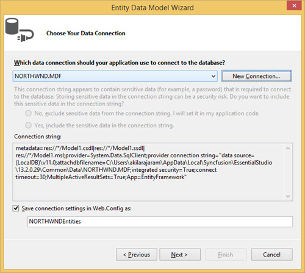
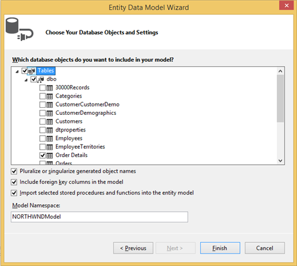
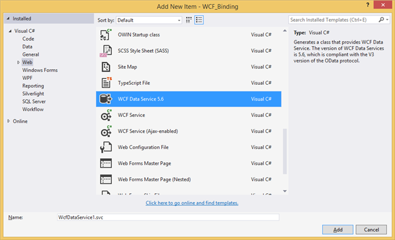
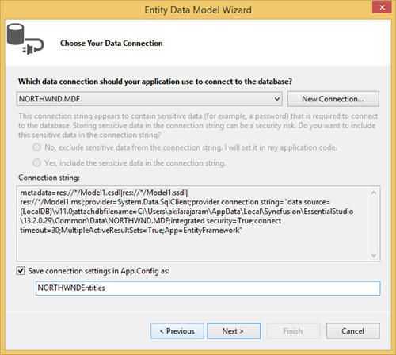
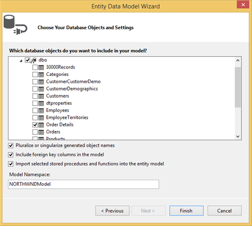
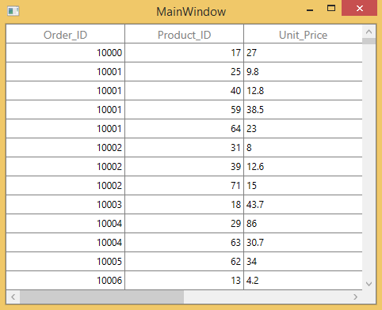
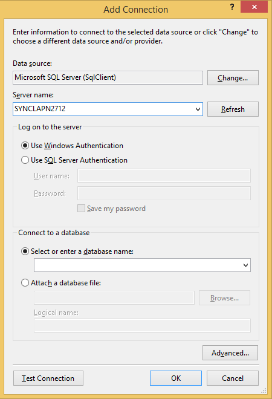
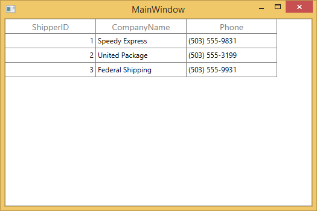
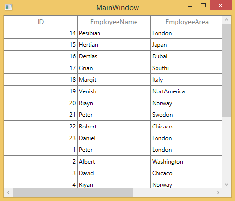

# Data Binding in WPF DataGrid (SfDataGrid)

WPF [DataGrid](https://www.syncfusion.com/wpf-controls/datagrid) (SfDataGrid) control is designed to display the bounded data in a tabular format. The data binding can be achieved by assigning the data sources to [SfDataGrid.ItemsSource](https://help.syncfusion.com/cr/wpf/Syncfusion.UI.Xaml.Grid.SfDataGrid.html#Syncfusion_UI_Xaml_Grid_SfDataGrid_ItemsSource) property.



<syncfusion:SfDataGrid  x:Name="dataGrid"
                        AutoGenerateColumns="True"
                        ItemsSource="{Binding Orders}" />



If the data source implements [INotifyCollectionChanged](https://docs.microsoft.com/en-us/dotnet/api/system.collections.specialized.inotifycollectionchanged) interface, then SfDataGrid control will automatically refresh the UI when item is added, removed or while list cleared. 

When you add, remove item in [ObservableCollection](https://docs.microsoft.com/en-us/dotnet/api/system.collections.objectmodel.observablecollection-1), SfDataGrid automatically refresh the UI as `ObservableCollection` implements `INotifyCollectionChanged`. But when you do the same in [List](https://docs.microsoft.com/en-us/dotnet/api/system.collections.generic.list-1), SfDataGrid will not refresh the UI automatically.

## Binding with IEnumerable

WPF DataGrid (SfDataGrid) control supports to bind any collection that implements the [IEnumerable](https://docs.microsoft.com/en-us/dotnet/api/system.collections.ienumerable) interface. All the data operations such as sorting, grouping, filtering, summaries are supported when you are binding collection derived from IEnumerable.

## Binding with DataTable

WPF DataGrid (SfDataGrid) control supports to bind the [DataTable](https://docs.microsoft.com/en-us/dotnet/api/system.data.datatable). SfDataGrid control automatically refresh the UI when you are binding DataTable as ItemsSource when rows are added, removed or cleared.

Below are the limitations when binding DataTable as ItemsSource to SfDataGrid.

* [GridUnboundColumn.Expression](https://help.syncfusion.com/cr/wpf/Syncfusion.UI.Xaml.Grid.GridUnBoundColumn.html#Syncfusion_UI_Xaml_Grid_GridUnBoundColumn_Expression) is not supported. You can achieve the expression support when binding DataTable using [DataColumn](https://docs.microsoft.com/en-us/dotnet/api/system.data.datacolumn) of DataTable by setting [DataColumn.Expression](https://docs.microsoft.com/en-us/dotnet/api/system.data.datacolumn.expression) property.
* `AddNewRow` is not support when filtering is enabled.
* Advanced Filtering does not support Case Sensitive filtering.
* [SfDataGrid.View.Filter](http://help.syncfusion.com/cr/wpf/Syncfusion.Data.ICollectionViewAdv.html) is not supported.
* Custom sorting is not supported.
* Filtering with [TimeSpan](https://docs.microsoft.com/en-us/dotnet/api/system.timespan) values is not supported.
* [SfDataGrid.LiveDataUpdateMode](https://help.syncfusion.com/cr/wpf/Syncfusion.UI.Xaml.Grid.SfDataGrid.html#Syncfusion_UI_Xaml_Grid_SfDataGrid_LiveDataUpdateMode) is not supported.
* Filtering with sub second components in `DateTime` values is not supported.

### Apply DataView.RowFilter on initial loading

When DataTable is bounded as `SfDataGrid.ItemsSource`, the [DataView.RowFilter](https://docs.microsoft.com/en-us/dotnet/api/system.data.dataview.rowfilter?view=netframework-4.8) will not be applied to the data on initial loading by default. The `DataView.RowFilter` can be applied to the data on initial loading by enabling [CanUseViewFilter](https://help.syncfusion.com/cr/wpf/Syncfusion.UI.Xaml.Grid.SfDataGrid.html#Syncfusion_UI_Xaml_Grid_SfDataGrid_CanUseViewFilter) property.

## Binding with dynamic data object

WPF DataGrid (SfDataGrid) control supports to bind [dynamic data object](https://docs.microsoft.com/en-us/dotnet/api/system.dynamic). Below are the limitations when you are binding dynamic data object,

1. SfDataGrid doesn’t support [LiveDataUpdateMode](https://help.syncfusion.com/cr/wpf/Syncfusion.UI.Xaml.Grid.SfDataGrid.html#Syncfusion_UI_Xaml_Grid_SfDataGrid_LiveDataUpdateMode) - `AllowDataShaping` and `AllowSummaryUpdate`.
2. In WinRT, UI won’t get refreshed when you are changing the property value. This is limitation in WinRT platform.
All the data operations (sorting, grouping, filtering and etc.) are supported when you are binding dynamic data object. If the data operations are not working as expected, set [SfDataGrid.IsDynamicItemsSource](https://help.syncfusion.com/cr/wpf/Syncfusion.UI.Xaml.Grid.SfDataGrid.html#Syncfusion_UI_Xaml_Grid_SfDataGrid_IsDynamicItemsSource) property as `true` .
 
 
## Binding Complex properties

SfDataGrid control provides support to bind complex property to its columns. To bind the complex property to [GridColumn](http://help.syncfusion.com/cr/wpf/Syncfusion.UI.Xaml.Grid.GridColumn.html), set the complex property path to [MappingName](https://help.syncfusion.com/cr/wpf/Syncfusion.UI.Xaml.Grid.GridColumnBase.html#Syncfusion_UI_Xaml_Grid_GridColumnBase_MappingName).



<syncfusion:SfDataGrid AutoGenerateColumns="False" ItemsSource="{Binding Orders}">
    <syncfusion:SfDataGrid.Columns>
        <syncfusion:GridTextColumn MappingName="OrderID" />
        <syncfusion:GridTextColumn MappingName="Customer.CustomerID" />
        <syncfusion:GridTextColumn MappingName="ShipCity" />
    </syncfusion:SfDataGrid.Columns>
</syncfusion:SfDataGrid>



All the data operations (sorting, grouping, filtering and etc.) are supported when you are binding complex property. If the data operations are not working as expected, set [GridColumn.UseBindingValue](https://help.syncfusion.com/cr/wpf/Syncfusion.UI.Xaml.Grid.GridColumn.html#Syncfusion_UI_Xaml_Grid_GridColumn_UseBindingValue) as `true` to make it work. 

### Limitations when binding complex property 

* SfDataGrid doesn’t support [LiveDataUpdateMode](https://help.syncfusion.com/cr/wpf/Syncfusion.UI.Xaml.Grid.SfDataGrid.html#Syncfusion_UI_Xaml_Grid_SfDataGrid_LiveDataUpdateMode) - `AllowDataShaping` and `AllowSummaryUpdate`.

## Binding Indexer properties

SfDataGrid control provides support to bind an indexer property to its columns. To bind an indexer property to [GridColumn](http://help.syncfusion.com/cr/wpf/Syncfusion.UI.Xaml.Grid.GridColumn.html), set the indexer property path to [MappingName](https://help.syncfusion.com/cr/wpf/Syncfusion.UI.Xaml.Grid.GridColumnBase.html#Syncfusion_UI_Xaml_Grid_GridColumnBase_MappingName). 



<syncfusion:SfDataGrid x:Name="dataGrid" ItemsSource="{Binding Students}" AutoGenerateColumns="False">
    <syncfusion:SfDataGrid.Columns>
        <syncfusion:GridTextColumn MappingName="RollNo"/>
        <syncfusion:GridTextColumn MappingName="Name"/>
        <syncfusion:GridTextColumn MappingName="Marks[0]"/>
    </syncfusion:SfDataGrid.Columns>
</syncfusion:SfDataGrid>


this.dataGrid.Columns.Add(new GridTextColumn() {MappingName="Marks[0]"});



All the data operations (sorting, grouping, filtering and etc.) are supported when you are binding indexer property. If the data operations are not working as expected, set [GridColumn.UseBindingValue](https://help.syncfusion.com/cr/wpf/Syncfusion.UI.Xaml.Grid.GridColumn.html#Syncfusion_UI_Xaml_Grid_GridColumn_UseBindingValue) as `true` to make it work.
 
### Limitations when binding indexer property 

* SfDataGrid doesn’t support [LiveDataUpdateMode](https://help.syncfusion.com/cr/wpf/Syncfusion.UI.Xaml.Grid.SfDataGrid.html#Syncfusion_UI_Xaml_Grid_SfDataGrid_LiveDataUpdateMode) - `AllowDataShaping` and `AllowSummaryUpdate`.

## Defining source data type

Based on type of data item bound to SfDataGrid, the data operations and column auto generation are carried out. You can specify the type of underlying data item explicitly for doing data operation by setting [SfDataGrid.SourceType](https://help.syncfusion.com/cr/wpf/Syncfusion.UI.Xaml.Grid.SfDataGrid.html#Syncfusion_UI_Xaml_Grid_SfDataGrid_SourceType) property.



<syncfusion:SfDataGrid x:Name="dataGrid" ItemsSource="{Binding Orders}" SourceType="{x:Type local:OrderInfo}"/>


dataGrid.SourceType = typeof(OrderInfo);



For example, when you set [SourceType](https://help.syncfusion.com/cr/wpf/Syncfusion.UI.Xaml.Grid.SfDataGrid.html#Syncfusion_UI_Xaml_Grid_SfDataGrid_SourceType) property, the columns are generated based on members of SourceType regardless of data items actual type. When your `ItemsSource` have different types derived from same type, you can set SourceType as base type for all different types.

## Events

### ItemsSourceChanged

[SfDataGrid.ItemsSourceChanged](https://help.syncfusion.com/cr/wpf/Syncfusion.UI.Xaml.Grid.SfDataGrid.html) event occurs when the data source is changed by using ItemsSource property.
This event receives two arguments namely `sender` that handles `SfDataGrid` and [GridItemsSourceChangedEventArgs ](http://help.syncfusion.com/cr/wpf/Syncfusion.UI.Xaml.Grid.GridItemsSourceChangedEventHandler.html)as objects.

The [GridItemsSourceChangedEventArgs ](http://help.syncfusion.com/cr/wpf/Syncfusion.UI.Xaml.Grid.GridItemsSourceChangedEventHandler.html)object contains the following properties:

* [OldItemsSource](https://help.syncfusion.com/cr/wpf/Syncfusion.UI.Xaml.Grid.GridItemsSourceChangedEventArgs.html#Syncfusion_UI_Xaml_Grid_GridItemsSourceChangedEventArgs_OldItemsSource) - Gets the value of old data source
* [NewItemsSource](https://help.syncfusion.com/cr/wpf/Syncfusion.UI.Xaml.Grid.GridItemsSourceChangedEventArgs.html#Syncfusion_UI_Xaml_Grid_GridItemsSourceChangedEventArgs_NewItemsSource) - Get the value of new data source

## View

WPF DataGrid has the View property of type [ICollectionViewAdv](http://help.syncfusion.com/cr/wpf/Syncfusion.Data.ICollectionViewAdv.html) interface that implements ICollectionView interface. View is responsible for maintain and manipulation data and other advanced operations like Sorting, Grouping, Filtering and etc. 

When you bind Collection to `ItemsSource` property of SfDataGrid, then View will be created and maintains the operations on Data such as Grouping, Filtering, Sorting, Insert, Delete, and Modification. 

Following are some important properties that can be used for various purposes.

N> DataGrid creates different types of views derived from `ICollectionViewAdv` interface based on ItemsSource.

<table>
<tr>
<th>Property</th>
<th>Type</th>
<th>Description</th>
</tr>
<tr>
<td>Records</td>
<td>IRecordsList</td>
<td>Maintains the Records that are displayed in View when DataGrid is not Grouped.</td></tr>
<tr>
<td>TopLevelGroup</td>
<td>TopLevelGroup</td>
<td>Maintains the Group information when DataGrid is Grouped.</td>
</tr>
<tr>
<td>TopLevelGroup.DisplayElements</td>
<td>GroupDisplayElements</td>
<td>Maintains the Records and Group information that are displayed in View when DataGrid is Grouped.</td>
</tr>
<tr>
<td>Filter</td>
<td>Predicate&lt;object&gt;</td>
<td>Get or sets the method that determines the data is suitable to be displayed in View. </td>
</tr>
<tr>
<td>FilterPredicates</td>
<td>ObservableCollection&lt;IFilterDefinition&gt;</td>
<td>Maintains the FilterPredicates that are created while filtering using Filtering UI. </td>
</tr>
<tr>
<td>Groups</td>
<td>ReadOnlyObservableCollection&lt;object&gt;</td>
<td>Maintains the top-level group information. It returns null value when there are no groups. </td>
</tr>
<tr>
<td>GroupDescriptions</td>
<td>ObservableCollection&lt;GroupDescription&gt;</td>
<td>Maintains the GroupDescription collection information. It describes how the items in the collection are grouped in the view.</td>
</tr>
<tr>
<td>SortDescriptions</td>
<td>SortDescriptionCollection</td>
<td>Maintains the SortDescription collection information. It describes how the items in the collection are sort in the view.</td>
</tr>
<tr>
<td>SourceCollection</td>
<td>IEnumerable</td>
<td>Maintains the underlying source collection.</td>
</tr>
<tr>
<td>TableSummaryRows</td>
<td>ObservableCollection&lt;ISummaryRow&gt;</td>
<td>Maintains the TableSummaryRows collection information. To know more about TableSummaries {{ '[Refer here](http://help.syncfusion.com/wpf/sfdatagrid/summaries)' | markdownify }} </td>
</tr>
<tr>
<td>SummaryRows</td>
<td>ObservableCollection&lt;ISummaryRow&gt;</td>
<td>Maintains the SummaryRows collection information. To know more about summaries {{ '[Refer here](http://help.syncfusion.com/wpf/sfdatagrid/summaries)' | markdownify }} </td>
</tr>
<tr>
<td>CaptionSummaryRows</td>
<td>ISummaryRow</td>
<td>Maintains the CaptionSummaryRow information.To know more about CaptionSummaries {{ '[Refer here](http://help.syncfusion.com/wpf/sfdatagrid/summaries)' | markdownify }}</td>
</tr>
</table>

The following events are associated with View.

### RecordPropertyChanged

[RecordPropertyChanged](https://help.syncfusion.com/cr/wpf/Syncfusion.Data.ICollectionViewAdv.html) event is raised when the DataModel property value is changed, if the DataModel implements the INotifyPropertyChanged interface. The event receives with two arguments namely sender that handles the DataModel and [PropertyChangedEventArgs](https://docs.microsoft.com/en-us/dotnet/api/system.componentmodel.propertychangedeventargs?f1url=%3FappId%3DDev10IDEF1%26l%3DEN-US%26k%3Dk(System.ComponentModel.PropertyChangedEventArgs)%26rd%3Dtrue&view=net-5.0) as object.

`PropertyChangedEventArgs` has below property,

[PropertyName](https://docs.microsoft.com/en-us/dotnet/api/system.componentmodel.propertychangedeventargs.propertyname) – It denotes the PropertyName of the changed value.

### CollectionChanged

[CollectionChanged](https://help.syncfusion.com/cr/wpf/Syncfusion.Data.CollectionViewAdv.html) event is raised whenever that is some change in Records / DisplayElements collection. The event receives two arguments namely sender that handles View object and [NotifyCollectionChangedEventArgs](https://docs.microsoft.com/en-us/dotnet/api/system.collections.specialized.notifycollectionchangedeventargs?f1url=%3FappId%3DDev10IDEF1%26l%3DEN-US%26k%3Dk(System.Collections.Specialized.NotifyCollectionChangedEventArgs)%26rd%3Dtrue&view=net-5.0) as object.

`NotifyCollectionChangedEventArgs` has below properties,

[Action](https://docs.microsoft.com/en-us/dotnet/api/system.collections.specialized.notifycollectionchangedeventargs.action?f1url=%3FappId%3DDev10IDEF1%26l%3DEN-US%26k%3Dk(System.Collections.Specialized.NotifyCollectionChangedEventArgs.Action)%26rd%3Dtrue&view=net-5.0) - It contains the current action. (i.e.) Add, Remove, Move, Replace, Reset.

[NewItems](https://docs.microsoft.com/en-us/dotnet/api/system.collections.specialized.notifycollectionchangedeventargs.newitems?f1url=%3FappId%3DDev10IDEF1%26l%3DEN-US%26k%3Dk(System.Collections.Specialized.NotifyCollectionChangedEventArgs.NewItems)%26rd%3Dtrue&view=net-5.0) - It contains the list of new items involved in the change.

[OldItems](https://docs.microsoft.com/en-us/dotnet/api/system.collections.specialized.notifycollectionchangedeventargs.olditems?f1url=%3FappId%3DDev10IDEF1%26l%3DEN-US%26k%3Dk(System.Collections.Specialized.NotifyCollectionChangedEventArgs.OldItems)%26rd%3Dtrue&view=net-5.0) - It contains the list of old items affected by the Action.

[NewStartingIndex](https://docs.microsoft.com/en-us/dotnet/api/system.collections.specialized.notifycollectionchangedeventargs.newstartingindex?f1url=%3FappId%3DDev10IDEF1%26l%3DEN-US%26k%3Dk(System.Collections.Specialized.NotifyCollectionChangedEventArgs.NewStartingIndex)%26rd%3Dtrue&view=net-5.0) - It contains the index at which the change occurred.

[OldStartingIndex](https://docs.microsoft.com/en-us/dotnet/api/system.collections.specialized.notifycollectionchangedeventargs.oldstartingindex?f1url=%3FappId%3DDev10IDEF1%26l%3DEN-US%26k%3Dk(System.Collections.Specialized.NotifyCollectionChangedEventArgs.OldStartingIndex)%26rd%3Dtrue&view=net-5.0)-It contains the index at which the Action occurred.

### SourceCollectionChanged

[SourceCollectionChanged](https://help.syncfusion.com/cr/wpf/Syncfusion.Data.ICollectionViewAdv.html) event is raised when you make changes in SourceCollection for example add or remove the collection. The event receives two arguments namely sender that handles GridQueryableCollectionViewWrapper object and NotifyCollectionChangedEventArgs as object.

`NotifyCollectionChangedEventArgs` has below properties,

[Action](https://docs.microsoft.com/en-us/dotnet/api/system.collections.specialized.notifycollectionchangedeventargs.action?f1url=%3FappId%3DDev10IDEF1%26l%3DEN-US%26k%3Dk(System.Collections.Specialized.NotifyCollectionChangedEventArgs.Action)%26rd%3Dtrue&view=net-5.0) - It contains the current action. (i.e.) Add, Remove, Move, Replace, Reset.

[NewItems](https://docs.microsoft.com/en-us/dotnet/api/system.collections.specialized.notifycollectionchangedeventargs.newitems?f1url=%3FappId%3DDev10IDEF1%26l%3DEN-US%26k%3Dk(System.Collections.Specialized.NotifyCollectionChangedEventArgs.NewItems)%26rd%3Dtrue&view=net-5.0) - It contains the list of new items involved in the change.

[OldItems](https://docs.microsoft.com/en-us/dotnet/api/system.collections.specialized.notifycollectionchangedeventargs.olditems?f1url=%3FappId%3DDev10IDEF1%26l%3DEN-US%26k%3Dk(System.Collections.Specialized.NotifyCollectionChangedEventArgs.OldItems)%26rd%3Dtrue&view=net-5.0) - It contains the list of old items affected by the Action.

[NewStartingIndex](https://docs.microsoft.com/en-us/dotnet/api/system.collections.specialized.notifycollectionchangedeventargs.newstartingindex?f1url=%3FappId%3DDev10IDEF1%26l%3DEN-US%26k%3Dk(System.Collections.Specialized.NotifyCollectionChangedEventArgs.NewStartingIndex)%26rd%3Dtrue&view=net-5.0) - It contains the index at which the change occurred.

[OldStartingIndex](https://docs.microsoft.com/en-us/dotnet/api/system.collections.specialized.notifycollectionchangedeventargs.oldstartingindex?f1url=%3FappId%3DDev10IDEF1%26l%3DEN-US%26k%3Dk(System.Collections.Specialized.NotifyCollectionChangedEventArgs.OldStartingIndex)%26rd%3Dtrue&view=net-5.0) - It contains the index at which the Action occurred.

The following is the methods that are associated with View which can be used to defer refresh the view.

<table>
<tr>
<th>Method Name</th>
<th>Description</th>
</tr>
<tr>
<td>DeferRefresh</td>
<td>
Enter the defer cycle so that you can perform all data operations in view and update once. </td>
</tr>
<tr>
<td>BeginInit & EndInit</td>
<td>
When BeginInit method is called it suspends all the updates until EndInit method is called. You can perform all the updation with in these methods and update the view at once.</td>
</tr>
</table>

N> View has properties that already defined in SfDataGrid. It recommended setting those properties via SfDataGrid.

## Binding data from WCF service

In this walkthrough, you will learn about how to create a WCF service and load it to SfDataGrid control. 
Below are the topics,

1. Creating the WCF data service 
2. Creating the WPF Client Application 
3. Loading data from WCF Service

Reference:
[https://docs.microsoft.com/en-us/previous-versions/visualstudio/visual-studio-2015/data-tools/bind-wpf-controls-to-a-wcf-data-service?view=vs-2015](https://docs.microsoft.com/en-us/previous-versions/visualstudio/visual-studio-2015/data-tools/bind-wpf-controls-to-a-wcf-data-service?view=vs-2015)

### Create the WCF data service 

To create the WCF data service, follow the steps mentioned in the below MSDN link or the follow below steps,

[https://docs.microsoft.com/en-us/dotnet/framework/data/wcf/creating-the-data-service](https://docs.microsoft.com/en-us/dotnet/framework/data/wcf/creating-the-data-service).

You can skip the below steps and directly add service reference to the client application, if you are having already running service.
 
### Create an ASP.NET Web Application

To create an ASP.NET Web Application, follow the below steps,

1. In NewProject dialog box, select the **Web** template under **Visual C#** and then select **ASP.NET Web Application**.
2. Name the project file as **WCF_Binding** and then click **OK** to create project.
    
    

### Define data model using ADO.NET Entity Data Model

Follow the below steps to define **ADO.NET Entity Data Model** in the web project created in the previous step,

1. Right-click on your web project, select **Add** option and then click **New Item**.
2. In the **Add New Item** wizard, select **ADO.NET Entity Data Model** under **Data** Template.
3. Name the data model as “**Northwind**” and click **Add** button.
4. In the **Entity Data Model Wizard**, select **EF Designer from Database**, and then click **Next**.

    

5. **Choose Your Data Connection** page appears and select **Northwind** database available in the drop-down list (OR) select the **New Connection** button to configure a new data connection. For more information, you can refer: [How to: Create Connections to SQL Server Databases](https://docs.microsoft.com/en-us/previous-versions/visualstudio/visual-studio-2008/s4yys16a(v=vs.90)).

    

6. Click **Next** button and the **Choose Your Database Objects and settings** page appears.
7. Expand **Tables** node and select Order_Details table.

    

8. Now select **Finish** button to add the entity model for “Northwind.edmx” file to your web project.

### Add the WCF Data Service to web application

To add the WCF Data Service to your web project created in first step,

1. Right-click on your web project, select **Add** option and then click **New Item.**
2. In **Add New Item Wizard**, Select **WCF Data Service 5.6** under **Web** Template.
3. In **Name** text box enter **WcfDataService1.svc** and then click **Add** button.
    

4. Once service is added and configure the read and write access to resources in **InitializeService** function of DataService.



public class WcfDataService1 : DataService<NORTHWNDEntities>
{

    // This method is called only once to initialize service-wide policies.

    public static void InitializeService(DataServiceConfiguration config)
    {

        // TODO: set rules to indicate which entity sets and service operations are visible, Updatable , etc.

        // Examples:
        config.SetEntitySetAccessRule("*", EntitySetRights.AllRead);

        // config.SetEntitySetAccessRule("MyEntitySet", EntitySetRights.AllRead);

        // config.SetServiceOperationAccessRule("MyServiceOperation", ServiceOperationRights.All);

        //config.DataServiceBehavior.MaxProtocolVersion = DataServiceProtocolVersion.V3;
    }
}



5.On the menu bar, select Debug->Start without Debugging to execute the service. A browser window opens and the XML schema for the service is displayed. You can also get the localhost address for the service here.

### Creating the WPF Client Application

To create the WPF client application, add new WPF project in the same solution and name the project as NorthwindEditor. After creating the WPF application, you can add the service created in previous step to your WPF project.

To add service reference to client application,

1. Right-click on your WPF project and select **Add Service Reference** option to add the service created in previous step.
2. **Add Service Reference** wizard appears, then select **Discover** button which displays the list of available services in **Services** panel.
3. Select WcfDataService1.svc and click **OK** option to add the service reference to your WPF project.

    

### Loading data from WCF service

To load the data from WCF service to SfDataGrid,
 
1. Add SfDataGrid control and the required assemblies in your WPF application.
2. Wire the **SfDataGrid.Loaded** event and set the northwindEntities.Order_Details table to `SfDataGrid.ItemsSource`.  
3. Replace local host address as URI of your service. You can get the local host address from the shortcut menu of the “WcfDataService1.svc” file in Solution Explorer and select **View** in Browser. Internet Explorer opens and the XML schema for the service is displayed.
4. Copy the localhost address and replace it in your service URI.
5. Set the WPF application as StartUp project.



this.dataGrid.Loaded += dataGrid_Loaded;

void dataGrid_Loaded(object sender, RoutedEventArgs e)
{
    NORTHWNDEntities northwindEntities = new NORTHWNDEntities(new Uri("http://localhost:58378/WcfDataService1.svc/"));
    this.dataGrid.ItemsSource = northwindEntities.Order_Details;
}



Now, run the application and you can see the SfDataGrid control loaded with data from WCF service.
 
 
## Binding data from ADO.NET Entity Framework

SfDataGrid control supports to bind data from ADO.NET Entity Framework. In this walk-through, you will learn about binding data from ADO.NET Entity Framework and save back the changes to the database. You can download the entire source code of this demo from [here](http://www.syncfusion.com/downloads/support/directtrac/general/ze/ADO.Net_EntityFrmeworkDemo-1459994268.zip).

To load the data from ADO.NET Entity Framework, you can refer the steps mentioned in below follow the below steps,

1. Creating WPF client Application.
2. Defining Data Model using Entity Framework 4.0
3. Loading data from Entity Framework.

References :

[https://docs.microsoft.com/en-us/previous-versions/dd465159(v=vs.120)](https://docs.microsoft.com/en-us/previous-versions/dd465159(v=vs.120))

[https://docs.microsoft.com/en-us/previous-versions/dotnet/netframework-4.0/ee340709(v=vs.100)](https://docs.microsoft.com/en-us/previous-versions/dotnet/netframework-4.0/ee340709(v=vs.100))

[https://docs.microsoft.com/en-us/ef/ef6/modeling/designer/workflows/database-first](https://docs.microsoft.com/en-us/ef/ef6/modeling/designer/workflows/database-first)

### Creating WPF client Application

To load data from Entity Framework, create a new WPF Application and add the SfDataGrid control to your application.

### Defining Data Model using Entity Framework 4.0

To create Data Model using Entity Framework in WPF application created in the previous step,
 
1. Right-click your WPF project, select **Add** option and then click **New Item**.
2. The **Add New Item** wizard appears, select “**ADO.NET Entity Data Model** “ from the **Data** node.
3. Name the file as **Model1.edmx** and then select **Add** button.

    

4.	The Entity Data Model wizard appears.

5. In the **Choose Model Contents**, select **Generate from database** option and then click **Next**.

    

6. In the **Choose Your Data Connection**, select **Northwind** database from the drop-down list for data connection. To configure/modify connection, you can refer: [How to: Create Connections to SQL Server Databases](https://docs.microsoft.com/en-us/previous-versions/visualstudio/visual-studio-2008/s4yys16a(v=vs.90)).

    

7. Enable the **Save entity connection settings in App.config as** check box and then click **Next**.
8. In the **Choose Your Database Objects and Settings**, expand the Tables node and select the **Order_Details** table.

    

9. Click **Finish** button to add the **EntityBindingFramework.edmx** file to your application. The **Entity diagram** for the **Order_detail** table is opened.

### Loading data from Entity Framework data service

To access data from the database created in previous step, create a ViewModel class with OrderDetails property and the OrderDetails is initialized by accessing the Order_Details table from the database.



public class ViewModel
{
    private List<Order_Detail> orderDetails;

    public List<Order_Detail> OrderDetails
    {
        get { return orderDetails; }
        set { orderDetails = value; }
    }

    public ViewModel()
    {
        NORTHWNDEntities northWind = new NORTHWNDEntities();
        OrderDetails = (List<Order_Detail>)(from data in northWind.Order_Details
                                            select data).ToList();
    }        
}



To populate the SfDataGrid using Entity Framework, bind the collection created in previous step to [SfDataGrid.ItemsSource](https://help.syncfusion.com/cr/wpf/Syncfusion.UI.Xaml.Grid.SfDataGrid.html#Syncfusion_UI_Xaml_Grid_SfDataGrid_ItemsSource) property and set the `DataContext` as ViewModel.



<syncfusion:SfDataGrid  x:Name="dataGrid" 
                        AllowEditing="True" 
                        AutoGenerateColumns="True" 
                        ItemsSource="{Binding OrderDetails}"/>



Now, run the application and you can see the following screenshot shows the SfDataGrid control populated with data from Entity Framework data service.

 
    

### Save back to Database

You can save the row or cell level changes back to the data source by handling [SfDataGrid.RowValidated](https://help.syncfusion.com/cr/wpf/Syncfusion.UI.Xaml.Grid.SfDataGrid.html), [SfDataGrid.CurrentCellValidated](https://help.syncfusion.com/cr/wpf/Syncfusion.UI.Xaml.Grid.SfDataGrid.html) or [SfDataGrid.CurrentCellValueChanged](https://help.syncfusion.com/cr/wpf/Syncfusion.UI.Xaml.Grid.SfDataGrid.html) events. 

The below code example will save back the changed value of row to data  base.



NORTHWNDEntities northWind;

public MainWindow()
{
    InitializeComponent();
    northWind = new NORTHWNDEntities();
    this.dataGrid.RowValidated += dataGrid_RowValidated;
}

void dataGrid_RowValidated(object sender, Syncfusion.UI.Xaml.Grid.RowValidatedEventArgs args)
{
    Order_Detail newRecord = args.RowData as Order_Detail;
    Order_Detail order = northWind.Order_Details.First(i => i.OrderID == newRecord.OrderID);
    order.OrderID = newRecord.OrderID;
    order.ProductID = newRecord.ProductID;
    order.Quantity = newRecord.Quantity;
    order.UnitPrice = newRecord.UnitPrice;
    order.Discount = newRecord.Discount;
    northWind.Entry(order).State = EntityState.Modified;
    northWind.SaveChanges();           
}



## Binding data from LINQ to SQL

SfDataGrid control supports to bind data from LINQ to SQL .In this walkthrough, you will learn about binding data from LINQ to SQL and save back the changes to the Database.

1. Creating WPF Application
2. Adding data model using LINQ to SQL classes 
3. Loading data from LINQ to SQL classes 
4. Binding data to SfDataGrid

References :

[https://docs.microsoft.com/en-us/dotnet/framework/data/adonet/sql/linq/data-binding](https://docs.microsoft.com/en-us/dotnet/framework/data/adonet/sql/linq/data-binding)

[https://docs.microsoft.com/en-us/dotnet/framework/data/adonet/sql/linq/insert-update-and-delete-operations](https://docs.microsoft.com/en-us/dotnet/framework/data/adonet/sql/linq/insert-update-and-delete-operations)

### Creating WPF Client Application

To add LINQ to SQL, create a new WPF application and add the SfDataGrid control in your application.
 
### Adding data model using LINQ to SQL

To create data model using LINQ to SQL in WPF project follow the below steps.

1. Right-click on your WPF project, select **Add** option and then click **New Item**.
2. The **Add New Item** wizard appears, select **LINQ to SQL Classes** from the **Visual C**#.
3. Name the file as **Northwind** and then select **Add** option to add the **Northwind.dbml** in your project.

    

4.	Once the Northwind.dbml is added in your project, then the design view is opened.

    

5. You can add new Database connection by clicking add icon button in Server Explorer. 
6. The **Add Connection** wizard appeared with the default data source as **Microsoft SQL Server Database File (SqlClient**).

    

7. Click **Change** to open the **Change Data Source** dialog box and select the type of data source that you have owned. 
8. In the **Server name** option, click the **Refresh** button to select the server from the drop down list.
9. Enable **select or enter a database name** radio button to select database from the drop down list under the **Connect to a database** option.

    

10. Click **Test Connection** to check whether the connection with your database is succeeded or not.
11. Once the connection is succeeded, click **OK** button to add database in your server explorer.

    

12. Drag **Shippers** table in to design view of **Northwind.dbml**. The **Entity model diagram** for Shippers table is generated once it is dropped in to design view.
 
### Loading data from LINQ to SQL classes 

To load the database created in previous step in to SfDataGrid, create a ViewModel class with Shippers property and it is initialized with Shippers table in Northwind database.



public class ViewModel
{
    private List<Shipper> shippers;

    public List<Shipper> Shippers
    {
        get { return shippers; }
        set { shippers = value; }
    }

    public ViewModel()
    {
        NorthwindDataContext northWind = new NorthwindDataContext();
        shippers = (from data in northWind.Shippers
                    select data).ToList();
    }
}



N> NorthwindDataContext is from `Northwind.Designer.cs` file (it is from the file that is added with LINQ to SQL). Shippers are selected table from Database.

### Binding data to SfDataGrid

To bind data from LINQ to SQL classes, assign the Shippers collection created in the previous step, to [SfDataGrid.ItemsSource](https://help.syncfusion.com/cr/wpf/Syncfusion.UI.Xaml.Grid.SfDataGrid.html#Syncfusion_UI_Xaml_Grid_SfDataGrid_ItemsSource) property and set the `DataContext` as ViewModel.



this.dataGrid.ItemsSource = (this.dataGrid.DataContext as ViewModel).Shippers;



Now, run the application and you can see the following screenshot shows the SfDataGrid control loaded with Shippers data.

 
    

### Save back to Database

You can save the row or cell level changes back to the data source by handling [SfDataGrid.RowValidated](https://help.syncfusion.com/cr/wpf/Syncfusion.UI.Xaml.Grid.SfDataGrid.html), [SfDataGrid.CurrentCellValidated](https://help.syncfusion.com/cr/wpf/Syncfusion.UI.Xaml.Grid.SfDataGrid.html) or [SfDataGrid.CurrentCellValueChanged](https://help.syncfusion.com/cr/wpf/Syncfusion.UI.Xaml.Grid.SfDataGrid.html) events. 

The below code example will save back the changed value of row to database.



this.dataGrid.RowValidated += dataGrid_RowValidated;

void dataGrid_RowValidated(object sender, Syncfusion.UI.Xaml.Grid.RowValidatedEventArgs args)
{
    NorthwindDataContext northWind = new NorthwindDataContext();

    Shipper newRecord = args.RowData as Shipper;
    Shipper shipper = (from data in northWind.Shippers
                        where data.ShipperID == newRecord.ShipperID
                        select data).First() as Shipper;
    shipper.CompanyName = newRecord.CompanyName;
    shipper.Phone = newRecord.Phone;
    northWind.SubmitChanges();   
}



## Binding data from ADO.NET

SfDataGrid control supports to load the data using [ADO.NET](https://docs.microsoft.com/en-us/previous-versions/dotnet/articles/aa302325(v=msdn.10)). In this walk-through, you will learn about binding data from ADO.NET service and save back the changes to the database.

1. Creating WPF application 
2. Connecting  database to WPF application
3. Loading data using ADO.NET

### Creating WPF Application

To display the data from the ADO.NET data service, create a new WPF Application.
 
### Connecting WPF application to Databases

To connect SQL database to your WPF application, refer the below MSDN link or follow the below steps,

[https://docs.microsoft.com/en-us/previous-versions/visualstudio/visual-studio-2008/s4yys16a(v=vs.90)](https://docs.microsoft.com/en-us/previous-versions/visualstudio/visual-studio-2008/s4yys16a(v=vs.90))

1. In the Tools menu, select the **Connect to Database**.
2. The **Add Connection** wizard appeared with the default data source as **Microsoft SQL Server Database File (SqlClient)**.

    

3. Click **Change** to open the **Change Data Source** dialog box and select the type of data source that you have owned.
 
    

4. In the **Server name** option, click the **Refresh** button to select the server from the drop down list.
5. Enable **select or enter a database name** radio button to select your database from the drop down list under the **Connect to a database** option.
6. Click **Test Connection** to check whether the database connection is succeeded or not.
7. Once the connection is succeeded, click **OK** button to add database in your server explorer.

    

8. To get connection string for the database, right-click on your database and then click **properties** option.

### Loading data from ADO.NET

To access the data from data source using ADO.NET, follow the below steps.

1. Create a user interface with SfDataGrid control and add the required assemblies to your WPF application.
2. Create a connection through any of the [.NET Framework data provider](https://docs.microsoft.com/en-us/dotnet/framework/data/adonet/data-providers) based on the type of data source that you have owned.
3. Set the [ItemsSource](https://help.syncfusion.com/cr/wpf/Syncfusion.UI.Xaml.Grid.SfDataGrid.html#Syncfusion_UI_Xaml_Grid_SfDataGrid_ItemsSource) as Shippers table from data set. For more information refer [here](https://docs.microsoft.com/en-us/previous-versions/visualstudio/visual-studio-2008/s4yys16a(v=vs.90)).



public partial class MainWindow : Window
{
    DataSet ds = new DataSet();

    SqlConnection connectionString = new SqlConnection("Data Source=SYNCLAPN2712;Initial Catalog=NORTHWND.MDF;Integrated Security=True");
    SqlDataAdapter adapter = null;

    public MainWindow()
    {            
        InitializeComponent();
        BindData();
    }

    private void BindData()
    {
        connectionString.Open();
        adapter = new SqlDataAdapter("Select * from Shippers ", connectionString);
        adapter.Fill(ds, "Shippers");
        dataGrid.ItemsSource = ds.Tables["Shippers"];
    }
}



Now, run the application and you can see the following screenshot displays the SfDataGrid loaded the data using ADO.NET.

 
    

### Save back to Database

You can save the row or cell level changes back to the data source by handling [SfDataGrid.RowValidated](https://help.syncfusion.com/cr/wpf/Syncfusion.UI.Xaml.Grid.SfDataGrid.html), [SfDataGrid.CurrentCellValidated](https://help.syncfusion.com/cr/wpf/Syncfusion.UI.Xaml.Grid.SfDataGrid.html) or [SfDataGrid.CurrentCellValueChanged](https://help.syncfusion.com/cr/wpf/Syncfusion.UI.Xaml.Grid.SfDataGrid.html) events. 

The below code example will save back the changed value of row to database.
You can refer the below MSDN link for more information.

[https://docs.microsoft.com/en-us/dotnet/framework/data/adonet/updating-data-sources-with-dataadapters](https://docs.microsoft.com/en-us/dotnet/framework/data/adonet/updating-data-sources-with-dataadapters)



this.dataGrid.RowValidated += dataGrid_RowValidated;

void dataGrid_RowValidated(object sender, Syncfusion.UI.Xaml.Grid.RowValidatedEventArgs args)
{
    adapter.UpdateCommand = new SqlCommand("UPDATE Shippers SET CompanyName = @CompanyName " + "," + "Phone = @Phone " +
"WHERE ShipperID = @ShipperID", connectionString);
    adapter.UpdateCommand.Parameters.Add("@CompanyName", SqlDbType.NVarChar, 40, "CompanyName");
    adapter.UpdateCommand.Parameters.Add("@Phone", SqlDbType.NVarChar, 24, "Phone");
    SqlParameter parameter = adapter.UpdateCommand.Parameters.Add("@ShipperID", SqlDbType.Int, 4);
    parameter.SourceColumn = "ShipperID";
    parameter.SourceVersion = DataRowVersion.Original;
    DataTable shippersTable = new DataTable();
    shippersTable.Clear();
    adapter.Fill(shippersTable);
    DataRow shippersRow = shippersTable.Rows[args.RowIndex - 1];
    shippersRow["CompanyName"] = (args.RowData as DataRowView).Row.ItemArray[1];
    shippersRow["Phone"] = (args.RowData as DataRowView).Row.ItemArray[2];
    adapter.Update(shippersTable);        
}



## Binding data from Microsoft Access

SfDataGrid control supports to bind data from Microsoft Access database .In this section, you will learn about how to bind the data from Microsoft Access database to SfDataGrid. 

To load the data from Microsoft Access database,

1. Create a new WPF project.
2. Import the Microsoft Access database file to WPF project.
3. You can connect the Microsoft Access Database through the `OleDbConnection`.
4. Create and open the connection.
5. Use `OleDbDataAdapter` to load the data in to `DataSet`.
6. Access the Employee table from the DataSet and set the Employee collection as `ItemsSource` of SfDataGrid.




this.dataGrid.Loaded+=dataGrid_Loaded;

void dataGrid_Loaded(object sender, RoutedEventArgs e)
{            
    System.Data.OleDb.OleDbConnection con = new System.Data.OleDb.OleDbConnection(@"Provider=Microsoft.ACE.OLEDB.12.0;Data Source=EmployeeDatabase.accdb;Persist Security Info=True");           
    System.Data.OleDb.OleDbDataAdapter myDataAdapter = new System.Data.OleDb.OleDbDataAdapter("SELECT * FROM Employee", con);           
    DataSet ds = new DataSet();
    con.Open();
    myDataAdapter.Fill(ds, "Employee");
    con.Close();            
    dataGrid.ItemsSource = ds.Tables["Employee"];
}



7.Now, run the application and you can see following screenshot shows the SfDataGrid control populated data from Microsoft Access database.
     
    

## How To

### Maintain scroll position when changing the ItemsSource for SfDataGrid

By default, the scrollbar position is not maintained and gets reset when changing the ItemsSource of the SfDataGrid. But, you can maintain the scrollbar position of the SfDataGrid by setting the [SfDataGrid.CanMaintainScrollPosition](https://help.syncfusion.com/cr/wpf/Syncfusion.UI.Xaml.Grid.SfDataGrid.html#Syncfusion_UI_Xaml_Grid_SfDataGrid_CanMaintainScrollPosition) value to `true`.



<syncfusion:SfDataGrid  x:Name="dataGrid"
                        CanMaintainScrollPosition="True"
                        ItemsSource="{Binding Orders}"/>


dataGrid.CanMaintainScrollPosition = true;


