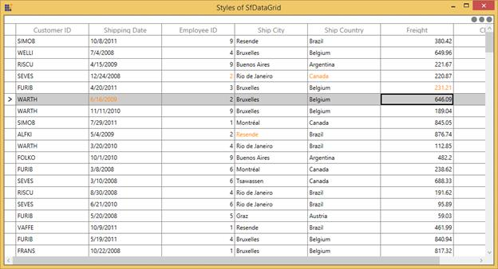

# Editing in WPF DataGrid (SfDataGrid)

DataGrid provides support for editing and it can be enabled or disabled by setting [SfDataGrid.AllowEditing](https://help.syncfusion.com/cr/wpf/Syncfusion.UI.Xaml.Grid.SfGridBase.html#Syncfusion_UI_Xaml_Grid_SfGridBase_AllowEditing) property.



<syncfusion:SfDataGrid x:Name="dataGrid"
                       AllowEditing="True"
                       AutoGenerateColumns="True"
                       ItemsSource="{Binding Orders}" />



dataGrid.AllowEditing = true;



You can enable or disable editing for particular column by setting [GridColumn.AllowEditing](https://help.syncfusion.com/cr/wpf/Syncfusion.UI.Xaml.Grid.GridColumnBase.html#Syncfusion_UI_Xaml_Grid_GridColumnBase_AllowEditing) property.



<syncfusion:GridTextColumn AllowEditing="True" MappingName="OrderID" />



dataGrid.Columns["OrderID"].AllowEditing = true;



N> [GridColumn.AllowEditing](https://help.syncfusion.com/cr/wpf/Syncfusion.UI.Xaml.Grid.GridColumnBase.html#Syncfusion_UI_Xaml_Grid_GridColumnBase_AllowEditing) takes higher priority than [SfDataGrid.AllowEditing](https://help.syncfusion.com/cr/wpf/Syncfusion.UI.Xaml.Grid.SfGridBase.html#Syncfusion_UI_Xaml_Grid_SfGridBase_AllowEditing).

N> It is mandatory to set the [NavigationMode](https://help.syncfusion.com/cr/wpf/Syncfusion.UI.Xaml.Grid.SfGridBase.html#Syncfusion_UI_Xaml_Grid_SfGridBase_NavigationMode) to Cell to enable [CurrentCell](https://help.syncfusion.com/cr/wpf/Syncfusion.UI.Xaml.Grid.GridCurrentCellManager.html#Syncfusion_UI_Xaml_Grid_GridCurrentCellManager_CurrentCell) navigation and editing.

## Edit mode

You can enter into edit mode by pressing <kbd>F2</kbd> key or clicking (touch also supported) the cell. You can allow users to edit the cell in single click (OnTap) or double click (OnDoubleTab) by setting by [EditTrigger](https://help.syncfusion.com/cr/wpf/Syncfusion.UI.Xaml.Grid.SfGridBase.html#Syncfusion_UI_Xaml_Grid_SfGridBase_EditTrigger) property.



<syncfusion:SfDataGrid x:Name="dataGrid"
                       AllowEditing="True" 
                       EditTrigger="OnTap"
                       ItemsSource="{Binding Orders}" />



dataGrid.EditTrigger = EditTrigger.OnTap;



## Edit cursor placement

When the cell enters into edit mode, cursor is placed based on [EditorSelectionBehavior](https://help.syncfusion.com/cr/wpf/Syncfusion.UI.Xaml.Grid.SfGridBase.html#Syncfusion_UI_Xaml_Grid_SfGridBase_EditorSelectionBehavior) property. 

* **SelectAll** – selects the text of edit element loaded inside cell.

* **MoveLast** – places the cursor at the last of edit element loaded inside cell.  



<syncfusion:SfDataGrid x:Name="dataGrid"
                       AllowEditing="True"
                       EditorSelectionBehavior="SelectAll"
                       ItemsSource="{Binding Orders}" />



dataGrid.EditorSelectionBehavior = EditorSelectionBehavior.SelectAll;



## Retain editing on lost focus

The editing of current cell will be ended by default while the focus is moving from DataGrid to another control. You can set the [LostFocusBehavior](https://help.syncfusion.com/cr/wpf/Syncfusion.UI.Xaml.Grid.SfDataGrid.html#Syncfusion_UI_Xaml_Grid_SfDataGrid_LostFocusBehavior) property to `LostFocusBehavior.Default` if you want to retain the editing of the current cell even when focus is moved to another control.



<syncfusion:SfDataGrid x:Name="dataGrid"
                       AllowEditing="True"
                       LostFocusBehavior="Default"
                       ItemsSource="{Binding Orders}" />



dataGrid.LostFocusBehavior = LostFocusBehavior.Default;



## Working with IEditableObject interface

SfDataGrid supports to commit and roll back the changes in row level when underlying data object implements [IEditableObject](https://docs.microsoft.com/en-us/dotnet/api/system.componentmodel.ieditableobject) interface. 

The editing changes in a row will be committed only when user move to next row or pressing enter key in [EndEdit](https://docs.microsoft.com/en-us/dotnet/api/system.componentmodel.ieditableobject.endedit). Also when user press <kbd>Esc</kbd> key, then the changes made in a row will be reverted in [CancelEdit](https://docs.microsoft.com/en-us/dotnet/api/system.componentmodel.ieditableobject.canceledit). 

`IEditableObject` has the following methods to capture editing, 

* [BeginEdit](https://docs.microsoft.com/en-us/dotnet/api/system.componentmodel.ieditableobject.beginedit) – Gets called to begin edit on underlying data object when cell in a row get into edit mode. 

* [CancelEdit](https://docs.microsoft.com/en-us/dotnet/api/system.componentmodel.ieditableobject.canceledit) – Gets called when user press the <kbd>Esc</kbd> key to discard the changes in a row since last `BeginEdit` call. 

* [EndEdit](https://docs.microsoft.com/en-us/dotnet/api/system.componentmodel.ieditableobject.endedit) – Gets called when user move to the next row or press <kbd>Enter</kbd> key  to commit changes in underlying data object since last `BeginEdit` call. 

In the below code snippet explains the simple implementation of `IEditableObject`.




public class Employee : NotificationObject, IEditableObject
{
    private string _Name;
    private int _ContactID;
    private string _Title;
    private DateTime _BirthDate;
    private string _Gender;
    private double _SickLeaveHours;
    private double _Salary;
    
    protected Dictionary<string, object> BackUp()
    {
        var dict = new Dictionary<string, object>();
        var itemProperties = this.GetType().GetTypeInfo().DeclaredProperties;
  
        foreach (var pDescriptor in itemProperties)
        {
  
            if (pDescriptor.CanWrite)
                dict.Add(pDescriptor.Name, pDescriptor.GetValue(this));
        }
        return dict;
    }

    public string Name
    {
        get { return this._Name; }
        set
        {
            this._Name = value;
            this.RaisePropertyChanged("Name");
        }

    }

    public string Title
    {
        get { return this._Title; }
        set
        {
            this._Title = value;
            this.RaisePropertyChanged("Title");
        }
    }

    public int ContactID
    {
        get { return this._ContactID; }
        set
        {
            this._ContactID = value;
            this.RaisePropertyChanged("ContactID");
        }
    }

    public DateTime BirthDate
    {
        get { return this._BirthDate; }
        set
        {
            this._BirthDate = value;
            this.RaisePropertyChanged("BirthDate");
        }
    }

    public string Gender
    {
        get { return this._Gender; }
        set
        {
            this._Gender = value;
            this.RaisePropertyChanged("Gender");
        }
    }

    public double SickLeaveHours
    {
        get { return this._SickLeaveHours; }
        set
        {
            this._SickLeaveHours = value;
            this.RaisePropertyChanged("SickLeaveHours");
        }
    }

    public double Salary
    {
        get { return this._Salary; }
        set
        {
            this._Salary = value;
            this.RaisePropertyChanged("Salary");
        }
    }

    private int _EmployeeID;

    public int EmployeeID
    {
        get { return this._EmployeeID; }
        set
        {
            this._EmployeeID = value;
            this.RaisePropertyChanged("EmployeeID");
        }
    }

    private Dictionary<string, object> storedValues;

    public void BeginEdit()
    {
        this.storedValues = this.BackUp();
    }

    public void CancelEdit()
    {
   
        if (this.storedValues == null)
            return;

        foreach (var item in this.storedValues)
        {
            var itemProperties = this.GetType().GetTypeInfo().DeclaredProperties;
            var pDesc = itemProperties.FirstOrDefault(p => p.Name == item.Key);
  
            if (pDesc != null)
                pDesc.SetValue(this, item.Value);
        }
    }

    public void EndEdit()
    {
 
        if (this.storedValues != null)
        {
            this.storedValues.Clear();
            this.storedValues = null;
        }
        Debug.WriteLine("End Edit Called");
    }
}

public class NotificationObject : INotifyPropertyChanged
{
    public void RaisePropertyChanged(string propName)
    {
 
        if (this.PropertyChanged != null)
        this.PropertyChanged(this, new PropertyChangedEventArgs(propName));
    }

    public event PropertyChangedEventHandler PropertyChanged;

}



## Edit events

SfDataGrid triggers the following events during editing. 

### CurrentCellBeginEdit Event

[CurrentCellBeginEdit](https://help.syncfusion.com/cr/wpf/Syncfusion.UI.Xaml.Grid.SfDataGrid.html) event occurs when the [CurrentCell](https://help.syncfusion.com/cr/wpf/Syncfusion.UI.Xaml.Grid.GridCurrentCellManager.html#Syncfusion_UI_Xaml_Grid_GridCurrentCellManager_CurrentCell) enter into edit mode. [CurrentCellBeginEditEventArgs](http://help.syncfusion.com/cr/wpf/Syncfusion.UI.Xaml.Grid.CurrentCellBeginEditEventArgs.html) has following members which provides information for `CurrentCellBeginEdit` event.

* [Cancel](https://docs.microsoft.com/en-us/dotnet/api/system.componentmodel.canceleventargs.cancel?f1url=%3FappId%3DDev10IDEF1%26l%3DEN-US%26k%3Dk(System.ComponentModel.CancelEventArgs.Cancel)%26rd%3Dtrue&view=net-5.0) : When set to `true`, the event is canceled and the `CurrentCell` does not enter into the edit mode.
* [RowColumnIndex](https://help.syncfusion.com/cr/wpf/Syncfusion.UI.Xaml.Grid.CurrentCellBeginEditEventArgs.html#Syncfusion_UI_Xaml_Grid_CurrentCellBeginEditEventArgs_RowColumnIndex) : Gets the current row column index of the DataGrid.
* [Column](https://help.syncfusion.com/cr/wpf/Syncfusion.UI.Xaml.Grid.CurrentCellBeginEditEventArgs.html#Syncfusion_UI_Xaml_Grid_CurrentCellBeginEditEventArgs_Column) : Gets the Grid Column of the SfDataGrid.




this.dataGrid.CurrentCellBeginEdit += dataGrid_CurrentCellBeginEdit;

void dataGrid_CurrentCellBeginEdit(object sender, Syncfusion.UI.Xaml.Grid.CurrentCellBeginEditEventArgs args)
{
}




### CurrentCellEndEdit Event

[CurrentCellEndEdit](https://help.syncfusion.com/cr/wpf/Syncfusion.UI.Xaml.Grid.SfDataGrid.html) event occurs when the [CurrentCell](https://help.syncfusion.com/cr/wpf/Syncfusion.UI.Xaml.Grid.GridCurrentCellManager.html#Syncfusion_UI_Xaml_Grid_GridCurrentCellManager_CurrentCell) exits the edit mode. [CurrentCellEndEditEventArgs](http://help.syncfusion.com/cr/wpf/Syncfusion.UI.Xaml.Grid.CurrentCellEndEditEventArgs.html) has following members which provides information for `CurrentCellEndEdit` event.

* [RowColumnIndex](https://help.syncfusion.com/cr/wpf/Syncfusion.UI.Xaml.Grid.CurrentCellEndEditEventArgs.html#Syncfusion_UI_Xaml_Grid_CurrentCellEndEditEventArgs_RowColumnIndex) : Gets the value for the current row column index.




this.dataGrid.CurrentCellEndEdit += dataGrid_CurrentCellEndEdit;

void dataGrid_CurrentCellEndEdit(object sender, Syncfusion.UI.Xaml.Grid.CurrentCellEndEditEventArgs args)
{
}




### CurrentCellValueChanged Event

[CurrentCellValueChanged](https://help.syncfusion.com/cr/wpf/Syncfusion.UI.Xaml.Grid.SfDataGrid.html) event occurs whenever a value changes in GridColumn's that supports editing. [CurrentCellValueChangedEventArgs](http://help.syncfusion.com/cr/wpf/Syncfusion.UI.Xaml.Grid.CurrentCellValueChangedEventArgs.html) has following members which provides information for `CurrentCellValueChanged` event.

* [Column](https://help.syncfusion.com/cr/wpf/Syncfusion.UI.Xaml.Grid.CurrentCellBeginEditEventArgs.html#Syncfusion_UI_Xaml_Grid_CurrentCellBeginEditEventArgs_Column) : Gets the Grid Column of the SfDataGrid.
* [RowColumnIndex](https://help.syncfusion.com/cr/wpf/Syncfusion.UI.Xaml.Grid.CurrentCellValueChangedEventArgs.html#Syncfusion_UI_Xaml_Grid_CurrentCellValueChangedEventArgs_RowColumnIndex) : Gets the value of the current RowColumnIndex.




this.dataGrid.CurrentCellValueChanged += dataGrid_CurrentCellValueChanged;

void dataGrid_CurrentCellValueChanged(object sender, Syncfusion.UI.Xaml.Grid.CurrentCellValueChangedEventArgs args)
{
}




N> `GridComboBoxColumn` and `GridMultiColumnDropList`, you have to use the `CurrentCellDropDownSelectionChanged` event.

### Combobox column selectionchanged event

[CurrentCellDropDownSelectionChanged](https://help.syncfusion.com/cr/wpf/Syncfusion.UI.Xaml.Grid.SfDataGrid.html) event occurs whenever the `SelectedItem` of `GridMultiColumnDropDownList` and `GridComboBoxColumn` column changed.

[CurrentCellDropDownSelectionChangedEventArgs](http://help.syncfusion.com/cr/wpf/Syncfusion.UI.Xaml.Grid.CurrentCellDropDownSelectionChangedEventArgs.html) has following members which provides information for `CurrentCellDropDownSelectionChanged` event.

* [RowColumnIndex](https://help.syncfusion.com/cr/wpf/Syncfusion.UI.Xaml.Grid.CurrentCellDropDownSelectionChangedEventArgs.html#Syncfusion_UI_Xaml_Grid_CurrentCellDropDownSelectionChangedEventArgs_RowColumnIndex) – Gets the RowColumnIndex of the corresponding item that were selected from the drop-down control.
* [SelectedIndex](https://help.syncfusion.com/cr/wpf/Syncfusion.UI.Xaml.Grid.CurrentCellDropDownSelectionChangedEventArgs.html#Syncfusion_UI_Xaml_Grid_CurrentCellDropDownSelectionChangedEventArgs_SelectedIndex) – Gets the index of the corresponding item that were selected from the drop-down control.
* [SelectedItem](https://help.syncfusion.com/cr/wpf/Syncfusion.UI.Xaml.Grid.CurrentCellDropDownSelectionChangedEventArgs.html#Syncfusion_UI_Xaml_Grid_CurrentCellDropDownSelectionChangedEventArgs_SelectedItem) – Gets the data item that were selected from the drop-down control.




this.dataGrid.CurrentCellDropDownSelectionChanged += dataGrid_CurrentCellDropDownSelectionChanged;

void dataGrid_CurrentCellDropDownSelectionChanged(object sender, CurrentCellDropDownSelectionChangedEventArgs args)
{
}




## Programmatically edit the cell

### BeginEdit

SfDataGrid allows you to edit the cell programmatically by calling the [BeginEdit](https://help.syncfusion.com/cr/wpf/Syncfusion.UI.Xaml.Grid.GridCurrentCellManager.html#Syncfusion_UI_Xaml_Grid_GridCurrentCellManager_BeginEdit) method. Initially the [CurrentCell](https://help.syncfusion.com/cr/wpf/Syncfusion.UI.Xaml.Grid.GridCurrentCellManager.html#Syncfusion_UI_Xaml_Grid_GridCurrentCellManager_CurrentCell) need to set before calling the `BeginEdit` method when the CurrentCell value is null.




//Add this namespace to access the RowColumnIndex structure type in SfDataGrid
using Syncfusion.UI.Xaml.ScrollAxis;

this.dataGrid.Loaded += dataGrid_Loaded;

void dataGrid_Loaded(object sender, RoutedEventArgs e)
{
    RowColumnIndex rowColumnIndex = new RowColumnIndex(3, 2);
    this.dataGrid.MoveCurrentCell(rowColumnIndex);
    this.dataGrid.SelectionController.CurrentCellManager.BeginEdit();
}



### EndEdit

You can call the [EndEdit](https://help.syncfusion.com/cr/wpf/Syncfusion.UI.Xaml.Grid.GridCurrentCellManager.html#Syncfusion_UI_Xaml_Grid_GridCurrentCellManager_EndEdit_System_Boolean_) method to programmatically end edit. 




//Add this namespace to access the RowColumnIndex structure type in SfDataGrid
using Syncfusion.UI.Xaml.ScrollAxis;

this.dataGrid.Loaded += dataGrid_Loaded;        
void dataGrid_Loaded(object sender, RoutedEventArgs e)
{
    RowColumnIndex rowColumnIndex = new RowColumnIndex(3, 2);
    this.dataGrid.MoveCurrentCell(rowColumnIndex);
    this.dataGrid.SelectionController.CurrentCellManager.EndEdit();
}




### CancelEdit

You can use the [CurrentCellBeginEdit](https://help.syncfusion.com/cr/wpf/Syncfusion.UI.Xaml.Grid.SfDataGrid.html) event to cancel the editing operation for the corresponding cell.




//Add this namespace to access the RowColumnIndex structure type in SfDataGrid
using Syncfusion.UI.Xaml.ScrollAxis;

this.dataGrid.CurrentCellBeginEdit += dataGrid_CurrentCellBeginEdit;

void dataGrid_CurrentCellBeginEdit(object sender, Syncfusion.UI.Xaml.Grid.CurrentCellBeginEditEventArgs args)
{
    var recordIndex = this.dataGrid.ResolveToRecordIndex(args.RowColumnIndex.RowIndex);
    var columnIndex = this.dataGrid.ResolveToGridVisibleColumnIndex(args.RowColumnIndex.ColumnIndex);
    var mappingName = this.dataGrid.Columns[columnIndex].MappingName;
    var record = this.dataGrid.View.Records.GetItemAt(recordIndex);
    var cellValue = this.dataGrid.View.GetPropertyAccessProvider().GetValue(record, mappingName);

    if (args.RowColumnIndex == new RowColumnIndex(3, 2))
    args.Cancel = true;
}




## Cell click events

WPF DataGrid provides `CellTapped` and `CellDoubleTapped` events to handle cell click actions. 

### Cell tapped event

WPF DataGrid `CellTapped` event occurs when the user clicks or touches a cell in DataGrid with [GridCellTappedEventArgs](https://help.syncfusion.com/cr/wpf/Syncfusion.UI.Xaml.Grid.GridCellTappedEventArgs.html). `CellTapped` event does not occur for the non-selectable cells. The `GridCellTappedEventArgs` has following members which provides information for `CellTapped` event.
* [Column](https://help.syncfusion.com/cr/wpf/Syncfusion.UI.Xaml.Grid.CellTappedEventArgs.html#Syncfusion_UI_Xaml_Grid_CellTappedEventArgs_Column) - Gets the GridColumn of the tapped cell.
* [Record](https://help.syncfusion.com/cr/wpf/Syncfusion.UI.Xaml.Grid.CellTappedEventArgs.html#Syncfusion_UI_Xaml_Grid_CellTappedEventArgs_Record) - Gets the data context of the tapped cell.
* [RowColumnIndex](https://help.syncfusion.com/cr/wpf/Syncfusion.UI.Xaml.Grid.CellTappedEventArgs.html#Syncfusion_UI_Xaml_Grid_CellTappedEventArgs_RowColumnIndex) - Gets the RowColumnIndex of the tapped cell.
* [ChangedButton](https://help.syncfusion.com/cr/wpf/Syncfusion.UI.Xaml.Grid.CellTappedEventArgs.html#Syncfusion_UI_Xaml_Grid_CellTappedEventArgs_ChangedButton) - Get the MouseButton associated with the event.
* [OriginalSender](https://help.syncfusion.com/cr/wpf/Syncfusion.UI.Xaml.Grid.GridEventArgs.html#Syncfusion_UI_Xaml_Grid_GridEventArgs_OriginalSender) - Gets the original reporting source that raised the event.  



<Syncfusion:SfDataGrid x:Name="dataGrid" 
                               CellTapped="datagrid_CellTapped"                         
                               ItemsSource="{Binding OrderInfoCollection }">
</Syncfusion:SfDataGrid>


this.dataGrid.CellTapped += Datagrid_CellTapped;    

private void Datagrid_CellTapped(object sender, GridCellTappedEventArgs e)
{
    //You can do your own logic here.
}



### Cell double tapped event

`CellDoubleTapped` event occurs when the user double clicks or double taps a cell in DataGrid with [GridCellDoubleTappedEventArgs](https://help.syncfusion.com/cr/wpf/Syncfusion.UI.Xaml.Grid.GridCellDoubleTappedEventArgs.html). `CellDoubleTapped` event does not occur for non-selectable cells. `GridCellDoubleTappedEventArgs` has following members which provides information for `CellDoubleTapped ` event.
* [Column](https://help.syncfusion.com/cr/wpf/Syncfusion.UI.Xaml.Grid.CellDoubleTappedEventArgs.html#Syncfusion_UI_Xaml_Grid_CellDoubleTappedEventArgs_Column) - Gets the GridColumn of the double tapped cell.
* [Record](https://help.syncfusion.com/cr/wpf/Syncfusion.UI.Xaml.Grid.CellDoubleTappedEventArgs.html#Syncfusion_UI_Xaml_Grid_CellDoubleTappedEventArgs_Record) - Gets the data context of the double tapped cell.
* [RowColumnIndex](https://help.syncfusion.com/cr/wpf/Syncfusion.UI.Xaml.Grid.CellDoubleTappedEventArgs.html#Syncfusion_UI_Xaml_Grid_CellDoubleTappedEventArgs_RowColumnIndex) - Gets the RowColumnIndex of the double tapped cell.
* [ChangedButton](https://help.syncfusion.com/cr/wpf/Syncfusion.UI.Xaml.Grid.CellDoubleTappedEventArgs.html#Syncfusion_UI_Xaml_Grid_CellDoubleTappedEventArgs_ChangedButton) - Gets the MouseButton associated with the event.
* [OriginalSender](https://help.syncfusion.com/cr/wpf/Syncfusion.UI.Xaml.Grid.GridEventArgs.html#Syncfusion_UI_Xaml_Grid_GridEventArgs_OriginalSender) - Gets the original reporting source that raised the event.



<Syncfusion:SfDataGrid x:Name="dataGrid" 
                               CellDoubleTapped="datagrid_CellDoubleTapped"                     
                               ItemsSource="{Binding OrderInfoCollection }">
</Syncfusion:SfDataGrid>


this.dataGrid.CellDoubleTapped += Datagrid_CellDoubleTapped;  

private void Datagrid_CellDoubleTapped(object sender, GridCellDoubleTappedEventArgs e)
{

    //you can do your own logic here.
}



## Mouse and Keyboard operations for UIElement inside Template

You can directly load edit element using `GridTemplateColumn.CellTemplate` property. In this case, you can provide focus and control (keyboard and mouse) to the UIElement inside CellTemplate in the below ways,

### Providing focus to the control inside the Template

You can focus to the particular UIElement loaded inside template when cell gets activated by setting [FocusedManager.FocusedElement](https://help.syncfusion.com/cr/wpf/Syncfusion.UI.Xaml.Grid.FocusManagerHelper.html#Syncfusion_UI_Xaml_Grid_FocusManagerHelper_FocusedElementProperty) attached property. 




<syncfusion:GridTemplateColumn HeaderText="Customer ID" 
                               MappingName="CustomerID" >
    <syncfusion:GridTemplateColumn.CellTemplate>
        <DataTemplate>
            <TextBlock syncfusion:FocusManagerHelper.FocusedElement="True"
                       FontStyle="Italic"
                       FontWeight="SemiBold"
                       Padding="2,0"
                       Text="{Binding CustomerID}" />
        </DataTemplate>
    </syncfusion:GridTemplateColumn.CellTemplate>
</syncfusion:GridTemplateColumn>




### Providing keyboard control to UIElement inside CellTemplate

You can allow `UIElement` loaded inside `CellTemplate` to handle keyboard interaction by setting [FocusManagerHelper.WantsKeyInput](https://help.syncfusion.com/cr/wpf/Syncfusion.UI.Xaml.Grid.FocusManagerHelper.html#Syncfusion_UI_Xaml_Grid_FocusManagerHelper_WantsKeyInputProperty) attached property to `GridColumn`. 



<syncfusion:GridTemplateColumn MappingName="ProductId"  
                               syncfusion:FocusManagerHelper.WantsKeyInput= "True">
    <syncfusion:GridTemplateColumn.CellTemplate>
        <DataTemplate>
            <Grid>
                <TextBox x:Name="text" Text="{Binding ProductId}"/>
            </Grid>
        </DataTemplate>
    </syncfusion:GridTemplateColumn.CellTemplate>
</syncfusion:GridTemplateColumn>




N> <kbd>Enter</kbd> and <kbd>Tab</kbd> keys are always handled by `SfDataGrid` only.

### Providing mouse control to UIElement inside Template

You can allow `UIElement` loaded inside template to handle mouse interaction in required cases by setting [VisualContainer.WantsMouseInput](https://help.syncfusion.com/cr/wpf/Syncfusion.UI.Xaml.Grid.VisualContainer.html#Syncfusion_UI_Xaml_Grid_VisualContainer_WantsMouseInputProperty) attached property to `GridColumn`.




<syncfusion:SfDataGrid x:Name="dataGrid"
                       AutoGenerateColumns="False" 
                       ItemsSource="{Binding Orders}">
    <syncfusion:SfDataGrid.Columns>
        <syncfusion:GridTemplateColumn MappingName="ProductName">
            <syncfusion:GridTemplateColumn.CellTemplate>
                <DataTemplate>
                    <ComboBox ItemsSource="{Binding ComboItems, Source={StaticResource viewModel}}" 
                              syncfusion:VisualContainer.WantsMouseInput="True" />
                </DataTemplate>
            </syncfusion:GridTemplateColumn.CellTemplate>
        </syncfusion:GridTemplateColumn>
    </syncfusion:SfDataGrid.Columns>
</syncfusion:SfDataGrid>




## How to

### How to track edited cells in WPF DataGrid? 

You can change the foreground color of edited cells through the `CellStyleSelector` to track edited cells.

Please follow the below steps to highlight the edited cells.

1. Add new property `EditedColumns` in data object to maintain edited column `MappingName`.
2. Add the `MappingName` of the column to `EditedColumns`, in `CurrentCellValueChanged` event to keep track of edited columns in data object. 




this.dataGrid.CurrentCellValueChanged+=dataGrid_CurrentCellValueChanged;

private void dataGrid_CurrentCellValueChanged(object sender, CurrentCellValueChangedEventArgs args)
{

    if (!(args.Record as OrderInfo).EditedColumns.Contains(args.Column.MappingName))
        (args.Record as OrderInfo).EditedColumns.Add(args.Column.MappingName);

    //updates the current row index
    this.dataGrid.UpdateDataRow(args.RowColumnIndex.RowIndex);
}




3. Create a style of TargetType `GridCell` and change the Foreground using `CellStyleSelector` based on `EditedColumns` property in data object.



<Application.Resources>
    
</Application.Resources>

<Window.Resources>
    <local:CellStyleSelector x:Key="cellStyleSelector" />
</Window.Resources>

<syncfusion:SfDataGrid x:Name="dataGrid"
                       CellStyleSelector="{StaticResource cellStyleSelector}"
                       AllowEditing="True"
                       ItemsSource="{Binding Path=OrdersDetails}"
                       ShowRowHeader="True">
</syncfusion:SfDataGrid>





public class CellStyleSelector : StyleSelector
{

    public override Style SelectStyle(object item, DependencyObject container)
    {
        var gridCell = container as GridCell;

        if (gridCell.ColumnBase == null || gridCell.ColumnBase.GridColumn == null)
            base.SelectStyle(item, container);
            
        var record = item as OrderInfo;

        if (record.EditedColumns.Contains(gridCell.ColumnBase.GridColumn.MappingName))        
            return App.Current.Resources["cellStyle"] as Style;
            
        return base.SelectStyle(item, container);
    }
}



### Allow editing when pressing minus key

SfDataGrid does not allow the cell to get into the edit mode while pressing the <kbd>Minus</kbd> key or any special character. You can overcome this behavior by customizing the SfDataGrid class, and overriding its `OnTextInput()` method.



public class SfDataGridExt : SfDataGrid
{
    public SfDataGridExt()
    : base()
    {
    }
    
    protected override void OnTextInput(TextCompositionEventArgs e)
    {

        if (!SelectionController.CurrentCellManager.HasCurrentCell)
        {
            base.OnTextInput(e);
            return;
        }

        //Get the Current Row and Column index from the CurrentCellManager
        var rowColumnIndex = SelectionController.CurrentCellManager.CurrentRowColumnIndex;
        RowGenerator rowGenerator = this.RowGenerator;

        //Get the row from the Row index
        var dataRow = rowGenerator.Items.FirstOrDefault(item => item.RowIndex == rowColumnIndex.RowIndex);

        //Check whether the dataRow is null or not and the type as DataRow

        if (dataRow != null && dataRow is DataRow)
        {

            //Get the column from the VisibleColumn collection based on the column index
            var dataColumn = dataRow.VisibleColumns.FirstOrDefault(column => column.ColumnIndex == rowColumnIndex.ColumnIndex);

            //Convert the input text to char type 
            char text;
            char.TryParse(e.Text, out text);

            //Skip if the column is GridTemplateColumn and the column is not already in editing 

            //Allow Editing only pressed letters digits and Minus sign key 

            if (dataColumn != null && !(dataColumn.GridColumn is GridTemplateColumn) && !dataColumn.IsEditing && SelectionController.CurrentCellManager.BeginEdit() && (e.Text.Equals("-") || char.IsLetterOrDigit(text)))
                dataColumn.Renderer.PreviewTextInput(e);
        }
        base.OnTextInput(e);
    }
}



## See Also

[How to change row background based on RowState.Modified when underlying itemsSource is DataTable in SfDataGrid?](https://www.syncfusion.com/kb/9894)

[How to show different controls in same column of SfDataGrid?](https://www.syncfusion.com/kb/7181)

[How to edit GridHyperLinkColumn?](https://www.syncfusion.com/kb/6770)

[How to use the editing related events in GridCheckBoxColumn?](https://www.syncfusion.com/kb/6705)

[How to skip editing for Read-Only columns in AddNewRow?](https://www.syncfusion.com/kb/6702)

[How to change the cell value of selectedcells when end edit?](https://www.syncfusion.com/kb/6655)

[How to show the Number Keyboard when editing GridNumericColumn?](https://www.syncfusion.com/kb/9398/how-to-show-the-watermark-text-in-gridnumericcolumn-of-wpf-datagrid-sfdatagrid)

[How to validate the AddNewRow value based on already existing records?](https://www.syncfusion.com/kb/6596)

[How to change the CheckBox value for all SelectedItems when any selected CheckBox value changed?](https://www.syncfusion.com/kb/6083)

[How to fire RowValidating event for GridCheckBoxColumn in SfDataGrid](https://www.syncfusion.com/kb/5954)

[How to create ReadOnly UnboundRows?](https://www.syncfusion.com/kb/5348)

[How to load null value to the GridDateTimeColumn when AllowInlineEditing is set to true?](https://www.syncfusion.com/kb/5337)

[How to move the CurrentCell to the first column of the AddNewRow when the Tab key is pressed from the last column and its position is at the Bottom of the SfDataGrid?](https://www.syncfusion.com/kb/4736)

[How to customize edit mode behavior of GridCell in SfDataGrid?](https://www.syncfusion.com/kb/3823)

[How to change the Enter key behavior in SfDataGrid?](https://www.syncfusion.com/kb/3815)

[How to change the Enter key behavior to insert line break when the CurrentCell is in the edit mode?](https://www.syncfusion.com/kb/3727)

[How to edit SfDataGrid Template column by single tap?](https://www.syncfusion.com/kb/3206)

[How to set the Copy and Paste option of the Grid by using ContextMenu and SfRibbon?](https://www.syncfusion.com/kb/3203)

[How to hide the rows based on condition in SfDataGrid?](https://www.syncfusion.com/kb/3190)

[How to disable Edit mode for cells in SfDataGrid with different background for those disabled cells?](https://www.syncfusion.com/kb/2604)

[How to focus a particular UIElement inside DataTemplate after calling CurrentCell.BeginEdit() or when entering edit mode?](https://www.syncfusion.com/kb/2526)

[How to change the same values in all records when the ComboBox column value is changed?](https://www.syncfusion.com/kb/2498)

[How to disable the edit mode of AddNewRow in SfDataGrid when AllowEditing is set as False?](https://www.syncfusion.com/kb/2495)

[How to get the parent grid while editing the child grid?](https://www.syncfusion.com/kb/2472)

[How to handle keyboard and mouse interactions for GridTemplateColumn?](https://www.syncfusion.com/kb/2433/)
