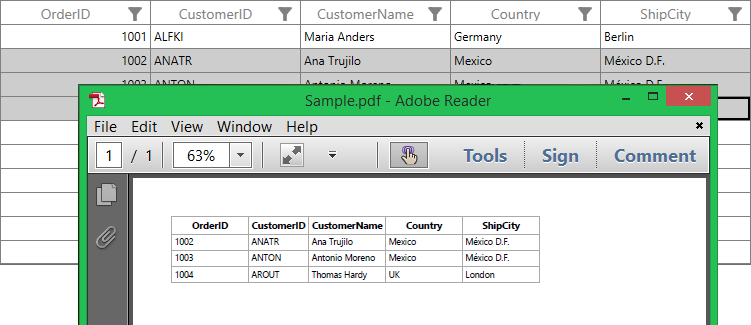
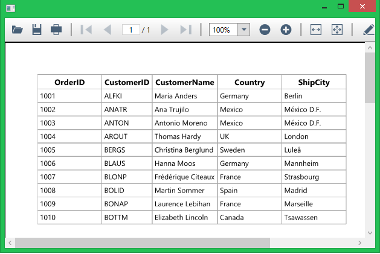
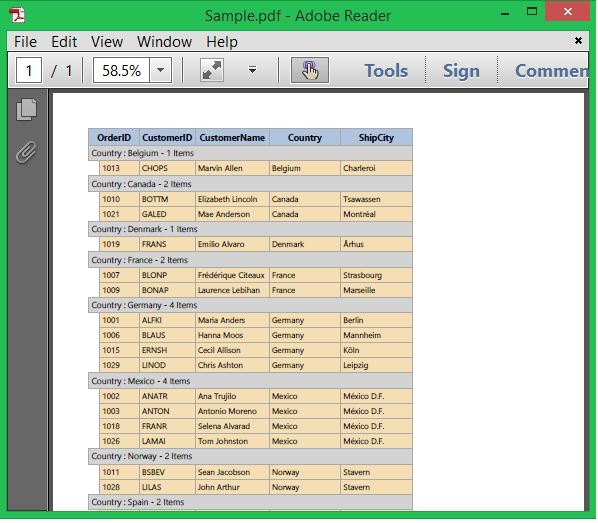
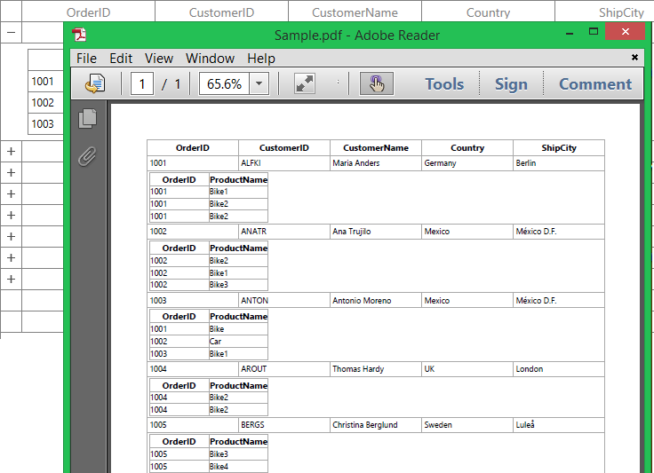
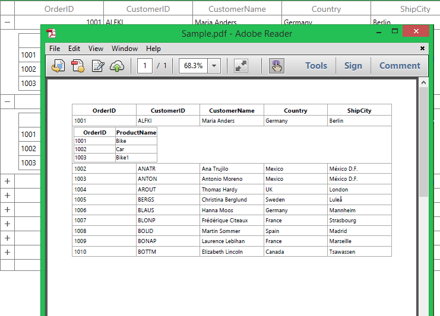
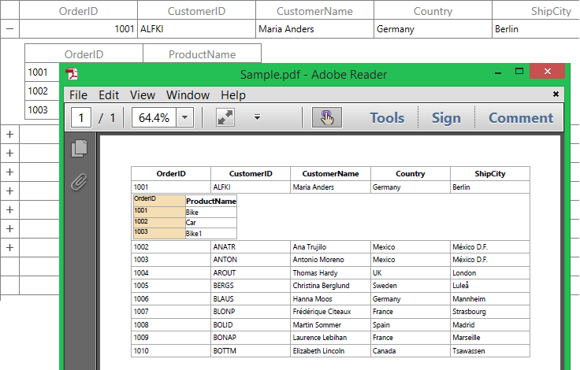

# Export To PDF in WPF DataGrid (SfDataGrid)

DataGrid provides support to export data to PDF file. It also provides support for grouping, filtering, sorting, paging, unbound rows, merged cells, stacked headers and details View while exporting.

The following assemblies needs to be added for exporting to PDF file. 

* Syncfusion.SfGridConverter.WPF
* Syncfusion.Pdf.Base

For NuGet package, have to install [Syncfusion.DataGridExcelExport.WPF](https://www.nuget.org/packages/Syncfusion.DataGridExcelExport.WPF) package. For more details refer this [UG link](https://help.syncfusion.com/wpf/control-dependencies#exporting-datagrid-to-excel-pdf-and-csv).

You can export SfDataGrid to PDF by using the following extension methods present in the [Syncfusion.UI.Xaml.Grid.Converter](http://help.syncfusion.com/cr/wpf) namespace.

* [ExportToPdf](https://help.syncfusion.com/cr/wpf/Syncfusion.UI.Xaml.Grid.Converter.GridPdfExportExtension.html#Syncfusion_UI_Xaml_Grid_Converter_GridPdfExportExtension_ExportToPdf_Syncfusion_UI_Xaml_Grid_SfDataGrid_)
* [ExportToPdfGrid](https://help.syncfusion.com/cr/wpf/Syncfusion.UI.Xaml.Grid.Converter.GridPdfExportExtension.html#Syncfusion_UI_Xaml_Grid_Converter_GridPdfExportExtension_ExportToPdfGrid_Syncfusion_UI_Xaml_Grid_SfDataGrid_Syncfusion_Data_ICollectionViewAdv_Syncfusion_UI_Xaml_Grid_Converter_PdfExportingOptions_)



using Syncfusion.UI.Xaml.Grid.Converter;
var document = dataGrid.ExportToPdf();
document.Save("Sample.pdf");



N> SfDataGrid exports data to PDF file by using [Essential PDF](http://help.syncfusion.com/file-formats/pdf/overview). You can refer [PDF documentation](http://help.syncfusion.com/file-formats/pdf/working-with-document) for manipulating.

## PDF exporting options

Exporting operation can be customized by passing [PdfExportingOptions](http://help.syncfusion.com/cr/wpf/Syncfusion.UI.Xaml.Grid.Converter.PdfExportingOptions.html) instance as argument to `ExportToPdf` and `ExportToPdfGrid` method. 

### Auto size column widths in PDF

You can export SfDataGrid to PDF by fitting column widths based on its content by setting [AutoColumnWidth](https://help.syncfusion.com/cr/wpf/Syncfusion.UI.Xaml.Grid.Converter.PdfExportingOptions.html#Syncfusion_UI_Xaml_Grid_Converter_PdfExportingOptions_AutoColumnWidth) property as `true`. 



PdfExportingOptions options = new PdfExportingOptions();
options.AutoColumnWidth = true;
var document = dataGrid.ExportToPdf(options);            
document.Save("Sample.pdf");



### Auto size row heights in PDF

You can export SfDataGrid to PDF by fitting row heights based on its content by setting [AutoRowHeight](https://help.syncfusion.com/cr/wpf/Syncfusion.UI.Xaml.Grid.Converter.PdfExportingOptions.html#Syncfusion_UI_Xaml_Grid_Converter_PdfExportingOptions_AutoRowHeight) property as `true`. 



PdfExportingOptions options = new PdfExportingOptions();
options.AutoRowHeight = true;
var document = dataGrid.ExportToPdf(options);            
document.Save("Sample.pdf");



### Exclude columns while exporting

By default, all the columns (including hidden columns) in SfDataGrid will be exported to PDF. If you want to exclude some columns while exporting to PDF, you can use [ExcludeColumns](https://help.syncfusion.com/cr/wpf/Syncfusion.UI.Xaml.Grid.Converter.PdfExportingOptions.html#Syncfusion_UI_Xaml_Grid_Converter_PdfExportingOptions_ExcludeColumns) property in [PdfExportingOptions](http://help.syncfusion.com/cr/wpf/Syncfusion.UI.Xaml.Grid.Converter.PdfExportingOptions.html).



PdfExportingOptions options = new PdfExportingOptions();
options.ExcludeColumns.Add("CustomerName");
options.ExcludeColumns.Add("Country");
var document = dataGrid.ExportToPdf(options);            
document.Save("Sample.pdf");



Here, the columns having `CustomerName` and `Country` as MappingName are excluded while exporting.

### Export Format

By default, display text only will be exported to PDF. If you want to export the actual value, you need to set [ExportFormat](https://help.syncfusion.com/cr/wpf/Syncfusion.UI.Xaml.Grid.Converter.PdfExportingOptions.html#Syncfusion_UI_Xaml_Grid_Converter_PdfExportingOptions_ExportFormat) property as `false`. 



PdfExportingOptions options = new PdfExportingOptions();
options.ExportFormat = false;
var document = dataGrid.ExportToPdf(options);            
document.Save("Sample.pdf");



### Column header on each page

Column headers can be exported on each page by setting [RepeatHeaders](https://help.syncfusion.com/cr/wpf/Syncfusion.UI.Xaml.Grid.Converter.PdfExportingOptions.html#Syncfusion_UI_Xaml_Grid_Converter_PdfExportingOptions_RepeatHeaders) property.



PdfExportingOptions options = new PdfExportingOptions();
options.RepeatHeaders = true;
var document = dataGrid.ExportToPdf(options);            
document.Save("Sample.pdf");



### Export all columns in one page

While exporting to PDF, you can fit all columns on one page by setting [FitAllColumnsInOnePage](https://help.syncfusion.com/cr/wpf/Syncfusion.UI.Xaml.Grid.Converter.PdfExportingOptions.html#Syncfusion_UI_Xaml_Grid_Converter_PdfExportingOptions_FitAllColumnsInOnePage) property as `true`.



PdfExportingOptions options = new PdfExportingOptions();
options.FitAllColumnsInOnePage = true;
var document = dataGrid.ExportToPdf(options);            
document.Save("Sample.pdf");



### Export paging

While exporting data to PDF, if paging is used, current page only will be exported, by default. If you want to export all pages, you need to set [ExportAllPages](https://help.syncfusion.com/cr/wpf/Syncfusion.UI.Xaml.Grid.Converter.PdfExportingOptions.html#Syncfusion_UI_Xaml_Grid_Converter_PdfExportingOptions_ExportAllPages) property as `true`.



PdfExportingOptions options = new PdfExportingOptions();
options.ExportAllPages = true;            
var document = dataGrid.ExportToPdf(options);
document.Save("Sample.pdf");



### Exclude groups while exporting

By default, all the groups in dataGrid will be exported to PDF. If you want to export without Groups, you need to set [ExportGroups](https://help.syncfusion.com/cr/wpf/Syncfusion.UI.Xaml.Grid.Converter.PdfExportingOptions.html#Syncfusion_UI_Xaml_Grid_Converter_PdfExportingOptions_ExportGroups) property as `false`.



PdfExportingOptions options = new PdfExportingOptions();
options.ExportGroups = false;
var document = dataGrid.ExportToPdf(options);            
document.Save("Sample.pdf");



### Exclude group Summaries while exporting

By default, group summaries in dataGrid will be exported to PDF. If you want to export without group summaries, you need to set [ExportGroupSummary](https://help.syncfusion.com/cr/wpf/Syncfusion.UI.Xaml.Grid.Converter.PdfExportingOptions.html#Syncfusion_UI_Xaml_Grid_Converter_PdfExportingOptions_ExportGroupSummary) property as `false`.



PdfExportingOptions options = new PdfExportingOptions();
options.ExportGroupSummary = false;
var document = dataGrid.ExportToPdf(options);            
document.Save("Sample.pdf");



### Exclude table Summaries while exporting

By default, table summaries in dataGrid will be exported to PDF. If you want to export without table summaries, you need to set [ExportTableSummary](https://help.syncfusion.com/cr/wpf/Syncfusion.UI.Xaml.Grid.Converter.PdfExportingOptions.html#Syncfusion_UI_Xaml_Grid_Converter_PdfExportingOptions_ExportTableSummary) property as `false`.



PdfExportingOptions options = new PdfExportingOptions();
options.ExportTableSummary = false;
var document = dataGrid.ExportToPdf(options);            
document.Save("Sample.pdf");



### Exporting unbound rows

You can export unbound rows to PDF by setting [ExportUnBoundRows](https://help.syncfusion.com/cr/wpf/Syncfusion.UI.Xaml.Grid.Converter.PdfExportingOptions.html#Syncfusion_UI_Xaml_Grid_Converter_PdfExportingOptions_ExportUnBoundRows) property as `true`.



PdfExportingOptions options = new PdfExportingOptions();
options.ExportUnBoundRows = true;
var document = dataGrid.ExportToPdf(options);            
document.Save("Sample.pdf");



### Exporting stacked headers

You can export stacked headers to PDF by setting [ExportStackedHeaders](https://help.syncfusion.com/cr/wpf/Syncfusion.UI.Xaml.Grid.Converter.PdfExportingOptions.html#Syncfusion_UI_Xaml_Grid_Converter_PdfExportingOptions_ExportStackedHeaders) property to `true`.



PdfExportingOptions options = new PdfExportingOptions();
options.ExportStackedHeaders = true;
var document = dataGrid.ExportToPdf(options);            
document.Save("Sample.pdf");



### Exporting merged cells

You can export merged cells to PDF by setting [ExportMergedCells](https://help.syncfusion.com/cr/wpf/Syncfusion.UI.Xaml.Grid.Converter.PdfExportingOptions.html#Syncfusion_UI_Xaml_Grid_Converter_PdfExportingOptions_ExportMergedCells) property as `true`.



PdfExportingOptions options = new PdfExportingOptions();
options.ExportMergedCells = true;
var document = dataGrid.ExportToPdf(options);
document.Save("Sample.pdf");



## Setting Header and Footer

SfDataGrid provides a way to display additional content at the top (Header) or bottom (Footer) of the page while exporting to PDF. This can be achieved by setting [PageHeaderFooterEventHandler](https://help.syncfusion.com/cr/wpf/Syncfusion.UI.Xaml.Grid.Converter.PdfExportingOptions.html#Syncfusion_UI_Xaml_Grid_Converter_PdfExportingOptions_PageHeaderFooterEventHandler) in [PdfExportingOptions](http://help.syncfusion.com/cr/wpf/Syncfusion.UI.Xaml.Grid.Converter.PdfExportingOptions.html).

You can insert string, image or any drawing in header and footer in `PdfHeaderFooterEventHandler`. Setting [PdfPageTemplateElement](http://help.syncfusion.com/cr/wpf/Syncfusion.Pdf.PdfPageTemplateElement.html) to [PdfHeaderFooterEventArgs.PdfDocumentTemplate.Top](https://help.syncfusion.com/cr/wpf/Syncfusion.Pdf.PdfDocumentTemplate.html#Syncfusion_Pdf_PdfDocumentTemplate_Top) loads the content at top of the page and setting the `PdfPageTemplateElement` to [PdfHeaderFooterEventArgs.PdfDocumentTemplate.Bottom](https://help.syncfusion.com/cr/wpf/Syncfusion.Pdf.PdfDocumentTemplate.html#Syncfusion_Pdf_PdfDocumentTemplate_Bottom) loads the content at bottom of the page.



PdfExportingOptions options = new PdfExportingOptions();
options.PageHeaderFooterEventHandler = PdfHeaderFooterEventHandler;
var document = dataGrid.ExportToPdf(options);
document.Save("Sample.pdf");

static void PdfHeaderFooterEventHandler(object sender, PdfHeaderFooterEventArgs e)
{
    PdfFont font = new PdfStandardFont(PdfFontFamily.TimesRoman, 20f,  PdfFontStyle.Bold);                 
    var width = e.PdfPage.GetClientSize().Width;
    PdfPageTemplateElement header = new PdfPageTemplateElement(width, 38);
    header.Graphics.DrawString("Order Details", font, PdfPens.Black, 70, 3);
    e.PdfDocumentTemplate.Top = header;
}



Here, `string` is inserted in the header of exported PDF file using [DrawString](https://help.syncfusion.com/cr/wpf/Syncfusion.Pdf.Graphics.PdfGraphics.html#Syncfusion_Pdf_Graphics_PdfGraphics_DrawString_System_String_Syncfusion_Pdf_Graphics_PdfFont_Syncfusion_Pdf_Graphics_PdfBrush_System_Drawing_PointF_) method. Similarly, you can insert image, line,etc. using [DrawImage](https://help.syncfusion.com/cr/wpf/Syncfusion.Pdf.Graphics.PdfGraphics.html#Syncfusion_Pdf_Graphics_PdfGraphics_DrawImage_Syncfusion_Pdf_Graphics_PdfImage_System_Drawing_PointF_), [DrawLine](https://help.syncfusion.com/cr/wpf/Syncfusion.Pdf.Graphics.PdfGraphics.html#Syncfusion_Pdf_Graphics_PdfGraphics_DrawLine_Syncfusion_Pdf_Graphics_PdfPen_System_Drawing_PointF_System_Drawing_PointF_) methods respectively. 

## Change PDF page orientation

You can change the page orientation of PDF while exporting. The default page orientation is Portrait.

To change the page orientation, you need to get the exported [PdfGrid](http://help.syncfusion.com/cr/wpf/Syncfusion.Pdf.Grid.PdfGrid.html) by using [ExportToPdfGrid](https://help.syncfusion.com/cr/wpf/Syncfusion.UI.Xaml.Grid.Converter.GridPdfExportExtension.html#Syncfusion_UI_Xaml_Grid_Converter_GridPdfExportExtension_ExportToPdfGrid_Syncfusion_UI_Xaml_Grid_SfDataGrid_Syncfusion_Data_ICollectionViewAdv_Syncfusion_UI_Xaml_Grid_Converter_PdfExportingOptions_) method and then draw that `PdfGrid` into a [PdfDocument](http://help.syncfusion.com/cr/wpf/Syncfusion.Pdf.PdfDocument.html) by changing the [PageSettings.Orientation](https://help.syncfusion.com/cr/wpf/Syncfusion.Pdf.PdfPageSettings.html#Syncfusion_Pdf_PdfPageSettings_Orientation) property of `PdfDocument`.



var options = new PdfExportingOptions();
var document = new PdfDocument();
document.PageSettings.Orientation = PdfPageOrientation.Landscape;
var page = document.Pages.Add();
var PDFGrid = dataGrid.ExportToPdfGrid(dataGrid.View, options);
var format = new PdfGridLayoutFormat()
{
    Layout = PdfLayoutType.Paginate,
    Break = PdfLayoutBreakType.FitPage
};

PDFGrid.Draw(page, new PointF(), format);
document.Save("Sample.pdf");



## Export DataGrid SelectedItems to PDF

By default, entire grid will be exported to PDF. You can export selected items only by passing `SelectedItems` to [ExportToPdf](https://help.syncfusion.com/cr/wpf/Syncfusion.UI.Xaml.Grid.Converter.GridPdfExportExtension.html#Syncfusion_UI_Xaml_Grid_Converter_GridPdfExportExtension_ExportToPdf_Syncfusion_UI_Xaml_Grid_SfDataGrid_) and [ExportToPdfGrid](https://help.syncfusion.com/cr/wpf/Syncfusion.UI.Xaml.Grid.Converter.GridPdfExportExtension.html#Syncfusion_UI_Xaml_Grid_Converter_GridPdfExportExtension_ExportToPdfGrid_Syncfusion_UI_Xaml_Grid_SfDataGrid_Syncfusion_Data_ICollectionViewAdv_Syncfusion_UI_Xaml_Grid_Converter_PdfExportingOptions_) methods.



PdfExportingOptions options = new PdfExportingOptions();
options.AutoColumnWidth = true;
var document = dataGrid.ExportToPdf(dataGrid.SelectedItems, options);
document.Save("Sample.pdf");



## Saving options

### Save directly to file

After exporting to PDF, you can save exported PDF file directly to file system by using [Save](https://help.syncfusion.com/cr/wpf/Syncfusion.Pdf.PdfDocumentBase.html#Syncfusion_Pdf_PdfDocumentBase_Save_System_IO_Stream_) method.



var document = dataGrid.ExportToPdf();
document.Save("Sample.pdf");



You can refer [PDF documentation](http://help.syncfusion.com/file-formats/pdf/loading-and-saving-document#saving-a-pdf-document-to-file-system). 

### Save as stream

After exporting to PDF, you can save exported PDF file to stream by using [Save](https://help.syncfusion.com/cr/wpf/Syncfusion.Pdf.PdfDocumentBase.html#Syncfusion_Pdf_PdfDocumentBase_Save_System_IO_Stream_) method.



FileStream fileStream = new FileStream("Sample.pdf", FileMode.Create);          
var document = dataGrid.ExportToPdf();
document.Save(fileStream);
fileStream.Close();



You can refer [PDF documentation](http://help.syncfusion.com/file-formats/pdf/loading-and-saving-document#saving-a-pdf-document-to-stream). 

### Save using File dialog

After exporting to PDF, you can save exported PDF file by opening [FileDialog](https://msdn.microsoft.com/en-us/library/system.windows.forms.filedialog.aspx). 



var document = dataGrid.ExportToPdf();
SaveFileDialog sfd = new SaveFileDialog
{
    Filter = "PDF Files(*.pdf)|*.pdf"
};

if (sfd.ShowDialog() == true)
{
    using (Stream stream = sfd.OpenFile())
    {
        document.Save(stream);
    }

    //Message box confirmation to view the created Pdf file.

    if (MessageBox.Show("Do you want to view the Pdf file?", "Pdf file has been created",
                        MessageBoxButton.YesNo, MessageBoxImage.Information) == MessageBoxResult.Yes)
    {
 
        //Launching the Pdf file using the default Application.
        System.Diagnostics.Process.Start(sfd.FileName);
    }
}         



## Opening exported PDF without saving

You can view exported PDF document without saving by using [PDFViewerControl](http://help.syncfusion.com/wpf/pdfviewer/overview).



var document = this.dataGrid.ExportToPdf();
MemoryStream stream = new MemoryStream();
document.Save(stream);
PdfViewerControl pdfViewer = new PdfViewerControl();
pdfViewer.Load(stream);
Window window = new Window();
window.Content = pdfViewer;
window.Show();



## Exporting Customization

### Styling cells based on CellType in PDF

You can customize the cell styles based on `CellType` by using [ExportingEventHandler](https://help.syncfusion.com/cr/wpf/Syncfusion.UI.Xaml.Grid.Converter.PdfExportingOptions.html#Syncfusion_UI_Xaml_Grid_Converter_PdfExportingOptions_ExportingEventHandler).



PdfExportingOptions options = new PdfExportingOptions();
options.ExportingEventHandler = GridPdfExportingEventHandler;
var document = dataGrid.ExportToPdf(options);
document.Save("Sample.pdf");

void GridPdfExportingEventHandler(object sender, GridPdfExportingEventArgs e)
{

    if (e.CellType == ExportCellType.HeaderCell)
        e.CellStyle.BackgroundBrush = PdfBrushes.LightSteelBlue;

    else if (e.CellType == ExportCellType.GroupCaptionCell)
        e.CellStyle.BackgroundBrush = PdfBrushes.LightGray;

    else if (e.CellType == ExportCellType.RecordCell)
        e.CellStyle.BackgroundBrush = PdfBrushes.Wheat;
}



### Embedding fonts in PDF file

By default, some fonts (such as Unicode font) are not supported in PDF. In this case, it is possible to embed the font in PDF document with the help of [PdfTrueTypeFont](http://help.syncfusion.com/cr/wpf/Syncfusion.Pdf.Graphics.PdfTrueTypeFont.html). 



PdfExportingOptions options = new PdfExportingOptions();
options.ExportingEventHandler = GridPdfExportingEventHandler;
var document = dataGrid.ExportToPdf(options);
document.Save("Sample.pdf");

void GridPdfExportingEventHandler(object sender, GridPdfExportingEventArgs e)
{    

    if (e.CellType != ExportCellType.RecordCell)
        return;

    //creates a new font from the font file.                
    var font = new PdfTrueTypeFont(@"..\..\Resources\segoeui.ttf", 9f, PdfFontStyle.Regular);
    e.CellStyle.Font = font;
}



Here, new font is created from font file and it is assigned to the `Font` of [PdfGridCell](http://help.syncfusion.com/cr/wpf/Syncfusion.Pdf.Grid.PdfGridCell.html).

## Cell customization in PDF while exporting

You can customize the cells in the PDF document by setting [CellsExportingEventHandler](https://help.syncfusion.com/cr/wpf/Syncfusion.UI.Xaml.Grid.Converter.PdfExportingOptions.html#Syncfusion_UI_Xaml_Grid_Converter_PdfExportingOptions_CellsExportingEventHandler) in [PdfExportingOptions](http://help.syncfusion.com/cr/wpf/Syncfusion.UI.Xaml.Grid.Converter.PdfExportingOptions.html).

### Customize cell values while exporting

You can customize the call values while exporting to PDF by using [CellsExportingEventHandler](https://help.syncfusion.com/cr/wpf/Syncfusion.UI.Xaml.Grid.Converter.PdfExportingOptions.html#Syncfusion_UI_Xaml_Grid_Converter_PdfExportingOptions_CellsExportingEventHandler) and [PdfExportingOptions](http://help.syncfusion.com/cr/wpf/Syncfusion.UI.Xaml.Grid.Converter.PdfExportingOptions.html).



PdfExportingOptions options = new PdfExportingOptions();
options.CellsExportingEventHandler = CellsExportingEventHandler;
var document = dataGrid.ExportToPdf(options);
document.Save("Sample.pdf");

private void CellsExportingEventHandler(object sender, GridCellPdfExportingEventArgs e)
{

    // Based on the column mapping name and the cell type, you can change the cell values while exporting to PDF.

    if (e.CellType == ExportCellType.RecordCell && e.ColumnName == "IsClosed")
    {

        //if the cell value is True, "Y" will be displayed else "N" will be displayed.

        if (e.CellValue.Equals("True"))
            e.CellValue = "Y";

        else
            e.CellValue = "N";
    }
}



Here, cell values are changed for `IsClosed` column based on custom condition.

### Changing row style in PDF based on data

You can customize the rows based on the record values by using [CellsExportingEventHandler](https://help.syncfusion.com/cr/wpf/Syncfusion.UI.Xaml.Grid.Converter.PdfExportingOptions.html#Syncfusion_UI_Xaml_Grid_Converter_PdfExportingOptions_CellsExportingEventHandler).



PdfExportingOptions options = new PdfExportingOptions();
options.CellsExportingEventHandler = CellsExportingEventHandler;
var document = dataGrid.ExportToPdf(options);
document.Save("Sample.pdf");

private void CellsExportingEventHandler(object sender, GridCellPdfExportingEventArgs e)
{

    if (!(e.NodeEntry is OrderInfo))
        return;

    if ((e.NodeEntry as OrderInfo).Country == "Mexico")
    {
        var cellStyle = new PdfGridCellStyle();
        cellStyle.BackgroundBrush = PdfBrushes.LightPink;             
        cellStyle.Borders.All = new PdfPen(PdfBrushes.DarkGray, 0.2f);
        e.PdfGridCell.Style = cellStyle;
    }
}



### Exporting Middle Eastern Languages (Arabic, Hebrew) from SfDataGrid to PDF

By default, [Middle Eastern languages ](http://en.wikipedia.org/wiki/Middle_East)(Arabic, Hebrew) in SfDataGrid are exported as left to right in PDF. You can export them as displayed in SfDataGrid (export from Right to Left) by enabling [RightToLeft](https://help.syncfusion.com/cr/wpf/Syncfusion.Pdf.Graphics.PdfStringFormat.html#Syncfusion_Pdf_Graphics_PdfStringFormat_RightToLeft) property in [PdfStringFormat](http://help.syncfusion.com/cr/wpf/Syncfusion.Pdf.Graphics.PdfStringFormat.html) class and apply the format to the [PdfGridCell](http://help.syncfusion.com/cr/wpf/Syncfusion.Pdf.Grid.PdfGridCell.html) by using [CellsExportingEventHandler](https://help.syncfusion.com/cr/wpf/Syncfusion.UI.Xaml.Grid.Converter.PdfExportingOptions.html#Syncfusion_UI_Xaml_Grid_Converter_PdfExportingOptions_CellsExportingEventHandler).



 PdfExportingOptions options = new PdfExportingOptions();
options.CellsExportingEventHandler = CellsExportingEventHandler;
var document = dataGrid.ExportToPdf(options);
document.Save("Sample.pdf");

private void CellsExportingEventHandler(object sender, GridCellPdfExportingEventArgs e)
{    

    if (e.CellType != ExportCellType.RecordCell)
        return;

    PdfStringFormat format = new PdfStringFormat();

    //format the string from right to left.
    format.RightToLeft = true;
    e.PdfGridCell.StringFormat = format;
}



### Exporting images to PDF document

By default, images which is loaded in the [GridTemplateColumn](http://help.syncfusion.com/cr/wpf/Syncfusion.UI.Xaml.Grid.GridTemplateColumn.html) will not be exported to PDF. You can export it by using [CellsExportingEventHandler](https://help.syncfusion.com/cr/wpf/Syncfusion.UI.Xaml.Grid.Converter.PdfExportingOptions.html#Syncfusion_UI_Xaml_Grid_Converter_PdfExportingOptions_CellsExportingEventHandler) in `PdfExportingOptions`. In `CellsExportingEventHandler`, image is loaded in [PdfGridCell](http://help.syncfusion.com/cr/wpf/Syncfusion.Pdf.Grid.PdfGridCell.html).



PdfExportingOptions options = new PdfExportingOptions();
options.CellsExportingEventHandler = CellsExportingEventHandler;
var document = dataGrid.ExportToPdf(options);
document.Save("Sample.pdf");

private void CellsExportingEventHandler(object sender, GridCellPdfExportingEventArgs e)
{  
 
    if (e.CellType == ExportCellType.RecordCell && e.ColumnName == "IsClosed")
    {
        var style = new PdfGridCellStyle();
        PdfPen normalBorder = new PdfPen(PdfBrushes.DarkGray, 0.2f);
        System.Drawing.Image image = null;
 
        //Images are exported based on the CellValue 
 
        if (e.CellValue.Equals("True"))
        {
 
            //Access the image from the specified path 
            image = System.Drawing.Image.FromFile(@"..\..\Images\True.png");
        }
 
        else
            image = System.Drawing.Image.FromFile(@"..\..\Images\False.png");

        //Create the PDFImage for the specified image and assigned to BackgroundImage of the PdfGridCellStyle
        style.BackgroundImage = PDFImage.FromImage(image);
        e.PdfGridCell.ImagePosition = PdfGridImagePosition.Fit;
        e.PdfGridCell.Style = style;

        //customize the Border color of PdfGridCell
        e.PdfGridCell.Style.Borders.All = normalBorder;
        e.CellValue = null;
    }
}



## Exporting DetailsView

By default, [DetailsViewDataGrid](http://help.syncfusion.com/cr/wpf/Syncfusion.UI.Xaml.Grid.DetailsViewDataGrid.html) will not be exported to PDF. You can export `DetailsViewDataGrid` by setting [ExportDetailsView](https://help.syncfusion.com/cr/wpf/Syncfusion.UI.Xaml.Grid.Converter.PdfExportingOptions.html#Syncfusion_UI_Xaml_Grid_Converter_PdfExportingOptions_ExportDetailsView) property as `true`.



PdfExportingOptions options = new PdfExportingOptions();
options.ExportDetailsView = true;
var document = dataGrid.ExportToPdf(options);
document.Save("Sample.pdf");



By default, only expanded DetailsViewDataGrids only will be exported to PDF document. If you want to export all the DetailsViewDataGrids, you need to set [ExportAllDetails](https://help.syncfusion.com/cr/wpf/Syncfusion.UI.Xaml.Grid.Converter.PdfExportingOptions.html#Syncfusion_UI_Xaml_Grid_Converter_PdfExportingOptions_ExportAllDetails) as `true`.



PdfExportingOptions options = new PdfExportingOptions();
options.ExportDetailsView = true;
options.ExportAllDetails = true;
var document = dataGrid.ExportToPdf(options);
document.Save("Sample.pdf");



Here, first record only expanded in SfDataGrid. But all the DetailsViewDataGrid’s are shown in exported PDF document.

You can customize its exporting operation by using [ChildGridExportingEventHandler](https://help.syncfusion.com/cr/wpf/Syncfusion.UI.Xaml.Grid.Converter.PdfExportingOptions.html#Syncfusion_UI_Xaml_Grid_Converter_PdfExportingOptions_ChildGridExportingEventHandler).

N> While exporting `DetailsViewDataGrid`, [FitAllColumnsInOnePage](https://help.syncfusion.com/cr/wpf/Syncfusion.UI.Xaml.Grid.Converter.PdfExportingOptions.html#Syncfusion_UI_Xaml_Grid_Converter_PdfExportingOptions_FitAllColumnsInOnePage) is set to `true` internally as horizontal pagination is not supported for `DetailsViewDataGrid`.

### Excluding DetailsViewDataGrid while exporting

You can exclude particular `DetailsViewDataGrid` while exporting, by using the [ChildGridExportingEventHandler](https://help.syncfusion.com/cr/wpf/Syncfusion.UI.Xaml.Grid.Converter.PdfExportingOptions.html#Syncfusion_UI_Xaml_Grid_Converter_PdfExportingOptions_ChildGridExportingEventHandler) and [ChildGridPdfExportingEventArgs.Cancel](https://msdn.microsoft.com/en-us/library/e1bcat2e.aspx).



PdfExportingOptions options = new PdfExportingOptions();
options.ExportDetailsView = true;
options.ChildGridExportingEventHandler = ChildGridExportingEventHandler;
var document = dataGrid.ExportToPdf(options);
document.Save("Sample.pdf");

void ChildGridExportingEventHandler(object sender, ChildGridPdfExportingEventArgs e)
{
    var recordEntry = e.NodeEntry as RecordEntry;

    if ((recordEntry.Data as OrderInfo).OrderID == 1002)
        e.Cancel = true;
}



Here, `DetailsViewDataGrid` is not exported for the parent record having `OrderID` as 1002.

### Excluding DetailsViewDataGrid columns from exporting

You can exclude [DetailsViewDataGrid](http://help.syncfusion.com/cr/wpf/Syncfusion.UI.Xaml.Grid.DetailsViewDataGrid.html) columns while exporting, by using [ChildGridExportingEventHandler](https://help.syncfusion.com/cr/wpf/Syncfusion.UI.Xaml.Grid.Converter.PdfExportingOptions.html#Syncfusion_UI_Xaml_Grid_Converter_PdfExportingOptions_ChildGridExportingEventHandler) and  [ChildGridPdfExportingEventArgs.PdfExportingOptions.ExcludeColumns](https://help.syncfusion.com/cr/wpf/Syncfusion.UI.Xaml.Grid.Converter.PdfExportingOptions.html#Syncfusion_UI_Xaml_Grid_Converter_PdfExportingOptions_ExcludeColumns).



PdfExportingOptions options = new PdfExportingOptions();
options.ExportDetailsView = true;
options.ChildGridExportingEventHandler = ChildGridExportingEventHandler;
var document = dataGrid.ExportToPdf(options);
document.Save("Sample.pdf");

void ChildGridExportingEventHandler(object sender, ChildGridPdfExportingEventArgs e)
{ 
    e.PdfExportingOptions.ExcludeColumns = new List&lt;string&gt;() { "OrderID" };
}



Here, `OrderID` column is displayed in `DetailsViewDataGrid` and it is excluded while exporting to PDF.

### Customizing DetailsViewDataGrid cells

Like parent DataGrid, You can customize the `DetailsViewDataGrid` cells also by using [CellsExportingEventHandler](https://help.syncfusion.com/cr/wpf/Syncfusion.UI.Xaml.Grid.Converter.PdfExportingOptions.html#Syncfusion_UI_Xaml_Grid_Converter_PdfExportingOptions_CellsExportingEventHandler). Based on [GridCellPdfExportingEventArgs.GridViewDefinition](https://help.syncfusion.com/cr/wpf/Syncfusion.UI.Xaml.Grid.Converter.GridCellPdfExportingEventArgs.html#Syncfusion_UI_Xaml_Grid_Converter_GridCellPdfExportingEventArgs_GridViewDefinition) property, you can identify the particular `DetailsViewDataGrid` and customize it.



PdfExportingOptions options = new PdfExportingOptions();
options.ExportDetailsView = true;
options.CellsExportingEventHandler = CellsExportingEventHandler;
var document = dataGrid.ExportToPdf(options);
document.Save("Sample.pdf");

private void CellsExportingEventHandler(object sender, GridCellPdfExportingEventArgs e)
{
 
    if (e.GridViewDefinition == null || e.GridViewDefinition.RelationalColumn != "ProductDetails")                                     
        return;
 
    if (e.ColumnName == "OrderID")
    {
        var cellStyle = new PdfGridCellStyle();
        cellStyle.BackgroundBrush = PdfBrushes.Wheat;
        cellStyle.Borders.All = new PdfPen(PdfBrushes.DarkGray, 0.2f);
        e.PdfGridCell.Style = cellStyle;
    }
}



