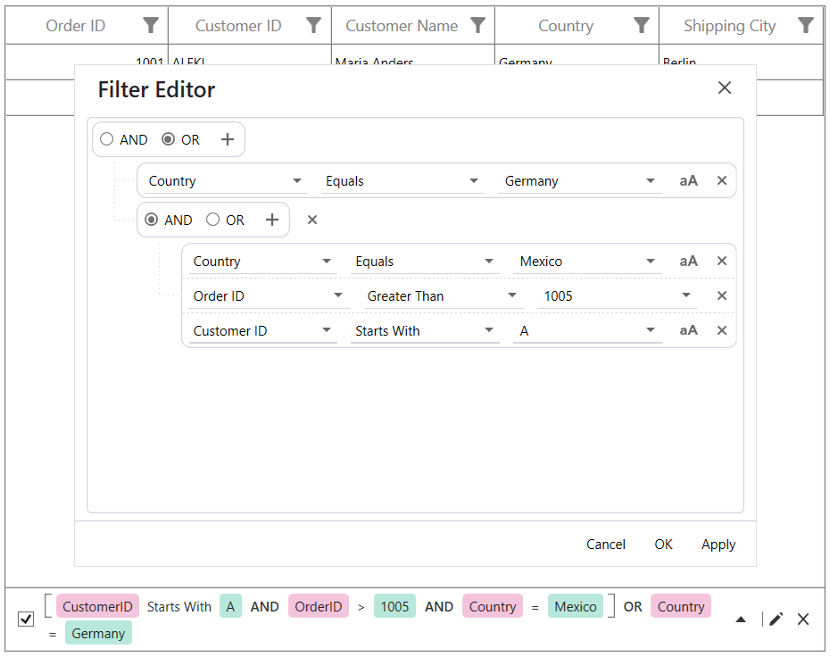
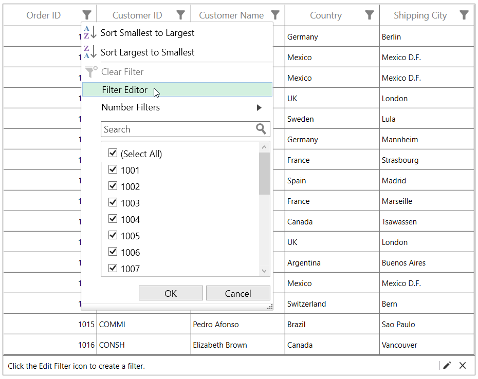
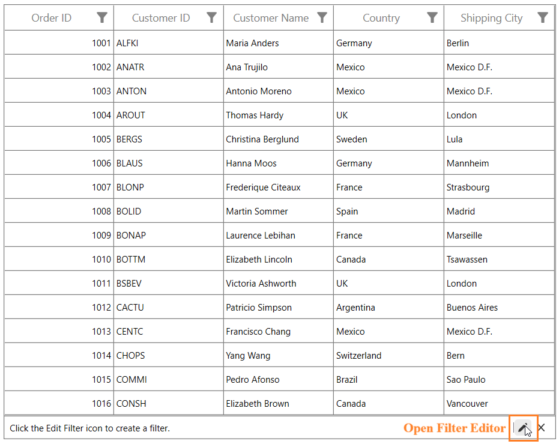
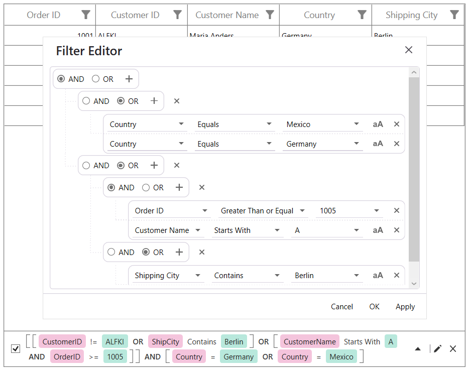
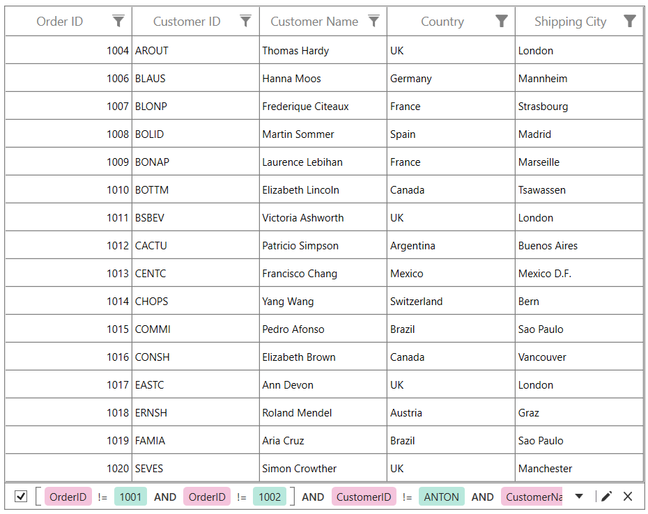
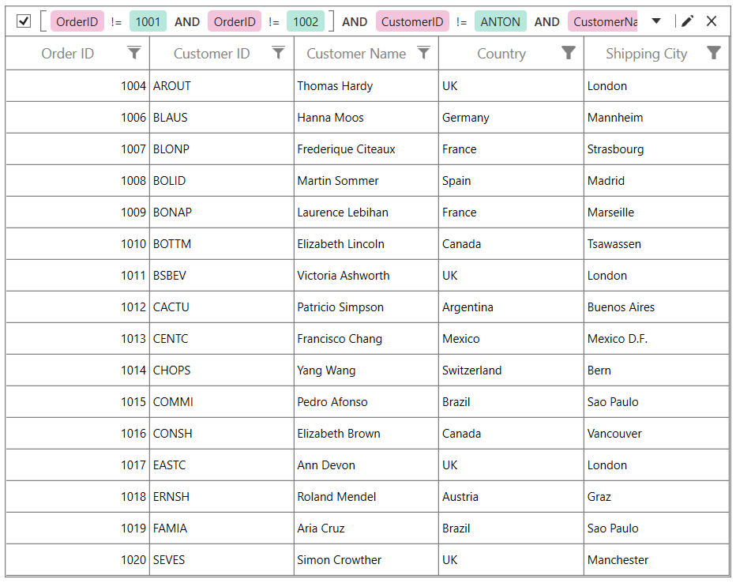
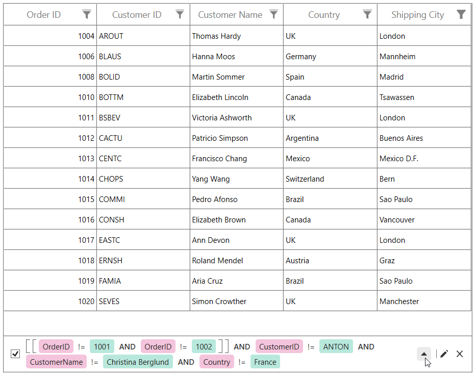
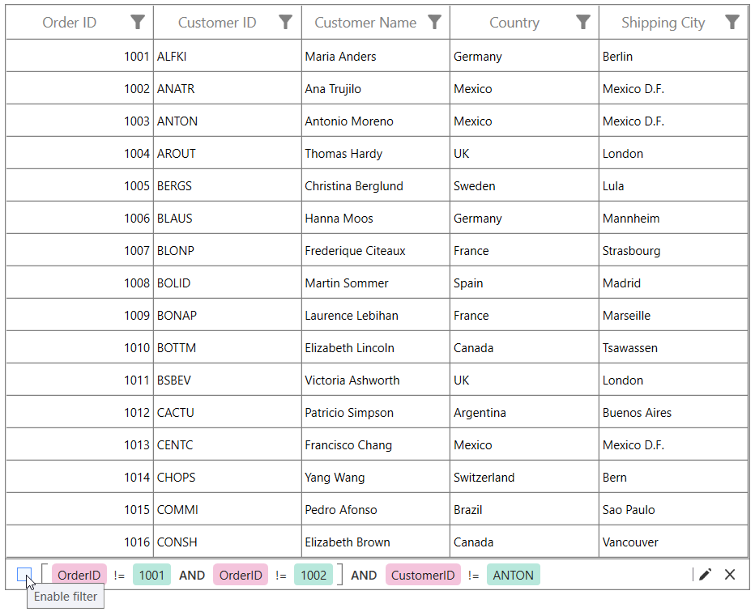

# Filter Editor in WPF Data Grid

[WPF DataGrid](https://www.syncfusion.com/wpf-controls/datagrid) (SfDataGrid) allows you to create complex filter criteria by combining multiple conditions with logical operators and nested groups through the Filter Editor. The applied filter criteria can be displayed in the Filter Editor Panel, which stays synchronized with the supported filtering operations performed in the DataGrid.

Before enabling the Filter Editor, ensure filtering is enabled by setting [SfDataGrid.AllowFiltering](https://help.syncfusion.com/cr/wpf/Syncfusion.UI.Xaml.Grid.SfGridBase.html#Syncfusion_UI_Xaml_Grid_SfGridBase_AllowFiltering) to `true`.

## Enable Filter Editor

You can enable the Filter Editor by setting the `SfDataGrid.EnableFilterEditor` property to `true`. The default value is `false`.

When `EnableFilterEditor` is set to `true`, the Filter Editor action is displayed in the column filter popup. The Edit Filter icon is also displayed in the Filter Editor Panel.



<syncfusion:SfDataGrid x:Name="dataGrid"
                       AllowFiltering="True"
                       AutoGenerateColumns="True"
                       EnableFilterEditor="True"
                       ItemsSource="{Binding Orders}" />


this.dataGrid.EnableFilterEditor = true;



N> The `EnableFilterEditor` property controls the availability of the Filter Editor actions in the column filter popup and Filter Editor Panel. It does not control the visibility or position of the Filter Editor Panel.

## Open Filter Editor

You can open the Filter Editor in the following ways:

* From the column filter popup.
* From the Filter Editor Panel.

### Open from the column filter popup

You can open the Filter Editor by clicking the filter icon in the column header and selecting the **Filter Editor** action from the column filter popup.

### Open from the Filter Editor Panel

You can click the **Edit Filter** icon in the Filter Editor Panel to open the Filter Editor and modify the current filter criteria. After applying the updated filter criteria, the DataGrid records and the filter expression displayed in the Filter Editor Panel are refreshed.

## Apply filter criteria

The Filter Editor allows you to create filter criteria by selecting a field, filter operator, and filter value. You can add multiple filter conditions and combine them using the `AND` or `OR` logical operator.

You can also organize the conditions into nested groups to create complex filter expressions.

The Filter Editor provides the following actions:

* **Apply** - Applies the current filter criteria to the DataGrid and keeps the Filter Editor open.
* **OK** - Applies the current filter criteria to the DataGrid and closes the Filter Editor.
* **Cancel** - Discards the pending changes and closes the Filter Editor.

After applying the filter criteria, the DataGrid displays the records that satisfy the filter expression. The applied filter expression is also displayed in the Filter Editor Panel when the panel position is set to `Top` or `Bottom`.

## Filter Editor Panel

The Filter Editor Panel displays the current filter criteria applied to the DataGrid and supports the following actions: enable or suspend the applied filter, expand or collapse the displayed expression, open the Filter Editor to modify the filter criteria, and hide the panel without clearing the applied filter. The panel is synchronized with the filtering changes performed through the supported DataGrid filtering interfaces.

You can specify the position of the Filter Editor Panel by setting the `SfDataGrid.FilterPanelPosition` property to Top or Bottom.. The default value is `None`.

| Value     | Description                                                |
|-----------|------------------------------------------------------------|
| **Top**    | Displays the Filter Editor Panel above the DataGrid records. |
| **Bottom** | Displays the Filter Editor Panel below the DataGrid records. |
| **None**   | Hides the Filter Editor Panel.                             |



<syncfusion:SfDataGrid x:Name="dataGrid"
                       AllowFiltering="True"
                       AutoGenerateColumns="True"
                       EnableFilterEditor="True"
                       FilterPanelPosition="Bottom"
                       ItemsSource="{Binding Orders}" />


this.dataGrid.FilterPanelPosition = FilterPanelPosition.Bottom;



N> Setting `FilterPanelPosition` to `None` hides only the Filter Editor Panel. It does not clear or modify the filters applied to the DataGrid.

## Expand or collapse the filter expression

The Filter Editor Panel displays the filter expression in a compact single-line view by default.

When the complete expression cannot be displayed within the available width, the expand icon is displayed. You can click the expand icon to display the expression in multiple wrapped lines.

You can click the collapse icon to return the expression to the compact single-line view.

Expanding or collapsing the filter expression changes only its presentation and does not modify the applied filter.

## Enable or suspend filtering

You can use the **Enable Filter** CheckBox in the Filter Editor Panel to enable or suspend the applied filter criteria.

When the CheckBox is selected, the retained filter criteria are applied to the DataGrid. When the CheckBox is cleared, filtering is suspended without removing the retained filter criteria.

The Enable Filter CheckBox is synchronized with filtering changes performed through the supported DataGrid filtering interfaces. When a filter is applied through another supported filtering operation, the CheckBox is automatically selected to reflect the active filtering state.

When filtering is suspended using the CheckBox, the retained filter criteria can be enabled again by selecting the CheckBox.

## Close the Filter Editor Panel

You can click the Close icon in the Filter Editor Panel to hide the panel. Closing the panel changes only its visibility and does not clear or modify the filter criteria applied to the DataGrid.

The configured `FilterPanelPosition` value is retained after the panel is closed. For example, when `FilterPanelPosition` is set to `Bottom`, closing the panel hides it without changing the configured position to `None`.

When the filtering state changes after the panel is closed, the panel becomes visible again at the configured position. This behavior applies to filtering changes performed through the supported DataGrid filtering interfaces.

The panel becomes visible again after a filtering change when `FilterPanelPosition` is set to **Top** or **Bottom**.

When `FilterPanelPosition` is set to **None**, the panel remains hidden even after subsequent filtering changes.

Closing the Filter Editor Panel does not:

* Clear the filters applied to the DataGrid.
* Modify the retained filter criteria.
* Change the configured `FilterPanelPosition`.
* Disable filtering in the DataGrid.

## Filter synchronization

The Filter Editor and Filter Editor Panel are synchronized with the supported filtering operations in the DataGrid.

The filter criteria and panel state are updated when filtering is performed through:

* [Checkbox Filter UI](wpf/DataGrid/filtering).
* [Advanced Filter UI](wpf/DataGrid/filtering).
* [Filter Row](wpf/DataGrid/filterrow).
* Filter Editor.
* Column filter predicates.
* Supported programmatic filtering operations.

When the filtering state changes:

* The DataGrid displays the records that satisfy the updated filter.
* The Filter Editor Panel displays the updated filter expression.
* The Enable Filter CheckBox reflects the active filtering state.
* A manually closed panel becomes visible again when `FilterPanelPosition` is set to **Top** or **Bottom**.
* The panel remains hidden when `FilterPanelPosition` is set to **None**.

N> The `EnableFilterEditor` property does not control filter synchronization. It controls only the availability of the Filter Editor action in the column filter popup and the Edit Filter icon in the Filter Editor Panel.

## Limitations

The following limitations apply to the Filter Editor integration:

* Filter criteria can be created only for the fields available through the DataGrid columns.
* Columns for which filtering is disabled are not available for creating filter conditions.
* Filters must be represented using the fields, operators, values, and logical groups supported by the Filter Editor.
* Custom view predicates that cannot be converted into Filter Editor criteria are not displayed as editable filter expressions.