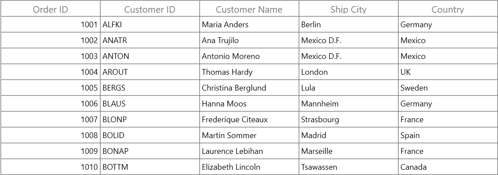
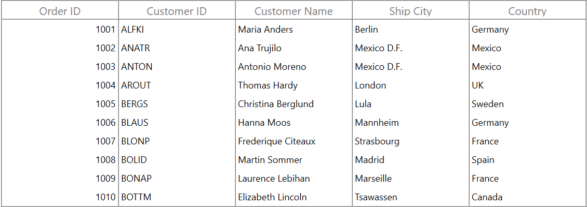
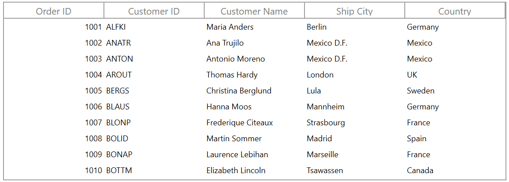
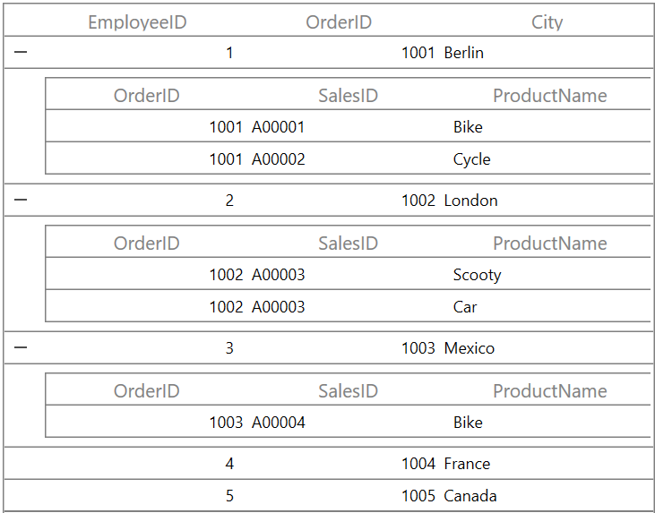

# Grid Lines Customization in WPF Data Grid

[WPF Data Grid](https://www.syncfusion.com/wpf-controls/datagrid) allows you to customize the grid lines visibility to vertical, horizontal, both or none. To achieve this, use the following properties.

[SfDataGrid.GridLinesVisibility](https://help.syncfusion.com/cr/wpf/Syncfusion.UI.Xaml.Grid.SfGridBase.html#Syncfusion_UI_Xaml_Grid_SfGridBase_GridLinesVisibility): To set the border lines for the cells other than header and stacked header cells.
[SfDataGrid.HeaderLinesVisibility](https://help.syncfusion.com/cr/wpf/Syncfusion.UI.Xaml.Grid.SfGridBase.html#Syncfusion_UI_Xaml_Grid_SfGridBase_HeaderLinesVisibility): To set the border lines only for header and stacked header cells.

The following are the list of options available to customize grid lines visibility,

* Both
* Vertical
* Horizontal
* None

## Record rows

### Both

The [GridLinesVisibility.Both](https://help.syncfusion.com/cr/wpf/Syncfusion.UI.Xaml.Grid.GridLinesVisibility.html#Syncfusion_UI_Xaml_Grid_GridLinesVisibility_Both) displays the Data Grid with both horizontal and vertical grid lines. By default GridLinesVisibility value set as Both.



xmlns:syncfusion="http://schemas.syncfusion.com/wpf" 

<syncfusion:SfDataGrid  x:Name="sfDataGrid"
                        AutoGenerateColumns="True"
                        GridLinesVisibility="Both"
                        ItemsSource="{Binding Orders}"/>



this.sfDataGrid.GridLinesVisibility = GridLinesVisibility.Both;



### Horizontal

The [GridLinesVisibility.Horizontal](https://help.syncfusion.com/cr/wpf/Syncfusion.UI.Xaml.Grid.GridLinesVisibility.html#Syncfusion_UI_Xaml_Grid_GridLinesVisibility_Horizontal) displays the Data Grid with horizontal grid lines only.



xmlns:syncfusion="http://schemas.syncfusion.com/wpf" 

<syncfusion:SfDataGrid  x:Name="sfDataGrid"
                        AutoGenerateColumns="True"
                        GridLinesVisibility="Horizontal" 
                        ItemsSource="{Binding Orders}"/>



 this.sfDataGrid.GridLinesVisibility = GridLinesVisibility.Horizontal;



### Vertical

The [GridLinesVisibility.Vertical](https://help.syncfusion.com/cr/wpf/Syncfusion.UI.Xaml.Grid.GridLinesVisibility.html#Syncfusion_UI_Xaml_Grid_GridLinesVisibility_Vertical) displays the Data Grid with vertical grid lines only.



xmlns:syncfusion="http://schemas.syncfusion.com/wpf"

<syncfusion:SfDataGrid  x:Name="sfDataGrid"
                        AutoGenerateColumns="True"
                        GridLinesVisibility="Vertical" 
                        ItemsSource="{Binding Orders}"/>


 this.sfDataGrid.GridLinesVisibility = GridLinesVisibility.Vertical;



### None
[GridLinesVisibility.None](https://help.syncfusion.com/cr/wpf/Syncfusion.UI.Xaml.Grid.GridLinesVisibility.html#Syncfusion_UI_Xaml_Grid_GridLinesVisibility_None) displays the Data Grid without grid lines.



xmlns:syncfusion="http://schemas.syncfusion.com/wpf"

 <dataGrid:SfDataGrid   x:Name="sfDataGrid"
                        AutoGenerateColumns="True" 
                        GridLinesVisibility="None"                     
                        ItemsSource="{Binding OrdersDetails}">
 </dataGrid:SfDataGrid>


 this.sfDataGrid.GridLinesVisibility = GridLinesVisibility.None;



## Header rows

You can customize the Data Grid header lines visibility by using the [SfDataGrid.HeaderLinesVisibility](https://help.syncfusion.com/cr/wpf/Syncfusion.UI.Xaml.Grid.SfGridBase.html#Syncfusion_UI_Xaml_Grid_SfGridBase_HeaderLinesVisibility) property. You can also customize the header lines visibility to horizontal, vertical, none or both. By default HeaderLinesVisibility value set as Both.



xmlns:syncfusion="http://schemas.syncfusion.com/wpf"

<syncfusion:SfDataGrid  x:Name="sfDataGrid"
                        AutoGenerateColumns="True"
                        HeaderLinesVisibility="Horizontal" 
                        ItemsSource="{Binding Orders}"/>



this.sfDataGrid.HeaderLinesVisibility = GridLinesVisibility.Horizontal;



## Grid lines for Master-Details view

The Data Grid allows you to customize the grid lines for Master-Details view also like parent grid by changing the grid lines properties in GridViewDefinition.DataGrid.



xmlns:syncfusion="http://schemas.syncfusion.com/wpf"

<syncfusion:SfDataGrid x:Name="sfDataGrid"
                       AutoGenerateColumns="True"                            
                       AutoGenerateRelations="False"
                       HideEmptyGridViewDefinition="True"
                       GridLinesVisibility="Horizontal"
                       HeaderLinesVisibility="Horizontal"
                       ItemsSource="{Binding Employees}">
        <!--  FirstLevelNestedGrid is created here  -->
        <syncfusion:GridViewDefinition RelationalColumn="Sales">
            <syncfusion:GridViewDefinition.DataGrid>
                <syncfusion:SfDataGrid  x:Name="FirstLevelNestedGrid"
                                        AutoGenerateColumns="True" 
                                        GridLinesVisibility="Horizontal"
                                        HeaderLinesVisibility="Horizontal">
                </syncfusion:SfDataGrid>
            </syncfusion:GridViewDefinition.DataGrid>
        </syncfusion:GridViewDefinition>
    </syncfusion:SfDataGrid.DetailsViewDefinition>
</syncfusion:SfDataGrid>



this.sfDataGrid.GridLinesVisibility = GridLinesVisibility.Horizontal;
this.sfDataGrid.HeaderLinesVisibility = GridLinesVisibility.Horizontal;
this.FirstLevelNestedGrid.GridLinesVisibility = GridLinesVisibility.Horizontal;
this.FirstLevelNestedGrid.HeaderLinesVisibility = GridLinesVisibility.Horizontal;




## Limitations

* Grid lines customization are not supported for RowHeader.