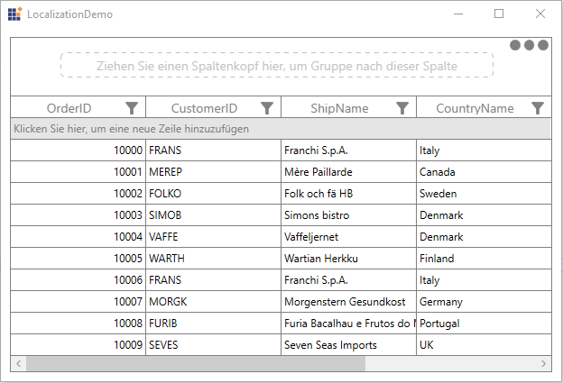

# Localization in WPF DataGrid (SfDataGrid)

Localization is the process of translating the application resources into different language for the specific cultures. You can localize the SfDataGrid by adding [resource] (https://msdn.microsoft.com/library/aa992030.aspx) file. Application culture can be changed by setting [CurrentUICulture] (https://msdn.microsoft.com/en-us/library/system.globalization.cultureinfo.currentuiculture.aspx) before `InitializeComponent()` method. 

Below application culture changed to German.



public MainWindow()
{
    System.Threading.Thread.CurrentThread.CurrentUICulture = new System.Globalization.CultureInfo("de-DE");

    InitializeComponent();
}    



To localize the SfDataGrid based on `CurrentUICulture` using resource files, follow the below steps. 

1.Create new folder and named as **Resources** in your application. 
2.Add the default resource file of SfDataGrid into **Resources** folder. You can download the Syncfusion.SfGrid.WPF.resx [here](https://www.syncfusion.com/downloads/support/directtrac/general/ze/Syncfusion.SfGrid.WPF71700028.zip).

3.Right-click on the Resources folder, select **Add** and then **NewItem**.

4.In `Add New Item` wizard, select the **Resource File** option and name the filename as **Syncfusion.SfGrid.WPF.&lt;culture name&gt;.resx**. For example, you have to give name as **Syncfusion.SfGrid.WPF.de.resx** for German culture.
 
5.The culture name that indicates the name of language and country. 

6.Now, select `Add` option to add the resource file in **Resources** folder.

7.Add the Name/Value pair in Resource Designer of **Syncfusion.SfGrid.WPF.de.resx** file and change its corresponding value to corresponding culture. 

You can get the sample from [here](https://www.syncfusion.com/downloads/support/directtrac/general/ze/Localization1013710435.zip)

## Localize when the resource file present in different assembly or different namespace?

By default, SfDataGrid try to read the resource file from executing assembly and its default namespace by using [Assembly.GetExecuteAssembly](https://msdn.microsoft.com/en-us/library/system.reflection.assembly.getexecutingassembly.aspx) method. When the resource file is located at different assembly or namespace, then you can let SfDataGrid know by using [GridResourceWrapper.SetResources](https://help.syncfusion.com/cr/wpf/Syncfusion.UI.Xaml.Grid.GridResourceWrapper.html#Syncfusion_UI_Xaml_Grid_GridResourceWrapper_SetResources_System_Reflection_Assembly_) method.



public MainWindow()
{
    System.Threading.Thread.CurrentThread.CurrentUICulture = new System.Globalization.CultureInfo("de-DE");            
    Syncfusion.UI.Xaml.Grid.GridResourceWrapper.SetResources("Assembly_name", "namespace_name");
    InitializeComponent();
}



## Editing default culture resource

You can edit default resource file by adding it to **Resources** folder of your application where SfDataGrid reads the static texts from here. You can download the default resource file from [here](https://www.syncfusion.com/downloads/support/directtrac/general/ze/Syncfusion.SfGrid.WPF71700028.zip).

Now, change the Name/Value pair in Resource Designer of **Syncfusion.SfGrid.WPF.resx** file.

