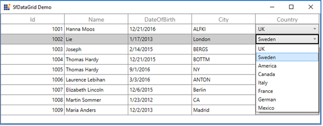

# MVVM in WPF DataGrid (SfDataGrid)

## DataGrid SelectedItem Binding

You can bind the [SelectedItem](https://help.syncfusion.com/cr/wpf/Syncfusion.UI.Xaml.Grid.SfGridBase.html#Syncfusion_UI_Xaml_Grid_SfGridBase_SelectedItem) property directly to the DataGrid by setting the `SfDataGrid.SelectedItem` property.



<syncfusion:SfDataGrid x:Name="dataGrid"
                        AutoGenerateColumns="False"  
                        SelectedItem="{Binding SelectedItem, Mode=TwoWay, UpdateSourceTrigger=PropertyChanged}"
                        ItemsSource="{Binding PersonDetails}"
                        NavigationMode="Cell"
                        ColumnSizer="Star"
                        SelectionMode="Extended"
                        ShowRowHeader="True">



Whenever the `SelectedItem` is changed, the `ViewModel` property will get notified.



public class PersonModel : INotifyPropertyChanged
{
          private object selectedItem;
          public object SelectedItem
          {
               get
               { 
                    return selectedItem;
               }
               set
               {
                   selectedItem = value;
                   RaisePropertyChanged("SelectedItem");
               }
         }
}



You can download the sample [here](http://www.syncfusion.com/downloads/support/directtrac/general/ze/SelectedItem-1872250691.zip).

## DataGrid SelectedItems Binding

You can bind the [SelectedItems](https://help.syncfusion.com/cr/wpf/Syncfusion.UI.Xaml.Grid.SfGridBase.html#Syncfusion_UI_Xaml_Grid_SfGridBase_SelectedItem) property directly to the DataGrid by setting the `SfDataGrid.SelectedItems` property.



<syncfusion:SfDataGrid x:Name="dataGrid"
                                Grid.Row="0"
                                AutoGenerateColumns="False"                               
                                SelectedItems="{Binding SelectedItems,Mode=TwoWay,UpdateSourceTrigger=PropertyChanged}"
                                ItemsSource="{Binding PersonDetails}"
                                NavigationMode="Cell"
                                ColumnSizer="Star"
                                SelectionMode="Extended"
                                ShowRowHeader="True">



You can bind the `SelectedItems` from the `ViewModel` property.



class ViewModel:INotifyPropertyChanged
{
         private ObservableCollection<object> _selectedItems; 
         public ObservableCollection<object> SelectedItems
         {
                get
                {
                      return _selectedItems;
                }
                set
                {
                    _selectedItems = value;
                     RaisePropertyChanged("SelectedItems");
                }
         }
}



You can download the sample [here](http://www.syncfusion.com/downloads/support/directtrac/general/ze/SelectedItems1384772866.zip).

## Button command binding to ViewModel

You can load a button for the columns in the DataGrid by using [GridTemplateColumn](https://help.syncfusion.com/cr/wpf/Syncfusion.UI.Xaml.Grid.GridTemplateColumn.html). When loading the buttons, you can bind command in `ViewModel` by using `ElementName` binding.

In the following example, `ViewModel` command receives the underlying data object as command parameter since the `DataContext` is binding as command parameter.



<syncfusion:SfDataGrid x:Name="sfGrid"
                                   Grid.Row="1"
                                   ColumnSizer="Star"
                                   AllowEditing="True"
                                   AutoGenerateColumns="False"
                                   ItemsSource="{Binding UserDetails}"
                                   ShowRowHeader="True">
<syncfusion:SfDataGrid.Columns>
    <syncfusion:GridTemplateColumn MappingName="City" syncfusion:FocusManagerHelper.WantsKeyInput="True">
        <syncfusion:GridTemplateColumn.CellTemplate>
            <DataTemplate>
                <Button  Content="Click" syncfusion:FocusManagerHelper.FocusedElement="True" 
                Command="{Binding Path=DataContext.RowDataCommand,ElementName=sfGrid}" CommandParameter="{Binding}"/>
            </DataTemplate>
        </syncfusion:GridTemplateColumn.CellTemplate>
    </syncfusion:GridTemplateColumn>
</syncfusion:SfDataGrid.Columns>
</syncfusion:SfDataGrid>



You can download the sample [here](http://www.syncfusion.com/downloads/support/directtrac/general/ze/ShowSelectedRowInformation-414969750.zip).

## Binding ComboBoxColumn ItemsSource from ViewModel

You can bind the `ItemsSource` from `ViewModel` to [GridComboBoxColumn](https://help.syncfusion.com/cr/wpf/Syncfusion.UI.Xaml.Grid.GridComboBoxColumn.html) or [GridMultiColumnDropDownList](https://help.syncfusion.com/cr/wpf/Syncfusion.UI.Xaml.Grid.GridMultiColumnDropDownList.html) by using the `ElementName` binding.



<syncfusion:SfDataGrid x:Name="DataGrid"
                               AutoGenerateColumns="False"
                               ItemsSource="{Binding OrderList}"
                               NavigationMode="Cell">
          <syncfusion:GridComboBoxColumn AllowEditing="True" 
                                         MappingName="Country"
                                         HeaderText="Country"
                                         ItemsSource="{Binding Path=DataContext.CountryList,
                                                                     ElementName=DataGrid}" />

</syncfusion:SfDataGrid>




class ViewModel:INotifyPropertyChanged
{
         private ObservableCollection<string> countryList; 
         public ObservableCollection<string> CountryList
         {
                get
                {
                      return countryList;
                }
                set
                {
                     countryList = value;
                     RaisePropertyChanged("CountryList");
                }
         }
}



You can download the sample [here](http://www.syncfusion.com/downloads/support/directtrac/general/ze/BindViewModelItemstoComboBoxColumn-223289547.zip). 

## Binding ViewModel ItemsSource to ComboBox inside data template

You can load the `ComboBox` inside the `GridTemplateColumn` and bind the `ItemsSource` from `ViewModel` to `ComboBox` by using the `ElementName` binding.



<syncfusion:SfDataGrid x:Name="DataGrid"
                        AutoGenerateColumns="False"
               ItemsSource="{Binding OrderList}"                        
                       NavigationMode="Cell">
    <syncfusion:SfDataGrid.Columns>
          <syncfusion:GridTemplateColumn MappingName="Country" syncfusion:FocusManagerHelper.WantsKeyInput="True">
                    <syncfusion:GridTemplateColumn.CellTemplate>
                        <DataTemplate>
                            <TextBlock Text="{Binding Country}"/>
                        </DataTemplate>
                    </syncfusion:GridTemplateColumn.CellTemplate>
                    <syncfusion:GridTemplateColumn.EditTemplate>
                        <DataTemplate>
                            <ComboBox ItemsSource="{Binding Path=DataContext.CountryList, ElementName=DataGrid}" DisplayMemberPath="{Binding CountryList}"/>
                        </DataTemplate>
                    </syncfusion:GridTemplateColumn.EditTemplate>
                </syncfusion:GridTemplateColumn>           
    </syncfusion:SfDataGrid.Columns>
</syncfusion:SfDataGrid>



You can download the sample [here](http://www.syncfusion.com/downloads/support/directtrac/general/ze/BindViewModelItemstotemplateComboBoxColumn-1705267981.zip).

## Binding DataGrid Columns from ViewModel

You can bind the [SfDataGrid.Columns](https://help.syncfusion.com/cr/wpf/Syncfusion.UI.Xaml.Grid.SfDataGrid.html#Syncfusion_UI_Xaml_Grid_SfDataGrid_Columns) to a property in the `ViewModel` by having the `binding` property of type `Syncfusion.SfGrid.UI.Xaml.Grid.Columns`. Thus, you can set binding to the `SfDataGrid.Columns` property that provides `DataContext` of the DataGrid is `ViewModel`. 



<Syncfusion:SfDataGrid x:Name="datagrid"  
                        AutoGenerateColumns="False"
                        Columns="{Binding SfGridColumns, Mode=TwoWay}"
                        ItemsSource="{Binding ItemsCollection}"
                        ShowRowHeader="True" />



Refer to the following code example in which the `SfGridColumns` is populated with some `GridTextColumn` when creating the `ViewModel` instance.



public class ViewModel
{
 private Columns sfGridColumns;

 public ViewModel()
 {
    SetSfGridColumns();
    this.ItemsCollection = employeeDetails;
 }

 public ObservableCollection<BusinessObjects> ItemsCollection
 {
    get { return itemsCollection; }
    set { itemsCollection = value;}
 }

 public Columns SfGridColumns
 {
    get { return sfGridColumns; }
    set { this.sfGridColumns = value; }
 }

 /// 

 /// To generate the columns for SfDataGrid
 /// 

 protected void SetSfGridColumns()
 {
    this.sfGridColumns = new Columns();
    sfGridColumns.Add(new GridTextColumn() { MappingName = "EmployeeName" });
    sfGridColumns.Add(new GridTextColumn() { MappingName = "EmployeeAge" });
    sfGridColumns.Add(new GridTextColumn() { MappingName = "EmployeeSalary" });
    sfGridColumns.Add(new GridTextColumn() { MappingName = "ExperienceInMonth" });
 }
}



You can download the sample [here](http://www.syncfusion.com/downloads/support/directtrac/general/ze/ColumnCollection-341303193.zip).
