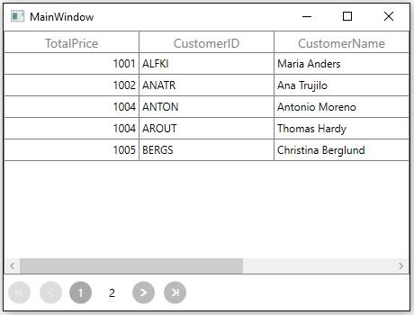

# Paging in WPF DataGrid (SfDataGrid)

SfDataGrid provides support to manipulate the data using SfDataPager control. You can refer [SfDataPager](http://help.syncfusion.com/wpf/sfdatapager) control user guide for more information.

## Getting started

Follow the below steps to bind SfDataGrid with SfDataPager.
 
1. Create `IEnumerable` collection that you want to bind and set it to [SfDataPager.Source](https://help.syncfusion.com/cr/wpf/Syncfusion.UI.Xaml.Controls.DataPager.SfDataPager.html#Syncfusion_UI_Xaml_Controls_DataPager_SfDataPager_Source) property.

2. Set [SfDataPager.PageSize](https://help.syncfusion.com/cr/wpf/Syncfusion.UI.Xaml.Controls.DataPager.SfDataPager.html#Syncfusion_UI_Xaml_Controls_DataPager_SfDataPager_PageSize) property to specify the number of records to be displayed per page.

3. Bind [SfDataPager.PagedSource](https://help.syncfusion.com/cr/wpf/Syncfusion.UI.Xaml.Controls.DataPager.SfDataPager.html#Syncfusion_UI_Xaml_Controls_DataPager_SfDataPager_PagedSource) to [SfDataGrid.ItemsSource](https://help.syncfusion.com/cr/wpf/Syncfusion.UI.Xaml.Grid.SfDataGrid.html#Syncfusion_UI_Xaml_Grid_SfDataGrid_ItemsSource) property. So whenever the page is changed, `PagedSource` will be update based on current page.



<Grid>
    <Grid.RowDefinitions>
        <RowDefinition Height="*" />
        <RowDefinition Height="Auto" />
    </Grid.RowDefinitions>

    <syncfusion:SfDataGrid x:Name="dataGrid"
                Grid.Row="0"
	ItemsSource="{Binding ElementName=dataPager,Path=PagedSource}"/>
    <syncfusion:SfDataPager x:Name="dataPager"
                Grid.Row="1"
                PageSize="5"
                Source="{Binding Orders}"/>
</Grid>


public class ViewModel
{
    private ObservableCollection<OrderInfo> _orders;

    public ObservableCollection<OrderInfo> Orders
    {
        get { return _orders; }
        set { _orders = value; }
    }

    public ViewModel()
    {
        _orders = new ObservableCollection<OrderInfo>();
        this.GenerateOrders();
    }

    private void GenerateOrders()
    {
        _orders.Add(new OrderInfo(1001, "Maria Anders", "Germany", "ALFKI", "Berlin"));
        _orders.Add(new OrderInfo(1002, "Ana Trujilo", "Mexico", "ANATR", "Mexico D.F."));
        _orders.Add(new OrderInfo(1003, "Antonio Moreno", "Mexico", "ANTON", "Mexico D.F."));
        _orders.Add(new OrderInfo(1004, "Thomas Hardy", "UK", "AROUT", "London"));
        _orders.Add(new OrderInfo(1005, "Christina Berglund", "Sweden", "BERGS", "Lula"));
        _orders.Add(new OrderInfo(1006, "Hanna Moos", "Germany", "BLAUS", "Mannheim"));
        _orders.Add(new OrderInfo(1007, "Frederique Citeaux", "France", "BLONP", "Strasbourg"));
        _orders.Add(new OrderInfo(1008, "Martin Sommer", "Spain", "BOLID", "Madrid"));
        _orders.Add(new OrderInfo(1009, "Laurence Lebihan", "France", "BONAP", "Marseille"));
        _orders.Add(new OrderInfo(1010, "Elizabeth Lincoln", "Canada", "BOTTM", "Tsawassen"));
    }
}

public class OrderInfo
{
    int orderID;
    string customerId;
    string country;
    string customerName;
    string shippingCity;

    public int OrderID
    {
          get {   return orderID;  }
          set {   orderID = value; }
    }

    public string CustomerID
    {
          get {  return customerId; }
          set {  customerId = value; }
    }

    public string CustomerName
    {
          get {  return customerName; }
          set {  customerName = value;}
    }

    public string Country
    {
          get { return country; }
          set  {  country = value; }
    }

    public string ShipCity
    {
         get {  return shippingCity; }
         set {  shippingCity = value; }
    }

    public OrderInfo(int orderId, string customerName, string country, string customerId,string shipCity)
    {
         this.OrderID = orderId;
         this.CustomerName = customerName;
         this.Country = country;
         this.CustomerID = customerId;
         this.ShipCity = shipCity;
    }
}



#### Limitations

1. SfDataPager doesn’t accepts `DataTable` as Source. 
2. `AddNewRow` is not supported in SfDataPager.
3. `FilterRow` is not supported in SfDataPager.

## Load data in on-demand

SfDataPager allows you to load data for current page alone using `OnDemandPaging` instead of loading data for all pages.

Follow the below steps to load the `ItemsSource` for page in on-demand,

1. Set [SfDataPager.UseOnDemandPaging](https://help.syncfusion.com/cr/wpf/Syncfusion.UI.Xaml.Controls.DataPager.SfDataPager.html#Syncfusion_UI_Xaml_Controls_DataPager_SfDataPager_UseOnDemandPaging) as `true`.
 
2. Set [SfDataPager.PageCount](https://help.syncfusion.com/cr/wpf/Syncfusion.UI.Xaml.Controls.DataPager.SfDataPager.html#Syncfusion_UI_Xaml_Controls_DataPager_SfDataPager_PageCount) based on total number of records and [SfDataPager.PageSize](https://help.syncfusion.com/cr/wpf/Syncfusion.UI.Xaml.Controls.DataPager.SfDataPager.html#Syncfusion_UI_Xaml_Controls_DataPager_SfDataPager_PageSize) property.

3. Use [OnDemandLoading](https://help.syncfusion.com/cr/wpf/Syncfusion.UI.Xaml.Controls.DataPager.SfDataPager.html) event to load the `ItemsSource` for current page using [LoadDynamicItems](https://help.syncfusion.com/cr/wpf/Syncfusion.UI.Xaml.Controls.DataPager.SfDataPager.html#Syncfusion_UI_Xaml_Controls_DataPager_SfDataPager_LoadDynamicItems_System_Int32_System_Collections_IEnumerable_) method.

[OnDemandLoading](https://help.syncfusion.com/cr/wpf/Syncfusion.UI.Xaml.Controls.DataPager.SfDataPager.html) event is raised when SfDataPager moves to another page and you can load the `ItemsSource` for corresponding page through `OnDemandLoading` event. 

[OnDemandLoadingEventArgs](http://help.syncfusion.com/cr/wpf/Syncfusion.UI.Xaml.Controls.DataPager.OnDemandLoadingEventArgs.html) has the following members,

1. `StartIndex` - returns the start index based on `PageIndex` (Number of previous pages * PageSize).

2. `PageSize` - denotes the number of records to be displayed in the page.

N> Do not assign `SfDataPager.Source` property while using `OnDemandPaging`.



<Grid>
    <Grid.RowDefinitions>
        <RowDefinition Height="*" />
        <RowDefinition Height="Auto" />
    </Grid.RowDefinitions>

    <syncfusion:SfDataGrid x:Name="dataGrid"
                                               Grid.Row="0"
                                               ItemsSource="{Binding ElementName=dataPager,Path=PagedSource}"/>
    <syncfusion:SfDataPager x:Name="dataPager" 
                                                  PageCount="3"
                                                  PageSize="10"     
                                                  UseOnDemandPaging="True"
                                                  Grid.Row="1"/>

</Grid>


private ObservableCollection<OrderInfo> source;

public MainWindow()
{
    InitializeComponent();
    dataPager.OnDemandLoading += dataPager_OnDemandLoading;
}

private void dataPager_OnDemandLoading(object sender, Syncfusion.UI.Xaml.Controls.DataPager.OnDemandLoadingEventArgs args)
{
    source = (this.DataContext as ViewModel).Orders;
    dataPager.LoadDynamicItems(args.StartIndex, source.Skip(args.StartIndex).Take(args.PageSize));
}



### Resetting cache

While navigating between the pages, records are loaded through `OnDemandLoading` event and the records of navigated pages will be maintained in cache. If you navigate to already navigated page, the records are loaded from cache instead of loading from `OnDemandLoading` event. You can clear the cache by using [PageCollectionView.ResetCache](https://help.syncfusion.com/cr/wpf/Syncfusion.Data.PagedCollectionView.html#Syncfusion_Data_PagedCollectionView_ResetCache) method. Once this method is invoked, the `OnDemandLoading` event will be raised while navigating multiple times to the same page.


<syncfusion:SfDataPager x:Name="dataPager" 
                                             PageCount="3"
                                             PageSize="10"     
                                             UseOnDemandPaging="True"
                                            Grid.Row="1"/>


ObservableCollection<OrderInfo> source;

public MainWindow()
{
    InitializeComponent();
    dataPager.OnDemandLoading += dataPager_OnDemandLoading;
    source = (this.DataContext as ViewModel).Orders;
}

private void dataPager_OnDemandLoading(object sender, Syncfusion.UI.Xaml.Controls.DataPager.OnDemandLoadingEventArgs args)
{
    dataPager.LoadDynamicItems(args.StartIndex, source.Skip(args.StartIndex).Take(args.PageSize));

    //resetting cache for all pages.
  (dataPager.PagedSource as PagedCollectionView).ResetCache();
}



You can also clear the cache to particular page by specifying the `PageIndex` in [PageCollectionView.ResetCacheForPage](https://help.syncfusion.com/cr/wpf/Syncfusion.Data.PagedCollectionView.html#Syncfusion_Data_PagedCollectionView_ResetCacheForPage_System_Int32_) method.



(dataPager.PagedSource as PagedCollectionView).ResetCacheForPage(this.dataPager.PageIndex);



### Loading data from database in on-demand
You can read the data from database in on-demand (here, records are retrieved from `Northwind` data provider) in `OnDemandLoading` event handler.



<Grid>
    <Grid.RowDefinitions>
        <RowDefinition Height="*" />
        <RowDefinition Height="Auto" />
    </Grid.RowDefinitions>
    <syncfusion:SfDataGrid x:Name="dataGrid"
                                               Grid.Row="0"
                                               AutoGenerateColumns="False"
                                               ItemsSource="{Binding Path=PagedSource,
                                                    ElementName=dataPager}">
        <syncfusion:SfDataGrid.Columns>
            <syncfusion:GridTextColumn MappingName="OrderID" TextAlignment="Left" />
            <syncfusion:GridTextColumn MappingName="CustomerID" />
            <syncfusion:GridTextColumn MappingName="EmployeeID" TextAlignment="Right" />
            <syncfusion:GridTextColumn HeaderText="Ship Name" MappingName="ShipName" />
            <syncfusion:GridTextColumn HeaderText="Ship Address" MappingName="ShipAddress" />
            <syncfusion:GridTextColumn HeaderText="Ship City" MappingName="ShipCity" />
            <syncfusion:GridTextColumn HeaderText="Ship Country" MappingName="ShipCountry" />
        </syncfusion:SfDataGrid.Columns>
    </syncfusion:SfDataGrid>
    <syncfusion:SfDataPager x:Name="dataPager"
                                                 Grid.Row="1"                                                 
                                                 PageCount="5"
                                                 PageSize="10"
                                                 UseOnDemandPaging="True" />
</Grid>


public partial class MainWindow : Window
{
    Northwind northWind;
 
    public MainWindow()
    {
        InitializeComponent();
        dataPager.OnDemandLoading += dataPager_OnDemandLoading;
        string connectionString = string.Format(@"Data Source = {0}", ("Northwind.sdf"));
 
       //northWind dataProvider connectivity.
        northWind = new Northwind(connectionString);
    }

    private void dataPager_OnDemandLoading(object sender, Syncfusion.UI.Xaml.Controls.DataPager.OnDemandLoadingEventArgs args)
    {                      
        dataPager.LoadDynamicItems(args.StartIndex, northWind.Orders.Skip(args.StartIndex).Take(args.PageSize).ToList());
    }



### Changing PageCount at run time while filtering
You can change the [SfDataPager.PageCount](https://help.syncfusion.com/cr/wpf/Syncfusion.UI.Xaml.Controls.DataPager.SfDataPager.html#Syncfusion_UI_Xaml_Controls_DataPager_SfDataPager_PageCount) at runtime based on the records count in `OnDemandPaging`. 
Here, PageCount are modified by filtering the records in run time.



<Grid>
        <Grid.ColumnDefinitions>
            <ColumnDefinition Width="*" />
            <ColumnDefinition Width="250" />
        </Grid.ColumnDefinitions>
        <Grid.RowDefinitions>
            <RowDefinition Height="*" />
            <RowDefinition Height="Auto" />
        </Grid.RowDefinitions>

        <StackPanel Grid.Column="1">
            <TextBlock Width="250"
                       Margin="10"
                       FontSize="14"
                       Foreground="DarkBlue"
                       Text="Enter value to filter the ShipName column (Filter by contains)"
                       TextWrapping="Wrap" />
            <TextBox Name="fitlerTextBox"
                     Width="150"
                     Margin="10" />
            <Button Width="100"
                    Margin="10"
                    Click="FilterBtn_Click"
                    Content="Filter" />
        </StackPanel>
        <syncfusion:SfDataGrid x:Name="dataGrid"
                               Grid.Row="0"
                               AllowEditing="True"
                               AutoGenerateColumns="False"
                               ItemsSource="{Binding Path=PagedSource,
                                                     ElementName=dataPager}">
            <syncfusion:SfDataGrid.Columns>
                <syncfusion:GridTextColumn HeaderText="Ship Name" MappingName="ShipName" />
                <syncfusion:GridTextColumn MappingName="OrderID" TextAlignment="Left" />
                <syncfusion:GridTextColumn MappingName="CustomerID" />
                <syncfusion:GridTextColumn MappingName="EmployeeID" TextAlignment="Right" />
                <syncfusion:GridTextColumn HeaderText="Ship Address" MappingName="ShipAddress" />
                <syncfusion:GridTextColumn HeaderText="Ship City" MappingName="ShipCity" />
                <syncfusion:GridTextColumn HeaderText="Ship Country" MappingName="ShipCountry" />
            </syncfusion:SfDataGrid.Columns>
        </syncfusion:SfDataGrid>
        <syncfusion:SfDataPager x:Name="dataPager"
                                Grid.Row="1"
                                PageCount="5"
                                PageSize="10"
                                UseOnDemandPaging="True" />
    </Grid>


public partial class MainWindow : Window
{
    List<Orders> source = new List<Orders>();
    Northwind northWind;
  
    public MainWindow()
    {
        InitializeComponent();
        dataPager.OnDemandLoading += dataPager_OnDemandLoading;
        string connectionString = string.Format(@"Data Source = {0}", ("Northwind.sdf"));
  
       //northwind dataprovider connectivity.
        northWind = new Northwind(connectionString);      
source = northWind.Orders.ToList(); 
    }

    private void dataPager_OnDemandLoading(object sender, Syncfusion.UI.Xaml.Controls.DataPager.OnDemandLoadingEventArgs args)
    {        
        dataPager.LoadDynamicItems(args.StartIndex, source.Skip(args.StartIndex).Take(args.PageSize));
    }

private List<Orders> ApplyFilter(Northwind NorthwindSource)
{
 
   //records are filtered based on ShipName column
    return NorthwindSource.Orders.Where(item => item.ShipName.Contains(fitlerTextBox.Text)).ToList();
}

private void FilterBtn_Click(object sender, RoutedEventArgs e)
{
    source = ApplyFilter(northWind);
 
   //page count resets based on filtered records.
 
    if (source.Count() < dataPager.PageSize)
        this.dataPager.PageCount = 1;
 
    else
    {
        var count = source.Count() / dataPager.PageSize;
 
        if (source.Count() % dataPager.PageSize == 0)
            this.dataPager.PageCount = count;
 
        else
            this.dataPager.PageCount = count + 1;
    }
    this.dataPager.MoveToPage(0);
}



Here, records are filtered based on the textbox text in clicking event of Filter button. Initially `PageCount` is 5 and it is changed as 3 once the records are filtered.

You can refer the [sample](http://www.syncfusion.com/downloads/support/directtrac/133329/ze/DataPager398566735) from here.

### Sorting complete collection

You can sort the complete collection with ‘OnDemandPaging’ by using [SfDataGrid.SortColumnChanging](https://help.syncfusion.com/cr/wpf/Syncfusion.UI.Xaml.Grid.SfDataGrid.html) event.
In this event, you can sort the complete underlying collection instead of sorting current page alone by resetting the caches.



<Window.DataContext>
    <local:ViewModel />
</Window.DataContext>
<Grid>
    <Grid.RowDefinitions>
        <RowDefinition Height="*" />
        <RowDefinition Height="Auto" />
    </Grid.RowDefinitions>

    <syncfusion:SfDataGrid x:Name="dataGrid"
                                               Grid.Row="0"
                                               ItemsSource="{Binding ElementName=dataPager,Path=PagedSource}"/>
    <syncfusion:SfDataPager x:Name="dataPager" 
                                                  PageCount="4"
                                               PageSize="10"     
                                               UseOnDemandPaging="True"                                              
                                               Grid.Row="1"/>

</Grid>


using Syncfusion.Data.Extensions;
List<OrderInfo> source;

public MainWindow()
{
    InitializeComponent();
    source = new List<OrderInfo>();
    dataPager.OnDemandLoading += dataPager_OnDemandLoading;
    source = (this.DataContext as ViewModel).Orders;
    this.dataGrid.SortColumnsChanging += DataGrid_SortColumnsChanging;
}

private void DataGrid_SortColumnsChanging(object sender, GridSortColumnsChangingEventArgs e)
{
    (dataPager.PagedSource as PagedCollectionView).ResetCache();
    (dataPager.PagedSource as PagedCollectionView).ResetCacheForPage(dataPager.PageIndex);

    if (e.Action == NotifyCollectionChangedAction.Add || e.Action == NotifyCollectionChangedAction.Replace)
    {
        var sortDesc = e.AddedItems[0];

        if (sortDesc.SortDirection == ListSortDirection.Ascending)
        {

        //records are sorted in ascending order.
            source = source.OfQueryable().AsQueryable().OrderBy(sortDesc.ColumnName).Cast<OrderInfo>().ToList();
        }

        else
        {

        //records are sorted descending order.
            source =
                source.OfQueryable()
                        .AsQueryable()
                        .OrderByDescending(sortDesc.ColumnName)
                        .Cast<OrderInfo>()
                        .ToList();
        }
        this.dataPager.MoveToPage(dataPager.PageIndex);
    }

private void dataPager_OnDemandLoading(object sender, Syncfusion.UI.Xaml.Controls.DataPager.OnDemandLoadingEventArgs args)
{
    dataPager.LoadDynamicItems(args.StartIndex, source.Skip(args.StartIndex).Take(args.PageSize));
}



### Loading ItemsSource for page using async and await

When you fetch the data from external server, it takes some time to load the data. In this case, you can delay the loading in `SfDataPager.OnDemandLoading` event using `async` and `await`. 
Here `dataPager_OnDemandLoading` event is defined with `async` keyword to load the data by time delay. `GetEmployeesDetailsListAsync` method is invoked in `dataPager_OnDemandLoading` with `await` keyword which holds the execution until returning the data. 



private EmployeeInfoRepository repository;

public MainWindow()
{
    InitializeComponent();
    repository = new EmployeeInfoRepository();
}

//async method which return data with some delay

public async Task<List<Employees>> GetEmployeesDetailsListAsync(int startIndex, int pageSize)
{
    var employees = new List<Employees>();

    //wait the method Execution to 2000 milliseconds
    System.Threading.Thread.Sleep(2000);

    for (int i = startIndex; i < (startIndex + pageSize); i++)
    {

        //Get the Data's to SfDataPager from ViewModel class
        employees.Add(repository.GetEmployees(i,pageSize));
    }
    return employees;
}

//Delegate handler marked as async to use await inside

private async void dataPager_OnDemandLoading(object sender, OnDemandLoadingEventArgs args)
{
    var source = await GetEmployeesDetailsListAsync(args.StartIndex, args.PageSize);

    //Data's loaded to SfDataPager dynamically     
     dataPager.LoadDynamicItems(args.StartIndex, source.Take(args.PageSize));

    //Resets the previously loaded page data's. It’s optional         
    (dataPager.PagedSource as PagedCollectionView).ResetCache();
}




`GetEmployees` method in `EmployeeInfoRepository` returns the record to SfDataPager.



public class EmployeeInfoRepository
{

    public EmployeeInfoRepository()
    {
    }

    public List<Employees> GetEmployees(int startIndex, int pageSize)
    {
        int j = 0;
        var employees = new List<Employees>();

        for (int i = startIndex; i < (startIndex + pageSize); i++)
        {
            Employees employee = GetEmployee(employees);
            employees.Add(employee);
        }
        return employees;
    }

  }



### Limitations
1. UI Filtering is not supported. You can code in application level to filter the data.
2. Data processing operations (Sorting, Grouping) are done only in the current page. 
3. Deleting is not supported. You can code to delete row in application level. 
4. Only the navigated pages are exported when `OnDemandPaging’ is enabled, if the navigated page cache is cleared then the corresponding page will not be exported.
