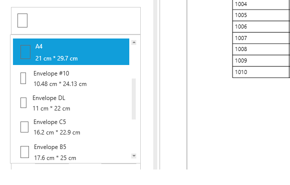
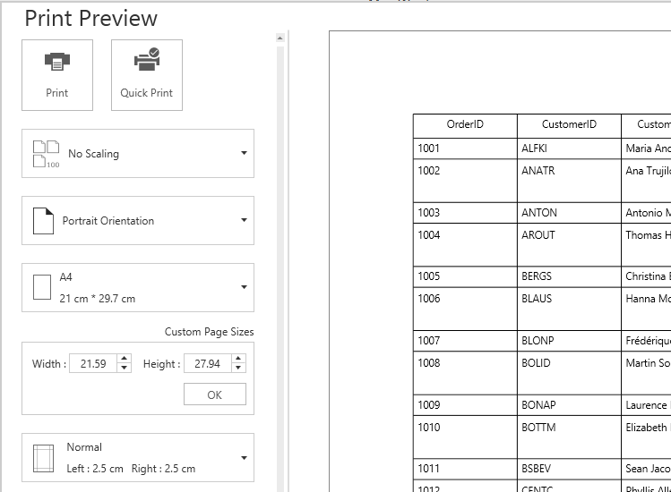
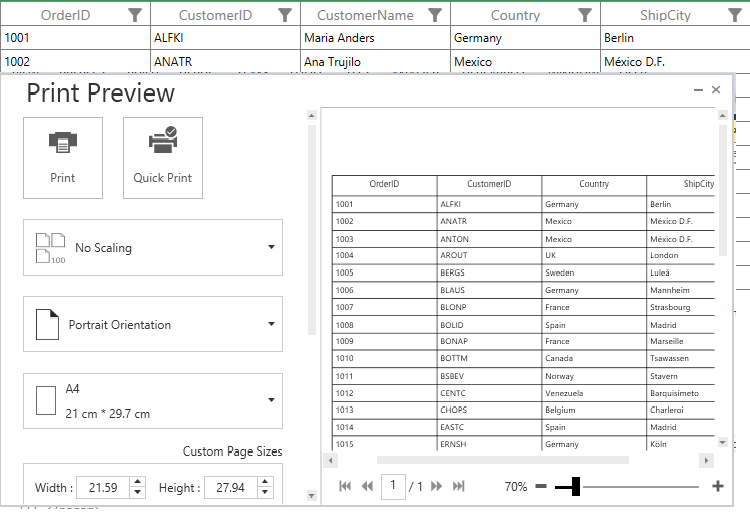
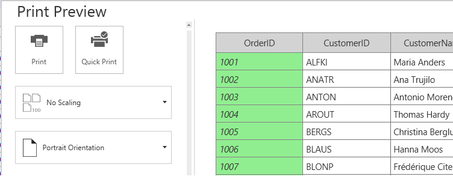
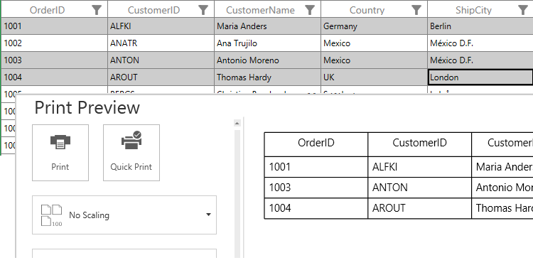
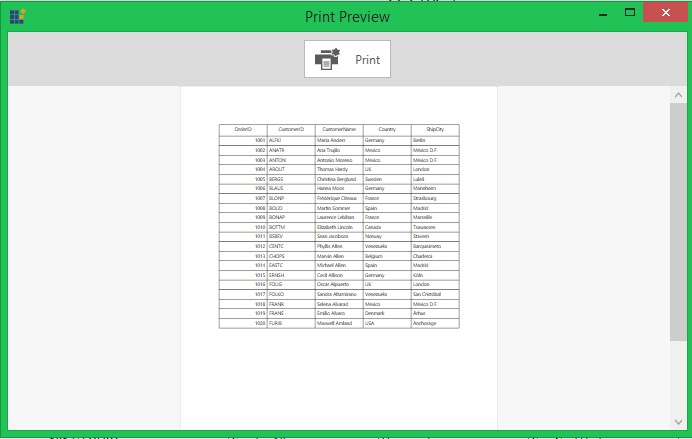

# Printing in WPF DataGrid (SfDataGrid)

SfDataGrid provides support to print the data displayed in the DataGrid using [SfDataGrid.Print](http://help.syncfusion.com/cr/cref_files/wpf/Syncfusion.SfGrid.WPF~Syncfusion.UI.Xaml.Grid.SfDataGrid~Print.html) method. It also provides support to display print preview window by calling   [SfDataGrid.ShowPrintPreview](http://help.syncfusion.com/cr/cref_files/wpf/Syncfusion.SfGrid.WPF~Syncfusion.UI.Xaml.Grid.SfDataGrid~ShowPrintPreview.html) method.



dataGrid.Print();



## Print Preview

SfDataGrid provides option to display print preview to review and customize the document in desired format before printing. Print preview window can be opened by calling [SfDataGrid.ShowPrintPreview](http://help.syncfusion.com/cr/cref_files/wpf/Syncfusion.SfGrid.WPF~Syncfusion.UI.Xaml.Grid.SfDataGrid~ShowPrintPreview.html) method.



dataGrid.ShowPrintPreview();



## Print Settings

SfDataGrid provides various options to customize print preview settings using [SfDataGrid.PrintSettings](http://help.syncfusion.com/cr/cref_files/wpf/Syncfusion.SfGrid.WPF~Syncfusion.UI.Xaml.Grid.SfDataGrid~PrintSettings.html) property of type [PrintSettings](http://help.syncfusion.com/cr/cref_files/wpf/Syncfusion.SfGrid.WPF~Syncfusion.UI.Xaml.Grid.PrintSettings.html).



dataGrid.PrintSettings = new PrintSettings();
dataGrid.PrintSettings.AllowRepeatHeaders = false;            
dataGrid.Print();



### Print

Print preview window has Print and Quick Print Buttons which needs to be clicked to print the SfDataGrid.

1. Clicking the Print button opens the System print dialog where user can select the printer and set the number of copies to be printed.

    

2. Clicking the Quick Print button, directly print the pages using default printer without opening the print dialog.

### Scaling

SfDataGrid provides support to scale rows or columns or both while printing to fit on one page. Scaling options can be changed by setting [PrintSettings.PrintScaleOption](http://help.syncfusion.com/cr/cref_files/wpf/Syncfusion.SfGrid.WPF~Syncfusion.UI.Xaml.Grid.PrintSettings~PrintScaleOption.html) property.



dataGrid.PrintSettings = new PrintSettings();
dataGrid.PrintSettings.PrintScaleOption = PrintScaleOptions.FitAllColumnsonOnePage;
dataGrid.ShowPrintPreview();



Scaling options can be changed in print preview at runtime by selecting from scaling options drop-down in print preview. 

### Column Header on each page

Column headers can be printed on each page by enabling [PrintSettings.AllowRepeatHeaders](http://help.syncfusion.com/cr/cref_files/wpf/Syncfusion.SfGrid.WPF~Syncfusion.UI.Xaml.Grid.PrintSettings~AllowRepeatHeaders.html) property while printing.



dataGrid.PrintSettings = new PrintSettings();
dataGrid.PrintSettings.AllowRepeatHeaders = true;
dataGrid.Print();



### Changing Flow Direction while printing

You can change the text direction in print page by using [PrintSettings.PrintFlowDirection](http://help.syncfusion.com/cr/cref_files/wpf/Syncfusion.SfGrid.WPF~Syncfusion.UI.Xaml.Grid.PrintSettings~PrintFlowDirection.html) property.



dataGrid.PrintSettings = new PrintSettings();
dataGrid.PrintSettings.PrintFlowDirection = FlowDirection.RightToLeft;
dataGrid.Print();



### Print with StackedHeaders

SfDataGrid provides support to print the StackedHeaders by setting the [PrintSettings.CanPrintStackedHeaders](https://help.syncfusion.com/cr/wpf/Syncfusion.UI.Xaml.Grid.PrintSettings.html#Syncfusion_UI_Xaml_Grid_PrintSettings_CanPrintStackedHeaders) as `true`.



this.sfDataGrid.PrintSettings.CanPrintStackedHeaders = true;



## Page Settings

SfDataGrid provides various options to customize page settings using [SfDataGrid.PrintSettings](http://help.syncfusion.com/cr/cref_files/wpf/Syncfusion.SfGrid.WPF~Syncfusion.UI.Xaml.Grid.SfDataGrid~PrintSettings.html) property of type [PrintSettings](http://help.syncfusion.com/cr/cref_files/wpf/Syncfusion.SfGrid.WPF~Syncfusion.UI.Xaml.Grid.PrintSettings.html).

### Orientation

SfDataGrid provides support to switch between Portrait (more rows but fewer columns) and Landscape (more columns but fewer rows) orientation while printing. Orientation can be changed by setting [PrintSettings.PrintPageOrientation](http://help.syncfusion.com/cr/cref_files/wpf/Syncfusion.SfGrid.WPF~Syncfusion.UI.Xaml.Grid.PrintSettings~PrintPageOrientation.html) Property.



dataGrid.PrintSettings = new PrintSettings();
dataGrid.PrintSettings.PrintPageOrientation = PrintOrientation.Landscape;
dataGrid.ShowPrintPreview();



Print orientation can be changed in print preview at runtime by selecting from orientation drop-down in print preview.

### Page size

SfDataGrid provides support to change the page size. Page size can be changed by setting [PrintSettings.PrintPageWidth](http://help.syncfusion.com/cr/cref_files/wpf/Syncfusion.SfGrid.WPF~Syncfusion.UI.Xaml.Grid.PrintSettings~PrintPageWidth.html) and [PrintSettings.PrintPageHeight](http://help.syncfusion.com/cr/cref_files/wpf/Syncfusion.SfGrid.WPF~Syncfusion.UI.Xaml.Grid.PrintSettings~PrintPageHeight.html) properties.



dataGrid.PrintSettings = new PrintSettings();
dataGrid.PrintSettings.PrintPageHeight = 800;            
dataGrid.PrintSettings.PrintPageWidth = 800;
dataGrid.Print();



Page size can be changed in print preview also by selecting from page-size drop-down which displays pre-defined page sizes. You can also manually enter custom page width and height in the editors below page-size drop-down and press OK to apply the custom width and height for the page.

### Page margin

SfDataGrid provides support to change the page margins to adjust content in printed page. Page margin can be changed by setting [PrintSettings.PrintPageMargin](http://help.syncfusion.com/cr/cref_files/wpf/Syncfusion.SfGrid.WPF~Syncfusion.UI.Xaml.Grid.PrintSettings~PrintPageMargin.html) property.



dataGrid.PrintSettings = new PrintSettings();
dataGrid.PrintSettings.PrintPageMargin = new Thickness(5);
dataGrid.Print();



Page margin can be changed in print preview also by selecting from pre-defined page margin from margin drop-down. You can manually enter custom margins in the editors below margin drop-down and press OK to apply the custom margin.

## Setting Header and Footer

SfDataGrid provides a way to display additional content at the top (Header) or bottom (Footer) of the page while printing. This can be achieved by setting [PrintPageHeaderHeight](http://help.syncfusion.com/cr/cref_files/wpf/Syncfusion.SfGrid.WPF~Syncfusion.UI.Xaml.Grid.PrintSettings~PrintPageHeaderHeight.html) , [PrintPageHeaderTemplate](http://help.syncfusion.com/cr/cref_files/wpf/Syncfusion.SfGrid.WPF~Syncfusion.UI.Xaml.Grid.PrintSettings~PrintPageHeaderTemplate.html) , [PrintPageFooterHeight](http://help.syncfusion.com/cr/cref_files/wpf/Syncfusion.SfGrid.WPF~Syncfusion.UI.Xaml.Grid.PrintSettings~PrintPageFooterHeight.html)  [PrintPageFooterTemplate](http://help.syncfusion.com/cr/cref_files/wpf/Syncfusion.SfGrid.WPF~Syncfusion.UI.Xaml.Grid.PrintSettings~PrintPageFooterTemplate.html) properties in [PrintSettings](http://help.syncfusion.com/cr/cref_files/wpf/Syncfusion.SfGrid.WPF~Syncfusion.UI.Xaml.Grid.SfDataGrid~PrintSettings.html).

Steps to add page header while printing,

1. Create DataTemplate in `Application.Resources`.



<Application.Resources>
    <DataTemplate x:Key="PageHeaderTempalte">
        <Grid Background="Gray">
            <TextBlock Text="Syncfusion" 
                       FontSize="18" 
                       FontWeight="Bold" 
                       Foreground="White" 
                       HorizontalAlignment="Center"/>
        </Grid>
    </DataTemplate>
</Application.Resources>



2.Set the above defined DataTemplate to [PrintSettings.PrintPageHeaderTemplate](http://help.syncfusion.com/cr/cref_files/wpf/Syncfusion.SfGrid.WPF~Syncfusion.UI.Xaml.Grid.PrintSettings~PrintPageHeaderTemplate.html) and assign value for [PrintSettings.PrintPageHeaderHeight](http://help.syncfusion.com/cr/cref_files/wpf/Syncfusion.SfGrid.WPF~Syncfusion.UI.Xaml.Grid.PrintSettings~PrintPageHeaderHeight.html) property also.



dataGrid.PrintSettings = new PrintSettings();
dataGrid.PrintSettings.PrintPageHeaderHeight = 30;
dataGrid.PrintSettings.PrintPageHeaderTemplate = Application.Current.Resources["PageHeaderTempalte"] as DataTemplate;
dataGrid.ShowPrintPreview();



3.Now run the application and you can see page header in all the pages. In the same way, you can set [PrintSettings.PrintPageFooterTemplate](http://help.syncfusion.com/cr/cref_files/wpf/Syncfusion.SfGrid.WPF~Syncfusion.UI.Xaml.Grid.PrintSettings~PrintPageFooterTemplate.html) also.

N> [PrintManagerBase](http://help.syncfusion.com/cr/cref_files/wpf/Syncfusion.SfGrid.WPF~Syncfusion.UI.Xaml.Grid.PrintManagerBase.html) is the `DataContext` for [PrintPageControl](http://help.syncfusion.com/cr/cref_files/wpf/Syncfusion.SfGrid.WPF~Syncfusion.UI.Xaml.Grid.PrintPageControl.html), where the header and footer templates are loaded.

### Printing Current Date time and Page number

You can print current Date and Time at each page by setting the  [PrintPageFooterHeight](http://help.syncfusion.com/cr/cref_files/wpf/Syncfusion.SfGrid.WPF~Syncfusion.UI.Xaml.Grid.PrintSettings~PrintPageFooterHeight.html)  [PrintPageFooterTemplate](http://help.syncfusion.com/cr/cref_files/wpf/Syncfusion.SfGrid.WPF~Syncfusion.UI.Xaml.Grid.PrintSettings~PrintPageFooterTemplate.html) properties in [PrintSettings](http://help.syncfusion.com/cr/cref_files/wpf/Syncfusion.SfGrid.WPF~Syncfusion.UI.Xaml.Grid.SfDataGrid~PrintSettings.html).
 
You can get the page number from [PrintPageControl](http://help.syncfusion.com/cr/cref_files/wpf/Syncfusion.SfGrid.WPF~Syncfusion.UI.Xaml.Grid.PrintPageControl.html).



<Application.Resources>
    <DataTemplate x:Key="PageFooterTempalte">
        <Grid>
            <TextBlock HorizontalAlignment="Center" 
                       FontSize="20" 
                       Text="{Binding Source={x:Static system:DateTime.Now}}"/>
            <TextBlock Margin="0,0,10,0"
                       HorizontalAlignment="Right"
                       VerticalAlignment="Center" FontSize="20">
                <TextBlock.Text>
                    <Binding Path="PageIndex"
                             RelativeSource="{RelativeSource Mode=FindAncestor,
                                                              AncestorType={x:Type syncfusion:PrintPageControl}}"
                             StringFormat="Page : {0}" />
                </TextBlock.Text>
            </TextBlock>
        </Grid>
    </DataTemplate>
</Application.Resources>





dataGrid.PrintSettings = new PrintSettings();
dataGrid.PrintSettings.PrintPageFooterHeight = 30;
dataGrid.PrintSettings.PrintPageFooterTemplate = Application.Current.Resources["PageFooterTempalte"] as DataTemplate;
dataGrid.ShowPrintPreview();



## Different modes of printing for better performance

### Printing using drawing for better performance

When you require better performance and don’t want appearance settings (Background and Foreground) to be exported while printing then you can use this printing option by setting [PrintSettings.AllowPrintByDrawing](http://help.syncfusion.com/cr/cref_files/wpf/Syncfusion.SfGrid.WPF~Syncfusion.UI.Xaml.Grid.PrintSettings~AllowPrintByDrawing.html) property to `true`.
 
 
N> This is default print mode. For appearance customization of rows and cells while printing, refer [printing customization](#printing-customization) section.

 
### Printing using UIElement Rendering

When you want to print the SfDataGrid with same appearance settings as in the display (Background and Foreground) or with custom appearance by writing styles, then you can enable this print option by setting [PrintSettings.AllowPrintByDrawing](http://help.syncfusion.com/cr/cref_files/wpf/Syncfusion.SfGrid.WPF~Syncfusion.UI.Xaml.Grid.PrintSettings~AllowPrintByDrawing.html) property to `false`.

You can print SfDataGrid as it displayed in View by setting [PrintSettings.AllowPrintStyles](http://help.syncfusion.com/cr/cref_files/wpf/Syncfusion.SfGrid.WPF~Syncfusion.UI.Xaml.Grid.PrintSettings~AllowPrintStyles.html) to `true`.



dataGrid.PrintSettings = new PrintSettings();
dataGrid.PrintSettings.AllowPrintByDrawing = false;
dataGrid.PrintSettings.AllowPrintStyles = true;
dataGrid.ShowPrintPreview();



[GridHeaderCellControl](http://help.syncfusion.com/cr/cref_files/wpf/Syncfusion.SfGrid.WPF~Syncfusion.UI.Xaml.Grid.GridHeaderCellControl.html) style customized and the same style will be exported while printing by setting [PrintSettings.AllowPrintStyles](http://help.syncfusion.com/cr/cref_files/wpf/Syncfusion.SfGrid.WPF~Syncfusion.UI.Xaml.Grid.PrintSettings~AllowPrintStyles.html) to `true`.



<Application.Resources>
     
</Application.Resources>



#### Applying custom style

Custom styles can be applied while printing by setting [PrintSettings.AllowPrintStyles](http://help.syncfusion.com/cr/cref_files/wpf/Syncfusion.SfGrid.WPF~Syncfusion.UI.Xaml.Grid.PrintSettings~AllowPrintStyles.html) to `false` and writing style for below controls based on your requirement.

<table>
<tr>
<th>
Appearance to be customized
</th>
<th>
TargetType of Style
</th>
</tr>
<tr>
<td>
Header Cell
</td>
<td>
{{'[PrintHeaderCell](http://help.syncfusion.com/cr/cref_files/wpf/Syncfusion.SfGrid.WPF~Syncfusion.UI.Xaml.Grid.PrintHeaderCell.html)'| markdownify }}
</td>
</tr>
<tr>
<td>
Normal Cells
</td>
<td>
{{'[PrintGridCell](http://help.syncfusion.com/cr/cref_files/wpf/Syncfusion.SfGrid.WPF~Syncfusion.UI.Xaml.Grid.PrintGridCell.html)'| markdownify }}
</td>
</tr>
<tr>
<td>
Caption summary cells
</td>
<td>
{{'[PrintCaptionSummaryCell](http://help.syncfusion.com/cr/cref_files/wpf/Syncfusion.SfGrid.WPF~Syncfusion.UI.Xaml.Grid.PrintCaptionSummaryCell.html)'| markdownify }}
</td>
</tr>
<tr>
<td>
Group summary cells
</td>
<td>
{{'[PrintGroupSummaryCell](http://help.syncfusion.com/cr/cref_files/wpf/Syncfusion.SfGrid.WPF~Syncfusion.UI.Xaml.Grid.PrintGroupSummaryCell.html)'| markdownify }}
</td>
</tr>
<tr>
<td>
Table summary cells
</td>
<td>
{{'[PrintTableSummaryCell](http://help.syncfusion.com/cr/cref_files/wpf/Syncfusion.SfGrid.WPF~Syncfusion.UI.Xaml.Grid.PrintTableSummaryCell.html)'| markdownify }}
</td>
</tr>
<tr>
<td>
Unbound row cells
</td>
<td>
{{'[PrintUnboundRowCell](http://help.syncfusion.com/cr/cref_files/wpf/Syncfusion.SfGrid.WPF~Syncfusion.UI.Xaml.Grid.PrintUnboundRowCell.html)'| markdownify }}
</td>
</tr>
</table>

To provide custom appearance for Header cells while printing, [PrintHeaderCell](http://help.syncfusion.com/cr/cref_files/wpf/Syncfusion.SfGrid.WPF~Syncfusion.UI.Xaml.Grid.PrintHeaderCell.html) style is customized.



<Application.Resources>
    
</Application.Resources>



To print SfDataGrid with custom styles, set [PrintSettings.AllowPrintByDrawing](http://help.syncfusion.com/cr/cref_files/wpf/Syncfusion.SfGrid.WPF~Syncfusion.UI.Xaml.Grid.PrintSettings~AllowPrintByDrawing.html) and [PrintSettings.AllowPrintStyles](http://help.syncfusion.com/cr/cref_files/wpf/Syncfusion.SfGrid.WPF~Syncfusion.UI.Xaml.Grid.PrintSettings~AllowPrintStyles.html) properties to `false`.



dataGrid.PrintSettings = new PrintSettings();
dataGrid.PrintSettings.AllowPrintByDrawing = false;
dataGrid.PrintSettings.AllowPrintStyles = false;
dataGrid.ShowPrintPreview();



## Printing Customization
 
Printing operations can be customized by overriding [GridPrintManager](http://help.syncfusion.com/cr/cref_files/wpf/Syncfusion.SfGrid.WPF~Syncfusion.UI.Xaml.Grid.GridPrintManager.html) and its available methods.
 
### Setting different Row Height
 
SfDataGrid allows you to set different Row height for specific rows while printing. You can achieve this by overriding the [GetRowHeight](http://help.syncfusion.com/cr/cref_files/wpf/Syncfusion.SfGrid.WPF~Syncfusion.UI.Xaml.Grid.PrintManagerBase~GetRowHeight.html) method in [PrintManagerBase](http://help.syncfusion.com/cr/cref_files/wpf/Syncfusion.SfGrid.WPF~Syncfusion.UI.Xaml.Grid.PrintManagerBase.html) class.



public class CustomPrintManager : GridPrintManager
{

    public CustomPrintManager(SfDataGrid grid)
        : base(grid)
    {
    }

    protected override double GetRowHeight(object record, int rowIndex, RowType type)
    {

        if (rowIndex != -1 && !(record is Group))

            if (rowIndex % 2 != 0)

                return 50.0;

        return base.GetRowHeight(record, rowIndex, type);
    }        
}





dataGrid.PrintSettings.PrintManagerBase = new CustomPrintManager(this.dataGrid);
dataGrid.ShowPrintPreview();



### Hiding rows while printing
     
You can hide specific row by using [GetRowHeight](http://help.syncfusion.com/cr/cref_files/wpf/Syncfusion.SfGrid.WPF~Syncfusion.UI.Xaml.Grid.PrintManagerBase~GetRowHeight.html) method in [PrintManagerBase](http://help.syncfusion.com/cr/cref_files/wpf/Syncfusion.SfGrid.WPF~Syncfusion.UI.Xaml.Grid.PrintManagerBase.html) class and setting height as 0.

Here, unbound row is excluded while printing. Likewise, you can hide any row based on record and row index.



public class CustomPrintManager : GridPrintManager
{

    public CustomPrintManager(SfDataGrid grid)
        : base(grid)
    {
    }

    protected override double GetRowHeight(object record, int rowIndex, RowType type)
    {

        if (record is GridUnBoundRow)
            return 0;

        return base.GetRowHeight(record, rowIndex, type);
    }        
}





dataGrid.PrintSettings.PrintManagerBase = new CustomPrintManager(this.dataGrid);
dataGrid.ShowPrintPreview();



### Setup columns to be printed

SfDataGrid allows you to exclude the columns while printing the grid. You can change the column list by overriding the [GetColumnNames](http://help.syncfusion.com/cr/cref_files/wpf/Syncfusion.SfGrid.WPF~Syncfusion.UI.Xaml.Grid.PrintManagerBase~GetColumnNames.html) method in [PrintManagerBase](http://help.syncfusion.com/cr/cref_files/wpf/Syncfusion.SfGrid.WPF~Syncfusion.UI.Xaml.Grid.PrintManagerBase.html) class.



private class CustomPrintManager : GridPrintManager
{
 
    public CustomPrintManager(SfDataGrid grid)
        : base(grid)
    {
    }

    protected override List<string> GetColumnNames()
    {
        List<string> columnList = this.dataGrid.Columns.Select(x => x.MappingName).ToList();
        columnList.Remove("CustomerName");
        return columnList;
    }
}





dataGrid.PrintSettings.PrintManagerBase = new CustomPrintManager(this.dataGrid);
dataGrid.ShowPrintPreview();



Here, `CustomerName` column is displayed in grid. But it is excluded while printing.

### Customize the header text while printing

SfDataGrid allows you to change column header text while printing the grid. You can change the Column header text by overriding the [GetColumnHeaderText](http://help.syncfusion.com/cr/cref_files/wpf/Syncfusion.SfGrid.WPF~Syncfusion.UI.Xaml.Grid.GridPrintManager~GetColumnHeaderText.html) method in [GridPrintManager](http://help.syncfusion.com/cr/cref_files/wpf/Syncfusion.SfGrid.WPF~Syncfusion.UI.Xaml.Grid.GridPrintManager.html).



private class CustomPrintManager : GridPrintManager
{
  
    public CustomPrintManager(SfDataGrid grid)
        : base(grid)
    {
    }

    protected override string GetColumnHeaderText(string mappingName)
    {
  
        if (mappingName == "OrderID")
            return "Order ID";
            
        return base.GetColumnHeaderText(mappingName);
    }
}





dataGrid.PrintSettings.PrintManagerBase = new CustomPrintManager(this.dataGrid);
dataGrid.ShowPrintPreview();



Here, OrderID column Header text is changed as `Order ID` while printing.

### Styling Rows when AllowPrintByDrawing enabled

You can apply row styles based on custom condition by overriding [OnRenderCell](http://help.syncfusion.com/cr/cref_files/wpf/Syncfusion.SfGrid.WPF~Syncfusion.UI.Xaml.Grid.GridPrintManager~OnRenderCell.html) method in [GridPrintManager](http://help.syncfusion.com/cr/cref_files/wpf/Syncfusion.SfGrid.WPF~Syncfusion.UI.Xaml.Grid.GridPrintManager.html) class.



private class CustomPrintManager : GridPrintManager
{
 
    public CustomPrintManager(SfDataGrid grid)
        : base(grid)
    {
    }

    protected override void OnRenderCell(DrawingContext drawingContext, RowInfo  rowInfo, CellInfo cellInfo)
    {
 
        if (!(rowInfo.Record is RecordEntry))
        {
            base.OnRenderCell(drawingContext, rowInfo, cellInfo);
            return;
        }
        var rect = new Rect((cellInfo.CellRect).X, (cellInfo.CellRect).Y + 0.5,  (cellInfo.CellRect).Width, (cellInfo.CellRect).Height);
        
        if (((rowInfo.Record as RecordEntry).Data as OrderInfo).Country == "Germany")
            drawingContext.DrawGeometry(new SolidColorBrush(Colors.Bisque), new Pen(), new RectangleGeometry(rect));
            
        else if (((rowInfo.Record as RecordEntry).Data as OrderInfo).Country == "Mexico")
            drawingContext.DrawGeometry(new SolidColorBrush(Colors.LightSkyBlue), new Pen(), new RectangleGeometry(rect));
            
        base.OnRenderCell(drawingContext, rowInfo, cellInfo);
    }
}





dataGrid.PrintSettings.PrintManagerBase = new CustomPrintManager(this.dataGrid);
dataGrid.ShowPrintPreview();



### Styling Rows when AllowPrintByDrawing disabled

You can apply row styles based on custom logic by overriding [GetPrintGridCell](http://help.syncfusion.com/cr/cref_files/wpf/Syncfusion.SfGrid.WPF~Syncfusion.UI.Xaml.Grid.GridPrintManager~GetPrintGridCell.html) method in [GridPrintManager](http://help.syncfusion.com/cr/cref_files/wpf/Syncfusion.SfGrid.WPF~Syncfusion.UI.Xaml.Grid.GridPrintManager.html).



private class CustomPrintManager : GridPrintManager
{
 
    public CustomPrintManager(SfDataGrid grid)
        : base(grid)
    {
    }

    public override ContentControl GetPrintGridCell(object record, string mappingName)
    {
 
        if (!(record is OrderInfo))
            return base.GetPrintGridCell(record, mappingName);

        if ((record as OrderInfo).Country == "Germany")
            return new PrintGridCell() { Background = new SolidColorBrush(Colors.Bisque) };
            
        else if ((record as OrderInfo).Country == "Mexico")
            return new PrintGridCell() { Background = new SolidColorBrush(Colors.LightSkyBlue) };
            
        return base.GetPrintGridCell(record, mappingName);
    }
}





dataGrid.PrintSettings.PrintManagerBase = new CustomPrintManager(this.dataGrid);
dataGrid.PrintSettings.AllowPrintByDrawing = false;
dataGrid.ShowPrintPreview();



<table>
<tr>
<th>
Appearance to be customized
</th>
<th>
Method
</th>
</tr>
<tr>
<td>
Header Cell
</td>
<td>
{{'[GetPrintHeaderCell](http://help.syncfusion.com/cr/cref_files/wpf/Syncfusion.SfGrid.WPF~Syncfusion.UI.Xaml.Grid.GridPrintManager~GetPrintHeaderCell.html)'| markdownify }}
</td>
</tr>
<tr>
<td>
Normal Cells
</td>
<td>
{{'[GetPrintGridCell](http://help.syncfusion.com/cr/cref_files/wpf/Syncfusion.SfGrid.WPF~Syncfusion.UI.Xaml.Grid.GridPrintManager~GetPrintGridCell.html)'| markdownify }}
</td>
</tr>
<tr>
<td>
Caption summary cells
</td>
<td>
{{'[GetPrintCaptionSummaryCell](http://help.syncfusion.com/cr/cref_files/wpf/Syncfusion.SfGrid.WPF~Syncfusion.UI.Xaml.Grid.GridPrintManager~GetPrintCaptionSummaryCell.html)'| markdownify }}
</td>
</tr>
<tr>
<td>
Group summary cells
</td>
<td>
{{'[GetPrintGroupSummaryCell](http://help.syncfusion.com/cr/cref_files/wpf/Syncfusion.SfGrid.WPF~Syncfusion.UI.Xaml.Grid.GridPrintManager~GetPrintGroupSummaryCell.html)'| markdownify }}
</td>
</tr>
<tr>
<td>
Table summary cells
</td>
<td>
{{'[GetPrintTableSummaryCell](http://help.syncfusion.com/cr/cref_files/wpf/Syncfusion.SfGrid.WPF~Syncfusion.UI.Xaml.Grid.GridPrintManager~GetPrintTableSummaryCell.html)'| markdownify }}
</td>
</tr>
<tr>
<td>
Unbound row cells
</td>
<td>
{{'[GetPrintUnboundRowCell](http://help.syncfusion.com/cr/cref_files/wpf/Syncfusion.SfGrid.WPF~Syncfusion.UI.Xaml.Grid.GridPrintManager~GetPrintUnboundRowCell.html)'| markdownify }}
</td>
</tr>
</table>

### Setup alternate row style when AllowPrintByDrawing enabled

SfDataGrid allows you to apply alternative row style by overriding [OnRenderCell](http://help.syncfusion.com/cr/cref_files/wpf/Syncfusion.SfGrid.WPF~Syncfusion.UI.Xaml.Grid.GridPrintManager~OnRenderCell.html) method in [GridPrintManager](http://help.syncfusion.com/cr/cref_files/wpf/Syncfusion.SfGrid.WPF~Syncfusion.UI.Xaml.Grid.GridPrintManager.html).



private class CustomPrintManager : GridPrintManager
{

    public CustomPrintManager(SfDataGrid grid)
        : base(grid)
    {
    }

    protected override void OnRenderCell(DrawingContext drawingContext, RowInfo  rowInfo, CellInfo cellInfo)
    {
        var index = dataGrid.View.Records.IndexOfRecord(rowInfo.Record);
        var rect = new Rect((cellInfo.CellRect).X, (cellInfo.CellRect).Y + 0.5, (cellInfo.CellRect).Width, (cellInfo.CellRect).Height);
        
        if (index % 2 == 0)
            drawingContext.DrawGeometry(new SolidColorBrush(Colors.Bisque), new Pen(), new RectangleGeometry(rect));
            
        base.OnRenderCell(drawingContext, rowInfo, cellInfo);
    }
}





dataGrid.PrintSettings.PrintManagerBase = new CustomPrintManager(this.dataGrid);
dataGrid.ShowPrintPreview();



### Setup alternate row style when AllowPrintByDrawing disabled

SfDataGrid allows you to apply alternative row style by overriding [GetPrintGridCell](http://help.syncfusion.com/cr/cref_files/wpf/Syncfusion.SfGrid.WPF~Syncfusion.UI.Xaml.Grid.GridPrintManager~GetPrintGridCell.html) method in [GridPrintManager](http://help.syncfusion.com/cr/cref_files/wpf/Syncfusion.SfGrid.WPF~Syncfusion.UI.Xaml.Grid.GridPrintManager.html).



private class CustomPrintManager : GridPrintManager
{

    public CustomPrintManager(SfDataGrid grid)
        : base(grid)
    {
    }

    public override ContentControl GetPrintGridCell(object record, string  mappingName)
    {
        var index = dataGrid.View.Records.IndexOfRecord(record);
        
        if (index % 2 == 0)
            return new PrintGridCell() { Background = new SolidColorBrush(Colors.Bisque) };
            
        return base.GetPrintGridCell(record, mappingName);
    }
}





dataGrid.PrintSettings.PrintManagerBase = new CustomPrintManager(this.dataGrid);
dataGrid.PrintSettings.AllowPrintByDrawing = false;
dataGrid.ShowPrintPreview();



### Styling Columns when AllowPrintByDrawing enabled

You can apply column styles based on some conditions by overriding [OnRenderCell](http://help.syncfusion.com/cr/cref_files/wpf/Syncfusion.SfGrid.WPF~Syncfusion.UI.Xaml.Grid.GridPrintManager~OnRenderCell.html), [GetFormattedText](http://help.syncfusion.com/cr/cref_files/wpf/Syncfusion.SfGrid.WPF~Syncfusion.UI.Xaml.Grid.PrintManagerBase~GetFormattedText.html) methods in [GridPrintManager](http://help.syncfusion.com/cr/cref_files/wpf/Syncfusion.SfGrid.WPF~Syncfusion.UI.Xaml.Grid.GridPrintManager.html).



private class CustomPrintManager : GridPrintManager
{

    public CustomPrintManager(SfDataGrid grid)
        : base(grid)
    {
    }

    protected override void OnRenderCell(DrawingContext drawingContext, RowInfo  rowInfo, CellInfo cellInfo)
    {

        if (cellInfo.ColumnName == "OrderID" && rowInfo.Record != null)
        {
            var rect = new Rect((cellInfo.CellRect).X, (cellInfo.CellRect).Y + 0.5, (cellInfo.CellRect).Width, (cellInfo.CellRect).Height);
            drawingContext.DrawGeometry(new SolidColorBrush(Colors.LightGreen), new Pen(), new RectangleGeometry(rect));
        }
        
        base.OnRenderCell(drawingContext, rowInfo, cellInfo);
    }

    protected override FormattedText GetFormattedText(RowInfo rowInfo, CellInfo cellInfo, string cellValue)
    {
        var formattedText = base.GetFormattedText(rowInfo, cellInfo, cellValue);
        
        if (cellInfo.ColumnName == "OrderID" && rowInfo.Record != null)
            formattedText.SetFontStyle(FontStyles.Italic);
            
        return formattedText;
    }
}





dataGrid.PrintSettings.PrintManagerBase = new CustomPrintManager(this.dataGrid);
dataGrid.ShowPrintPreview();



Here, OrderID column Font Style and Background are changed.

### Styling Columns when AllowPrintByDrawing disabled

You can apply column styles based on custom logic by overriding [GetPrintGridCell](http://help.syncfusion.com/cr/cref_files/wpf/Syncfusion.SfGrid.WPF~Syncfusion.UI.Xaml.Grid.GridPrintManager~GetPrintGridCell.html) method in [GridPrintManager](http://help.syncfusion.com/cr/cref_files/wpf/Syncfusion.SfGrid.WPF~Syncfusion.UI.Xaml.Grid.GridPrintManager.html).



private class CustomPrintManager : GridPrintManager
{

    public CustomPrintManager(SfDataGrid grid)
        : base(grid)
    {
    }

    public override ContentControl GetPrintGridCell(object record, string mappingName)
    {

        if (mappingName == "OrderID")
            return new PrintGridCell() { Background = new  SolidColorBrush(Colors.LightGreen), FontStyle = FontStyles.Italic };
            
        return base.GetPrintGridCell(record, mappingName);          
    }
}





dataGrid.PrintSettings.PrintManagerBase = new CustomPrintManager(this.dataGrid);
dataGrid.PrintSettings.AllowPrintByDrawing = false;
dataGrid.ShowPrintPreview();



N> [GetColumnWidth](http://help.syncfusion.com/cr/cref_files/wpf/Syncfusion.SfGrid.WPF~Syncfusion.UI.Xaml.Grid.PrintManagerBase~GetColumnWidth.html) , [GetColumnTextWrapping](http://help.syncfusion.com/cr/cref_files/wpf/Syncfusion.SfGrid.WPF~Syncfusion.UI.Xaml.Grid.PrintManagerBase~GetColumnTextWrapping.html), [GetColumnTextAlignment](http://help.syncfusion.com/cr/cref_files/wpf/Syncfusion.SfGrid.WPF~Syncfusion.UI.Xaml.Grid.PrintManagerBase~GetColumnTextAlignment.html) and [GetColumnPadding](http://help.syncfusion.com/cr/cref_files/wpf/Syncfusion.SfGrid.WPF~Syncfusion.UI.Xaml.Grid.PrintManagerBase~GetColumnPadding.html) methods are also used for column customization while printing.

### Printing Selected rows

Selected rows can be printed by overriding [GetSourceListForPrinting](http://help.syncfusion.com/cr/cref_files/wpf/Syncfusion.SfGrid.WPF~Syncfusion.UI.Xaml.Grid.PrintManagerBase~GetSourceListForPrinting.html) method in [PrintManagerClass](http://help.syncfusion.com/cr/cref_files/wpf/Syncfusion.SfGrid.WPF~Syncfusion.UI.Xaml.Grid.PrintManagerBase.html) class.



private class CustomPrintManager : GridPrintManager
{

    public CustomPrintManager(SfDataGrid grid)
        : base(grid)
    {
    }

    protected override IList GetSourceListForPrinting()
    {
        List<object> selectedRecords = new List<object>();
        var selectedRows = dataGrid.SelectionController.SelectedRows.ToList();

        foreach (var row in selectedRows)
        {

            if (row.IsAddNewRow || (row.NodeEntry != null && (!row.NodeEntry.IsRecords)))
                continue;

            if (row.IsUnBoundRow)
            {
                var _row = dataGrid.UnBoundRows.FirstOrDefault(r => r.Position == row.GridUnboundRowInfo.Position && r.ShowBelowSummary == row.GridUnboundRowInfo.ShowBelowSummary && r.RowIndex == row.GridUnboundRowInfo.RowIndex);
                selectedRecords.Add(_row);
            }

            else
                selectedRecords.Add(row.NodeEntry);
        }
        return selectedRecords;
    }
}





dataGrid.PrintSettings.PrintManagerBase = new CustomPrintManager(this.dataGrid);
dataGrid.ShowPrintPreview();



## Creating custom PrintPreview window

You can create custom print preview window by adding [PrintPreviewAreaControl](http://help.syncfusion.com/cr/cref_files/wpf/Syncfusion.SfGrid.WPF~Syncfusion.UI.Xaml.Grid.PrintPreviewAreaControl.html) to preview the view. [PrintManagerBase](http://help.syncfusion.com/cr/cref_files/wpf/Syncfusion.SfGrid.WPF~Syncfusion.UI.Xaml.Grid.PrintPreviewAreaControl~PrintManagerBase.html) will handle the printing operations and `PrintPreviewAreaControl` is responsible for preview. 

Steps to create `custom print preview` window.

1.Add [PrintPreviewAreaControl](http://help.syncfusion.com/cr/cref_files/wpf/Syncfusion.SfGrid.WPF~Syncfusion.UI.Xaml.Grid.PrintPreviewAreaControl.html)  and required controls to print or customize the print settings.
 


 <Grid>
    <Grid Background="#FFF7F7F7">
        <Grid.RowDefinitions>
            <RowDefinition Height="Auto" />
            <RowDefinition Height="*" />
        </Grid.RowDefinitions>

        <Border Background="#FFDBDBDB" DataContext="{Binding ElementName=PrintPreviewArea}">
            <StackPanel Margin="10,5"
                        HorizontalAlignment="Center"
                        Orientation="Horizontal">
                    <Button Height="38"
                        Margin="10,3"
                        Command="{Binding PrintCommand}"
                        Content="Print"
                        Style="{StaticResource PrintButtonStyle}"
                        ToolTip="Print" />
                </StackPanel>
        </Border>

        <syncfusion:PrintPreviewAreaControl x:Name="PrintPreviewArea" Grid.Row="1" />

    </Grid>
</Grid>



2.Assign the instance of [GridPrintManager](http://help.syncfusion.com/cr/cref_files/wpf/Syncfusion.SfGrid.WPF~Syncfusion.UI.Xaml.Grid.GridPrintManager.html) to [PrintPreviewAreaControl.PrintManagerBase ](http://help.syncfusion.com/cr/cref_files/wpf/Syncfusion.SfGrid.WPF~Syncfusion.UI.Xaml.Grid.PrintPreviewAreaControl~PrintManagerBase.html) property.



var window = new PreviewWindow
{
    WindowStartupLocation = WindowStartupLocation.CenterScreen,
};
window.PrintPreviewArea.PrintManagerBase = new GridPrintManager(dataGrid);
window.ShowDialog();



3.You can customize print settings like scaling, Orientation at runtime by using [PrintPreviewAreaControl.PrintManagerBase](http://help.syncfusion.com/cr/cref_files/wpf/Syncfusion.SfGrid.WPF~Syncfusion.UI.Xaml.Grid.PrintPreviewAreaControl~PrintManagerBase.html) and it will be reflected it custom print preview window. 



this.PrintPreviewArea.PrintManagerBase.PrintScaleOption = PrintScaleOptions.FitAllRowsonOnePage;
this.PrintPreviewArea.PrintManagerBase.Print();



You can get the sample for custom print preview [here](http://www.syncfusion.com/downloads/support/directtrac/general/CUSTOM~1272396097.ZIP).
