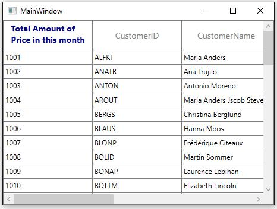
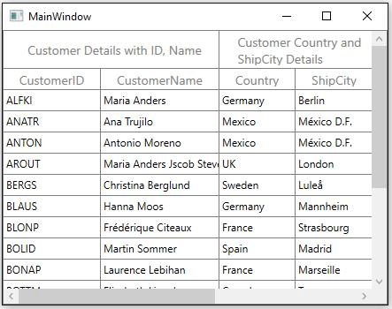

# Row Height Customization in WPF DataGrid (SfDataGrid)

You can change the header row height by setting [SfDataGrid.HeaderRowHeight](https://help.syncfusion.com/cr/wpf/Syncfusion.UI.Xaml.Grid.SfGridBase.html#Syncfusion_UI_Xaml_Grid_SfGridBase_HeaderRowHeight) and the other rows height can be changed by setting [SfDataGrid.RowHeight](https://help.syncfusion.com/cr/wpf/Syncfusion.UI.Xaml.Grid.SfGridBase.html#Syncfusion_UI_Xaml_Grid_SfGridBase_RowHeight) property.



<syncfusion:SfDataGrid x:Name="dataGrid" 
					   RowHeight="30"
					   HeaderRowHeight="50"
					   ItemsSource="{Binding Orders}" />


this.dataGrid.HeaderRowHeight = 50;
this.dataGrid.RowHeight = 30;



You can also change the particular row height using [VisualContainer.RowHeights](https://help.syncfusion.com/cr/wpf/Syncfusion.UI.Xaml.Grid.VisualContainer.html#Syncfusion_UI_Xaml_Grid_VisualContainer_RowHeights) property.



using Syncfusion.UI.Xaml.Grid.Helpers;
this.dataGrid.Loaded +=dataGrid_Loaded;

void dataGrid_Loaded(object sender, RoutedEventArgs e)
{
     var VisualContainer = this.dataGrid.GetVisualContainer();

     //Set RowHeight to 2'nd row
     VisualContainer.RowHeights[2] = 50;
     VisualContainer.InvalidateMeasure();
}



You can also change the row height of particular row using [QueryRowHeight](#_QueryRowHeight) event.



this.dataGrid.QueryRowHeight += dataGrid_QueryRowHeight;

void dataGrid_QueryRowHeight(object sender, QueryRowHeightEventArgs e)
{
 
    if (e.RowIndex == 2) //Sets Height to the first row.
    {
        e.Height = 50;
        e.Handled = true;
    }
}



## QueryRowHeight event

You can change the row height in on-demand based on the row index or row data using [SfDataGrid.QueryRowHeight](https://help.syncfusion.com/cr/wpf/Syncfusion.UI.Xaml.Grid.SfDataGrid.html) event.

`QueryRowHeight` event triggered for each row when it becomes visible.[QueryRowHeightEventArgs](http://help.syncfusion.com/cr/wpf/Syncfusion.UI.Xaml.Grid.QueryRowHeightEventArgs.html) provides information to `QueryRowHeight` event with following members,

* `RowIndex` – denotes index of the row in SfDataGrid.

* `Height` – Gets or sets the height of the row.

* `Handled` – Gets or sets a value indicating whether the `QueryRowHeight` event handled to change height of the row. Its default value is `false`.



this.dataGrid.QueryRowHeight += dataGrid_QueryRowHeight;

void dataGrid_QueryRowHeight(object sender, QueryRowHeightEventArgs e)
{

    if (e.RowIndex == 1) //Sets Height to the first row.
    {
        e.Height = 50;
        e.Handled = true;
    }
}



### Limitations

1. This event is not supported for `DetailsViewGrid`.

## Fit the Row Height based on its content

You can fit the row height based on its content in `QueryRowHeight` event handler using [GetAutoRowHeight](https://help.syncfusion.com/cr/wpf/Syncfusion.UI.Xaml.Grid.GridColumnSizer.html#Syncfusion_UI_Xaml_Grid_GridColumnSizer_GetAutoRowHeight_System_Int32_Syncfusion_UI_Xaml_Grid_GridRowSizingOptions_System_Double__System_Boolean_) method. This improves the readability of the content and it does not affect the loading performance of the SfDataGrid as the `QueryRowHeight` event triggered for rows in on-demand.

`GetAutoRowHeight` method returns `true` when the row height is calculated for record & header rows and returns `false` for other rows. Calculated height based on content set to the `out` parameter and you can assign the calculated height to the `Height` property of [QueryRowHeightEventArgs](https://help.syncfusion.com/cr/wpf/Syncfusion.UI.Xaml.Grid.QueryRowHeightEventArgs.html).

Below are the parameter to `GetAutoRowHeight` method, 

1. `RowIndex` – denotes the index of row in SfDataGrid.

2. `GridRowSizingOptions` – A class with properties to customize the row height calculation.



<syncfusion:SfDataGrid x:Name="dataGrid" ItemsSource="{Binding Orders}">
    <syncfusion:SfDataGrid.Columns>
        <syncfusion:GridTextColumn MappingName="CustomerName" TextWrapping="Wrap" />
        <syncfusion:GridTextColumn MappingName="CustomerID" TextWrapping="Wrap" />
        <syncfusion:GridTextColumn MappingName="Country" TextWrapping="Wrap" />
    </syncfusion:SfDataGrid.Columns>
</syncfusion:SfDataGrid>


GridRowSizingOptions gridRowResizingOptions = new GridRowSizingOptions();

//To get the calculated height from GetAutoRowHeight method.
double autoHeight;
this.dataGrid.QueryRowHeight += dataGrid_QueryRowHeight;

void dataGrid_QueryRowHeight(object sender, QueryRowHeightEventArgs e)
{
    if (this.dataGrid.GridColumnSizer.GetAutoRowHeight(e.RowIndex, gridRowResizingOptions, out autoHeight))
    {
        if (autoHeight > 24)
        {
            e.Height = autoHeight;
            e.Handled = true;
        }
    }
}



Here, row heights are customized based on the large text content.

#### GridRowSizingOptions

[GridRowSizingOptions](http://help.syncfusion.com/cr/wpf/Syncfusion.UI.Xaml.Grid.GridRowSizingOptions.html) have the following properties,

1. `ExcludeColumns` – If you want to skips specific column from row height calculation, you can add that columns to [GridRowSizingOptions.ExcludeColumns](https://help.syncfusion.com/cr/wpf/Syncfusion.UI.Xaml.Grid.GridRowSizingOptions.html#Syncfusion_UI_Xaml_Grid_GridRowSizingOptions_ExcludeColumns). By default, `GetAutoRowHeight` method calculates the row height based on all columns.
 
2. `CanIncludeHiddenColumns` – If you want to consider the hidden columns while calculating row height, you can set [GridRowSizingOptions.CanIncludeHiddenColumns](https://help.syncfusion.com/cr/wpf/Syncfusion.UI.Xaml.Grid.GridRowSizingOptions.html#Syncfusion_UI_Xaml_Grid_GridRowSizingOptions_CanIncludeHiddenColumns) as `true`.

### Calculate Height based on certain columns

You can exclude columns from row height calculation using [GridRowSizingOptions.ExcludeColumns](https://help.syncfusion.com/cr/wpf/Syncfusion.UI.Xaml.Grid.GridRowSizingOptions.html#Syncfusion_UI_Xaml_Grid_GridRowSizingOptions_ExcludeColumns). This will helps to reduce the count of loop run for height calculation for better performance.

You can add the columns which needs to exclude from height calculation using `GridRowSizingOptions.ExcludeColumns` collection.



GridRowSizingOptions gridRowResizingOptions = new GridRowSizingOptions();

//To get the calculated height from GetAutoRowHeight method.    
double autoHeight = double.NaN;

// The list contains the column names that will excluded from the height calculation in GetAutoRowHeight method.
List<string> excludeColumns = new List<string>() { "CustomerID", "Country" }; 
this.dataGrid.QueryRowHeight += dataGrid_QueryRowHeight;
gridRowResizingOptions.ExcludeColumns = excludeColumns;
    
void dataGrid_QueryRowHeight(object sender, QueryRowHeightEventArgs e)
{

    if (this.dataGrid.GridColumnSizer.GetAutoRowHeight(e.RowIndex, gridRowResizingOptions, out autoHeight))
    {

        if (autoHeight > 24)
        {
            e.Height = autoHeight;
            e.Handled = true;
        }
    }
}



Here `CustomerID` and `Country` columns are excluded from height calculation and the row height is calculated based on `CustomerName` column only.
 

## Reset Row Height at runtime

You can reset height of the particular or all rows in View at runtime to get the updated height from `QueryRowHeight` event handler using below methods. You have to call [InvalidateMeasureInfo](https://help.syncfusion.com/cr/wpf/Syncfusion.UI.Xaml.Grid.VisualContainer.html#Syncfusion_UI_Xaml_Grid_VisualContainer_InvalidateMeasureInfo) method of `VisualContainer` to refresh the View.
 
* [InvalidateRowHeight](https://help.syncfusion.com/cr/wpf/Syncfusion.UI.Xaml.Grid.SfDataGrid.html#Syncfusion_UI_Xaml_Grid_SfDataGrid_InvalidateRowHeight_System_Int32_) – Resets the height of particular row.



using Syncfusion.UI.Xaml.Grid.Helpers;

dataGrid.InvalidateRowHeight(2);
dataGrid.GetVisualContainer().InvalidateMeasureInfo();



* [RowHeightManager.Reset](https://help.syncfusion.com/cr/wpf/Syncfusion.UI.Xaml.Grid.RowHeightManager.html#Syncfusion_UI_Xaml_Grid_RowHeightManager_Reset) – Resets the height for all rows in View.



using Syncfusion.UI.Xaml.Grid.Helpers;

this.datagrid.GetVisualContainer().RowHeightManager.Reset();
dataGrid.GetVisualContainer().InvalidateMeasureInfo();



### Update Row Height while editing

You can set the height of the row based on the content after editing by refreshing the row height in [SfDataGrid.CurrentCellEndEdit](https://help.syncfusion.com/cr/wpf/Syncfusion.UI.Xaml.Grid.SfDataGrid.html) event.

You can call the `InvalidateRowHeight` method in [CurrentCellEndEdit](https://help.syncfusion.com/cr/wpf/Syncfusion.UI.Xaml.Grid.SfDataGrid.html#Syncfusion_UI_Xaml_Grid_SfDataGrid_CurrentCellEndEdit) event to reset the particular row height. Then call the `InvalidateMeasureInfo` method of `VisualContainer` to refresh the view. Now the `QueryRowHeight` event is called again for edited row alone and row height is calculated based on edited content.

 


using Syncfusion.UI.Xaml.Grid.Helpers;

GridRowSizingOptions gridRowResizingOptions = new GridRowSizingOptions();

//To get the calculated height from GetAutoRowHeight method.    
double autoHeight = double.NaN;        

this.dataGrid.QueryRowHeight += dataGrid_QueryRowHeight;
this.dataGrid.CurrentCellEndEdit += dataGrid_CurrentCellEndEdit;

void dataGrid_CurrentCellEndEdit(object sender, CurrentCellEndEditEventArgs args)
{
     dataGrid.InvalidateRowHeight(args.RowColumnIndex.RowIndex);
     dataGrid.GetVisualContainer().InvalidateMeasureInfo();
}

void dataGrid_QueryRowHeight(object sender, QueryRowHeightEventArgs e)
{

    if (this.dataGrid.GridColumnSizer.GetAutoRowHeight(e.RowIndex, gridRowResizingOptions, out autoHeight))
    {

        if (autoHeight > 24)
        {
            e.Height = autoHeight;
            e.Handled = true;
        }
    }
}



## Change HeaderRow Height based on its Content

By default, auto height is supported for the headers is `QueryRowHeight` event. If you want to set the auto height to header row alone, you can use the [GetHeaderIndex](https://help.syncfusion.com/cr/wpf/Syncfusion.UI.Xaml.Grid.GridIndexResolver.html#Syncfusion_UI_Xaml_Grid_GridIndexResolver_GetHeaderIndex_Syncfusion_UI_Xaml_Grid_SfDataGrid_) method to decide whether the row index is header or not in `QueryRowHeight` event.



<Window.Resources>
    <DataTemplate x:Key="headerTemplate">
        <TextBlock Height="50"
                    FontWeight="Bold"
                    Foreground="DarkBlue"
                    Text="Total Amount of Price in this month"
                    TextWrapping="Wrap" />
    </DataTemplate>
</Window.Resources>

<syncfusion:SfDataGrid x:Name="dataGrid" ItemsSource="{Binding Orders}">
    <syncfusion:SfDataGrid.Columns>
        <syncfusion:GridTextColumn HeaderTemplate="{StaticResource headerTemplate}" MappingName="TotalPrice" />
    </syncfusion:SfDataGrid.Columns>
</syncfusion:SfDataGrid>


GridRowSizingOptions gridRowResizingOptions = new GridRowSizingOptions();

//To get the calculated height from the GetAutoRowHeight method.
double autoHeight;
this.dataGrid.QueryRowHeight += dataGrid_QueryRowHeight;            

void dataGrid_QueryRowHeight(object sender, QueryRowHeightEventArgs e)
{

     //checked whether the row index is header or not.

     if (this.dataGrid.GetHeaderIndex() == e.RowIndex)
     {

          if (this.dataGrid.GridColumnSizer.GetAutoRowHeight(e.RowIndex, gridRowResizingOptions, out autoHeight))
          {

              if (autoHeight > 24)
              {
                   e.Height = autoHeight;
                   e.Handled = true;
              }
          }
     } 
}   



## Change StackedHeaderRow Height based on its content

By default, auto height is supported for `StackedHeaderRows` in `QueryRowHeight` event. You can also set the auto height to the StackedHeaderRows alone using `QueryRowHeight` event by checking the row index with StackedHeaderRows count.
Also you can wrap stacked header text by writing style of TargetType [GridStackedHeaderCellControl](http://help.syncfusion.com/cr/wpf/Syncfusion.UI.Xaml.Grid.GridStackedHeaderCellControl.html) and set the `TextWrapping` as Wrap as below,






GridRowSizingOptions gridRowResizingOptions = new GridRowSizingOptions();

//To get the calculated height from the GetAutoRowHeight method.
double autoHeight;

this.dataGrid.QueryRowHeight += dataGrid_QueryRowHeight;

void dataGrid_QueryRowHeight(object sender, QueryRowHeightEventArgs e)
{

     if (e.RowIndex < this.dataGrid.StackedHeaderRows.Count)
     {

         if (this.dataGrid.GridColumnSizer.GetAutoRowHeight(e.RowIndex, gridRowResizingOptions, out autoHeight))
         {

               if (autoHeight > 24)
               {
                    e.Height = autoHeight;
                    e.Handled = true;
               }
          }
     }
}



## Change TableSummaryRow Height

You can change the table summary row height by using [QueryRowHeight](https://help.syncfusion.com/cr/wpf/Syncfusion.UI.Xaml.Grid.SfDataGrid.html#Syncfusion_UI_Xaml_Grid_SfDataGrid_QueryRowHeight) event. You can use [IsTableSummaryIndex](https://help.syncfusion.com/cr/wpf/Syncfusion.UI.Xaml.Grid.GridIndexResolver.html#Syncfusion_UI_Xaml_Grid_GridIndexResolver_IsTableSummaryIndex_Syncfusion_UI_Xaml_Grid_SfDataGrid_System_Int32_) extension method to identify whether the row is table summary or not by passing row index. 



using Syncfusion.UI.Xaml.Grid.Helpers;
this.dataGrid.QueryRowHeight += dataGrid_QueryRowHeight;        

void dataGrid_QueryRowHeight(object sender, QueryRowHeightEventArgs e)
{

     if (dataGrid.IsTableSummaryIndex(e.RowIndex))
     {
          e.Height = 40;
          e.Handled = true;
     }
}



