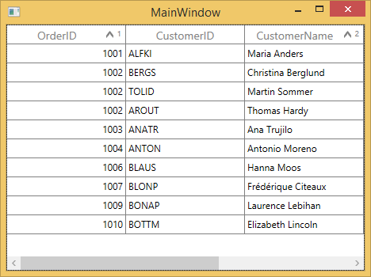

# Sorting in WPF DataGrid (SfDataGrid)

SfDataGrid allows you to sort the data against one or more columns either in ascending or descending order. When sorting is applied, the rows are rearranged based on sort criteria. You can allow users to sort the data by touching or clicking the column header using [SfDataGrid.AllowSorting](https://help.syncfusion.com/cr/wpf/Syncfusion.UI.Xaml.Grid.SfGridBase.html#Syncfusion_UI_Xaml_Grid_SfGridBase_AllowSorting) property to `true`.



<syncfusion:SfDataGrid x:Name="dataGrid"
                               AllowSorting="True"
                               ItemsSource="{Binding Orders}">


dataGrid.AllowSorting = true;



In another way, you can enable or disable the sorting for particular column by setting the [GridColumn.AllowSorting](https://help.syncfusion.com/cr/wpf/Syncfusion.UI.Xaml.Grid.GridColumnBase.html#Syncfusion_UI_Xaml_Grid_GridColumnBase_AllowSorting) property.



<syncfusion:SfDataGrid  x:Name="dataGrid"
                        AllowSorting="False"
                        AutoGenerateColumns="False"
                        ItemsSource="{Binding Orders}">
                        
    <syncfusion:SfDataGrid.Columns>
        <syncfusion:GridTextColumn AllowSorting="True" MappingName="OrderID" />
        <syncfusion:GridTextColumn AllowSorting="False" MappingName="CustomerID" />
        <syncfusion:GridTextColumn AllowSorting="False" MappingName="CustomerName" />
        <syncfusion:GridTextColumn AllowSorting="True" MappingName="Country" />
        <syncfusion:GridTextColumn AllowSorting="True" MappingName="ShipCity" />
    </syncfusion:SfDataGrid.Columns>
    
</syncfusion:SfDataGrid>


this.dataGrid.Columns["OrderID"].AllowSorting = true;
this.dataGrid.Columns["CustomerID"].AllowSorting = false;



N> The [GridColumn.AllowSorting](https://help.syncfusion.com/cr/wpf/Syncfusion.UI.Xaml.Grid.GridColumnBase.html#Syncfusion_UI_Xaml_Grid_GridColumnBase_AllowSorting) takes higher priority than [SfDataGrid.AllowSorting](https://help.syncfusion.com/cr/wpf/Syncfusion.UI.Xaml.Grid.SfGridBase.html#Syncfusion_UI_Xaml_Grid_SfGridBase_AllowSorting) property.

End users can sort the column by clicking column header cell. Once the columns get sorted, the sort indicator will be displayed on the right side of the column header.

## Sort column in double click

By default, column gets sorted when column header clicked. You can change this behavior to sort the column in double click action by setting [SfDataGrid.SortClickAction](https://help.syncfusion.com/cr/wpf/Syncfusion.UI.Xaml.Grid.SfGridBase.html#Syncfusion_UI_Xaml_Grid_SfGridBase_SortClickAction) property to `DoubleClick`.



<syncfusion:SfDataGrid  x:Name="dataGrid"
                        AllowSorting="True"
                        AutoGenerateColumns="True"
                        ItemsSource="{Binding Orders}"
                        SortClickAction="DoubleClick" />


this.dataGrid.SortClickAction = SortClickAction.DoubleClick;



## Sorting order

By default, the data is sorted in ascending or descending order when clicking column header. You can rearrange the data to its initial order from descending, when clicking column header by setting [SfDataGrid.AllowTriStateSorting](https://help.syncfusion.com/cr/wpf/Syncfusion.UI.Xaml.Grid.SfGridBase.html#Syncfusion_UI_Xaml_Grid_SfGridBase_AllowTriStateSorting) property.

Following are the sequence of sorting orders when clicking column header, 

* Sorts the data in ascending order
* Sorts the data in descending order 
* Clears the sorting and records displayed in its initial order

## Multi column sorting

SfDataGrid control allows you sort more than one column, where sorting is applied one column against other columns. To apply sorting on multiple columns, user have to click the column header by pressing the <kbd>Ctrl</kbd> key.

In the below screen shot, the OrderID column sorted. Then the CustomerName column is sorted against the OrderID data by clicking column header by pressing <kbd>Ctrl</kbd> key. The sorting state of OrderID column is preserved and CustomerName column sorted against OrderID column.

    
### Display sort order

It is also possible to display sorted order of columns in header by setting [SfDataGrid.ShowSortNumbers](https://help.syncfusion.com/cr/wpf/Syncfusion.UI.Xaml.Grid.SfGridBase.html#Syncfusion_UI_Xaml_Grid_SfGridBase_ShowSortNumbers) property to `true`. 



<syncfusion:SfDataGrid  x:Name="dataGrid"
                        AllowSorting="True"        
                        ShowSortNumbers="True"
                        ItemsSource="{Binding Orders}" />


this.dataGrid.ShowSortNumbers = true;



## Programmatic sorting

You can sort the data programmatically by adding or removing the [SortColumnDescription](http://help.syncfusion.com/cr/wpf/Syncfusion.UI.Xaml.Grid.SortColumnDescription.html) in [SfDataGrid.SortColumnDescriptions](https://help.syncfusion.com/cr/wpf/Syncfusion.UI.Xaml.Grid.SfGridBase.html#Syncfusion_UI_Xaml_Grid_SfGridBase_SortColumnDescriptions) property.

N>  [SfDataGrid.SortColumnsChanging](https://help.syncfusion.com/cr/wpf/Syncfusion.UI.Xaml.Grid.SfDataGrid.html) and [SfDataGrid.SortColumnsChanged](https://help.syncfusion.com/cr/wpf/Syncfusion.UI.Xaml.Grid.SfDataGrid.html) events are not raised when the data sorted programmatically through `SfDataGrid.SortColumnDescriptions`.

### Adding sort columns



<syncfusion:SfDataGrid  x:Name="dataGrid"
                        AutoExpandGroups="True"
                        AutoGenerateColumns="True"
                        ItemsSource="{Binding Orders}"
                        ShowGroupDropArea="True">
                        
    <syncfusion:SfDataGrid.SortColumnDescriptions>
        <syncfusion:SortColumnDescription ColumnName="OrderID" SortDirection="Ascending" />
        <syncfusion:SortColumnDescription ColumnName="CustomerName" SortDirection="Descending" />
    </syncfusion:SfDataGrid.SortColumnDescriptions>
    
</syncfusion:SfDataGrid>


this.dataGrid.SortColumnDescriptions.Add(new SortColumnDescription() { ColumnName = "OrderID", SortDirection = ListSortDirection.Ascending });
this.dataGrid.SortColumnDescriptions.Add(new SortColumnDescription() { ColumnName = "CustomerName", SortDirection = ListSortDirection.Descending });



### Removing sort columns

You can unsort the data by removing the corresponding [SortColumnDescription](http://help.syncfusion.com/cr/wpf/Syncfusion.UI.Xaml.Grid.SortColumnDescription.html) from the [SfDataGrid.SortColumnDescriptions](https://help.syncfusion.com/cr/wpf/Syncfusion.UI.Xaml.Grid.SfGridBase.html#Syncfusion_UI_Xaml_Grid_SfGridBase_SortColumnDescriptions) property.



var sortColumnDescription = this.dataGrid.SortColumnDescriptions.FirstOrDefault(col => col.ColumnName == "OrderID");

if (sortColumnDescription!=null)
{  
    this.dataGrid.SortColumnDescriptions.Remove(sortColumnDescription);
}



### Clear sorting

You can clear sorting, by clearing the [SfDataGrid.SortColumnDescriptions](https://help.syncfusion.com/cr/wpf/Syncfusion.UI.Xaml.Grid.SfGridBase.html#Syncfusion_UI_Xaml_Grid_SfGridBase_SortColumnDescriptions).



this.dataGrid.SortColumnDescriptions.Clear();



## Custom sorting

SfDataGrid allows you to sort the columns based on the custom logic. The custom sorting can be applied by adding the [SortComparer](http://help.syncfusion.com/cr/wpf/Syncfusion.Data.SortComparer.html) instance to [SfDataGrid.SortComparers](https://help.syncfusion.com/cr/wpf/Syncfusion.UI.Xaml.Grid.SfDataGrid.html#Syncfusion_UI_Xaml_Grid_SfDataGrid_SortComparers). 

The [SortComparer](http://help.syncfusion.com/cr/wpf/Syncfusion.Data.SortComparer.html) have the following properties,

[PropertyName](https://help.syncfusion.com/cr/wpf/Syncfusion.Data.SortComparer.html#Syncfusion_Data_SortComparer_PropertyName) - Gets or sets the name of the column to apply custom sorting.

[Comparer](https://help.syncfusion.com/cr/wpf/Syncfusion.Data.SortComparer.html#Syncfusion_Data_SortComparer_Comparer) - Gets or sets the custom comparer in which you can code to compare the data using custom logic. 

You can implement [ISortDirection](http://help.syncfusion.com/cr/wpf/Syncfusion.Data.ISortDirection.html) interface in comparer to get the sort direction. So you can apply different custom logics for ascending and descending. 

Follow the below steps to add custom comparer to sort using custom logic,

### Define custom comparer with custom sort logic

In the below code snippet, `CustomerName` property is compared based on its string length, instead of default string comparison.  



Public class CustomComparer:IComparer<object>,ISortDirection
{
    public int Compare(object x, object y)
    {
        int nameX;
        int nameY;

        //While data object passed to comparer

        if (x.GetType() == typeof(OrderInfo))
        {
            nameX = ((OrderInfo)x).CustomerName.Length;
            nameY = ((OrderInfo)y).CustomerName.Length;
        }
        
        //While sorting groups

        else if (x.GetType() == typeof(Group))
        {

            //Calculating the group key length
            nameX = ((Group)x).Key.ToString().Length;
            nameY = ((Group)y).Key.ToString().Length;
        }

        else
        {
            nameX = x.ToString().Length;
            nameY = y.ToString().Length;
        }

        //returns the comparison result based in SortDirection.
 
        if (nameX.CompareTo(nameY) > 0)
            return SortDirection == ListSortDirection.Ascending ? 1 : -1;
            
        else if (nameX.CompareTo(nameY) == -1)
            return SortDirection == ListSortDirection.Ascending ? -1 : 1;
            
        else
            return 0;
    }

    
    private ListSortDirection _SortDirection;
    
    /// 

    /// Gets or sets the property that denotes the sort direction.
    /// 

    /// <remarks>
    /// SortDirection gets updated only when sorting the groups. For other cases, SortDirection is always ascending.
    /// </remarks>

    public ListSortDirection SortDirection
    {
        get { return _SortDirection; }
        set { _SortDirection = value; }
    }
}



### Adding custom comparer to SfDataGrid

Custom comparer can be added to [SfDataGrid.SortComparers](https://help.syncfusion.com/cr/wpf/Syncfusion.UI.Xaml.Grid.SfDataGrid.html#Syncfusion_UI_Xaml_Grid_SfDataGrid_SortComparers) property. `SortComparers` maintains custom comparers and the custom comparer gets called when corresponding column gets sorted by clicking column header or programmatically.



<xmlns:linq="clr-namespace:Syncfusion.Data;assembly=Syncfusion.Data.WPF">

<syncfusion:SfDataGrid  x:Name="dataGrid"
                        AllowSorting="True"
                        AutoGenerateColumns="True"
                        ItemsSource="{Binding Orders}">
    <syncfusion:SfDataGrid.SortComparers>
        <linq:SortComparer Comparer="{StaticResource Comparer}" PropertyName="CustomerName" />
    </syncfusion:SfDataGrid.SortComparers>
</syncfusion:SfDataGrid>


this.dataGrid.SortComparers.Add(new SortComparer() { Comparer = new CustomComparer(), PropertyName = "CustomerName" });



Sorting CustomerName column sorts the data using custom comparer available in `SfDataGrid.SortComparers`.

## Sorting the underlying collection

SfDataGrid sorts the records in UI and maintains in its internal CollectionView and it will not change the order of data in underlying collection. 

You can get sorted data from `SfDataGrid.View.Records` when groups is not in place and `SfDataGrid.View.TopLevelGroup.DisplayElements` when grouping in place. 

If you want to sort the underlying collection when sorting takes place, then this can be achieved by handling [SfDataGrid.SortColumnsChanged](https://help.syncfusion.com/cr/wpf/Syncfusion.UI.Xaml.Grid.SfDataGrid.html) event.



this.dataGrid.SortColumnsChanged += dataGrid_SortColumnsChanged;

void dataGrid_SortColumnsChanged(object sender, GridSortColumnsChangedEventArgs e)
{
    var viewModel = this.DataContext as ViewModel;
    IEnumerable<OrderInfo> OrderedSource = viewModel.Orders;
    
    foreach (var sortColumn in this.dataGrid.View.SortDescriptions)
    {
        var columnName = sortColumn.PropertyName;
        
        if (sortColumn.Direction == ListSortDirection.Ascending)
            OrderedSource = OrderedSource.OrderBy(source => GetOrderSource(source, columnName));

        else
            OrderedSource = OrderedSource.OrderByDescending(source => GetOrderSource(source, columnName));
    }            
}

private object GetOrderSource(OrderInfo source, string name)
{
    var propInfo = source.GetType().GetRuntimeProperty(name);
    
    if (propInfo != null)
    
        // get the current sort column value
        return propInfo.GetValue(source);
        
    return null;
}



## Handling events

### SortColumnsChanging event

[SfDataGrid.SortColumnsChanging](https://help.syncfusion.com/cr/wpf/Syncfusion.UI.Xaml.Grid.SfDataGrid.html)  event occurs while sorting the columns by clicking column header. 
[GridSortColumnsChangingEventArgs](http://help.syncfusion.com/cr/wpf/Syncfusion.UI.Xaml.Grid.GridSortColumnsChangingEventArgs.html) has following members which provides information for `SortColumnsChanging` event.

[Action](https://help.syncfusion.com/cr/wpf/Syncfusion.UI.Xaml.Grid.GridSortColumnsChangingEventArgs.html#Syncfusion_UI_Xaml_Grid_GridSortColumnsChangingEventArgs_Action) **–** Gets the action triggered this event. 

[Cancel](https://msdn.microsoft.com/query/dev10.query?appId=Dev10IDEF1&l=EN-US&k=k(System.ComponentModel.CancelEventArgs.Cancel)&rd=true) **–** Setting value to `true`, cancels the triggered action. 

[AddedItems](https://help.syncfusion.com/cr/wpf/Syncfusion.UI.Xaml.Grid.GridSortColumnsChangingEventArgs.html#Syncfusion_UI_Xaml_Grid_GridSortColumnsChangingEventArgs_AddedItems) **-** Gets the list of new `SortColumnDescription’s` that are added.

[RemovedItems](https://help.syncfusion.com/cr/wpf/Syncfusion.UI.Xaml.Grid.GridSortColumnsChangingEventArgs.html#Syncfusion_UI_Xaml_Grid_GridSortColumnsChangingEventArgs_RemovedItems) **-** Gets the list of `SortColumnDescription’s` that are removed. 

[CancelScroll](https://help.syncfusion.com/cr/wpf/Syncfusion.UI.Xaml.Grid.GridSortColumnsChangingEventArgs.html#Syncfusion_UI_Xaml_Grid_GridSortColumnsChangingEventArgs_CancelScroll) **-** Gets or sets a value that indicates, whether scroll and bring SelectedItem in view after sorting takes place.

You can prevent sorting for the particular column through [GridSortColumnsChangingEventArgs.Cancel](https://msdn.microsoft.com/query/dev10.query?appId=Dev10IDEF1&l=EN-US&k=k(System.ComponentModel.CancelEventArgs.Cancel)&rd=true) property of `SortColumnsChanging` event.



this.dataGrid.SortColumnsChanging += dataGrid_SortColumnsChanging;

void dataGrid_SortColumnsChanging(object sender, Syncfusion.UI.Xaml.Grid.GridSortColumnsChangingEventArgs e)
{

    if (e.AddedItems[0].ColumnName == "OrderID")
    {
        e.Cancel = true;
    }  
}



### SortColumnsChanged event

[SfDataGrid.SortColumnsChanged](https://help.syncfusion.com/cr/wpf/Syncfusion.UI.Xaml.Grid.SfDataGrid.html) event occurs when the sorting is applied to the column.
[GridSortColumnsChangedEventArgs](http://help.syncfusion.com/cr/wpf/Syncfusion.UI.Xaml.Grid.GridSortColumnsChangedEventArgs.html) provides information for `SortColumnsChanged` event. 

## See Also
[How to sort a column in WPF DataGrid?](https://www.syncfusion.com/kb/10797)

[How to customize the Filtering and Sorting icons in the SfDataGrid ?](https://www.syncfusion.com/kb/8184)

[How to sort multiple column without pressing Ctrl key in SfDataGrid?](https://www.syncfusion.com/kb/7160)

[How to change the position of FilterToggleButton and SortIcon in header cell of SfDataGrid?](https://www.syncfusion.com/kb/4052)

[How to sort your binded collection of ViewModel?](https://www.syncfusion.com/kb/2461)
