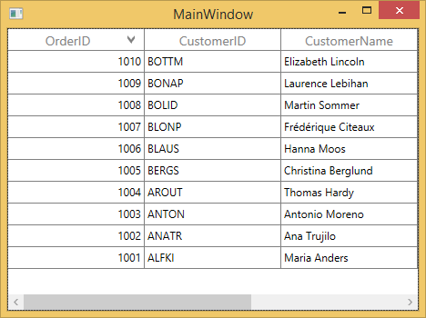
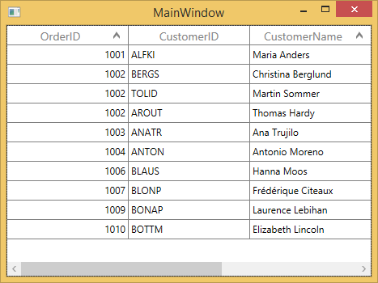
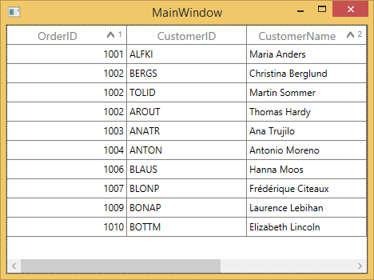
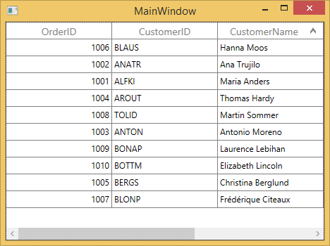

# Sorting in WPF DataGrid (SfDataGrid)

[WPF DataGrid](https://www.syncfusion.com/wpf-controls/datagrid) (SfDataGrid) allows you to sort the data against one or more columns in either ascending or descending order. When sorting is applied, the rows are rearranged based on the sort criteria. You can allow users to sort the data by touching or clicking the column header by setting the [SfDataGrid.AllowSorting](https://help.syncfusion.com/cr/wpf/Syncfusion.UI.Xaml.Grid.SfGridBase.html#Syncfusion_UI_Xaml_Grid_SfGridBase_AllowSorting) property to `true`.



<syncfusion:SfDataGrid x:Name="dataGrid"
                               AllowSorting="True"
                               ItemsSource="{Binding Orders}">


dataGrid.AllowSorting = true;



Alternatively, you can enable or disable sorting for a particular column by setting the [GridColumn.AllowSorting](https://help.syncfusion.com/cr/wpf/Syncfusion.UI.Xaml.Grid.GridColumnBase.html#Syncfusion_UI_Xaml_Grid_GridColumnBase_AllowSorting) property.



<syncfusion:SfDataGrid  x:Name="dataGrid"
                        AllowSorting="False"
                        AutoGenerateColumns="False"
                        ItemsSource="{Binding Orders}">
                        
    <syncfusion:SfDataGrid.Columns>
        <syncfusion:GridTextColumn AllowSorting="True" MappingName="OrderID" />
        <syncfusion:GridTextColumn AllowSorting="False" MappingName="CustomerID" />
        <syncfusion:GridTextColumn AllowSorting="False" MappingName="CustomerName" />
        <syncfusion:GridTextColumn AllowSorting="True" MappingName="Country" />
        <syncfusion:GridTextColumn AllowSorting="True" MappingName="ShipCity" />
    </syncfusion:SfDataGrid.Columns>
    
</syncfusion:SfDataGrid>


this.dataGrid.Columns["OrderID"].AllowSorting = true;
this.dataGrid.Columns["CustomerID"].AllowSorting = false;



N> The [GridColumn.AllowSorting](https://help.syncfusion.com/cr/wpf/Syncfusion.UI.Xaml.Grid.GridColumnBase.html#Syncfusion_UI_Xaml_Grid_GridColumnBase_AllowSorting) takes higher priority than the [SfDataGrid.AllowSorting](https://help.syncfusion.com/cr/wpf/Syncfusion.UI.Xaml.Grid.SfGridBase.html#Syncfusion_UI_Xaml_Grid_SfGridBase_AllowSorting) property.

End users can sort the column by clicking the column header cell. Once the columns get sorted, the sort indicator will be displayed on the right side of the column header.

## Sort column in double click

By default, the column gets sorted when the column header is clicked. You can change this behavior to sort the column on a double-click action by setting the [SfDataGrid.SortClickAction](https://help.syncfusion.com/cr/wpf/Syncfusion.UI.Xaml.Grid.SfGridBase.html#Syncfusion_UI_Xaml_Grid_SfGridBase_SortClickAction) property to `DoubleClick`.



<syncfusion:SfDataGrid  x:Name="dataGrid"
                        AllowSorting="True"
                        AutoGenerateColumns="True"
                        ItemsSource="{Binding Orders}"
                        SortClickAction="DoubleClick" />


this.dataGrid.SortClickAction = SortClickAction.DoubleClick;



## Sorting order

By default, the data is sorted in ascending or descending order when clicking the column header. You can rearrange the data to its initial order from descending when clicking the column header by setting the [SfDataGrid.AllowTriStateSorting](https://help.syncfusion.com/cr/wpf/Syncfusion.UI.Xaml.Grid.SfGridBase.html#Syncfusion_UI_Xaml_Grid_SfGridBase_AllowTriStateSorting) property.

The following is the sequence of sorting orders when clicking the column header:

* Sorts the data in ascending order.
* Sorts the data in descending order. 
* Clears the sorting, and records are displayed in their initial order.

## Multi column sorting

The WPF DataGrid (SfDataGrid) control allows you to sort more than one column, where sorting is applied one column against other columns. To apply sorting on multiple columns, the user has to click the column header while pressing the <kbd>Ctrl</kbd> key.

In the screenshot below, the `OrderID` column is sorted. Then the `CustomerName` column is sorted against the `OrderID` data by clicking the column header while pressing the <kbd>Ctrl</kbd> key. The sorting state of the `OrderID` column is preserved, and the `CustomerName` column is sorted against the `OrderID` column.

    
### Display sort order

It is also possible to display the sorted order of columns in the header by setting the [SfDataGrid.ShowSortNumbers](https://help.syncfusion.com/cr/wpf/Syncfusion.UI.Xaml.Grid.SfGridBase.html#Syncfusion_UI_Xaml_Grid_SfGridBase_ShowSortNumbers) property to `true`. 



<syncfusion:SfDataGrid  x:Name="dataGrid"
                        AllowSorting="True"        
                        ShowSortNumbers="True"
                        ItemsSource="{Binding Orders}" />


this.dataGrid.ShowSortNumbers = true;



## Programmatic sorting

You can sort the data programmatically by adding or removing the [SortColumnDescription](https://help.syncfusion.com/cr/wpf/Syncfusion.UI.Xaml.Grid.SortColumnDescription.html) in [SfDataGrid.SortColumnDescriptions](https://help.syncfusion.com/cr/wpf/Syncfusion.UI.Xaml.Grid.SfGridBase.html#Syncfusion_UI_Xaml_Grid_SfGridBase_SortColumnDescriptions) property.

N>  The [SfDataGrid.SortColumnsChanging](https://help.syncfusion.com/cr/wpf/Syncfusion.UI.Xaml.Grid.SfDataGrid.html#Syncfusion_UI_Xaml_Grid_SfDataGrid_SortColumnsChanging) and [SfDataGrid.SortColumnsChanged](https://help.syncfusion.com/cr/wpf/Syncfusion.UI.Xaml.Grid.SfDataGrid.html#Syncfusion_UI_Xaml_Grid_SfDataGrid_SortColumnsChanged) events are not raised when the data is sorted programmatically through `SfDataGrid.SortColumnDescriptions`.

### Adding sort columns



<syncfusion:SfDataGrid  x:Name="dataGrid"
                        AutoExpandGroups="True"
                        AutoGenerateColumns="True"
                        ItemsSource="{Binding Orders}"
                        ShowGroupDropArea="True">
                        
    <syncfusion:SfDataGrid.SortColumnDescriptions>
        <syncfusion:SortColumnDescription ColumnName="OrderID" SortDirection="Ascending" />
        <syncfusion:SortColumnDescription ColumnName="CustomerName" SortDirection="Descending" />
    </syncfusion:SfDataGrid.SortColumnDescriptions>
    
</syncfusion:SfDataGrid>


this.dataGrid.SortColumnDescriptions.Add(new SortColumnDescription() { ColumnName = "OrderID", SortDirection = ListSortDirection.Ascending });
this.dataGrid.SortColumnDescriptions.Add(new SortColumnDescription() { ColumnName = "CustomerName", SortDirection = ListSortDirection.Descending });



### Removing sort columns

You can unsort the data by removing the corresponding [SortColumnDescription](https://help.syncfusion.com/cr/wpf/Syncfusion.UI.Xaml.Grid.SortColumnDescription.html) from the [SfDataGrid.SortColumnDescriptions](https://help.syncfusion.com/cr/wpf/Syncfusion.UI.Xaml.Grid.SfGridBase.html#Syncfusion_UI_Xaml_Grid_SfGridBase_SortColumnDescriptions) property.



var sortColumnDescription = this.dataGrid.SortColumnDescriptions.FirstOrDefault(col => col.ColumnName == "OrderID");

if (sortColumnDescription!=null)
{  
    this.dataGrid.SortColumnDescriptions.Remove(sortColumnDescription);
}



### Clear sorting

You can clear sorting, by clearing the [SfDataGrid.SortColumnDescriptions](https://help.syncfusion.com/cr/wpf/Syncfusion.UI.Xaml.Grid.SfGridBase.html#Syncfusion_UI_Xaml_Grid_SfGridBase_SortColumnDescriptions).



this.dataGrid.SortColumnDescriptions.Clear();



## Custom sorting

SfDataGrid allows you to sort the columns based on custom logic. The custom sorting can be applied by adding the [SortComparer](https://help.syncfusion.com/cr/wpf/Syncfusion.Data.SortComparer.html) instance to [SfDataGrid.SortComparers](https://help.syncfusion.com/cr/wpf/Syncfusion.UI.Xaml.Grid.SfDataGrid.html#Syncfusion_UI_Xaml_Grid_SfDataGrid_SortComparers). 

The [SortComparer](https://help.syncfusion.com/cr/wpf/Syncfusion.Data.SortComparer.html) has the following properties:

[PropertyName](https://help.syncfusion.com/cr/wpf/Syncfusion.Data.SortComparer.html#Syncfusion_Data_SortComparer_PropertyName) - Gets or sets the name of the column to apply custom sorting.

[Comparer](https://help.syncfusion.com/cr/wpf/Syncfusion.Data.SortComparer.html#Syncfusion_Data_SortComparer_Comparer) - Gets or sets the custom comparer in which you can code to compare the data using custom logic. 

You can implement the [ISortDirection](https://help.syncfusion.com/cr/wpf/Syncfusion.Data.ISortDirection.html) interface in the comparer to get the sort direction. So you can apply different custom logic for ascending and descending. 

Follow the steps below to add a custom comparer to sort using custom logic:

### Define custom comparer with custom sort logic

In the code snippet below, the `CustomerName` property is compared based on its string length, instead of the default string comparison.  



Public class CustomComparer:IComparer<object>,ISortDirection
{
    public int Compare(object x, object y)
    {
        int nameX;
        int nameY;

        //While data object passed to comparer

        if (x.GetType() == typeof(OrderInfo))
        {
            nameX = ((OrderInfo)x).CustomerName.Length;
            nameY = ((OrderInfo)y).CustomerName.Length;
        }
        
        //While sorting groups

        else if (x.GetType() == typeof(Group))
        {

            //Calculating the group key length
            nameX = ((Group)x).Key.ToString().Length;
            nameY = ((Group)y).Key.ToString().Length;
        }

        else
        {
            nameX = x.ToString().Length;
            nameY = y.ToString().Length;
        }

        //returns the comparison result based in SortDirection.
 
        if (nameX.CompareTo(nameY) > 0)
            return SortDirection == ListSortDirection.Ascending ? 1 : -1;
            
        else if (nameX.CompareTo(nameY) == -1)
            return SortDirection == ListSortDirection.Ascending ? -1 : 1;
            
        else
            return 0;
    }

    
    private ListSortDirection _SortDirection;
    
    /// 

    /// Gets or sets the property that denotes the sort direction.
    /// 

    /// <remarks>
    /// SortDirection gets updated only when sorting the groups. For other cases, SortDirection is always ascending.
    /// </remarks>

    public ListSortDirection SortDirection
    {
        get { return _SortDirection; }
        set { _SortDirection = value; }
    }
}



### Adding custom comparer to SfDataGrid

A custom comparer can be added to the [SfDataGrid.SortComparers](https://help.syncfusion.com/cr/wpf/Syncfusion.UI.Xaml.Grid.SfDataGrid.html#Syncfusion_UI_Xaml_Grid_SfDataGrid_SortComparers) property. `SortComparers` maintains custom comparers, and the custom comparer is called when the corresponding column gets sorted by clicking the column header or programmatically.



<xmlns:linq="clr-namespace:Syncfusion.Data;assembly=Syncfusion.Data.WPF">

<syncfusion:SfDataGrid  x:Name="dataGrid"
                        AllowSorting="True"
                        AutoGenerateColumns="True"
                        ItemsSource="{Binding Orders}">
    <syncfusion:SfDataGrid.SortComparers>
        <linq:SortComparer Comparer="{StaticResource Comparer}" PropertyName="CustomerName" />
    </syncfusion:SfDataGrid.SortComparers>
</syncfusion:SfDataGrid>


this.dataGrid.SortComparers.Add(new SortComparer() { Comparer = new CustomComparer(), PropertyName = "CustomerName" });



Sorting the `CustomerName` column sorts the data using the custom comparer available in `SfDataGrid.SortComparers`.

## Sorting the underlying collection

SfDataGrid sorts the records in the UI and maintains them in its internal `CollectionView`, and it will not change the order of the data in the underlying collection. 

You can get the sorted data from `SfDataGrid.View.Records` when groups are not in place, and from `SfDataGrid.View.TopLevelGroup.DisplayElements` when grouping is in place. 

If you want to sort the underlying collection when sorting takes place, this can be achieved by handling the [SfDataGrid.SortColumnsChanged](https://help.syncfusion.com/cr/wpf/Syncfusion.UI.Xaml.Grid.SfDataGrid.html#Syncfusion_UI_Xaml_Grid_SfDataGrid_SortColumnsChanged) event.



this.dataGrid.SortColumnsChanged += dataGrid_SortColumnsChanged;

void dataGrid_SortColumnsChanged(object sender, GridSortColumnsChangedEventArgs e)
{
    var viewModel = this.DataContext as ViewModel;
    IEnumerable<OrderInfo> OrderedSource = viewModel.Orders;
    
    foreach (var sortColumn in this.dataGrid.View.SortDescriptions)
    {
        var columnName = sortColumn.PropertyName;
        
        if (sortColumn.Direction == ListSortDirection.Ascending)
            OrderedSource = OrderedSource.OrderBy(source => GetOrderSource(source, columnName));

        else
            OrderedSource = OrderedSource.OrderByDescending(source => GetOrderSource(source, columnName));
    }            
}

private object GetOrderSource(OrderInfo source, string name)
{
    var propInfo = source.GetType().GetRuntimeProperty(name);
    
    if (propInfo != null)
    
        // get the current sort column value
        return propInfo.GetValue(source);
        
    return null;
}



## Handling events

### SortColumnsChanging event

[SfDataGrid.SortColumnsChanging](https://help.syncfusion.com/cr/wpf/Syncfusion.UI.Xaml.Grid.SfDataGrid.html#Syncfusion_UI_Xaml_Grid_SfDataGrid_SortColumnsChanging)  event occurs while sorting the columns by clicking column header. 
[GridSortColumnsChangingEventArgs](https://help.syncfusion.com/cr/wpf/Syncfusion.UI.Xaml.Grid.GridSortColumnsChangingEventArgs.html) has following members which provides information for `SortColumnsChanging` event.

[Action](https://help.syncfusion.com/cr/wpf/Syncfusion.UI.Xaml.Grid.GridSortColumnsChangingEventArgs.html#Syncfusion_UI_Xaml_Grid_GridSortColumnsChangingEventArgs_Action) **–** Gets the action triggered this event. 

[Cancel](https://learn.microsoft.com/en-us/dotnet/api/system.componentmodel.canceleventargs.cancel?view=net-5.0) **–** Setting value to `true`, cancels the triggered action. 

[AddedItems](https://help.syncfusion.com/cr/wpf/Syncfusion.UI.Xaml.Grid.GridSortColumnsChangingEventArgs.html#Syncfusion_UI_Xaml_Grid_GridSortColumnsChangingEventArgs_AddedItems) **-** Gets the list of new `SortColumnDescription’s` that are added.

[RemovedItems](https://help.syncfusion.com/cr/wpf/Syncfusion.UI.Xaml.Grid.GridSortColumnsChangingEventArgs.html#Syncfusion_UI_Xaml_Grid_GridSortColumnsChangingEventArgs_RemovedItems) **-** Gets the list of `SortColumnDescription’s` that are removed. 

[CancelScroll](https://help.syncfusion.com/cr/wpf/Syncfusion.UI.Xaml.Grid.GridSortColumnsChangingEventArgs.html#Syncfusion_UI_Xaml_Grid_GridSortColumnsChangingEventArgs_CancelScroll) **-** Gets or sets a value that indicates, whether scroll and bring SelectedItem in view after sorting takes place.

You can prevent sorting for the particular column through [GridSortColumnsChangingEventArgs.Cancel](https://learn.microsoft.com/en-us/dotnet/api/system.componentmodel.canceleventargs.cancel?view=net-5.0) property of `SortColumnsChanging` event.



this.dataGrid.SortColumnsChanging += dataGrid_SortColumnsChanging;

void dataGrid_SortColumnsChanging(object sender, Syncfusion.UI.Xaml.Grid.GridSortColumnsChangingEventArgs e)
{

    if (e.AddedItems[0].ColumnName == "OrderID")
    {
        e.Cancel = true;
    }  
}



### SortColumnsChanged event

The [SfDataGrid.SortColumnsChanged](https://help.syncfusion.com/cr/wpf/Syncfusion.UI.Xaml.Grid.SfDataGrid.html#Syncfusion_UI_Xaml_Grid_SfDataGrid_SortColumnsChanged) event occurs when the sorting is applied to the column.
[GridSortColumnsChangedEventArgs](https://help.syncfusion.com/cr/wpf/Syncfusion.UI.Xaml.Grid.GridSortColumnsChangedEventArgs.html) provides information for the `SortColumnsChanged` event. 

## See Also
[How to sort a column in WPF DataGrid?](https://support.syncfusion.com/kb/article/9555/how-to-sort-a-column-in-wpf-datagrid-sfdatagrid)

[How to customize the Filtering and Sorting icons in the SfDataGrid ?](https://support.syncfusion.com/kb/article/7261/how-to-customize-the-filtering-and-sorting-icons-in-wpf-datagrid-sfdatagrid)

[How to sort multiple column without pressing Ctrl key in SfDataGrid?](https://support.syncfusion.com/kb/article/6625/how-to-sort-multiple-column-without-pressing-ctrl-key-in-wpf-datagrid-sfdatagrid)

[How to change the position of FilterToggleButton and SortIcon in header cell of SfDataGrid?](https://support.syncfusion.com/kb/article/4194/how-to-change-the-position-of-header-cell-in-wpf-datagrid)

[How to sort your binded collection of ViewModel?](https://support.syncfusion.com/kb/article/2850/how-to-sort-your-binded-collection-of-viewmodel-in-wpf-datagrid)
