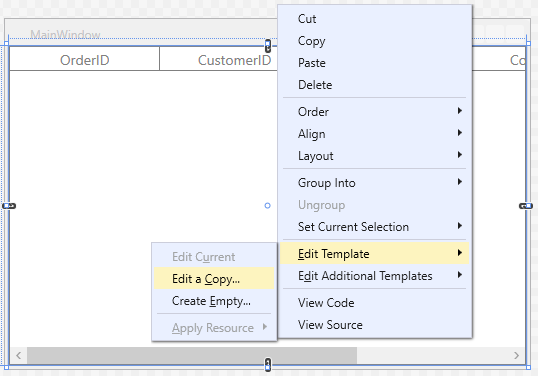
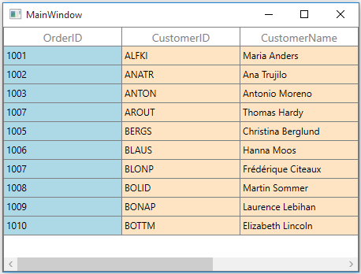
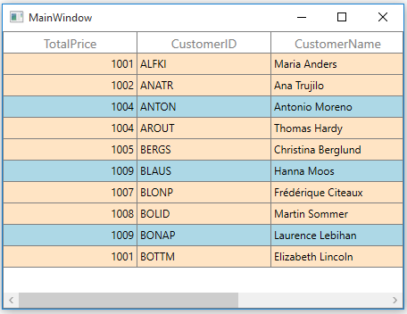
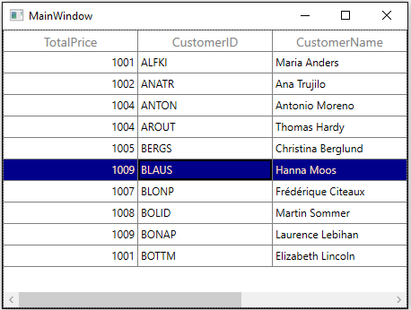
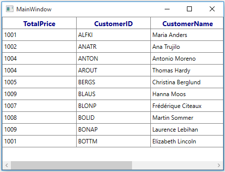
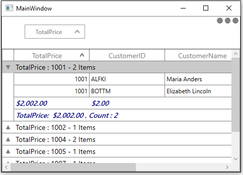
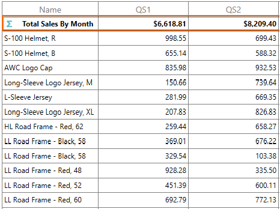
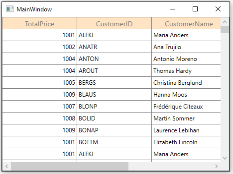
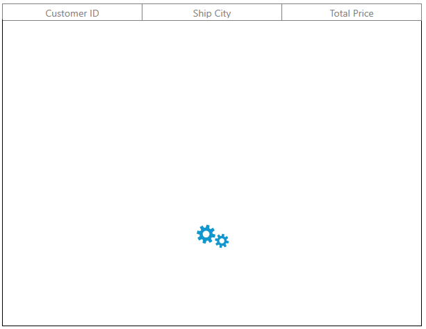

# Styles and Templates in WPF DataGrid (SfDataGrid)

The appearance of [WPF DataGrid]((https://www.syncfusion.com/wpf-controls/datagrid)) (SfDataGrid) and its inner elements (example: Cell, Row, Header, Summary etc.) can be customized using various properties exposed and by editing the elements’ Style. 

## Control Structure of SfDataGrid

## Customizing Default Containers
WPF DataGrid (SfDataGrid) arranges the cell and row content using cell and row containers. Below screenshot shows the `VisualTree` of SfDataGrid where `HeaderCell` is loaded into the `HeaderCellControl` and data cells are loaded into the [VirtualizingCellsControl](https://help.syncfusion.com/cr/wpf/Syncfusion.UI.Xaml.Grid.VirtualizingCellsControl.html) container. `VirtualizingCellsControl` container uses [GridCell](https://help.syncfusion.com/cr/wpf/Syncfusion.UI.Xaml.Grid.GridCell.html) to load the cell content.

[RowGenerator](https://help.syncfusion.com/cr/wpf/Syncfusion.UI.Xaml.Grid.RowGenerator.html) class processes the creation and re-using of containers for SfDataGrid. You create your own containers by overriding `RowGenerator` class and setting it to [SfDataGrid.RowGenerator](https://help.syncfusion.com/cr/wpf/Syncfusion.UI.Xaml.Grid.SfDataGrid.html#Syncfusion_UI_Xaml_Grid_SfDataGrid_RowGenerator). Using this method to customize the row and cell containers allows for customizations that aren’t possible through styling and conditional styling.

### Row containers
Below table shows the different types of grid rows and its container.
<table>
<tr>
<td>
{{'**RowType**'| markdownify }}
</td>
<td>
{{'**Container**'| markdownify }}
</td>
</tr>
<tr>
<td>
DataRow
</td>
<td>
{{'[VirtualizingCellsControl](https://help.syncfusion.com/cr/wpf/Syncfusion.UI.Xaml.Grid.VirtualizingCellsControl.html)'| markdownify }}
</td>
</tr>
<tr>
<td>
UnboundRow
</td>
<td>
{{'[UnBoundRowControl](https://help.syncfusion.com/cr/wpf/Syncfusion.UI.Xaml.Grid.UnBoundRowControl.html)'| markdownify }}
</td>
</tr>
<tr>
<td>
FilterRow
</td>
<td>
{{'[FilterRowControl](https://help.syncfusion.com/cr/wpf/Syncfusion.UI.Xaml.Grid.RowFilter.FilterRowControl.html)'| markdownify }}
</td>
</tr>
<tr>
<td>
DetailsViewDataRow
</td>
<td>
{{'[DetailsViewRowControl](https://help.syncfusion.com/cr/wpf/Syncfusion.UI.Xaml.Grid.DetailsViewRowControl.html)'| markdownify }}
</td>
</tr>
<tr>
<td>
TableSummaryRow
</td>
<td>
{{'[TableSummaryRowControl](https://help.syncfusion.com/cr/wpf/Syncfusion.UI.Xaml.Grid.TableSummaryRowControl.html)'| markdownify }}
</td>
</tr>
<tr>
<td>
HeaderRow
</td>
<td>
{{'[HeaderRowControl](https://help.syncfusion.com/cr/wpf/Syncfusion.UI.Xaml.Grid.HeaderRowControl.html)'| markdownify }}
</td>
</tr>
<tr>
<td>
AddNewRow
</td>
<td>
{{'[AddNewRowControl](https://help.syncfusion.com/cr/wpf/Syncfusion.UI.Xaml.Grid.AddNewRowControl.html)'| markdownify }}
</td>
</tr>
<tr>
<td>
CaptionSummaryRow
</td>
<td>
{{'[CaptionSummaryRowControl](https://help.syncfusion.com/cr/wpf/Syncfusion.UI.Xaml.Grid.CaptionSummaryRowControl.html)'| markdownify }}
</td>
</tr>
<tr>
<td>
GroupSummaryRow
</td>
<td>
{{'[GroupSummaryRowControl](https://help.syncfusion.com/cr/wpf/Syncfusion.UI.Xaml.Grid.GroupSummaryRowControl.html)'| markdownify }}
</td>
</tr>
<tr>
<td>
StackedHeaderRow
</td>
<td>
{{'[GridStackedHeaderCellControl](https://help.syncfusion.com/cr/wpf/Syncfusion.UI.Xaml.Grid.GridStackedHeaderCellControl.html)'| markdownify }}
</td>
</tr>
</table>

### Animating the data row when property changes

You can customize the [DataRow](https://help.syncfusion.com/cr/wpf/Syncfusion.UI.Xaml.Grid.DataRow.html) operations by overriding the `DataRow` class. You have to override the [GetDataRow](https://help.syncfusion.com/cr/wpf/Syncfusion.UI.Xaml.Grid.RowGenerator.html#Syncfusion_UI_Xaml_Grid_RowGenerator_GetDataRow__1_Syncfusion_UI_Xaml_Grid_RowType_) method in [RowGenerator](https://help.syncfusion.com/cr/wpf/Syncfusion.UI.Xaml.Grid.RowGenerator.html) to load the customized `DataRow`.
Similarly, you can able to customize:
1. [GridUnboundRow](https://help.syncfusion.com/cr/wpf/Syncfusion.UI.Xaml.Grid.GridUnBoundRow.html)
2. [FilterRow](https://help.syncfusion.com/cr/wpf/Syncfusion.UI.Xaml.Grid.RowFilter.FilterRow.html)
3. [SpannedDataRow](https://help.syncfusion.com/cr/wpf/Syncfusion.UI.Xaml.Grid.SpannedDataRow.html)

The below code example shows how to animate the `DataRow` when the row data is changed.


this.dataGrid.RowGenerator = new CustomRowGenerator(this.dataGrid);
public class CustomDataRow : DataRow
{

    public CustomDataRow()
        : base()
    {                  
    }
     
    protected Storyboard sb = null;

    protected override void OnRowDataChanged()
    {
        base.OnRowDataChanged();

        if (this.WholeRowElement != null)
        {
            DoubleAnimation animation = new DoubleAnimation
            {
                From = 0,
                To = 1,
                Duration = new Duration(TimeSpan.FromMilliseconds(2000)),
                AutoReverse = true,
                FillBehavior = FillBehavior.Stop
            };

            Storyboard.SetTarget(animation, this.WholeRowElement);
            Storyboard.SetTargetProperty(animation, new PropertyPath(Path.OpacityProperty));
            sb = new Storyboard();
            sb.Children.Add(animation);
            sb.Begin();
        }        
    }             
}

public class CustomRowGenerator : RowGenerator
{

    public CustomRowGenerator(SfDataGrid dataGrid)
        : base(dataGrid)
    { }

    protected override GridDataRow GetDataRow<T>(RowType type)
    {

        //Set the customized DataRow.

        if (typeof(T) == typeof(DataRow))
            return new CustomDataRow();
        return base.GetDataRow<T>(type);
    }
}



You can download a working demo for the above customization from [here](http://www.syncfusion.com/downloads/support/directtrac/general/ze/wpf-953049514).

The below code example shows how to change the background color of the `VirtualizingCellsControl` when the value has been changed for a particular cell. This can be done by hooking the `DataContextChanged` and `PropertyChanged` event.


this.dataGrid.RowGenerator = new CustomRowGenerator(this.dataGrid);

public class CustomVirtualizingCellsControl : VirtualizingCellsControl
{

    public CustomVirtualizingCellsControl()
        : base()
    {
        this.DataContextChanged += CustomVirtualizingCellsControl_DataContextChanged;
    }

    private void CustomVirtualizingCellsControl_DataContextChanged(object sender, DependencyPropertyChangedEventArgs e)
    {
        var newValue = e.NewValue as INotifyPropertyChanged;
        newValue.PropertyChanged += NewValue_PropertyChanged;
    }      

    private void NewValue_PropertyChanged(object sender, PropertyChangedEventArgs e)
    {

        if (e.PropertyName == "CustomerID")
            this.Background = new SolidColorBrush(Colors.Pink);
    }
}

public class CustomRowGenerator : RowGenerator
{
    public CustomRowGenerator(SfDataGrid dataGrid)
        : base(dataGrid)
    { }

    protected override VirtualizingCellsControl GetVirtualizingCellsControl<T>()
    {
 
        //Set the customized VirtualizingCellsControl
 
        if (typeof(T) == typeof(VirtualizingCellsControl))
            return new CustomVirtualizingCellsControl();
        return base.GetVirtualizingCellsControl<T>();
    }
}



You can download a working demo for the above customization from [here](http://www.syncfusion.com/downloads/support/directtrac/general/ze/VirtualizingControl-1405123935.zip).

### Cell containers
Below table shows the different types of cells and its container.
<table>
<tr>
<td>
{{'**CellType**'| markdownify }}
</td>
<td>
{{'**Container**'| markdownify }}
</td>
</tr>
<tr>
<td>
GridCell
</td>
<td>
{{'[OrientedCellsPanel](https://help.syncfusion.com/cr/wpf/Syncfusion.UI.Xaml.Grid.OrientedCellsPanel.html)'| markdownify }}
</td>
</tr>
<tr>
<td>
GridUnBoundRowCell
</td>
<td>
{{'[OrientedCellsPanel](https://help.syncfusion.com/cr/wpf/Syncfusion.UI.Xaml.Grid.OrientedCellsPanel.html)'| markdownify }}
</td>
</tr>
<tr>
<td>
GridFilterRowCell
</td>
<td>
{{'[OrientedCellsPanel](https://help.syncfusion.com/cr/wpf/Syncfusion.UI.Xaml.Grid.OrientedCellsPanel.html)'| markdownify }}
</td>
</tr>
</table>

### Animating the data cell when property changes

You can customize the [GridCell](https://help.syncfusion.com/cr/wpf/Syncfusion.UI.Xaml.Grid.GridCell.html) behavior by overriding the `GridCell` class. You have to override the [GetGridCell](https://help.syncfusion.com/cr/wpf/Syncfusion.UI.Xaml.Grid.RowGenerator.html#Syncfusion_UI_Xaml_Grid_RowGenerator_GetGridCell__1) method in [RowGenerator](https://help.syncfusion.com/cr/wpf/Syncfusion.UI.Xaml.Grid.RowGenerator.html) to load the customized `GridCell`.
Similarly, you can able to customize:
1. [GridUnBoundRowCell](https://help.syncfusion.com/cr/wpf/Syncfusion.UI.Xaml.Grid.GridUnBoundRowCell.html)
2. [GridFilterRowCell](https://help.syncfusion.com/cr/wpf/Syncfusion.UI.Xaml.Grid.RowFilter.GridFilterRowCell.html)

The below code example shows how to animate the cell based on the changes occur in another cell using the `DataContextChanged` and `PropertyChanged` events.



this.dataGrid.RowGenerator = new CustomRowGenerator(this.dataGrid);

public class CustomGridCell : GridCell
{       

    public CustomGridCell() : base()
    {
        this.DataContextChanged += CustomGridCell_DataContextChanged;            
    }
     
    private void CustomGridCell_DataContextChanged(object sender, DependencyPropertyChangedEventArgs e)
    {
        var newData = e.NewValue as INotifyPropertyChanged;
        newData.PropertyChanged += Data_PropertyChanged;
    }
    protected Storyboard sb = null;

    private void Data_PropertyChanged(object sender, PropertyChangedEventArgs e)
    {

        if (e.PropertyName == "CustomerID")
        {
            DoubleAnimation animation = new DoubleAnimation
            {
                From = 0,
                To = 1,
                Duration = new Duration(TimeSpan.FromMilliseconds(2000)),
                AutoReverse = false,
                FillBehavior = FillBehavior.HoldEnd
            };

            Storyboard.SetTarget(animation, this);
            Storyboard.SetTargetProperty(animation, new PropertyPath(Path.OpacityProperty));
            sb = new Storyboard();
            sb.Children.Add(animation);
            sb.Begin();
        }
    }

    protected override void Dispose(bool isDisposing)
    {
        this.DataContextChanged -= CustomGridCell_DataContextChanged;
        base.Dispose(isDisposing);
    }
}

public class CustomRowGenerator : RowGenerator
{

    public CustomRowGenerator(SfDataGrid dataGrid)
        : base(dataGrid)
    {
    }

    protected override GridCell GetGridCell<T>()
    {
        return new CustomGridCell();
    }
}



You can download a working demo for the above customization from [here](http://www.syncfusion.com/downloads/support/directtrac/general/ze/Gridcell-1615427562).

## Editing Style in Visual Studio Designer

You can edit the SfDataGrid style in Visual Studio Designer by right clicking it in design View and click **Edit Template**.

By clicking **Edit a Copy**, it will generate default template of SfDataGrid in **XAML view** and you can edit the default style.

## Editing DataGrid Elements Style in Visual Studio Designer

You can edit the SfDataGrid elements style in Visual Studio Designer by right clicking it in designer view and click **Edit Additional Templates**.

You can edit or create new style for the following SfDataGrid elements through **Edit Additional Templates** option,

1. HeaderStyle
2. HeaderTemplate
3. CellStyle
4. RowStyle
5. GroupDropAreaStyle
6. CaptionSummaryCellStyle
7. CaptionSummaryRowStyle
8. GroupSummaryCellStyle
9. GroupSummaryRowStyle
10. TableSummaryCellStyle
11. TableSummaryRowStyle
12. UnBoundRowCellStyle
13. UnBoundRowStyle
14. FilterPopupStyle
15. FilterPopupTemplate
16. DetailsViewDataGridStyle

N> Visual Studio Editing option is available from Visual Studio 2012 and higher versions only.

## Writing Style by TargetType

The appearance of WPF DataGrid (SfDataGrid) and its inner elements can be customized by writing style of TargetType to those control. If the key is not specified, then the style will be applied to all the SfDataGrid in its scope. You can apply specific to SfDataGrid or column or cell using various properties exposed.
 
## Styling Record cell

The record cells can be customized by writing style of TargetType [GridCell](http://help.syncfusion.com/cr/wpf/Syncfusion.UI.Xaml.Grid.GridCell.html). You can set to particular SfDataGrid by setting [SfDataGrid.CellStyle](https://help.syncfusion.com/cr/wpf/Syncfusion.UI.Xaml.Grid.SfDataGrid.html#Syncfusion_UI_Xaml_Grid_SfDataGrid_CellStyle) property and the particular column can be styled by setting [GridColumn.CellStyle](https://help.syncfusion.com/cr/wpf/Syncfusion.UI.Xaml.Grid.GridColumnBase.html#Syncfusion_UI_Xaml_Grid_GridColumnBase_CellStyle) property. Underlying record will be the DataContext for `GridCell`.



<Window.Resources>
    
</Window.Resources>

<syncfusion:SfDataGrid x:Name="dataGrid" 
                       CellStyle="{StaticResource customCellStyle}"
                       ItemsSource="{Binding Orders}"/>



You can also set the `CellStyle` to particular column in below way.



<syncfusion:GridTextColumn MappingName="OrderID">
    <syncfusion:GridTextColumn.CellStyle>
        
    </syncfusion:GridTextColumn.CellStyle>
</syncfusion:GridTextColumn>



N> `GridColumn.CellStyle` takes higher priority than `SfDataGrid.CellStyle` property.

### Changing Grid line border as dotted line

You can change the gridline border as dotted line by customizing [GridCell.BorderBrush](https://docs.microsoft.com/en-us/dotnet/api/system.windows.controls.control.borderbrush?f1url=%3FappId%3DDev10IDEF1%26l%3DEN-US%26k%3Dk(System.Windows.Controls.Control.BorderBrush)%26rd%3Dtrue&view=net-5.0) property.



<Window.Resources>
    
</Window.Resources>

<syncfusion:SfDataGrid x:Name="dataGrid"
                       ItemsSource="{Binding Orders}">



### Changing Grid line color

You can also change the gridline color by setting [GridCell.BorderBrush](https://docs.microsoft.com/en-us/dotnet/api/system.windows.controls.control.borderbrush?f1url=%3FappId%3DDev10IDEF1%26l%3DEN-US%26k%3Dk(System.Windows.Controls.Control.BorderBrush)%26rd%3Dtrue&view=net-5.0) property.



<Window.Resources>
    
</Window.Resources>



## Styling Record row

The record rows can be customized by writing style of TargetType [VirtualizingCellsControl](http://help.syncfusion.com/cr/wpf/Syncfusion.UI.Xaml.Grid.VirtualizingCellsControl.html). You can set to particular SfDataGrid by setting [SfDataGrid.RowStyle](https://help.syncfusion.com/cr/wpf/Syncfusion.UI.Xaml.Grid.SfDataGrid.html#Syncfusion_UI_Xaml_Grid_SfDataGrid_RowStyle) property.



<Window.Resources>
    
</Window.Resources>
<syncfusion:SfDataGrid x:Name="dataGrid"
                       ItemsSource="{Binding Orders}" 
                       RowStyle="{StaticResource customRowStyle}"/>



## Alternating Row Style

You can style the alternate rows by setting [SfDataGrid.AlternatingRowStyle](https://help.syncfusion.com/cr/wpf/Syncfusion.UI.Xaml.Grid.SfDataGrid.html#Syncfusion_UI_Xaml_Grid_SfDataGrid_AlternatingRowStyle) and [SfDataGrid.RowStyle](https://help.syncfusion.com/cr/wpf/Syncfusion.UI.Xaml.Grid.SfDataGrid.html#Syncfusion_UI_Xaml_Grid_SfDataGrid_RowStyle) property. `AlternateRowStyle` will be applied based on [SfDataGrid.AlternationCount](https://help.syncfusion.com/cr/wpf/Syncfusion.UI.Xaml.Grid.SfDataGrid.html#Syncfusion_UI_Xaml_Grid_SfDataGrid_AlternationCount) property.



<Window.Resources>
    

    
</Window.Resources>

<syncfusion:SfDataGrid x:Name="dataGrid" 
                       AlternatingRowStyle="{StaticResource alternatingRowStyle}" 
                       AlternationCount="3"
                       RowStyle="{StaticResource RowStyle}"
                       ItemsSource="{Binding Orders}"/>



## Selection

The foreground and background for the selected row, cell can be customized by setting [SfDataGrid.RowSelectionBrush](https://help.syncfusion.com/cr/wpf/Syncfusion.UI.Xaml.Grid.SfDataGrid.html#Syncfusion_UI_Xaml_Grid_SfDataGrid_RowSelectionBrush) and [SfDataGrid.SelectionForegroundBrush](https://help.syncfusion.com/cr/wpf/Syncfusion.UI.Xaml.Grid.SfDataGrid.html#Syncfusion_UI_Xaml_Grid_SfDataGrid_SelectionForegroundBrush) property.



<syncfusion:SfDataGrid x:Name="dataGrid"
                       RowSelectionBrush="DarkBlue"  
                       SelectionForegroundBrush="Bisque"
                       ItemsSource="{Binding Orders}">



## Styling Column Header

### Styling Header cell

The header cell can be customized by writing style of TargetType [GridHeaderCellControl](http://help.syncfusion.com/cr/wpf/Syncfusion.UI.Xaml.Grid.GridHeaderCellControl.html). You can set to particular SfDataGrid by setting [SfDataGrid.HeaderStyle](https://help.syncfusion.com/cr/wpf/Syncfusion.UI.Xaml.Grid.SfDataGrid.html#Syncfusion_UI_Xaml_Grid_SfDataGrid_HeaderStyle) property and the particular column can be styled by setting [GridColumn.HeaderStyle](https://help.syncfusion.com/cr/wpf/Syncfusion.UI.Xaml.Grid.GridColumnBase.html#Syncfusion_UI_Xaml_Grid_GridColumnBase_HeaderStyle) property.

N> `GridColumn.HeaderStyle` takes higher priority than `SfDataGrid.HeaderStyle` property.



<Window.Resources>
    
</Window.Resources>

<syncfusion:SfDataGrid x:Name="dataGrid"
                       HeaderStyle="{StaticResource headerStyle}"
                       ItemsSource="{Binding Orders}"/>



### Styling DetailsViewDataGrid header

The header style can be applied to [DetailsViewDataGrid](http://help.syncfusion.com/cr/wpf/Syncfusion.UI.Xaml.Grid.DetailsViewDataGrid.html) alone by setting [HeaderStyle](https://help.syncfusion.com/cr/wpf/Syncfusion.UI.Xaml.Grid.SfDataGrid.html#Syncfusion_UI_Xaml_Grid_SfDataGrid_HeaderStyle) property to `DetailsViewDataGrid` in both XAML and code behind.



<Window.Resources>
    
</Window.Resources>

<syncfusion:SfDataGrid x:Name="dataGrid"
			ItemsSource="{Binding Orders}">
    <syncfusion:SfDataGrid.DetailsViewDefinition>
        <syncfusion:GridViewDefinition RelationalColumn="Details">
            <syncfusion:GridViewDefinition.DataGrid>
                <syncfusion:SfDataGrid x:Name="FirstDetailsViewGrid"
                                       HeaderStyle="{StaticResource header}">
                </syncfusion:SfDataGrid>
            </syncfusion:GridViewDefinition.DataGrid>
        </syncfusion:GridViewDefinition>
    </syncfusion:SfDataGrid.DetailsViewDefinition>
</syncfusion:SfDataGrid>



If [SfDataGrid.AutoGenerateRelations](https://help.syncfusion.com/cr/wpf/Syncfusion.UI.Xaml.Grid.SfDataGrid.html#Syncfusion_UI_Xaml_Grid_SfDataGrid_AutoGenerateRelations) is `true`, you can set the header style to DetailsViewDataGrid in [SfDataGrid.AutoGenerateRelations](https://help.syncfusion.com/cr/wpf/Syncfusion.UI.Xaml.Grid.SfDataGrid.html) event.



<syncfusion:SfDataGrid x:Name="dataGrid" 
                       AutoGenerateRelations="True"                                
                       ItemsSource="{Binding Orders}">


this.dataGrid.AutoGeneratingRelations += dataGrid_AutoGeneratingRelations;

void dataGrid_AutoGeneratingRelations
              (object sender, Syncfusion.UI.Xaml.Grid.AutoGeneratingRelationsArgs e)
{
    e.GridViewDefinition.DataGrid.HeaderStyle = (Style)this.Resources["header"];
}



### Styling Stacked Headers

The appearance of stacked header can be customized by writing style of TargetType [GridStackedHeaderCellControl](http://help.syncfusion.com/cr/wpf/Syncfusion.UI.Xaml.Grid.GridStackedHeaderCellControl.html).



<Window.Resources>
    
</Window.Resources>



### Setting different styles to StackedHeader

You can apply the different style to stacked header by overriding the [default renderer](https://help.syncfusion.com/cr/wpf/Syncfusion.UI.Xaml.Grid.SfDataGrid.html#Syncfusion_UI_Xaml_Grid_SfDataGrid_CellRenderers) of StackedHeader.



<Application.Resources>
    
    
</Application.Resources>


//Default GridStackedCellRenderer is removed.
this.dataGrid.CellRenderers.Remove("StackedHeader");

//Customized GridStackedCellRenderer is added.
this.dataGrid.CellRenderers.Add("StackedHeader", new GridCustomStackedRenderer());

public class GridCustomStackedRenderer : GridStackedHeaderCellRenderer
{

    public GridCustomStackedRenderer()
    {

    }

    public override void OnInitializeEditElement(DataColumnBase dataColumn, GridStackedHeaderCellControl uiElement, object dataContext)
    {

        if (dataColumn.ColumnIndex == 0)
            uiElement.Style = App.Current.Resources["style1"] as Style;

        else if (dataColumn.ColumnIndex == 2) 
            uiElement.Style = App.Current.Resources["style2"] as Style;            
        base.OnInitializeEditElement(dataColumn, uiElement, dataContext);
    }
}



## Setting Default Style for one column

You can also skip the cell styling for particular column from other setting like [SfDataGrid.CellStyle](https://help.syncfusion.com/cr/wpf/Syncfusion.UI.Xaml.Grid.SfDataGrid.html#Syncfusion_UI_Xaml_Grid_SfDataGrid_CellStyle) by setting [GridColumn.CellStyle](https://help.syncfusion.com/cr/wpf/Syncfusion.UI.Xaml.Grid.GridColumnBase.html#Syncfusion_UI_Xaml_Grid_GridColumnBase_CellStyle) to null. Likewise, you can skip all the style properties in particular column (example: `HeaderStyle`). 



<Window.Resources>
    
</Window.Resources>

<syncfusion:SfDataGrid x:Name="dataGrid" 
                       CellStyle="{StaticResource customCellStyle}"
                       ItemsSource="{Binding Orders}">
    <syncfusion:SfDataGrid.Columns>
        <syncfusion:GridTextColumn MappingName="OrderID" 
                                   CellStyle="{x:Null}" />        
    </syncfusion:SfDataGrid.Columns>
</syncfusion:SfDataGrid>


this.dataGrid.Columns["OrderID"].CellStyle = null;



## Styling CaptionSummary 

### Styling CaptionSummary cells

The caption summary cells can be customized by writing style of TargetType [GridCaptionSummaryCell](http://help.syncfusion.com/cr/wpf/Syncfusion.UI.Xaml.Grid.GridCaptionSummaryCell.html). You can set to particular SfDataGrid by setting [SfDataGrid.CaptionSummaryCellStyle](https://help.syncfusion.com/cr/wpf/Syncfusion.UI.Xaml.Grid.SfDataGrid.html#Syncfusion_UI_Xaml_Grid_SfDataGrid_CaptionSummaryCellStyle) property.



<Window.Resources>
    
</Window.Resources>

<syncfusion:SfDataGrid x:Name="dataGrid" 
                       ShowGroupDropArea="True"
                       CaptionSummaryCellStyle="{StaticResource customCaptionSummaryCell}"
                       ItemsSource="{Binding Orders}"/>



### Styling CaptionSummary rows

The caption summary rows can be customized by writing style of TargetType [GridCaptionSummaryRowControl](http://help.syncfusion.com/cr/wpf/Syncfusion.UI.Xaml.Grid.CaptionSummaryRowControl.html). You can set to particular SfDataGrid by setting [SfDataGrid.CaptionSummaryRowStyle](https://help.syncfusion.com/cr/wpf/Syncfusion.UI.Xaml.Grid.SfDataGrid.html#Syncfusion_UI_Xaml_Grid_SfDataGrid_CaptionSummaryRowStyle) property.



<Window.Resources>
    
</Window.Resources>

<syncfusion:SfDataGrid x:Name="dataGrid"
                       ShowGroupDropArea="True"
                       CaptionSummaryRowStyle="{StaticResource captionSummaryRowStyle}"
                       ItemsSource="{Binding Orders}"/>



## Styling GroupSummary

### Styling GroupSummary cells

The group summary cells can be customized by writing style of TargetType [GridGroupSummaryCell](http://help.syncfusion.com/cr/wpf/Syncfusion.UI.Xaml.Grid.GridGroupSummaryCell.html). You can set to particular SfDataGrid by setting [SfDataGrid.GroupSummaryCellStyle](https://help.syncfusion.com/cr/wpf/Syncfusion.UI.Xaml.Grid.SfDataGrid.html#Syncfusion_UI_Xaml_Grid_SfDataGrid_GroupSummaryCellStyle) property.



<Window.Resources>
    
</Window.Resources>

<syncfusion:SfDataGrid x:Name="dataGrid"
                       ShowGroupDropArea="True"
                       GroupSummaryCellStyle="{StaticResource customGroupSummary}"
                       ItemsSource="{Binding Orders}"/>



### Styling GroupSummary rows

The group summary rows can be customized by writing style of TargetType [GridGroupSummaryRowControl](http://help.syncfusion.com/cr/wpf/Syncfusion.UI.Xaml.Grid.GroupSummaryRowControl.html). You can set to particular SfDataGrid by setting [SfDataGrid.GroupSummaryRowStyle](https://help.syncfusion.com/cr/wpf/Syncfusion.UI.Xaml.Grid.SfDataGrid.html#Syncfusion_UI_Xaml_Grid_SfDataGrid_GroupSummaryRowStyle) property.



<Window.Resources>
    
</Window.Resources>

<syncfusion:SfDataGrid x:Name="dataGrid"
                       GroupSummaryRowStyle="{StaticResource customGroupSummaryRowControl}"
                       ShowGroupDropArea="True"                                                
                       ItemsSource="{Binding Orders}"/>



## Styling TableSummary

### Styling TableSummary cells

The table summary cells can be customized by writing style of TargetType [GridTableSummaryCell](http://help.syncfusion.com/cr/wpf/Syncfusion.UI.Xaml.Grid.GridTableSummaryCell.html). You can set to particular SfDataGrid by setting [SfDataGrid.TableSummaryCellStyle](https://help.syncfusion.com/cr/wpf/Syncfusion.UI.Xaml.Grid.SfDataGrid.html#Syncfusion_UI_Xaml_Grid_SfDataGrid_TableSummaryCellStyle) property.



<Window.Resources>
    
</Window.Resources>

<syncfusion:SfDataGrid x:Name="dataGrid"
                       ItemsSource="{Binding Orders}"
                       TableSummaryCellStyle="{StaticResource customTableSummary}"/>



### Styling TableSummary rows

The table summary rows can be customized by writing style of TargetType [GridTableSummaryRowControl](http://help.syncfusion.com/cr/wpf/Syncfusion.UI.Xaml.Grid.TableSummaryRowControl.html). You can set to particular SfDataGrid by setting [SfDataGrid.TableSummaryRowStyle](https://help.syncfusion.com/cr/wpf/Syncfusion.UI.Xaml.Grid.SfDataGrid.html#Syncfusion_UI_Xaml_Grid_SfDataGrid_TableSummaryRowStyle) property.



<Window.Resources>
    
</Window.Resources>

<syncfusion:SfDataGrid x:Name="dataGrid"                
                       ItemsSource="{Binding Orders}" 
                       TableSummaryRowStyle="{StaticResource tableSummaryRowStyle}"  />



## Styling UnboundRows

### Styling unbound row cells

The unbound row cells can be customized by writing style of TargetType [GridUnBoundRowCell](http://help.syncfusion.com/cr/wpf/Syncfusion.UI.Xaml.Grid.GridUnBoundRowCell.html). You can set to particular SfDataGrid by setting [SfDataGrid.UnBoundRowCellStyle](https://help.syncfusion.com/cr/wpf/Syncfusion.UI.Xaml.Grid.SfDataGrid.html#Syncfusion_UI_Xaml_Grid_SfDataGrid_UnBoundRowCellStyle) property.




<syncfusion:SfDataGrid x:Name="sfDataGrid"                                                                                                            
                       ItemsSource="{Binding YearlySalesDetails}"                            
                       UnBoundRowCellStyle="{StaticResource style}"/>              



### Styling unbound row 

The unbound rows can be customized by writing style of TargetType [UnBoundRowControl](http://help.syncfusion.com/cr/wpf/Syncfusion.UI.Xaml.Grid.UnBoundRowControl.html). You can set to particular SfDataGrid by setting [SfDataGrid.UnBoundRowStyle](https://help.syncfusion.com/cr/wpf/Syncfusion.UI.Xaml.Grid.SfDataGrid.html#Syncfusion_UI_Xaml_Grid_SfDataGrid_UnBoundRowStyle) property.




<syncfusion:SfDataGrid x:Name="sfDataGrid"                                                                                                            
                       ItemsSource="{Binding YearlySalesDetails}" 
                       UnBoundRowStyle="{StaticResource rowStyle}"/>                      



## Styling AddNewRow

The appearance of AddNewRow can customized by writing style of TargetType [AddNewRowControl](http://help.syncfusion.com/cr/wpf/Syncfusion.UI.Xaml.Grid.AddNewRowControl.html).



<Window.Resources>
    
</Window.Resources>

<syncfusion:SfDataGrid x:Name="dataGrid" 
                       AddNewRowPosition="Top"
                       ItemsSource="{Binding Orders}">



## Styling RowHeader

The appearance of header row can be customized by writing style of TargetType [HeaderRowControl](http://help.syncfusion.com/cr/wpf/Syncfusion.UI.Xaml.Grid.HeaderRowControl.html).



<Window.Resources>
    
</Window.Resources>



### Displaying row index in row header cell

The appearance of row header can be customized by writing style of TargetType [RowHeaderCell](http://help.syncfusion.com/cr/wpf/Syncfusion.UI.Xaml.Grid.GridRowHeaderCell.html).

You can also display the row index value in the row header cell by customizing its style.



<Window.Resources>
    
</Window.Resources>



## Template Selectors

The [DataTemplateSelectors](https://docs.microsoft.com/en-us/dotnet/api/system.windows.controls.datatemplateselector) can be used to set the custom templates to the cell or rows based on the data. You can set to particular SfDataGrid by setting [SfDataGrid.CellTemplateSelector](https://help.syncfusion.com/cr/wpf/Syncfusion.UI.Xaml.Grid.SfGridBase.html#Syncfusion_UI_Xaml_Grid_SfGridBase_CellTemplateSelector) and the template can be set to particular column by setting [GridColumn.CellTemplateSelector](https://help.syncfusion.com/cr/wpf/Syncfusion.UI.Xaml.Grid.GridColumnBase.html#Syncfusion_UI_Xaml_Grid_GridColumnBase_CellTemplateSelector).

Here, custom template applied to `TotalPrice` and `CustomerID` columns.



<Application.Resources>
    <DataTemplate x:Key="CellTemplate1">
        <TextBlock Foreground="DarkBlue" Text="{Binding Path=Value}" />
    </DataTemplate>
    <DataTemplate x:Key="CellTemplate2">
        <TextBlock Foreground="DarkRed" Text="{Binding Path=Value}" />
    </DataTemplate>
</Application.Resources>

<Window.Resources>
        <local:GridCellTemplateSelector x:Key="templateSelector"/>
</Window.Resources>

<syncfusion:SfDataGrid x:Name="dataGrid"
                       ItemsSource="{Binding Orders}" 
                       CellTemplateSelector="{StaticResource templateSelector}">
    <syncfusion:SfDataGrid.Columns>
        <syncfusion:GridTemplateColumn MappingName="TotalPrice" 
                                       SetCellBoundValue="True" />
        <syncfusion:GridTemplateColumn MappingName="CustomerName" SetCellBoundValue="True"/>
    </syncfusion:SfDataGrid.Columns>
</syncfusion:SfDataGrid>


public class GridCellTemplateSelector : DataTemplateSelector
{

    public override DataTemplate SelectTemplate(object item, DependencyObject container)
    {
        var data = (item as DataContextHelper).Record as OrderInfo;

        //custom logic is checked.

        if (data.TotalPrice < 1005)
            return Application.Current.Resources["CellTemplate1"] as DataTemplate;

        else
            return Application.Current.Resources["CellTemplate2"] as DataTemplate;
    }
}



### Changing HeaderTemplates

You can customize the appearance of particular SfDataGrid column header by setting [SfDataGrid.HeaderTemplate](https://help.syncfusion.com/cr/wpf/Syncfusion.UI.Xaml.Grid.SfDataGrid.html#Syncfusion_UI_Xaml_Grid_SfDataGrid_HeaderTemplate) and the particular column header can be customized by setting [GridColumn.HeaderTemplate](https://help.syncfusion.com/cr/wpf/Syncfusion.UI.Xaml.Grid.GridColumnBase.html#Syncfusion_UI_Xaml_Grid_GridColumnBase_HeaderTemplate).



<DataTemplate x:Key="headerTemplate">
    <Grid>
        <Grid.ColumnDefinitions>
            <ColumnDefinition Width="Auto" />
            <ColumnDefinition Width="*" />
        </Grid.ColumnDefinitions>
        <TextBlock Grid.Column="0" VerticalAlignment="Center"
            Foreground="Black" Text="{Binding}" />
        <Image Source="/Assets/S3.png" Grid.Column="1" />
    </Grid>
</DataTemplate>

<syncfusion:SfDataGrid x:Name="dataGrid"
                       ItemsSource="{Binding Orders}" 
                       HeaderTemplate="{StaticResource headerTemplate}"/>



### Loading different editor elements in a same column

The different editor elements can be loaded in a same template column conditionally based on data by setting [GridTemplateColumn.EditTemplateSelector](https://help.syncfusion.com/cr/wpf/Syncfusion.UI.Xaml.Grid.GridTemplateColumn.html#Syncfusion_UI_Xaml_Grid_GridTemplateColumn_EditTemplateSelector).
 


<Application.Resources>
    <DataTemplate x:Key="DatePicker">
        <DatePicker/>
    </DataTemplate>

    <DataTemplate x:Key="textbox">
        <TextBox/>
    </DataTemplate>
</Application.Resources>

<Window.Resources>
    <local:GridCellEditTemplateSelector x:Key="editSelector"/>
</Window.Resources>

<syncfusion:SfDataGrid x:Name="dataGrid"  
                       AllowEditing="True"            
                       ItemsSource="{Binding Orders}">
    <syncfusion:SfDataGrid.Columns>
        <syncfusion:GridTemplateColumn HeaderText="Employee Name"           
                                       MappingName="CustomerName" 
                                       EditTemplateSelector="{StaticResource editSelector}" />
    </syncfusion:SfDataGrid.Columns>
</syncfusion:SfDataGrid>



For example, in the below code example `TextBox` or `DatePicker` will be loaded based on `TotalPrice` property of Underlying data.



public class GridCellEditTemplateSelector : DataTemplateSelector
{
 
    public override DataTemplate SelectTemplate(object item, DependencyObject container)
    {
 
        if((item as OrderInfo).TotalPrice < 1005)
            return Application.Current.Resources["textbox"] as DataTemplate;
 
        else
            return Application.Current.Resources["DatePicker"] as DataTemplate;            
    }        
}



## Styling DetailsViewDataGrid

The appearance of [DetailsViewDataGrid](http://help.syncfusion.com/cr/wpf/Syncfusion.UI.Xaml.Grid.DetailsViewDataGrid.html) can be customized by writing style of TargetType `DetailsViewDataGrid`. You can set to particular SfDataGrid by setting [SfDataGrid.DetailsViewDataGridStyle](https://help.syncfusion.com/cr/wpf/Syncfusion.UI.Xaml.Grid.SfDataGrid.html#Syncfusion_UI_Xaml_Grid_SfDataGrid_DetailsViewDataGridStyle) property.



<Window.Resources>
    
</Window.Resources>

<syncfusion:SfDataGrid x:Name="dataGrid" 
                       AutoGenerateRelations="True"   
                       DetailsViewDataGridStyle="{StaticResource detailsViewStyle}"           
                       ItemsSource="{Binding Orders}"/>



## Styling Filter popup

[Refer here for filter popup styling](http://help.syncfusion.com/wpf/sfdatagrid/filtering#appearance-customization)
 
## Styling Sort icon

The appearance of sort indicator can be customized by editing the style of [GridHeaderCellControl](http://help.syncfusion.com/cr/wpf/Syncfusion.UI.Xaml.Grid.GridHeaderCellControl.html). Once the `GridHeaderCellControl` style is edited, go to PART_SortButtonPresenter.

### Default GridHeaderCellControl style



<syncfusion:SortDirectionToVisibilityConverter x:Key="sortDirectionToVisibilityConverter" />
<syncfusion:SortDirectionToWidthConverter x:Key="sortDirectionToWidthConverter" />




Totally two paths will be present under the PART_SortButtonPresenter. You can change the appearance of Ascending sort indicator by customizing first path present in this. 
Here, height and color of the indicator is customized in the below code example.

### Customizing Ascending Sort Indicator



<Path Data="F1M753.644,-13.0589L753.736,-12.9639 753.557,-12.7816 732.137,8.63641 732.137,29.7119 756.445,5.40851 764.094,-2.24384 764.275,-2.42352 771.834,5.1286 796.137,29.4372 796.137,8.36163 774.722,-13.0589 764.181,-23.5967 753.644,-13.0589z" 
        Fill="DarkBlue" 
        HorizontalAlignment="Center" 
        Height="15" 
        Stretch="Fill" 
        SnapsToDevicePixels="True"
        VerticalAlignment="Center"
        Width="12">
    <Path.RenderTransform>
        <TransformGroup>
            <RotateTransform Angle="0"/>
            <ScaleTransform ScaleY="1" ScaleX="1"/>
        </TransformGroup>
    </Path.RenderTransform>
    <Path.Visibility>
        <Binding ConverterParameter="Ascending" Path="SortDirection" RelativeSource="{RelativeSource TemplatedParent}">
            <Binding.Converter>
                <syncfusion:SortDirectionToVisibilityConverter/>
            </Binding.Converter>
        </Binding>
    </Path.Visibility>
</Path>



And also, you can change the appearance of Descending sort indicator by customizing second path present in PART_SortButtonPresenter. For example, in the below code example height and color of the indicator is changed.

### Customizing Descending Sort Indicator



<Path Data="F1M181.297,177.841L181.205,177.746 181.385,177.563 202.804,156.146 202.804,135.07 178.497,159.373 170.847,167.026 170.666,167.205 163.107,159.653 138.804,135.345 138.804,156.42 160.219,177.841 170.76,188.379 181.297,177.841z"
        Fill="DarkGreen" 
        HorizontalAlignment="Center" 
        Height="15"
        Stretch="Fill" 
        SnapsToDevicePixels="True" 
        VerticalAlignment="Center" 
        Width="11">
    <Path.RenderTransform>
        <TransformGroup>
            <RotateTransform Angle="0"/>
            <ScaleTransform ScaleY="1" ScaleX="1"/>
        </TransformGroup>
    </Path.RenderTransform>
    <Path.Visibility>
        <Binding ConverterParameter="Decending" Path="SortDirection" RelativeSource="{RelativeSource TemplatedParent}">
            <Binding.Converter>
                <syncfusion:SortDirectionToVisibilityConverter/>
            </Binding.Converter>
        </Binding>
    </Path.Visibility>
</Path>



## Styling GroupDropArea

The appearance of [GroupDropArea](http://help.syncfusion.com/cr/wpf/Syncfusion.UI.Xaml.Grid.GroupDropArea.html) can be customized by writing style of TargetType `GroupDropArea`. You can disable the `water mark` displayed in `GroupDropArea` by setting [WaterMarkTextVisibility](https://help.syncfusion.com/cr/wpf/Syncfusion.UI.Xaml.Grid.GroupDropArea.html#Syncfusion_UI_Xaml_Grid_GroupDropArea_WatermarkTextVisibility) as `Collapsed`.



<Window.Resources>
    
</Window.Resources>

<syncfusion:SfDataGrid x:Name="dataGrid"
                       ShowGroupDropArea="True"
                       ItemsSource="{Binding Orders}"/>



## Showing busy indicator before loading records

You can show the indication of data loading with the help of [BusyIndicator](https://help.syncfusion.com/cr/wpf/Syncfusion.Windows.Tools.Controls.BusyIndicator.html) by setting [BusyIndicator.IsBusy](https://help.syncfusion.com/cr/wpf/Syncfusion.Windows.Tools.Controls.BusyIndicator.html#Syncfusion_Windows_Tools_Controls_BusyIndicator_IsBusy) as `True` and you can stop it by setting `BusyIndicator.IsBusy` as `false` in the `ItemsSourceChanged` event.



<Syncfusion:SfBusyIndicator Name="sfBusyIndicator"
                            IsBusy="True"
                            Margin="5"
                            VerticalAlignment="Center"
                            AnimationType="Gear"/>


sfDataGrid.Loaded += sfDataGrid_Loaded;
sfDataGrid.ItemsSourceChanged += sfDataGrid_ItemsSourceChanged;
async void sfDataGrid_Loaded(object sender, RoutedEventArgs e)
{
    this.sfDataGrid.ItemsSource = await (this.DataContext as ViewModel).GetRecords();
}

void sfDataGrid_ItemsSourceChanged(object sender, GridItemsSourceChangedEventArgs e)
{
    sfBusyIndicator.IsBusy = false;
}



