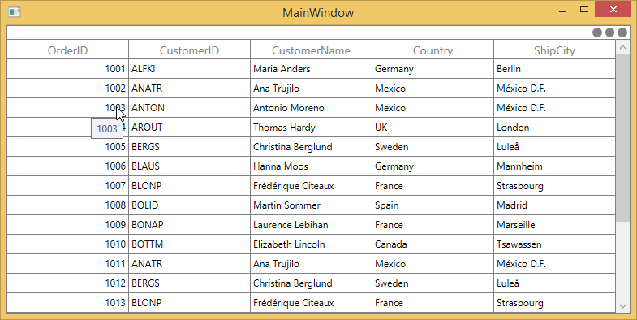
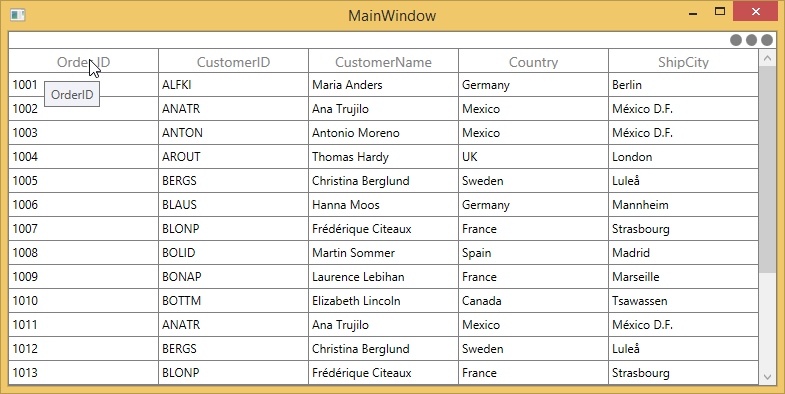
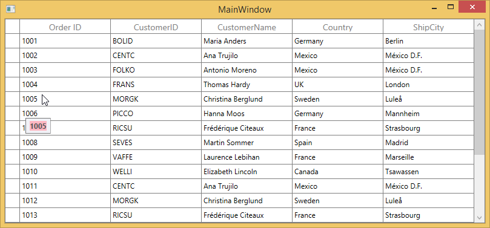
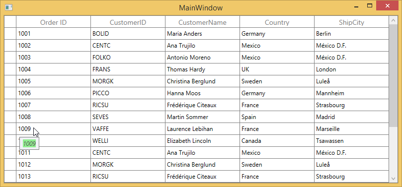

# ToolTip in WPF DataGrid (SfDataGrid)

ToolTip provides the support to show the pop-up window that displays the information when the mouse hovers in cells of SfDataGrid. 

## Record cell tooltip

You can enable the ToolTip for the [GridCell](https://help.syncfusion.com/cr/wpf/Syncfusion.UI.Xaml.Grid.GridCell.html) by setting the [SfDataGrid.ShowToolTip](https://help.syncfusion.com/cr/wpf/Syncfusion.UI.Xaml.Grid.SfGridBase.html#Syncfusion_UI_Xaml_Grid_SfGridBase_ShowToolTip) as `true`.




<syncfusion:SfDataGrid x:Name="dataGrid" 
                       AutoGenerateColumns="True"
                       ShowToolTip="True"
                       ItemsSource="{Binding Orders}" >
</syncfusion:SfDataGrid>





this.dataGrid.ShowToolTip = true;




You can enable the ToolTip for the particular column by setting the [GridColumn.ShowToolTip](https://help.syncfusion.com/cr/wpf/Syncfusion.UI.Xaml.Grid.GridColumnBase.html#Syncfusion_UI_Xaml_Grid_GridColumnBase_ShowToolTip) as `true`.




<syncfusion:SfDataGrid.Columns>
    <syncfusion:GridTextColumn HeaderText="Order ID" ShowToolTip="True" MappingName="OrderID" />
    <syncfusion:GridTextColumn HeaderText="CustomerID" ShowToolTip="True" MappingName="CustomerID" />
</syncfusion:SfDataGrid.Columns>





this.dataGrid.Columns["OrderID"].ShowToolTip = true;
this.dataGrid.Columns["CustomerID"].ShowToolTip = true;




N> `GridColumn.ShowToolTip` takes higher priority than [SfDataGrid.ShowToolTip](https://help.syncfusion.com/cr/wpf/Syncfusion.UI.Xaml.Grid.SfGridBase.html#Syncfusion_UI_Xaml_Grid_SfGridBase_ShowToolTip).

## Header tooltip

You can enable the ToolTip for the header cell by setting the [GridColumn.ShowHeaderToolTip](https://help.syncfusion.com/cr/wpf/Syncfusion.UI.Xaml.Grid.GridColumnBase.html#Syncfusion_UI_Xaml_Grid_GridColumnBase_ShowHeaderToolTip) as `true`.




<syncfusion:SfDataGrid.Columns>
<syncfusion:GridTextColumn HeaderText="Order ID" ShowHeaderToolTip="True" MappingName="OrderID" />
</syncfusion:SfDataGrid.Columns>





this.dataGrid.Columns["OrderID"].ShowHeaderToolTip = true;




## ToolTip Customization

You can change the appearance of the ToolTip by customizing the style with TargetType as ToolTip.




<Window.Resources>
    
</Window.Resources>

<syncfusion:SfDataGrid.Columns>
    <syncfusion:GridTextColumn HeaderText="Order ID"  ShowToolTip="True" MappingName="OrderID" />
</syncfusion:SfDataGrid.Columns>




You can customize the template of ToolTip by using the [GridColumn.ToolTipTemplate](https://help.syncfusion.com/cr/wpf/Syncfusion.UI.Xaml.Grid.GridColumnBase.html#Syncfusion_UI_Xaml_Grid_GridColumnBase_ToolTipTemplate) and [GridColumn.ToolTipTemplateSelector](https://help.syncfusion.com/cr/wpf/Syncfusion.UI.Xaml.Grid.GridColumnBase.html#Syncfusion_UI_Xaml_Grid_GridColumnBase_ToolTipTemplateSelector) properties. 

### Customize the ToolTip using ToolTipTemplate

You can customize the appearance of the ToolTip for particular column by setting `GridColumn.ToolTipTemplate`. And you can also customize the appearance of header ToolTip for particular column by [GridColumn.HeaderToolTipTemplate](https://help.syncfusion.com/cr/wpf/Syncfusion.UI.Xaml.Grid.GridColumnBase.html#Syncfusion_UI_Xaml_Grid_GridColumnBase_HeaderToolTipTemplate) property.




<Window.Resources>
    <local:StringToImageConverter x:Key="ImageConverter" />        
    <DataTemplate x:Key="TemplateToolTip">
        <Image Height="100" Width="100" Source="{Binding CustomerID,Converter={StaticResource ImageConverter}}" />
    </DataTemplate>
</Window.Resources>

<syncfusion:SfDataGrid.Columns>
    <syncfusion:GridTextColumn HeaderText="Order ID"  ShowToolTip="True" MappingName="OrderID" />
    <syncfusion:GridTextColumn HeaderText="CustomerID" ToolTipTemplate="{StaticResource TemplateToolTip}" ShowToolTip="True" MappingName="CustomerID" />
</syncfusion:SfDataGrid.Columns>




You can get the sample from [here](http://www.syncfusion.com/downloads/support/directtrac/general/ze/ToolTipTemplateSample-904850425.zip). 

### Customize the ToolTip with ToolTipTemplateSelector

The different ToolTip template can be loaded in a same column conditionally based on data by setting `GridColumn.ToolTipTemplateSelector`




<Window.Resources>
    <DataTemplate x:Key="ToolTip1">
        <Grid>
            <Rectangle Fill="Transparent"/>
            <TextBlock Text="{Binding OrderID}" FontWeight="Bold" Background="LightPink"/>
        </Grid>
    </DataTemplate>
    <DataTemplate x:Key="ToolTip2">
        <Grid>
            <Rectangle Fill="Transparent"/>
            <TextBlock Text="{Binding OrderID}" FontStyle="Italic" Background="LightGreen"/>
        </Grid>
    </DataTemplate>
</Window.Resources>

<syncfusion:SfDataGrid.Columns>
    <syncfusion:GridTextColumn HeaderText="Order ID" ShowToolTip="True" MappingName="OrderID" >
        <syncfusion:GridTextColumn.ToolTipTemplateSelector>
            <local:ToolTipTemplateSelector  
                   AlternateTemplate="{StaticResource ToolTip2}"  
                   DefaultTemplate="{StaticResource ToolTip1}" />
        </syncfusion:GridTextColumn.ToolTipTemplateSelector>
    </syncfusion:GridTextColumn>
</syncfusion:SfDataGrid.Columns>







public class ToolTipTemplateSelector : DataTemplateSelector
{
    private DataTemplate _defaultTemplate;
    
    /// 

    /// Gets or sets DefaultTemplate.
    /// 

 
    public DataTemplate DefaultTemplate
    {
        get { return _defaultTemplate; }
        set { _defaultTemplate = value; }
    }

    private DataTemplate _alternateTemplate;
    
    /// 

    /// Gets or Sets AlternateTemplate.
    /// 

    public DataTemplate AlternateTemplate
    {
        get { return _alternateTemplate; }
        set { _alternateTemplate = value; }
    }

    public override System.Windows.DataTemplate SelectTemplate(object item, System.Windows.DependencyObject container)
    {

        //The item that comes from ToolTipTemplate is DataContextHelper. When set SetCellBoundValue to true, it sets DataContextHelper as DataContext to DataTemplate. Refer property section of CellTemplate.
        OrderInfo dataUnit = item as OrderInfo;

        if (dataUnit == null) return this.DefaultTemplate;

        //use reflection to retrieve property
        Type type = dataUnit.GetType();
        PropertyInfo property = type.GetProperty("OrderID");

        //To see what template needs to be select according to the specified property value.

        if (property.GetValue(dataUnit, null).ToString().Contains('9') || property.GetValue(dataUnit, null).ToString().Contains('4'))
            return this.AlternateTemplate;

        else
            return this.DefaultTemplate;
    }
}




The below image refers the `DefaultTemplate` which is applied through `ToolTipTemplateSelector`.

The below image refers the `AlternateTemplate` which is applied through `ToolTipTemplateSelector`.

You can get the sample from [here](http://www.syncfusion.com/downloads/support/directtrac/general/ze/IEnumerableBinding_Demo-1708191985.zip).

## Events

### CellToolTipOpening event

The [CellToolTipOpening](https://help.syncfusion.com/cr/wpf/Syncfusion.UI.Xaml.Grid.SfDataGrid.html) event occurs when any tooltip of the cell is opened. The `CellToolTipOpening` event receives the [GridCellToolTipOpeningEventArgs](http://help.syncfusion.com/cr/wpf/Syncfusion.UI.Xaml.Grid.GridCellToolTipOpeningEventArgs.html) as argument which has the following properties:

<ul>
<li> <a href="https://help.syncfusion.com/cr/wpf/Syncfusion.UI.Xaml.Grid.CellToolTipOpeningEventArgs.html#Syncfusion_UI_Xaml_Grid_CellToolTipOpeningEventArgs_Column">Column :</a> Gets the hovered cell column in the SfTreeGrid.</li>
<li> <a href="https://help.syncfusion.com/cr/wpf/Syncfusion.UI.Xaml.Grid.CellToolTipOpeningEventArgs.html#Syncfusion_UI_Xaml_Grid_CellToolTipOpeningEventArgs_Record">Record :</a> Gets the data context of hovered cell.</li>
<li> <a href="https://help.syncfusion.com/cr/wpf/Syncfusion.UI.Xaml.Grid.CellToolTipOpeningEventArgs.html#Syncfusion_UI_Xaml_Grid_CellToolTipOpeningEventArgs_RowColumnIndex">RowColumnIndex :</a> Gets the row and column index of the hovered cell.</li>
<li> <a href="https://help.syncfusion.com/cr/wpf/Syncfusion.UI.Xaml.Grid.CellToolTipOpeningEventArgs.html#Syncfusion_UI_Xaml_Grid_CellToolTipOpeningEventArgs_ToolTip">ToolTip :</a> Gets the tooltip of the hovered cells.</li>
</ul>



<syncfusion:SfDataGrid Name="DataGrid"  
                        CellToolTipOpening="DataGrid_CellToolTipOpening"
                        AutoGenerateColumns="True"
                        ItemsSource="{Binding Orders}">


this.DataGrid.CellToolTipOpening += DataGrid_CellToolTipOpening;

private void DataGrid_CellToolTipOpening(object sender, Syncfusion.UI.Xaml.Grid.GridCellToolTipOpeningEventArgs e)
{
           
}

